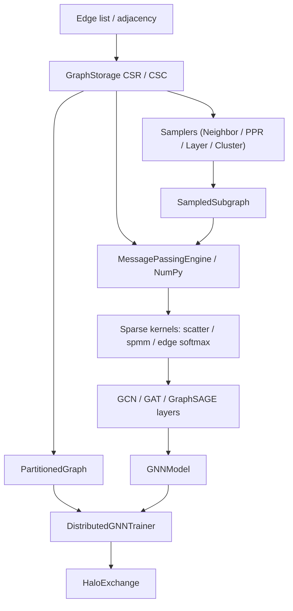

# GNN Runtime

A from-scratch graph neural network runtime built around sparse graph storage, message
passing, neighbor sampling, and the GCN/GAT/GraphSAGE layers. The graph storage and the sparse
kernels are pure NumPy; the trainable layers, fused kernels, and samplers use PyTorch, with
NumPy fallbacks for the core message-passing and sparse operations so the graph storage and
kernel paths remain usable without a deep-learning framework.

## Features

- **Sparse graph storage** — CSR/CSC/COO/hybrid layouts with neighbor, degree, subgraph, and
  self-loop operations, built from edge lists or adjacency matrices (`GraphStorage`,
  `GraphFormat`).
- **Graph partitioning** — balanced round-robin and degree-aware ("METIS-style") partitioning
  with halo (ghost) node tracking and edge-cut metrics (`PartitionedGraph`).
- **Message passing** — configurable message and aggregation functions over edges, with an
  attention-weighted and multi-head variant; a NumPy-only path for framework-free use
  (`MessagePassingEngine`, `MessagePassingNumpy`).
- **Neighbor sampling** — multi-hop fanout sampling, personalized-PageRank sampling, layer-wise
  and cluster sampling for mini-batch training (`NeighborSampler`, `PPRSampler`).
- **Sparse kernels** — scatter-add/mean/max, CSR and COO SpMM, segment reductions, edge softmax,
  and fused gather-scatter aggregation (`SparseOps`, `scatter_add`, `spmm`, `SparseOpsNumpy`).
- **GNN layers** — `GCNLayer` (symmetric normalization), `GATLayer` (multi-head attention),
  `GraphSAGELayer` (mean/max aggregators), and a stackable `GNNModel` with jumping-knowledge
  options.
- **Distributed training scaffolding** — single-process trainer with graph partitioning, a
  halo-exchange interface, and a `VertexReorderOptimizer` (RCM, degree, partition reordering) for
  cache locality (`DistributedGNNTrainer`, `HaloExchange`).

## Architecture



| Component | Module | Responsibility |
|-----------|--------|----------------|
| Graph storage | `graph.py` | CSR/CSC/COO storage, partitioning, halo nodes |
| Message passing | `message_passing.py` | message + aggregate functions, attention propagation |
| Sampling | `sampling.py` | neighbor, PPR, layer, and cluster samplers |
| Kernels | `kernels.py` | scatter, SpMM, segment reduce, edge softmax, fused ops |
| Layers | `layers.py` | GCN, GAT, GraphSAGE, GNNModel |
| Distributed | `distributed.py` | partitioned trainer, halo exchange, vertex reordering |

## Quick Start

### Prerequisites

- Python 3.9+
- NumPy 1.21+ (the only required dependency). The graph storage and NumPy kernel
  fallbacks run without PyTorch.
- PyTorch 2.0+ (optional, `pip install -e ".[torch]"`) is required for the trainable layers,
  the `MessagePassingEngine`, the samplers (`NeighborSampler`, `PPRSampler`, `LayerSampler`,
  `ClusterSampler`), and the distributed trainer. Each sampler raises `ImportError` if PyTorch
  is not installed.

### Installation

```bash
cd 42-gnn-runtime
pip install -e ".[dev]"          # core + tests
pip install -e ".[torch,dev]"    # add PyTorch for layers
```

### Running

This is a library; exercise it from Python or run the tests:

```bash
pytest tests/ -v
```

## Usage

Build a graph and query its structure (pure NumPy, no PyTorch needed):

```python
import numpy as np
from gnn_runtime import GraphStorage

src = np.array([0, 0, 1, 2, 3])
dst = np.array([1, 2, 2, 3, 0])
g = GraphStorage.from_edge_list(src, dst, num_nodes=4)

print(g.get_neighbors(0, direction="out"))  # [1 2]
print(g.degrees(direction="out"))           # degree per node
sub = g.subgraph(np.array([0, 1, 2]))       # induced subgraph
```

Run NumPy message passing over node features:

```python
import numpy as np
from gnn_runtime.message_passing import MessagePassingNumpy

edge_index = np.array([[0, 0, 1, 2],
                       [1, 2, 2, 3]])      # [2, E]
features = np.eye(4, dtype=np.float32)

summed = MessagePassingNumpy.propagate_sum(edge_index, features)
averaged = MessagePassingNumpy.propagate_mean(edge_index, features)
```

Partition a graph and inspect the cut:

```python
from gnn_runtime import PartitionedGraph

pg = PartitionedGraph(g, num_partitions=2)
pg.partition_balanced()
print(pg.edge_cut_ratio(), pg.partition_sizes())
halo = pg.get_halo_nodes(0)
```

Train a GCN (requires PyTorch):

```python
import torch
from gnn_runtime import GNNModel

edge_index = torch.tensor([[0, 1, 2, 3], [1, 2, 3, 0]])
x = torch.randn(4, 8)

model = GNNModel(in_channels=8, hidden_channels=16, out_channels=3,
                 num_layers=2, layer_type="gcn")
logits = model(x, edge_index)   # [4, 3]
```

## What's Real vs Simulated

- **Real:** `GraphStorage` (CSR/CSC/COO construction, neighbor/degree/subgraph/self-loop
  operations), the partitioner (balanced and degree-aware) and halo-node tracking, the
  NumPy message-passing and sparse-kernel paths, the PyTorch GCN/GAT/GraphSAGE layers and
  `GNNModel`, and the samplers (multi-hop fanout, PPR power iteration, layer, cluster). All are
  exercised by the test suite.
- **Simulated / requires extras:** "Distributed" training runs in a single process —
  `DistributedGNNTrainer` only calls `torch.distributed` init when `num_gpus > 1` and CUDA is
  present, and `HaloExchange.exchange` returns features unchanged unless a process group is
  initialized, so tests run the single-rank path. `partition_metis` is a simplified degree-aware
  heuristic, not the real METIS library. There is no memory-mapped or out-of-core storage; graphs
  live in memory. Datasets in tests are randomly generated, not standard benchmarks.

## Testing

```bash
pytest tests/ -v
```

Tests cover graph storage and partitioning (`test_graph.py`), message passing including the
NumPy fallback (`test_message_passing.py`), samplers (`test_sampling.py`), sparse kernels
(`test_kernels.py`), the GNN layers and full models (`test_layers.py`), and the distributed
scaffolding and vertex reordering (`test_distributed.py`). PyTorch-dependent tests are skipped
when torch is not installed; the NumPy paths run unconditionally.

## Project Structure

```
42-gnn-runtime/
  README.md
  src/gnn_runtime/
    graph.py            # GraphStorage, PartitionedGraph
    message_passing.py  # MessagePassingEngine, MessagePassingNumpy
    sampling.py         # NeighborSampler, PPRSampler, Layer/Cluster samplers
    kernels.py          # scatter, spmm, SparseOps, SparseOpsNumpy, FusedOps
    layers.py           # GCN, GAT, GraphSAGE, GNNModel
    distributed.py      # DistributedGNNTrainer, HaloExchange, VertexReorderOptimizer
  tests/                # graph, message passing, sampling, kernels, layers, distributed
  docs/BLUEPRINT.md     # full architecture and design
```

## License

MIT — see [LICENSE](../LICENSE)
