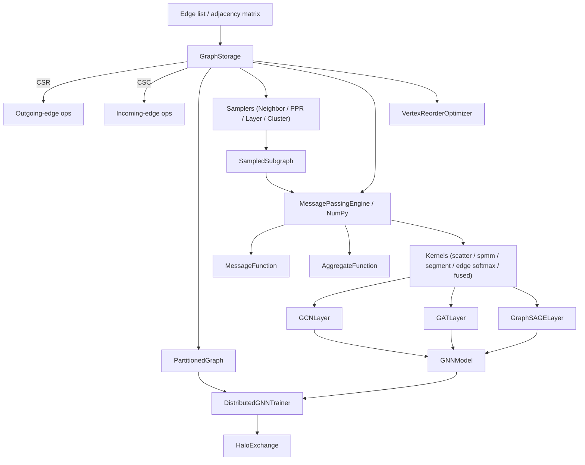

# GNN Runtime

## Overview

GNN Runtime is a from-scratch graph neural network execution engine. It implements the core
primitives a GNN framework needs — sparse graph storage, message passing, neighbor sampling,
sparse linear-algebra kernels, the canonical GNN layers, and the plumbing for partitioned
training — so the mechanics that libraries like DGL and PyTorch Geometric hide behind compiled
kernels are written out plainly. The goal is pedagogical clarity: every step from a raw edge
list to a node-classification logit is visible Python you can read.

The runtime is layered by dependency, and that split is deliberate. The graph storage
(`GraphStorage`, `PartitionedGraph`), the personalized-PageRank sampler, and the NumPy
sparse-kernel fallbacks are pure NumPy — they run with no deep-learning framework installed. The
trainable layers (`GCNLayer`, `GATLayer`, `GraphSAGELayer`, `GNNModel`), the
`MessagePassingEngine`, the tensor samplers (`NeighborSampler`, `LayerSampler`,
`ClusterSampler`), the fused kernels, and the distributed trainer use PyTorch when it is
available, guarded by a `try: import torch` at the top of each module. This keeps the
graph-structure code framework-agnostic while still letting the learnable parts use autograd,
and it means the graph algorithms can be studied, tested, and used on a machine that has only
NumPy.

The concepts the project teaches:

- **Sparse graph representation.** CSR and CSC adjacency, why CSR favors outgoing edges and CSC
  favors incoming edges, and how to convert between CSR, CSC, and COO. The layout is the same
  one production graph libraries use; here you can see the `indptr`/`indices` arrays being built
  by hand.
- **Message passing.** The gather-message-aggregate-update pattern that underlies every GNN,
  including plain sum/mean/max aggregation, attention-weighted propagation, and multi-head
  variants.
- **Neighbor sampling.** How mini-batch training on large graphs samples bounded-size
  neighborhoods rather than materializing the full k-hop expansion. Four strategies are
  implemented: multi-hop fanout (GraphSAGE-style), layer-wise, personalized PageRank, and cluster
  sampling (Cluster-GCN).
- **Sparse kernels.** Scatter reductions (add/mean/max), sparse-dense matrix multiply (SpMM) from
  both CSR and COO, segment reductions, edge softmax, and fused gather-scatter — the operations
  GNN layers compile down to.
- **GNN layers.** GCN's symmetric normalization, GAT's per-edge multi-head attention,
  GraphSAGE's neighbor aggregation with a root transform, and how they stack in a model with
  jumping-knowledge connections.
- **Distributed graph learning.** Graph partitioning (balanced and degree-aware), halo/ghost
  nodes and the send/receive maps that connect partitions, and vertex reordering for cache
  locality.

Scope is bounded to a single machine. "Distributed" training is a single-process scaffold that
exercises partitioning and the halo-exchange interface but does not run a real multi-process job:
`torch.distributed` is initialized only when `num_gpus > 1` and CUDA is present, and
`HaloExchange.exchange` returns features unchanged unless a process group is live. There are no
hand-written CUDA kernels — the sparse ops use PyTorch's `scatter_add_`/`scatter_reduce_`
primitives or explicit NumPy loops. The partitioner's "METIS" mode is a degree-aware greedy
heuristic, not the real METIS library, and graphs live entirely in memory (no memory-mapped or
out-of-core storage). These boundaries are stated so the design is understood for what it is: a
readable reference, not a production runtime.

**What's real vs simulated.** Fully implemented and exercised by the test suite: `GraphStorage`
(CSR/CSC/COO construction and all query/transform operations), both partitioners and halo-node
tracking, the NumPy message-passing and sparse-kernel paths, the PyTorch GCN/GAT/GraphSAGE layers
and `GNNModel`, and all four samplers. Simulated or reduced: "distributed" training runs
single-process (the `torch.distributed` init, DDP wrap, and real halo `isend`/`irecv` only engage
under `num_gpus > 1` with CUDA and a live process group, so tests take the single-rank path where
`HaloExchange.exchange` returns features unchanged); `partition_metis` is a degree-aware greedy
heuristic rather than the METIS library; there is no out-of-core or memory-mapped storage; and the
graphs used in tests are randomly generated rather than standard benchmarks, which is why no
dataset accuracy numbers are quoted anywhere in this document.

## Architecture



The system is six modules under `src/gnn_runtime/`:

- **`graph`** is the foundation: the sparse storage type and the partitioner. Pure NumPy.
- **`sampling`** builds bounded subgraphs around seed nodes for mini-batch training.
- **`message_passing`** turns node features and an edge index into aggregated messages, in both
  a PyTorch engine and a NumPy reference form.
- **`kernels`** holds the sparse primitives the layers and the message-passing engine use, again
  in both PyTorch and NumPy form.
- **`layers`** composes the kernels into trainable GNN layers and a stackable model.
- **`distributed`** partitions a graph across "ranks", exchanges halo features, and reorders
  vertices for locality.

Information flows from a raw edge list into `GraphStorage`, optionally through a sampler to bound
the neighborhood, then through message passing and the layers to produce node embeddings or
logits. The distributed path wraps a model and a partitioned graph and drives mini-batch
training. The dependency direction is strictly downward — `layers` imports `message_passing`,
`distributed` imports `graph` and `sampling`, and nothing imports `layers` except `distributed`
transitively via the model the caller supplies. This keeps the graph substrate free of any
learning-framework dependency.

There are really two execution modes sharing one substrate. The **full-graph** mode
(`GraphStorage.to_edge_index` → a `GNNModel.forward`) is the transductive path: the entire graph
is one batch, every node's full neighborhood participates, and it is used for evaluation and for
small graphs. The **mini-batch** mode (`NeighborSampler.sample` → `SampledSubgraph` →
`GNNModel.forward`) is the inductive/scalable path: each step operates on a bounded subgraph
around a set of seeds, so cost is independent of graph size. Both feed the *same* layer code —
the layers do not know or care whether their `edge_index` came from the whole graph or a sampled
subgraph, because the local-remapping convention makes a subgraph look like a small standalone
graph. That uniformity is the main architectural payoff of the design: sampling, partitioning,
and reordering are all pre-processing that hand the layers an ordinary `(features, edge_index)`
pair.

Framework availability is the other axis. Each module opens with a guarded `import torch`; if it
fails, `HAS_TORCH` is `False` and the PyTorch-only classes raise a clear `ImportError` on
construction, while the NumPy paths (`GraphStorage`, `PartitionedGraph`, `MessagePassingNumpy`,
`SparseOpsNumpy`, `PPRSampler`'s scoring, `VertexReorderOptimizer`) keep working. This is why the
test suite can run its structural half on a machine with only NumPy installed and skip only the
learnable-layer tests.

The component-to-module map:

| Component | Module | Responsibility |
|-----------|--------|----------------|
| Graph storage | `graph.py` | CSR/CSC/COO storage, partitioning, halo nodes |
| Message passing | `message_passing.py` | message + aggregate functions, attention propagation |
| Sampling | `sampling.py` | neighbor, PPR, layer, and cluster samplers |
| Kernels | `kernels.py` | scatter, SpMM, segment reduce, edge softmax, fused ops |
| Layers | `layers.py` | GCN, GAT, GraphSAGE, GNNModel |
| Distributed | `distributed.py` | partitioned trainer, halo exchange, vertex reordering |

## Core Components

### Graph storage (`graph.py`)

**`GraphFormat`** enumerates `CSR`, `CSC`, `COO`, and `HYBRID` (CSR + CSC for bidirectional
access).

**`GraphStorage`** is a dataclass holding the node/edge counts, the CSR `indptr`/`indices`,
optional CSC arrays, edge data, and node/edge feature dictionaries. It is constructed by class
methods rather than a raw constructor:

```python
@classmethod
def from_edge_list(cls, src, dst, num_nodes=None, edge_data=None,
                   directed=True) -> "GraphStorage": ...

@classmethod
def from_adjacency_matrix(cls, adj, threshold=0.0) -> "GraphStorage": ...
```

`from_edge_list` builds the CSR pointer array by counting outgoing edges per source
(`csr_indptr[s + 1] += 1` then `cumsum`), then sorts the destination array by source with
`argsort` so that neighbors of node `i` land contiguously in
`csr_indices[csr_indptr[i] : csr_indptr[i+1]]`. When `directed=False` it first mirrors every edge
(concatenating the reverse of `src`/`dst`, and the edge weights if present) before building CSR,
so an undirected graph carries `2E` directed entries. `num_nodes` is inferred from
`max(src.max(), dst.max()) + 1` when not given, and defaults to `0` for an empty edge set.
`from_adjacency_matrix` finds the above-threshold entries with `np.where` and delegates to
`from_edge_list`, dropping the edge weights when the adjacency is effectively binary (all extant
entries close to `1.0`). The construction is deliberately spelled out rather than delegated to
`scipy.sparse`: the counting-and-cumsum idiom for `indptr` and the stable sort that co-locates a
row's neighbors are the two ideas a reader should take away, and they are visible here in a
dozen lines.

The design keeps CSR as the single source of truth and derives everything else on demand. CSC
is a transposed view, COO is an expansion, and `edge_index` is a stacked COO — none of them are
stored redundantly at construction time. The trade-off is that the first `in`-direction query
pays a one-time `O(E)` transpose to materialize CSC, which is then cached on the instance.

The CSC transpose is built lazily. `to_csc` counts incoming edges per destination to form
`csc_indptr`, then walks the CSR structure filling `csc_indices` with sources, keeping a
running `counts` array to place each entry. It is a no-op if CSC already exists. `to_coo`
expands the CSR back into parallel `src`/`dst` arrays, and `to_edge_index` stacks those into the
PyG-style `[2, E]` form the layers consume.

Query operations respect the direction:

- `get_neighbors(node_id, direction)` slices CSR for `out` and (building CSC on demand) CSC for
  `in`, returning a copy so callers cannot mutate the backing arrays.
- `degree(node_id, direction)` is a single subtraction of adjacent `indptr` entries.
- `degrees(direction)` is fully vectorized as `np.diff(indptr)` over all nodes at once.
- `has_edge(src, dst)` checks membership in the outgoing neighbor list.

Structural transforms return new graphs rather than mutating in place. `add_self_loops` finds
nodes missing a self-loop, appends `(i, i)` edges for them, and rebuilds via `from_edge_list`,
carrying node features forward. `subgraph(node_ids)` extracts the induced subgraph: it remaps the
selected global IDs to a contiguous `0..k-1` local space, keeps only edges whose both endpoints
are in the set, and slices the node feature arrays down to the selected rows.

**`PartitionedGraph`** wraps a `GraphStorage` and divides its nodes across `num_partitions`. It
maintains `node_to_partition` (per-node partition id), `local_to_global` (a list of node-id
arrays, one per partition), and a `global_to_local` index. Two partitioners:

- `partition_balanced` assigns nodes to partitions round-robin by contiguous blocks of
  `num_nodes // num_partitions`, with the last partition absorbing the remainder.
- `partition_metis` is a simplified degree-aware greedy heuristic: it sorts nodes by descending
  out-degree and repeatedly assigns the next node to the currently smallest partition. This
  balances node counts while front-loading high-degree nodes; it is not the real METIS
  min-edge-cut algorithm.

`get_partition(partition_id, include_halo=True)` returns `(subgraph, all_node_ids, halo_nodes)`.
With halo enabled it scans each local node's outgoing neighbors, collects those living in other
partitions as the halo (ghost) set, and extracts the induced subgraph over local ∪ halo nodes;
without halo it returns just the local induced subgraph and a `None` halo set. Calling it before
partitioning raises, since the local mappings do not yet exist. `get_halo_nodes` returns just the
ghost set. `edge_cut_ratio` reports the fraction of edges whose endpoints straddle a partition
boundary, and `partition_sizes` the node count per partition — the two quality metrics for a
partitioning. Halo nodes are the reason distributed GNN training needs communication at all: a
node's message aggregation pulls features from all its in-neighbors, and when some of those live
on another rank their features must be fetched each step. The degree-aware partitioner exists
precisely to keep that halo (and therefore the communication volume) small by balancing
high-degree nodes across partitions rather than clustering them.

### Message passing (`message_passing.py`)

**`MessageFunction`** and **`AggregateFunction`** are abstract bases defining the two halves of a
propagation step. Concrete message functions:

- `CopyMessage` passes source features through unchanged.
- `ConcatMessage` concatenates source, destination, and optional edge features along the last
  dimension (raising if PyTorch is absent).

Concrete aggregators, each keyed by name in the engine's registry:

- `SumAggregate` scatter-adds messages into a zero output.
- `MeanAggregate` scatter-adds, then divides by the per-destination degree (clamped to ≥ 1 to
  avoid division by zero).
- `MaxAggregate` uses `scatter_reduce_(..., reduce='amax')` over a `-inf`-initialized output,
  then resets untouched rows to zero.

**`MessagePassingEngine`** (PyTorch) runs the full pass:

```python
def propagate(self, edge_index, node_features, edge_features=None,
              message_fn=None, aggregate_fn="sum",
              flow="source_to_target") -> torch.Tensor: ...
```

It resolves the flow direction (swapping `src`/`dst` for `target_to_source`), gathers source and
destination features along the edge index (`node_features[src]`, `node_features[dst]`), applies
the message function (defaulting to copying the source) to produce per-edge messages, and hands
them to the named aggregator keyed into `self._aggregate_fns`. An unknown aggregator name raises.

Two specialized paths:

- `propagate_with_attention` multiplies each source message by a scalar per-edge attention
  weight before a sum-scatter — the GAT aggregation with pre-computed coefficients.
- `multi_head_propagate` does the same across `num_heads` independent heads, looping per head and
  scatter-adding each head's weighted messages into the corresponding slice of the output.

Splitting propagation into a `MessageFunction` and an `AggregateFunction` is the design's main
extension point. A new GNN variant is often just a new message function (how a per-edge message
is formed from source, destination, and edge features) paired with an existing aggregator, so the
abstract-base pattern lets the engine stay fixed while variants slot in. The engine keeps the
aggregators in a small name-keyed registry (`sum`/`mean`/`max`), which is also how the layers and
the generic `GNNLayer` select aggregation by string. This is the same separation the message
passing literature draws between the "message" and "update" phases, made concrete as two
composable objects.

**`MessagePassingNumpy`** provides a framework-free reference with static methods `propagate_sum`
and `propagate_mean`. Both take an `edge_index` of shape `[2, E]` and node features `[N, F]`,
resolve the flow, and accumulate messages into an `[N, F]` output with an explicit per-edge loop
(`out[dst[e]] += node_features[src[e]]`), with `propagate_mean` additionally dividing by the
per-node in-degree. This is the un-vectorized form of exactly what the PyTorch engine's scatter
does, and it is the correctness oracle the tests check the tensor path against.

The whole pattern is worth seeing as one gather-scatter step. For a single edge `(u, v)` under
`source_to_target` flow, the source `u`'s feature row is read (gather), transformed by the
message function into a per-edge message, and added into destination `v`'s accumulator (scatter).
Running that over every edge and dividing each accumulator by its destination's in-degree is a
mean aggregation; skipping the division is a sum. The PyTorch engine expresses the same thing
with vectorized `node_features[src]` gathers and `scatter_add_`, so it processes all edges at
once, but the arithmetic each row receives is identical. That equivalence is what lets the tests
treat the NumPy loop as ground truth for the tensor kernels.

### Sampling (`sampling.py`)

**`SampledSubgraph`** is the result type shared by every sampler: the sampled `node_ids` (global
IDs), the local `edge_index` (`[2, E]` with IDs remapped into the subgraph's local space), the
per-layer `layer_sizes`, a `node_mapping` from global to local IDs, and the seed `batch_size`.

- **`NeighborSampler`** does multi-hop fanout sampling. It moves the CSR arrays to the target
  device once at construction. Given `fanouts=[f1, f2, ...]`, `sample(seed_nodes)` expands the
  neighborhood one hop per fanout: for each frontier node it slices the CSR neighbor list, takes
  all of them when `fanout == -1` or the degree is below the fanout, else draws `fanout`
  neighbors with `torch.randint` (with replacement) or `torch.randperm[:fanout]` (without). New
  nodes are appended to the running batch, edges are recorded neighbor→node (source→destination
  for message passing), and finally all edges are remapped to local IDs. This is the GraphSAGE
  mini-batch sampler.
- **`PPRSampler`** scores nodes by personalized PageRank via power iteration. The mass vector
  starts uniform over the seeds (`1 / num_seeds` each). Each iteration is one step of the PPR
  recurrence: a node with out-neighbors passes `(1 - alpha)` of its current score split evenly
  among them, and the `alpha` teleport fraction is added back onto the seed set rather than
  spread uniformly — that seed-only teleport is what makes the ranking *personalized* to the
  seeds instead of a global PageRank. Iteration stops when the L1 change between successive score
  vectors falls below `epsilon` or after `max_iters` (default 100). `sample(seed_nodes, top_k)`
  keeps the `top_k` highest-scoring nodes and builds their induced subgraph, while
  `compute_ppr_scores` exposes the full score vector for callers that want the raw importances.
  The point of PPR sampling is that it captures structurally important nodes several hops away
  that a fixed-fanout k-hop sampler would miss or reach only with exponential fanout. This is pure
  NumPy and needs no PyTorch for the scoring itself; only the tensor wrapping of the returned
  subgraph touches torch.
- **`LayerSampler`** wraps `NeighborSampler` with per-layer fanouts that default to a decreasing
  schedule (`max(25 // 2**i, 5)` per layer) for deep GNNs, so shallow layers see wider
  neighborhoods than deep ones.
- **`ClusterSampler`** partitions the node range into `num_clusters` contiguous clusters.
  `sample_cluster(i)` returns one cluster's induced subgraph; `sample_random_clusters(k)` unions
  `k` randomly chosen clusters into a single subgraph — the Cluster-GCN batching strategy. Unlike
  neighbor sampling, cluster sampling produces a fixed set of subgraphs and trains on whole
  clusters, trading the unbiased-but-noisy neighbor estimate for a lower-variance batch at the
  cost of the edges cut between clusters.

The common thread across all four samplers is the local remapping baked into `SampledSubgraph`.
A sampler works in global node IDs while walking the graph, but the returned `edge_index` is
expressed in a compact `0..k-1` local space via `node_mapping`, because the downstream layers
run on a dense feature tensor whose rows are the sampled nodes in order. `layer_sizes` records
how the frontier grew hop by hop, which lets a layered model slice out exactly the nodes it needs
at each depth. The seed nodes always occupy the first `batch_size` rows, so a caller reads its
predictions off `out[:batch_size]` — a convention the distributed trainer relies on when it
computes the loss only on the batch's seeds.

### Kernels (`kernels.py`)

The sparse primitives the layers and engine compile to, in PyTorch free functions, a `SparseOps`
static-method collection, a `SparseOpsNumpy` fallback, and a `FusedOps` collection.

PyTorch free functions reduce a per-edge `[E, F]` tensor into a per-node `[dim_size, F]` tensor:
`scatter_add` (plain scatter-add), `scatter_mean` (scatter-add divided by per-index count), and
`scatter_max` (using `scatter_reduce_(reduce='amax')`, returning values and an argmax
placeholder — the values are exact while the argmax slot is a zero-filled placeholder, since the
amax reduction does not track indices). `spmm` multiplies a CSR sparse matrix by a dense matrix
row-by-row (`out[row] = sum(mat[cols] * vals)`, treating a missing `value` array as all-ones), and
`spmm_coo` does the same from COO by gathering source rows, optionally weighting, and
scatter-adding into destinations. The two SpMM forms exist to make the CSR↔COO trade-off visible:
CSR walks contiguous rows in a loop and is the textbook definition, while COO vectorizes the whole
thing into one gather plus one scatter and is the form that actually runs at size.

**`SparseOps`** (static methods) adds structural utilities:

- `segment_csr` reduces contiguous segments delimited by CSR pointers, supporting
  `sum`/`mean`/`max`/`min`.
- `csr_to_coo` / `coo_to_csr` convert between the two layouts.
- `edge_softmax` computes a numerically stable softmax over edges grouped by destination node:
  subtract the per-destination max (via `scatter_reduce_ amax`), exponentiate, sum per
  destination, and divide — the normalization GAT needs.

**`SparseOpsNumpy`** mirrors the essentials without PyTorch: `spmm_csr`, `scatter_add_np`, and
`edge_softmax_np` (using `np.maximum.at` / `np.add.at` for the segment reductions). These are the
CPU-only reference implementations the tests validate against.

**`FusedOps`** combines gather and scatter to avoid materializing intermediate per-edge tensors
where the framework would otherwise. `gather_scatter_add` is the core message-passing step
(gather source rows, optionally weight, scatter-add to destinations). `fused_gcn_aggregate` and
`fused_gat_aggregate` are thin wrappers that fold the GCN normalization vector or the GAT
attention weights into that single fused call, so a layer never has to hold the full `[E, F]`
message tensor separately from its weights.

Three implementation details are worth calling out because they recur across the kernels. First,
scatter into a `-inf`-initialized buffer is the standard trick for a max reduction over a sparse
index set, and every max path (`scatter_max`, `MaxAggregate`, GraphSAGE's `max` aggregator) resets
the untouched `-inf` rows to zero afterward so that isolated nodes produce a valid zero vector
rather than `-inf`. Second, mean reductions never divide by a raw count — they clamp the count to
a minimum of one, so a node with no incoming edges yields zero instead of a NaN. Third, the CSR
`spmm` and `segment_csr` walk `indptr` in a Python loop and are `O(nnz)` but interpreter-bound;
they exist as the readable definition of the operation, while the COO `spmm_coo` and the fused
ops take the vectorized `scatter_add_` path that a caller would actually run at size. The
`SparseOpsNumpy` variants use `np.add.at` / `np.maximum.at`, NumPy's unbuffered scatter, which is
the direct analogue of PyTorch's `scatter_add_`/`scatter_reduce_` and makes the two paths line up
element for element in the tests.

### Layers (`layers.py`, PyTorch)

Every layer subclasses `nn.Module`, guards construction with `_check_torch()`, and exposes
`reset_parameters` with Xavier-uniform weight init.

- **`GCNLayer`** implements `H' = D^{-1/2} A D^{-1/2} H W`. It applies the linear transform, then
  computes the symmetric normalization `deg_inv_sqrt[src] * deg_inv_sqrt[dst]` (degree taken over
  destinations, with `inf` from zero-degree nodes zeroed out), and scatter-adds the normalized
  source messages. The normalization is the layer's whole subtlety: instead of averaging a
  node's neighbors, GCN weights each edge by the geometric mean of the two endpoints' inverse
  square-root degrees, which damps the influence of high-degree hub nodes symmetrically and keeps
  the propagation operator's spectrum bounded. Flags: `improved` (adds 1 to degrees, the
  renormalization trick that treats self-loops as slightly stronger), `cached` (memoizes the
  normalization vector across forward passes, valid only when the graph structure is fixed — the
  cache is cleared on `reset_parameters`, and using it with a changing edge set would apply a
  stale normalization), `add_self_loops`, `normalize`, `bias`.
- **`GATLayer`** implements multi-head graph attention. It projects to `heads * out_channels`,
  reshapes to `[N, H, F]`, forms per-edge logits `alpha_src[src] + alpha_dst[dst]` (each a
  learned linear score of the endpoint's features, summed per edge), applies a leaky-ReLU, runs a
  per-head `edge_softmax` over each destination's incoming edges so a node's attention weights
  sum to one, applies dropout during training, and scatter-adds the attention-weighted source
  messages into a `[N, H, F]` output. The softmax is done in-layer with a numerically stable
  `_edge_softmax` (per-destination max subtraction, then exp/sum/divide with a `1e-16` floor).
  Output is head-concatenated to `[N, H*F]` (`concat=True`, used for intermediate layers) or
  head-averaged to `[N, F]` (`concat=False`, used for the final layer). Flags: `heads`, `concat`,
  `negative_slope`, `dropout`, `add_self_loops`, `bias`.
- **`GraphSAGELayer`** aggregates neighbors with a `mean` or `max` aggregator, transforms the
  aggregate with `lin_neigh`, adds a root-node transform `lin_root(x)` when `root_weight` is set,
  and optionally L2-normalizes the output. Keeping the root transform separate from the neighbor
  transform is the SAGE idea: a node's own features are combined with the summary of its
  neighborhood rather than blended into the same aggregation, which preserves self-information
  through deep stacks. The `mean` path scatter-adds and divides by the clamped in-degree; the
  `max` path uses the `-inf`/reset trick. An unknown aggregator raises.
- **`GNNLayer`** is a generic configurable layer selecting message type (`gcn`/`gat`/`sage`) and
  aggregation (`sum`/`mean`/`max`), delegating the actual propagation to a `MessagePassingEngine`
  and building the message function inline (GCN normalization, GAT attention, or a plain copy).
  It is the flexible sibling of the three specialized layers above, useful for experimenting with
  message/aggregate combinations that the fixed layers do not expose, at the cost of routing
  through the general engine rather than a hand-fused path.
- **`GNNModel`** stacks `num_layers` layers of a chosen `layer_type` with ReLU + dropout between
  layers (no activation or dropout after the final layer, so its output feeds the classifier or
  the jumping-knowledge combiner unmodified). For GAT it uses 4 heads with `concat=True` on all
  but the last layer (which uses `concat=False` to land on the intended output width), tracking
  the widened channel count as `out_ch * 4` for the intermediate layers so the next layer's input
  dimension is correct. A final `nn.Linear` classifier maps to `out_channels`. Optional
  jumping-knowledge aggregation over the per-layer outputs is `cat` (concatenate all layer
  outputs, widening the classifier input to `hidden_channels * num_layers`), `max` (element-wise
  max across layers), or `lstm` (a bidirectional LSTM over the layer sequence whose final hidden
  states are projected back down). Jumping knowledge lets the model mix representations from
  different neighborhood radii, which counters the over-smoothing that deep GNN stacks otherwise
  suffer. `forward` returns classification logits; `encode` returns the node embeddings before the
  final classifier, for use as features in a downstream task.

### Distributed (`distributed.py`, PyTorch)

- **`DistributedGNNTrainer`** partitions a graph (`balanced` or `metis`) when `num_gpus > 1`,
  moves the model to a device, and trains mini-batches drawn with a `NeighborSampler`.
  `torch.distributed` is initialized (NCCL) only when `num_gpus > 1` and CUDA is present, so the
  default path is single-process on CPU; in that case `partitioned_graph` and `halo_exchange` are
  left as `None` and the trainer sees the whole graph as one local partition. When it does go
  multi-GPU it wraps the model in `DistributedDataParallel`, builds a `HaloExchange`, and reads
  `LOCAL_RANK`/`WORLD_SIZE` from the environment to join the process group.
  `train_epoch(optimizer, loss_fn, batch_size, fanouts)` selects the local partition (or the full
  graph), shuffles the local node indices, and for each batch: samples a subgraph around the
  batch's seeds, maps the sampled local IDs back to global IDs, gathers the corresponding feature
  rows (falling back to random `64`-dim features when the graph carries none under key `x`) and
  the seed labels (falling back to zeros under key `y`), runs a forward/backward step with the
  loss taken only on the first `batch_size` rows (the seeds), and accumulates the loss. At the end
  it returns the average per-batch loss, all-reducing the loss and batch count across ranks when a
  process group is live. `evaluate(mask)` runs a single full-graph forward pass over the whole
  edge index and returns `(cross_entropy_loss, accuracy)` computed on the masked nodes — the
  transductive evaluation path, separate from the sampled training path.
- **`HaloExchange`** builds the send/receive maps for ghost nodes at construction: for each other
  rank it computes which of our nodes that rank needs (`send_nodes`) and which of theirs we need
  (`recv_nodes`) by scanning cross-partition neighbors. The two maps are asymmetric on purpose —
  what rank A sends to rank B is exactly what B lists as received from A — and building both sides
  locally avoids a negotiation round-trip. `exchange` posts non-blocking `isend`/`irecv` for those
  features and waits on all operations together, overlapping the sends and receives; it returns
  the features unchanged when no process group is initialized, which is the single-rank test path.
  `all_reduce_gradients` sum-reduces and averages gradients across ranks so every rank ends a step
  with the same parameters. The whole class is the communication half of distributed GNN training
  made explicit: partitioning decides *what* crosses a boundary, and the halo maps decide *how* it
  is exchanged each step.
- **`VertexReorderOptimizer`** improves cache locality by producing permutation arrays.
  `reorder_rcm` runs a reverse Cuthill-McKee BFS from the lowest-degree node, visiting neighbors
  in increasing-degree order and reversing the result. `reorder_by_degree` sorts by degree, and
  `reorder_by_partition` groups by contiguous partition then sorts by degree within each.
  `apply_reordering(perm)` rebuilds a `GraphStorage` with vertices and features permuted and
  neighbor lists remapped and sorted, and `compute_cache_efficiency` measures the average
  `|node - neighbor|` edge distance in memory (lower is more local). RCM's guarantee is a low
  matrix bandwidth: after reordering, a node's neighbors tend to have nearby IDs, so a gather over
  `csr_indices` touches a small window of the feature array and stays in cache. The three
  strategies trade generality for cost — RCM is a global BFS reorder, degree ordering is a single
  sort, and partition ordering blends locality with the partition structure the trainer already
  uses.

### Edge and flow conventions

Two conventions run through the whole runtime and are worth stating explicitly, because a sign
error here silently produces the wrong graph. First, `edge_index` is always `[2, E]` with row 0
holding sources and row 1 holding destinations, and message passing defaults to
`flow="source_to_target"` — messages travel from `edge_index[0]` to `edge_index[1]`, so a node
aggregates over its *incoming* edges. Choosing `flow="target_to_source"` swaps the two rows,
which is how the same edge set can drive propagation in the reverse direction without rebuilding
the graph. Second, when a sampler records edges it deliberately orients them neighbor→node
(`edges_src = sampled neighbor`, `edges_dst = the frontier node`) so that after sampling, a plain
source-to-target pass moves information from the sampled neighborhood inward to the seeds — the
direction a mini-batch GNN needs. The GCN and GraphSAGE layers take degrees over the destination
row for the same reason: it is the in-degree, the count of messages a node will actually receive.
Keeping these conventions uniform is what lets the layers, the engine, and the samplers compose
without per-call adapters.

Putting the pieces together, one mini-batch training step threads all six modules: the trainer
draws a batch of seed nodes and hands them to a `NeighborSampler`, which walks `GraphStorage`'s
CSR arrays to produce a `SampledSubgraph` with a local `edge_index`; the trainer gathers the
matching feature rows and runs `GNNModel.forward`, whose layers call the kernels
(`gather_scatter_add`, `edge_softmax`, the fused aggregates) to propagate and update; the loss is
taken on the seed rows, backpropagated, and — in the multi-rank case —
`HaloExchange.all_reduce_gradients` synchronizes gradients before the optimizer step. Full-graph
evaluation short-circuits the sampler and reordering entirely, running `to_edge_index` straight
into the model. Every arrow in that chain carries the same two artifacts — a feature matrix and a
`[2, E]` edge index — which is the invariant that keeps the modules loosely coupled.

## Data Structures

The graph and subgraph types are the contract between modules. `GraphStorage` is the sparse
backbone; every other module reads it or produces it.

```python
@dataclass
class GraphStorage:
    num_nodes: int
    num_edges: int
    csr_indptr: np.ndarray                     # [num_nodes + 1] row pointers
    csr_indices: np.ndarray                    # [num_edges] destination per CSR row
    csc_indptr: Optional[np.ndarray] = None    # built lazily by to_csc()
    csc_indices: Optional[np.ndarray] = None
    edge_data: Optional[np.ndarray] = None     # optional edge weights [num_edges]
    node_features: Dict[str, np.ndarray] = ...  # name -> [num_nodes, F]
    edge_features: Dict[str, np.ndarray] = ...  # name -> [num_edges, Fe]
    partition_ids: Optional[np.ndarray] = None
    num_partitions: int = 1
```

```python
@dataclass
class SampledSubgraph:
    node_ids: "torch.Tensor"          # global IDs in the subgraph
    edge_index: "torch.Tensor"        # [2, E] local edges
    layer_sizes: List[int]            # frontier / batch size per hop
    node_mapping: Dict[int, int]      # global -> local
    batch_size: int = 0               # number of seed nodes
```

`GraphFormat` is a small enum tagging the four layouts:

```python
class GraphFormat(Enum):
    CSR = "csr"       # efficient for outgoing edges
    CSC = "csc"       # efficient for incoming edges
    COO = "coo"       # flexible, easy construction
    HYBRID = "hybrid" # CSR + CSC for bidirectional access
```

The CSR layout that backs `GraphStorage` is a plain array map, not a diagram. For the edge set
`0→1, 0→2, 1→2, 2→3, 3→0` over four nodes:

```
nodes:        0      1      2      3
csr_indptr: [ 0,     2,     3,     4,     5 ]   # length num_nodes + 1
                |      |      |      |     |
                v      v      v      v     v
csr_indices: [ 1, 2,  2,     3,     0 ]          # neighbors of node i live in
               \---/   |      |      |           # indices[indptr[i] : indptr[i+1]]
              node 0  node1  node2  node3
```

Reading it: node 0's neighbors are `csr_indices[0:2] == [1, 2]`, node 1's are
`csr_indices[2:3] == [2]`, and the out-degree of node `i` is `csr_indptr[i+1] - csr_indptr[i]`,
which is exactly what `np.diff(csr_indptr)` computes for all nodes at once. The CSC arrays,
when built, are the same structure over the transposed graph, giving `O(in-degree)` incoming
queries.

The feature dictionaries (`node_features`, `edge_features`) are keyed by name so a graph can carry
several named tensors — the trainer looks for `x` (input features) and `y` (labels) specifically,
and falls back to random features and zero labels when they are absent, which is how the tests
run on structure-only random graphs. `edge_data` holds a single optional weight per edge, sorted
in lockstep with `csr_indices` during construction so that the weight for the edge in
`csr_indices[k]` is `edge_data[k]`; the GCN normalization and weighted SpMM read it through this
alignment. Keeping features in dictionaries rather than fixed fields is what lets the same
`GraphStorage` serve a node-classification task, an edge-weighted propagation, and a
feature-carrying subgraph without schema changes.

The `edge_index` form used by message passing and the layers is the COO `[2, E]` matrix where
row 0 is sources and row 1 is destinations. `PartitionedGraph` layers three ID spaces on top:
`node_to_partition[g]` maps a global node to its owning partition, `local_to_global[p]` maps a
partition's local index space back to global IDs, and `global_to_local[g]` maps a global node to
its local index within its owner. Halo nodes are the additional global IDs a partition must
borrow because it has edges into another partition.

Concretely, suppose an 8-node graph is split balanced into two partitions. Partition 0 owns
global nodes `{0,1,2,3}` and partition 1 owns `{4,5,6,7}`, so `local_to_global[0] == [0,1,2,3]`
and `node_to_partition == [0,0,0,0,1,1,1,1]`. If node 2 has an edge to node 5, then when
partition 0 requests its subgraph with `include_halo=True`, node 5 appears in the returned
`all_node_ids` as a ghost, and `HaloExchange` records that partition 0 must *receive* node 5's
features from rank 1 each step. The three ID maps are what translate between the global graph the
partitioner reasons about and the compact local tensors each rank actually computes on — the same
global↔local translation `SampledSubgraph.node_mapping` performs for a sampled batch, applied to
a partition instead of a sample.

`SampledSubgraph` and the partition maps therefore solve the same problem at two scales: turn a
selected set of global nodes into a dense, contiguously-indexed local graph the layers can run on,
and keep enough of the mapping to translate results back. Every sampler and the partitioner emit
this shape, which is why one `GNNModel.forward` serves both the full-graph and the batched paths.

## API Design

The public surface, re-exported from `gnn_runtime/__init__.py`:

```python
# Graph storage
GraphStorage, GraphFormat, PartitionedGraph
# Message passing
MessagePassingEngine, MessageFunction, AggregateFunction
# Sampling
NeighborSampler, PPRSampler, SampledSubgraph
# Layers
GNNLayer, GCNLayer, GATLayer, GraphSAGELayer, GNNModel
# Kernels
SparseOps, scatter_add, scatter_mean, scatter_max, spmm
# Distributed
DistributedGNNTrainer, HaloExchange, VertexReorderOptimizer
```

Key signatures:

```python
# Graph
GraphStorage.from_edge_list(src, dst, num_nodes=None, edge_data=None, directed=True)
GraphStorage.from_adjacency_matrix(adj, threshold=0.0)
GraphStorage.get_neighbors(node_id: int, direction: str = "out") -> np.ndarray
GraphStorage.degrees(direction: str = "out") -> np.ndarray
GraphStorage.subgraph(node_ids: np.ndarray) -> GraphStorage
GraphStorage.add_self_loops() -> GraphStorage
GraphStorage.to_edge_index() -> np.ndarray                      # [2, E]
PartitionedGraph(graph: GraphStorage, num_partitions: int)
PartitionedGraph.partition_balanced() / partition_metis()
PartitionedGraph.get_partition(partition_id: int, include_halo: bool = True)
PartitionedGraph.edge_cut_ratio() -> float

# Message passing
MessagePassingEngine(device: str = "cpu")
MessagePassingEngine.propagate(edge_index, node_features, edge_features=None,
                               message_fn=None, aggregate_fn="sum",
                               flow="source_to_target")
MessagePassingEngine.propagate_with_attention(edge_index, node_features, attention_weights)
MessagePassingNumpy.propagate_sum(edge_index, node_features, flow="source_to_target")
MessagePassingNumpy.propagate_mean(edge_index, node_features, flow="source_to_target")

# Sampling
NeighborSampler(graph, fanouts: List[int], replace: bool = False, device: str = "cpu")
NeighborSampler.sample(seed_nodes) -> SampledSubgraph
PPRSampler(graph, alpha=0.15, epsilon=1e-5, max_iters=100)
PPRSampler.sample(seed_nodes, top_k=100) -> SampledSubgraph
PPRSampler.compute_ppr_scores(seed_nodes) -> np.ndarray

# Kernels
scatter_add(src, index, dim_size, dim=0)
scatter_mean(src, index, dim_size, dim=0)
scatter_max(src, index, dim_size, dim=0)                        # -> (values, argmax)
spmm(rowptr, col, value, mat)
SparseOps.edge_softmax(edge_score, edge_index, num_nodes)
SparseOps.segment_csr(src, indptr, reduce="sum")

# Layers
GCNLayer(in_channels, out_channels, improved=False, cached=False,
         add_self_loops=True, normalize=True, bias=True)
GATLayer(in_channels, out_channels, heads=1, concat=True, negative_slope=0.2, dropout=0.0)
GraphSAGELayer(in_channels, out_channels, aggregator="mean", normalize=True, root_weight=True)
GNNModel(in_channels, hidden_channels, out_channels, num_layers,
         layer_type="gcn", dropout=0.5, jk=None)
GNNModel.forward(x, edge_index) -> logits
GNNModel.encode(x, edge_index) -> embeddings

# Distributed
DistributedGNNTrainer(model, graph, num_gpus=1, partition_method="balanced")
DistributedGNNTrainer.train_epoch(optimizer, loss_fn, batch_size=1024, fanouts=None) -> float
DistributedGNNTrainer.evaluate(mask=None) -> (loss, accuracy)
VertexReorderOptimizer(graph).reorder_rcm() -> np.ndarray
VertexReorderOptimizer(graph).compute_cache_efficiency(perm=None) -> float
```

A minimal end-to-end use, mirroring the README, runs pure-NumPy structure work and then a
PyTorch model:

```python
import numpy as np, torch
from gnn_runtime import GraphStorage, GNNModel

g = GraphStorage.from_edge_list(np.array([0, 0, 1, 2, 3]),
                                np.array([1, 2, 2, 3, 0]), num_nodes=4)
print(g.get_neighbors(0), g.degrees())          # [1 2], per-node out-degree

model = GNNModel(in_channels=8, hidden_channels=16, out_channels=3,
                 num_layers=2, layer_type="gcn")
logits = model(torch.randn(4, 8), torch.tensor(g.to_edge_index()))  # [4, 3]
```

## Performance

The runtime targets clarity over raw throughput; the design choices below are structural
decisions grounded in the code rather than measured kernel benchmarks. No standard-dataset
numbers are claimed because the test data is randomly generated.

- **Storage layout.** CSR gives `O(degree)` neighbor access for outgoing edges with contiguous
  memory; CSC mirrors it for incoming edges and is built lazily only when an `in`-direction query
  arrives. The `degrees` query is fully vectorized as `np.diff(indptr)` rather than per-node
  loops, and `get_neighbors` is a pointer-delimited slice.
- **Sampling bounds work.** Mini-batch training cost is governed by the fanout product, not the
  graph size: a 2-layer `NeighborSampler` with fanouts `[15, 10]` touches at most `150` neighbors
  per seed regardless of the global degree distribution, so per-step compute and memory stay
  bounded on graphs of any size. `LayerSampler`'s decreasing schedule further trims the deep-hop
  frontier where the neighborhood would otherwise explode.
- **Fused kernels.** `FusedOps.gather_scatter_add` and the fused GCN/GAT aggregates fold the
  weight multiply into the gather-scatter so the `[E, F]` per-edge message tensor is never held
  alongside its weights — the dominant memory cost of naive message passing on high-degree
  graphs.
- **Numerically stable edge softmax.** Both `SparseOps.edge_softmax` and the GAT layer's inline
  softmax subtract the per-destination max before exponentiating and add a `1e-16` denominator
  floor, avoiding overflow on large attention logits and division by zero on isolated nodes.
- **Vertex reordering.** RCM and partition reordering raise the locality of `csr_indices` so that
  scatter/gather hit cache more often; `compute_cache_efficiency` quantifies the improvement as
  the average edge stride in memory, giving a concrete before/after number for a permutation. The
  reorder is a one-time pre-processing cost amortized over every subsequent forward/backward pass,
  and it composes with the GCN normalization cache: on a fixed, reordered graph the normalization
  vector is computed once and reused, so repeated epochs pay neither the reorder nor the
  normalization again.
- **NumPy fallbacks are reference paths, not fast paths.** `MessagePassingNumpy.propagate_sum`,
  `SparseOpsNumpy`, and the CSR `spmm` use explicit Python loops. They are the clearest
  expression of each operation and the correctness oracle for the tensor kernels, but they are
  the slowest path and are intended for small graphs and framework-free use, not scale.

The asymptotics are the ones a graph library aims for. CSR construction is `O(E log E)` (the sort
dominates), neighbor and degree queries are `O(degree)` and `O(1)` respectively, and a full
message-passing pass is `O(E * F)` — linear in edges and feature width, which is the best
possible for dense-feature aggregation. Mini-batch training replaces the `O(E)` per-step edge
count with the fanout-bounded `O(B * ∏ fanouts * F)`, decoupling step cost from the total edge
count. The power-iteration PPR is `O(iters * E)`, and RCM reordering is a single `O(V + E)` BFS.
Where the runtime pays for readability is the constant factor: the Python-level loops in the CSR
`spmm`, `segment_csr`, and the samplers' per-node work are interpreter-bound, so the fused
`scatter_add_` paths are the ones that stay competitive as graphs grow.

## Testing Strategy

The suite under `tests/` validates each layer and gates PyTorch-dependent tests behind an import
check so the NumPy paths always run. Roughly 116 tests span six files.

- **`test_graph.py`** — `GraphStorage` construction from edge lists and adjacency matrices,
  CSR↔CSC↔COO conversions, neighbor/degree/edge queries, self-loops, subgraph extraction, and
  `PartitionedGraph` balanced/METIS partitioning, halo identification, and edge-cut ratio.
- **`test_message_passing.py`** — the NumPy sum/mean aggregation and flow direction first (these
  run without PyTorch), then the PyTorch engine's sum/mean/max aggregation, custom message
  functions, and attention/multi-head propagation, checked against the NumPy oracle.
- **`test_sampling.py`** — multi-hop and all-neighbor (`fanout=-1`) sampling, with/without
  replacement, the local node mapping, PPR scoring and convergence, and the layer/cluster
  samplers including random-cluster unions.
- **`test_kernels.py`** — NumPy SpMM/scatter/edge-softmax, then scatter add/mean/max, CSR and COO
  SpMM, segment reductions, CSR↔COO conversions, and the fused gather-scatter and GCN/GAT
  aggregates.
- **`test_layers.py`** — GCN/GAT/GraphSAGE forward passes, edge weights, multi-head concat vs
  average, normalization, gradient flow, and the full `GNNModel` including the `cat`/`max`/`lstm`
  jumping-knowledge variants and a short training loop that checks loss decreases.
- **`test_distributed.py`** — vertex reordering (RCM, degree, partition) and the cache-efficiency
  metric, the halo-exchange send/receive mapping on the single-rank path, single-GPU/CPU training
  and masked evaluation, and partition-quality integration checks.

Edge cases exercised include empty graphs, undirected construction (reverse-edge mirroring),
fanouts larger than the available degree (which fall back to taking all neighbors), zero-degree
nodes in the GCN normalization (whose `inf` is zeroed), and partition assignments that leave a
partition empty. The design principle throughout is that the NumPy path is the ground truth and
every PyTorch kernel is asserted to match it within a tolerance, so correctness does not depend
on having a GPU or even a deep-learning framework installed.

The suite is layered to mirror the module dependency graph, so a failure localizes cleanly. The
structural tests (`test_graph.py`) run first and unconditionally, because everything else builds
on `GraphStorage`; if they pass, the sampler and partitioner tests can trust the substrate. The
kernel tests validate the sparse primitives in isolation before the layer tests exercise them in
composition, so a scatter bug surfaces in `test_kernels.py` rather than as a mysterious wrong
gradient in `test_layers.py`. The layer tests check three things per layer type — a shape-correct
forward pass, gradient flow via a backward pass, and the layer-specific invariant (GCN
normalization, GAT per-destination attention summing to one, GraphSAGE's optional L2 norm) — and
then the model-level tests confirm a multi-layer stack trains (loss decreases over a few steps)
under each jumping-knowledge mode. The distributed tests deliberately stay on the single-rank
path: they assert the halo send/receive maps are built correctly and that a single-process epoch
runs end to end, without requiring a multi-GPU environment the CI cannot provide. Running the
whole suite is `pytest tests/ -v`; PyTorch-dependent tests are collected but skipped when torch
is absent, so the NumPy contract is always verified.

## References

- Kipf and Welling, "Semi-Supervised Classification with Graph Convolutional Networks" (2017).
- Veličković et al., "Graph Attention Networks" (2018).
- Hamilton et al., "Inductive Representation Learning on Large Graphs" (GraphSAGE, 2017).
- Chiang et al., "Cluster-GCN: An Efficient Algorithm for Training Deep and Large Graph
  Convolutional Networks" (2019).
- Xu et al., "Representation Learning on Graphs with Jumping Knowledge Networks" (2018).
- Page et al., "The PageRank Citation Ranking: Bringing Order to the Web" (1999).
- Cuthill and McKee, "Reducing the bandwidth of sparse symmetric matrices" (1969).
- Fey and Lenssen, "Fast Graph Representation Learning with PyTorch Geometric" (2019).
- Wang et al., "Deep Graph Library: A Graph-Centric, Highly-Performant Package for Graph Neural
  Networks" (2019).
- Karypis and Kumar, "A Fast and High Quality Multilevel Scheme for Partitioning Irregular
  Graphs" (METIS, 1998).
