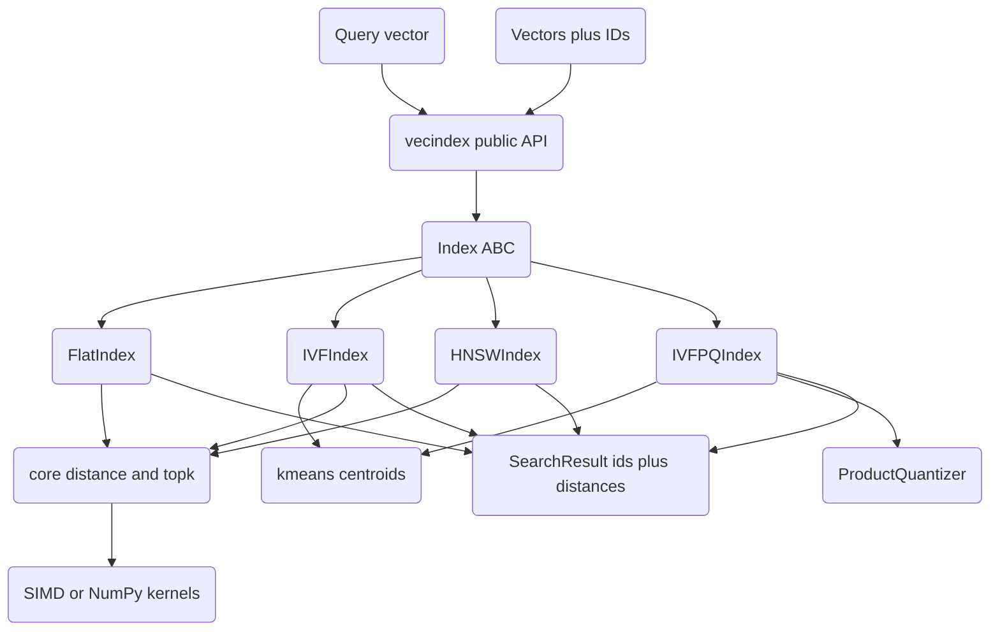

# Vector Index

A FAISS-lite vector similarity search library built from scratch in Python on top of
NumPy. It implements approximate nearest neighbor (ANN) indexes — Flat, IVF, HNSW, and
IVF-PQ — along with quantization, hybrid/rerank search, and optional Numba-accelerated
distance kernels. The package is exported as `vecindex`.

## Features

- **Flat index** — exact brute-force k-NN over all vectors (`FlatIndex` / `index/indexes.py`).
- **IVF index** — inverted-file partitioning via k-means with `nprobe` cluster probing (`IVFIndex`).
- **HNSW index** — multi-layer navigable small-world graph for O(log n) approximate search (`HNSWIndex`).
- **IVF-PQ index** — IVF partitioning plus product quantization on residuals, searched with ADC distance tables (`IVFPQIndex`).
- **Distance metrics** — L2, inner product, and cosine, with a unified "lower is better" convention (`MetricType`, `core/vectors.py`).
- **Quantizers** — product, optimized-product (rotation-learned), scalar, and binary quantization (`ProductQuantizer`, `OPQ`, `ScalarQuantizer`, `BinaryQuantizer` / `quantize/pq.py`).
- **Search utilities** — batched search, ID filtering, hybrid score fusion, and two-stage rerank (`BatchSearcher`, `HybridSearcher`, `RerankSearcher` / `search/search.py`).
- **SIMD kernels** — Numba-JIT distance and top-k kernels with automatic NumPy fallback (`simd/ops.py`, `SIMD_AVAILABLE`).
- **Index factory** — build indexes from a FAISS-style description string such as `"IVF100,PQ8"` (`IndexFactory`, `build_index`).
- **Benchmarking** — recall@k and QPS measurement against brute-force ground truth (`benchmark_index`, `compute_recall`).

## Architecture



| Component | Module | Responsibility |
|-----------|--------|----------------|
| Core ops | `core/vectors.py` | Distance metrics, `topk`, `kmeans`, `pca`, `VectorStore` |
| Indexes | `index/indexes.py` | `Index` ABC plus Flat / IVF / HNSW / IVF-PQ implementations |
| Quantizers | `quantize/pq.py` | PQ, OPQ, scalar, binary quantization; `compute_recall` |
| Search | `search/search.py` | Batch, hybrid, rerank, range search; `build_index`, `IndexFactory`, `benchmark_index` |
| SIMD | `simd/ops.py` | Numba-accelerated distance/top-k kernels with NumPy fallback |

## Quick Start

### Prerequisites

- Python >= 3.9
- NumPy >= 1.24 (only required dependency)
- Numba is optional; without it the SIMD module transparently falls back to NumPy

### Installation

```bash
pip install -e ".[dev]"
```

### Running

This is a library, not a service. Import it and build an index:

```bash
python -c "import vecindex; print(vecindex.__version__)"
```

## Usage

```python
import numpy as np
from vecindex import HNSWIndex, FlatIndex, MetricType

# Build an HNSW index over 1000 vectors of dimension 64
vectors = np.random.randn(1000, 64).astype(np.float32)
index = HNSWIndex(dim=64, M=16, ef_construction=200, ef_search=50, metric=MetricType.L2)
index.add(vectors)          # HNSW needs no separate training step

# Search for the 10 nearest neighbors of a query
query = np.random.randn(64).astype(np.float32)
result = index.search(query, k=10)
print(result.ids)           # numpy array of internal vector IDs
print(result.distances)     # corresponding distances (ascending)
```

IVF and IVF-PQ require a training pass to learn centroids before adding vectors:

```python
from vecindex import IVFIndex, IVFPQIndex

ivf = IVFIndex(dim=64, nlist=100, nprobe=10)
ivf.train(vectors)          # learn nlist centroids via k-means
ivf.add(vectors)
ivf_result = ivf.search(query, k=10)

# IVF-PQ: dim must be divisible by M (number of subquantizers)
ivfpq = IVFPQIndex(dim=64, nlist=100, M=8, nbits=8, nprobe=10)
ivfpq.train(vectors)
ivfpq.add(vectors)
```

The `build_index` helper and `IndexFactory` offer shorthand construction:

```python
from vecindex import build_index, IndexFactory

index = build_index(vectors, index_type="ivfpq", nlist=100, M=8)   # trained + populated
factory_index = IndexFactory.create("HNSW32", dim=64)               # FAISS-style string
```

## What's Real vs Simulated

- **Real:** All four index types (Flat, IVF, HNSW, IVF-PQ) are fully implemented and
  exercised by the test suite, including k-means training, HNSW graph construction with
  neighbor pruning, and IVF-PQ residual encoding with ADC scoring. The quantizers (PQ,
  OPQ, scalar, binary), distance metrics, `topk`/`kmeans`/`pca`, the search utilities
  (batch, hybrid, rerank, range), and `compute_recall` / `benchmark_index` all run in
  process against real NumPy arrays.
- **Simulated / requires optional dependencies:** SIMD acceleration is only active when
  Numba is installed; otherwise `simd/ops.py` falls back to equivalent NumPy code and
  `SIMD_AVAILABLE` is `False`. There is no GPU support, no memory-mapped on-disk index,
  and no save/load persistence — indexes live entirely in memory. IVF/IVF-PQ store
  inverted lists as Python lists, so they are illustrative rather than billion-scale.

## Testing

```bash
pytest tests/ -v
```

The suite has 163 tests across four files covering index correctness (exact results for
Flat, recall floors for HNSW and IVF-PQ, `nprobe`/`ef_search` recall monotonicity),
quantizer encode/decode round-trips, distance-metric correctness, search utilities, and
SIMD/NumPy parity. No external services are needed; tests run purely on synthetic NumPy data.

## Project Structure

```
43-vector-index/
  README.md                 # This file
  pyproject.toml            # Package metadata and dev dependencies
  src/vecindex/
    core/vectors.py         # Metrics, topk, kmeans, pca, VectorStore
    index/indexes.py        # Index ABC + Flat / IVF / HNSW / IVF-PQ
    quantize/pq.py          # ProductQuantizer, OPQ, Scalar, Binary, compute_recall
    search/search.py        # Batch / hybrid / rerank search, build_index, IndexFactory
    simd/ops.py             # Numba SIMD kernels with NumPy fallback
  tests/                    # 163 tests (index, quantization, search, simd)
  docs/BLUEPRINT.md         # Full architecture and design
```

## License

MIT — see [LICENSE](../LICENSE)
