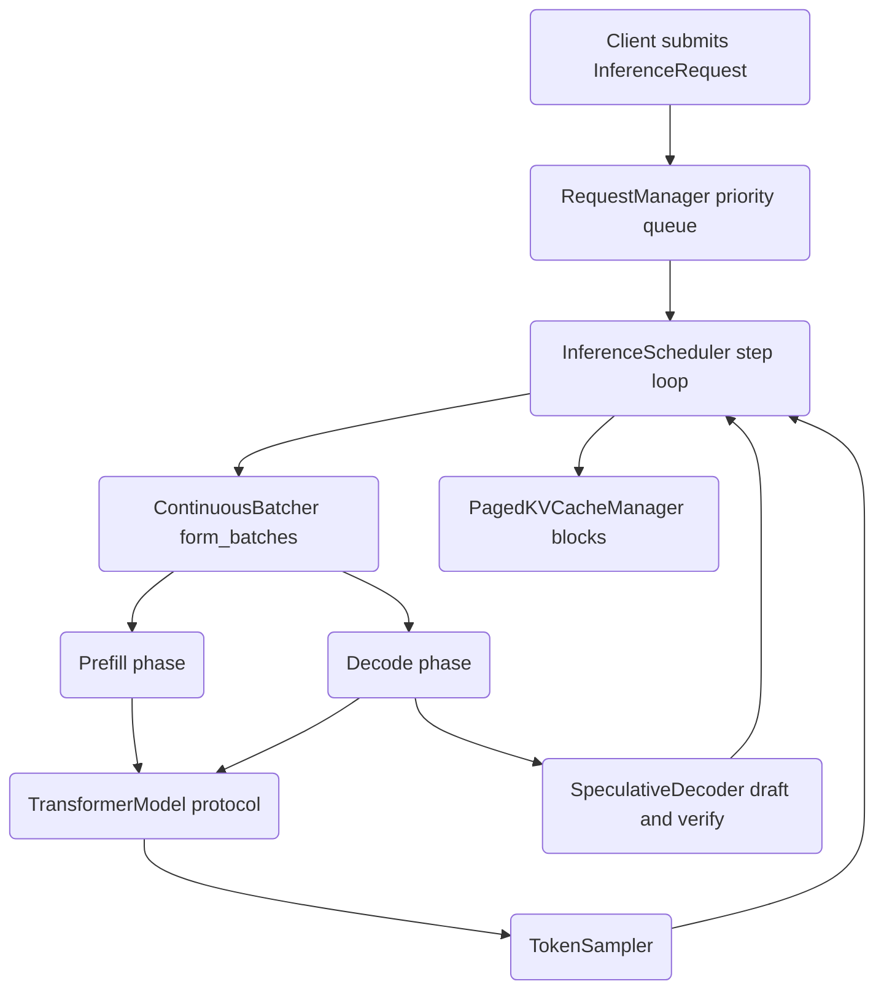

# Autoregressive Inference Engine

A from-scratch LLM inference engine implementing continuous batching, paged KV
cache management, and speculative decoding — the same mechanisms that underpin
serving systems like vLLM and TGI. The scheduling, memory management, batching,
and sampling logic are written in pure Python and run on NumPy, with an optional
PyTorch path for real tensors.

## Features

- **Priority request queue** — lifecycle tracking and a binary-heap priority queue with preemption and rejection accounting (`RequestManager` / `requests.py`).
- **Paged KV cache** — virtual-memory-style block paging with a free list, per-request block maps, and reference counting for copy-on-write (`PagedKVCacheManager` / `kv_cache.py`).
- **Sliding-window cache** — fixed-size circular buffer with correct reordering for long-context attention (`SlidingWindowCache`).
- **Continuous batching** — dynamic prefill/decode batch formation that mixes new prompts with in-flight decodes under token and batch-size budgets (`ContinuousBatcher` / `batching.py`).
- **Pluggable scheduling policies** — FIFO, priority, and shortest-job-first request selection (`FIFOPolicy`, `PriorityPolicy`, `ShortestJobFirstPolicy`).
- **Token sampling** — temperature scaling, top-k, top-p (nucleus), and repetition / frequency / presence penalties (`TokenSampler` / `sampling.py`).
- **Inference scheduler** — the prefill→decode loop with KV allocation, stop conditions, and out-of-memory preemption (`InferenceScheduler` / `scheduler.py`).
- **Speculative decoding** — draft-then-verify decoding with acceptance statistics, plus a tree-based variant (`SpeculativeDecoder`, `TreeSpeculativeDecoder` / `speculative.py`).
- **Model-agnostic interfaces** — `TransformerModel`, `DraftModel`, and `TargetModel` are typing `Protocol`s, so any object matching the signature works.
- **NumPy or PyTorch backend** — every tensor path detects PyTorch and falls back to NumPy, so the full suite runs with no GPU and no torch install.

## Architecture



| Component | Module | Responsibility |
|-----------|--------|----------------|
| Request management | `requests.py` | Priority queue, lifecycle states, preemption, stats |
| KV cache | `kv_cache.py` | Paged block allocator, sliding-window cache, memory accounting |
| Batching | `batching.py` | Prefill/decode batch formation, batched inputs, scheduling policies |
| Sampling | `sampling.py` | Temperature, top-k, top-p, repetition/frequency/presence penalties |
| Scheduler | `scheduler.py` | Step loop, KV allocation, stop conditions, preemption, metrics |
| Speculative decoding | `speculative.py` | Draft/verify decoding, tree variant, acceptance stats |

## Quick Start

### Prerequisites

- Python 3.9 or newer.
- NumPy (installed automatically). No GPU or PyTorch is required to run the tests.

### Installation

```bash
pip install -e ".[dev]"
```

To include the optional PyTorch tensor path:

```bash
pip install -e ".[full]"
```

### Running

There is no server entry point; the engine is a library driven from Python. The
snippet below runs an end-to-end generation loop using the built-in mock decode
path (no model required).

```bash
python -c "import autoregressive_inference; print(autoregressive_inference.__version__)"
```

## Usage

The scheduler runs without a model by using a deterministic mock decode path
(emits token id `100`), which is how the test suite exercises the full loop.

```python
from autoregressive_inference import (
    InferenceScheduler, RequestManager, ContinuousBatcher,
    PagedKVCacheManager, KVCacheConfig, TokenSampler,
    InferenceRequest, SamplingParams, RequestPriority,
)

config = KVCacheConfig(num_layers=2, num_heads=4, head_dim=64,
                       max_seq_len=256, block_size=16)
kv_cache = PagedKVCacheManager(config, num_blocks=64)

scheduler = InferenceScheduler(
    model=None,                       # mock decode path
    kv_cache_manager=kv_cache,
    request_manager=RequestManager(max_queue_size=100),
    batcher=ContinuousBatcher(max_batch_size=8),
    sampler=TokenSampler(seed=0),
)

scheduler.add_request(InferenceRequest(
    request_id="req-001",
    prompt="Once upon a time",
    prompt_token_ids=[1, 432, 567, 89, 234],
    sampling_params=SamplingParams(temperature=0.7, top_p=0.9, max_tokens=16),
    priority=RequestPriority.HIGH,
))

scheduler.run(max_steps=100)            # drives step() until the queue drains
done = scheduler.request_manager.get_request("req-001")
print(done.output_token_ids)            # generated token ids
print(scheduler.get_stats())            # throughput and queue metrics
```

Token sampling can be used standalone against a logits vector:

```python
import numpy as np
from autoregressive_inference import TokenSampler, SamplingParams

sampler = TokenSampler(seed=0)
logits = np.random.randn(1, 1000).astype(np.float32)
token = sampler.sample(logits, SamplingParams(top_k=10, top_p=0.9, temperature=0.8))
```

## What's Real vs Simulated

- **Real:** The request queue, paged and sliding-window KV caches, continuous
  batcher and scheduling policies, all sampling strategies, the prefill/decode
  scheduler loop with preemption, and the speculative-decoding driver and
  acceptance statistics. All run on NumPy and are exercised by 231 tests with no
  external services.
- **Simulated / requires a model:** No transformer weights are included.
  `TransformerModel`, `DraftModel`, and `TargetModel` are `Protocol` interfaces —
  callers supply a real or fake model. When `model=None`, the scheduler uses a
  fixed mock decode path (token id `100`), and the speculative decoder uses mock
  draft/verify logic (drafts `100+i`, accepts the first two). The PyTorch tensor
  paths require an environment with `torch` installed.

## Testing

```bash
pytest tests/ -v
```

The suite is 231 tests across requests, KV cache, batching, sampling, scheduler,
and speculative decoding. It runs entirely on CPU/NumPy with no model weights or
external services. GPU-only paths are marked with the `gpu` marker and can be
skipped with `-m "not gpu"`.

## Project Structure

```
44-autoregressive-inference/
  README.md                         # this file
  pyproject.toml                    # package metadata, deps, pytest/ruff config
  src/autoregressive_inference/
    requests.py                     # InferenceRequest, RequestManager, priority queue
    kv_cache.py                     # PagedKVCacheManager, KVCacheBlock, SlidingWindowCache
    batching.py                     # ContinuousBatcher, BatchedInputs, scheduling policies
    sampling.py                     # TokenSampler (top-k, top-p, penalties)
    scheduler.py                    # InferenceScheduler (prefill/decode loop, preemption)
    speculative.py                  # SpeculativeDecoder, TreeSpeculativeDecoder, protocols
  tests/                            # 231 tests, one module per component
  docs/BLUEPRINT.md                 # full architecture and design
```

## License

MIT — see [LICENSE](../LICENSE)
