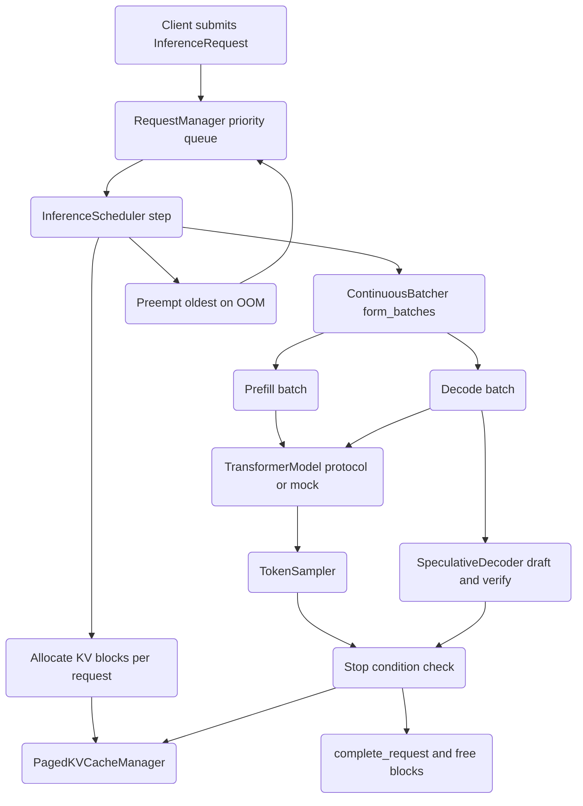

# Autoregressive Inference Engine

## Overview

This project is a from-scratch implementation of the core mechanisms that make
large-language-model serving efficient: request scheduling, paged key/value
cache management, continuous batching, token sampling, and speculative decoding.
It reconstructs the ideas behind production serving systems such as vLLM, TGI,
and Orca, but does so in plain, readable Python so that each mechanism can be
studied and tested in isolation.

The engine is deliberately independent of any model runtime. The model itself is
expressed as a typing `Protocol` (`TransformerModel`), and the draft/target
models for speculative decoding are likewise `Protocol`s (`DraftModel`,
`TargetModel`). This means the scheduler, cache, batcher, and sampler can be
exercised with no weights at all: when no model is supplied, the scheduler runs a
deterministic mock decode path. The whole system runs on NumPy and falls back
from PyTorch transparently, so the 231-test suite passes on a CPU with no GPU and
no `torch` install.

The concepts this project teaches:

- **Paged attention memory** — why contiguous KV cache allocation wastes memory
  under variable-length, dynamic workloads, and how block paging with a free list
  and reference counting fixes it.
- **Continuous (in-flight) batching** — how prefill and decode phases differ, why
  they are batched under separate budgets, and how new requests join a batch
  while others are still decoding.
- **Sampling theory in practice** — temperature, top-k truncation, nucleus
  (top-p) truncation, and repetition/frequency/presence penalties, including the
  numerical care needed for a stable softmax.
- **Speculative decoding** — using a cheap draft model to propose several tokens
  and verifying them with one parallel forward pass of the expensive target
  model, plus the tree-structured generalization.
- **Scheduling and preemption** — priority queues, lifecycle state machines, and
  what to do when the cache runs out of memory mid-flight.

Scope is the orchestration and memory layer of an inference server. It does not
include a transformer implementation, a tokenizer, attention kernels, or a
network server; those are intentionally left as interfaces so that the parts that
are implemented can be reasoned about precisely.

## Architecture



The system is layered around a single driver, `InferenceScheduler`, that ties
five independent subsystems together:

1. **Request management (`requests.py`).** Incoming work is wrapped in an
   `InferenceRequest` and pushed onto a `RequestManager`. The manager maintains a
   binary-heap priority queue of pending requests, a dictionary of running
   requests, and a dictionary of completed requests, all guarded by a lock.

2. **Scheduling (`scheduler.py`).** `InferenceScheduler.step()` pulls a bounded
   set of pending requests, allocates KV cache blocks for each, asks the batcher
   to form prefill and decode batches, runs both phases, samples next tokens,
   checks stop conditions, frees memory for finished requests, and preempts the
   oldest request when the cache is exhausted.

3. **KV cache (`kv_cache.py`).** `PagedKVCacheManager` owns a pool of
   fixed-size `KVCacheBlock`s, a free list, and a per-request block map. Blocks
   are reference-counted to support copy-on-write semantics. A separate
   `SlidingWindowCache` implements a circular buffer for sliding-window
   attention.

4. **Batching (`batching.py`).** `ContinuousBatcher` decides which requests go
   into the prefill batch (full prompts) and which go into the decode batch
   (single tokens), respecting `max_batch_size` and `max_prefill_tokens`.
   `BatchedInputs` materializes padded input-id, position-id, and attention-mask
   arrays. Three `SchedulingPolicy` subclasses offer alternative selection
   orders.

5. **Sampling and speculation (`sampling.py`, `speculative.py`).**
   `TokenSampler` converts logits to a sampled token id with the configured
   strategy. `SpeculativeDecoder` and `TreeSpeculativeDecoder` wrap a draft and a
   target model to accelerate decode.

Every tensor-bearing path in these modules is written to operate on either a
PyTorch tensor or a NumPy array, chosen at import time by a `HAS_TORCH` flag. The
pattern is consistent across `kv_cache.py`, `batching.py`, `sampling.py`, and
`speculative.py`: a `try: import torch` sets `HAS_TORCH`, helper predicates such
as `_is_torch_tensor` route per-call, and a small `_to_torch_if_needed` adapter
coerces incoming arrays to the backing store's type and device. The consequence
is that the orchestration logic is exercised identically whether or not a GPU is
present — the tests run the NumPy branch, and a deployment with weights runs the
torch branch through the same code paths.

## Core Components

### Request Manager

`RequestManager` (`requests.py`) is the front door. It accepts requests, orders
them by priority, hands batches to the scheduler, and tracks every state
transition.

Lifecycle states are an `enum`:

```python
class RequestStatus(Enum):
    PENDING = "pending"
    RUNNING_PREFILL = "running_prefill"
    RUNNING_DECODE = "running_decode"
    COMPLETED = "completed"
    FAILED = "failed"
    PREEMPTED = "preempted"
```

A request walks a fixed lifecycle. `add_request` enters it as `PENDING`;
`get_next_requests` moves it to `RUNNING_PREFILL`; once the prefill phase
finishes it becomes `RUNNING_DECODE` and stays there across successive decode
steps. From decode it either reaches `COMPLETED` when a stop condition fires, or
is bounced to `PREEMPTED` (and re-queued as `PENDING`) when the cache runs out of
memory. `fail_request` can move a running request to the terminal `FAILED`
state. Only `COMPLETED` and `FAILED` are terminal; every other state has an
outgoing transition.

The pending queue is a Python `heapq` min-heap. To make "higher priority first,
older first within a priority" come out as the heap minimum, `InferenceRequest`
defines a deliberately inverted `__lt__`:

```python
def __lt__(self, other):
    return (self.priority.value, -self.arrival_time) > \
           (other.priority.value, -other.arrival_time)
```

A higher priority value or an earlier arrival makes the request compare as
"smaller", so `heapq.heappop` returns it first. `__hash__` and `__eq__` are keyed
on `request_id` so requests can live in sets and dictionaries.

Key operations, all lock-guarded:

- `add_request` — rejects (and counts) when `pending_queue` is at
  `max_queue_size`, otherwise heap-pushes and increments `total_requests`.
- `get_next_requests(max_requests)` — pops up to `max_requests`, flips each to
  `RUNNING_PREFILL`, stamps `start_time`, and moves it into `running_requests`.
- `peek_pending` — returns a sorted copy without consuming the heap.
- `complete_request` / `fail_request` — move a running request into
  `completed_requests` with the terminal status and an `end_time`.
- `preempt_request` — pulls a running request out and pushes it back onto the
  pending heap as `PREEMPTED`.
- `get_stats` — snapshot of pending/running/completed/total/rejected counters.
- `clear_completed(older_than)` — garbage-collects finished requests.

### Paged KV Cache Manager

The autoregressive KV cache is the dominant memory consumer in LLM serving.
`PagedKVCacheManager` (`kv_cache.py`) borrows the operating-system idea of paging:
instead of one contiguous buffer per sequence, memory is carved into fixed-size
blocks that can be handed out non-contiguously.

A `KVCacheBlock` holds a five-dimensional tensor
`[num_layers, 2, num_heads, block_size, head_dim]`, where the `2` axis separates
K from V. It tracks how many token slots are filled (`num_tokens`) and a
`ref_count` for copy-on-write. The block backs onto a PyTorch tensor when torch
is available and a NumPy array otherwise:

```python
if HAS_TORCH:
    self.data = torch.zeros(num_layers, 2, num_heads, block_size, head_dim, ...)
else:
    self.data = np.zeros((num_layers, 2, num_heads, block_size, head_dim), ...)
```

`append(layer_idx, k, v)` writes one token's K and V into the next free slot, but
only advances `num_tokens` on the last layer — the engine fills a token across
all layers before counting it. `append_token` does the whole-token write in one
call. A helper `_to_torch_if_needed` converts incoming arrays to the block's
backing type and device so mixed NumPy/torch inputs are tolerated.

The manager itself owns:

- `blocks` — the pre-allocated pool of `num_blocks` blocks.
- `free_blocks` — a list of available block ids used as a stack.
- `request_blocks` — a map from `request_id` to its list of block ids.

Allocation pops from `free_blocks` and sets `ref_count = 1`:

```python
def allocate_blocks(self, request_id, num_blocks):
    with self._lock:
        if len(self.free_blocks) < num_blocks:
            return []                      # signal out of memory
        allocated = []
        for _ in range(num_blocks):
            block_id = self.free_blocks.pop()
            allocated.append(block_id)
            self.blocks[block_id].ref_count = 1
        self.request_blocks.setdefault(request_id, []).extend(allocated)
        return allocated
```

Freeing decrements `ref_count`; only when it reaches zero is the block reset and
returned to the free list, which is what makes copy-on-write sharing safe:

```python
def free_blocks_for_request(self, request_id):
    for block_id in self.request_blocks[request_id]:
        block = self.blocks[block_id]
        block.ref_count -= 1
        if block.ref_count == 0:
            block.reset()
            self.free_blocks.append(block_id)
```

`append_to_cache` finds the first non-full block for a request, allocating a
fresh block (and lazily a first block) when needed, returning `False` on
exhaustion rather than raising. `get_kv_for_request` concatenates the per-block K
and V slices along the sequence axis into a single contiguous view for attention.
`get_memory_usage` reports utilization and byte/GB figures derived from
`KVCacheConfig.get_block_memory_bytes()`, which computes
`num_layers * 2 * num_heads * block_size * head_dim * dtype_size`.

### Sliding Window Cache

`SlidingWindowCache` is an alternative cache for models that only attend to the
most recent `window_size` tokens. It keeps a circular buffer and tracks a write
`position` and an actual `length`. Writes wrap with `position % window_size`.
Reads are the subtle part: once the buffer is full, the logical token order no
longer matches physical order, so `get_kv` rebuilds an index that starts at the
oldest live slot and wraps around:

```python
start = self.position % self.window_size
indices = concatenate([arange(start, window_size), arange(0, start)])
return k_cache[layer_idx][:, indices, :], v_cache[layer_idx][:, indices, :]
```

The NumPy branch deliberately indexes `k_cache[layer_idx]` first and then applies
the advanced index, avoiding NumPy's axis-transposition behavior when basic and
advanced indices are mixed in one expression.

### Continuous Batcher

`ContinuousBatcher` (`batching.py`) implements in-flight batching. The crucial
observation is that the two phases of generation have different shapes: prefill
processes a whole prompt at once (compute-bound), while decode processes exactly
one token per request (memory-bound). They are therefore budgeted separately.

`form_batches(pending, running)`:

1. The decode batch is every running request in `RUNNING_DECODE`, truncated to
   `max_batch_size`.
2. Remaining token capacity is `max_prefill_tokens - len(decode_batch)` (decode
   contributes one token each).
3. Pending requests are added to the prefill batch greedily while their prompt
   lengths fit the remaining token budget and the combined batch stays under
   `max_batch_size`.

```python
decode_batch = [r for r in running if r.status == RequestStatus.RUNNING_DECODE]
decode_batch = decode_batch[:self.max_batch_size]
remaining_capacity = self.max_prefill_tokens - len(decode_batch)

prefill_batch, prefill_tokens = [], 0
for request in pending:
    tokens = len(request.prompt_token_ids)
    if prefill_tokens + tokens <= remaining_capacity:
        if len(prefill_batch) + len(decode_batch) < self.max_batch_size:
            prefill_batch.append(request)
            prefill_tokens += tokens
```

Supporting methods include `can_add_request` (admission test),
`estimate_batch_time` (a rough cost model weighting prefill tokens 2x decode),
`merge_for_execution` (wraps the two batches in `BatchedInputs`), and
`get_batch_stats` (token counts and batch utilization).

### Batched Inputs

`BatchedInputs` materializes the arrays a model needs. For each prefill request
it emits the full prompt; for each decode request it emits only the last token
(the previous output, or the prompt's last token on the first decode). It then
pads to a common length:

- `get_input_ids` — `[batch_size, max_len]` padded token ids.
- `get_position_ids` — absolute positions (`arange` for prefill, the running
  total length for decode).
- `get_attention_mask` — ones over real tokens, zeros over padding.
- `get_sequence_lengths`, `get_request_ids` — bookkeeping for unbatching.
- Properties: `batch_size`, `num_prefill`, `num_decode`,
  `total_prefill_tokens`, `is_empty`.

Every method has a torch branch and a NumPy branch and returns an empty
`[0, 0]` array when the batch is empty.

### Scheduling Policies

Beyond the batcher's default fill order, `batching.py` defines a small policy
hierarchy. `SchedulingPolicy.select_requests` is abstract; the three concrete
policies differ only in how they sort pending requests before applying the same
slot/token budget:

- `FIFOPolicy` — sorts by `arrival_time`.
- `PriorityPolicy` — sorts by the request's natural order (its `__lt__`, i.e.
  priority then arrival).
- `ShortestJobFirstPolicy` — sorts by prompt length to drain short prompts first.

All three always include running decode requests first so in-flight work
completes promptly. The policy classes are independent of `ContinuousBatcher`:
the batcher embeds the priority-style fill order directly, while the policy
hierarchy exists so an alternative selection strategy can be slotted in without
changing the batcher's token-budget arithmetic. This separation keeps the
"which requests" decision distinct from the "how many tokens fit" decision.

### Token Sampler

`TokenSampler` (`sampling.py`) turns a logits row into a token id. The public
`sample(logits, params, generated_ids)` applies transforms in a fixed order:

1. **Repetition penalty** (if `!= 1.0` and history present) — multiplies negative
   logits by the penalty and divides positive ones, per unique generated token.
2. **Frequency / presence penalty** — subtracts `frequency_penalty * count` and a
   flat `presence_penalty` for each previously generated token.
3. **Temperature** — divides logits by `temperature` when it is not 1 and is
   positive.
4. **Top-k** — keeps the `top_k` highest logits, masking the rest to `-inf`.
5. **Top-p (nucleus)** — sorts descending, takes the cumulative softmax, and
   masks everything past the `top_p` mass while always keeping at least one token.

It then takes a numerically stable softmax (subtracting the row max) and draws a
sample. `temperature == 0` is treated as greedy `argmax`. The sampler holds its
own `np.random.RandomState` and optional `torch.Generator` so a `seed` makes
sampling reproducible. A single-element result is returned as a Python scalar for
ergonomic single-request use.

Convenience methods round out the API: `sample_greedy`,
`sample_with_temperature`, and `get_top_tokens` (top-k tokens with logits and
probabilities, useful for debugging and tests).

### Inference Scheduler

`InferenceScheduler` (`scheduler.py`) is the conductor. It is constructed with
optional collaborators — a model, a `PagedKVCacheManager`, a `RequestManager`, a
`ContinuousBatcher`, a `TokenSampler`, an `eos_token_id` (default `2`), and an
optional `SpeculativeDecoder` — and supplies sensible defaults for the
collaborators that are omitted.

`step()` is one scheduling tick:

```python
def step(self):
    self._step_count += 1
    pending = self.request_manager.get_next_requests(self.batcher.max_batch_size)
    running = self.request_manager.get_running_requests()
    if not pending and not running:
        return []
    if self.kv_cache:
        for request in pending:
            num_blocks = (len(request.prompt_token_ids)
                          + request.sampling_params.max_tokens) \
                          // self.kv_cache.config.block_size + 1
            block_ids = self.kv_cache.allocate_blocks(request.request_id, num_blocks)
            if not block_ids:
                self._preempt_for_memory(request)
            else:
                request.kv_cache_block_ids = block_ids
    prefill_batch, decode_batch = self.batcher.form_batches(pending, running)
    if prefill_batch:
        self._execute_prefill(prefill_batch)
    completed = []
    if decode_batch:
        completed.extend(self._execute_decode(decode_batch))
    return completed
```

`_execute_prefill` advances each request to `RUNNING_DECODE` and records its
prefill token count. With no model it does only the bookkeeping (the mock path);
with a model it runs `model.prefill(...)` under `torch.no_grad()` when torch is
present.

`_execute_decode` is where tokens are produced. The mock path (no model) appends
the fixed token id `100`, increments counters, and checks the stop condition. The
real path reads the last token, calls `model.decode(...)`, samples the next token
from the final-position logits with the request's history for penalties, and
appends it. When a request stops, its KV blocks are freed and it is marked
complete.

`_should_stop` ends generation when `output_token_ids` reaches `max_tokens` or
when the produced token equals `eos_token_id`. The `stop_sequences` field on
`SamplingParams` is carried through the request but not yet enforced here,
because matching a textual stop sequence requires a tokenizer to decode the
running output — a capability deliberately left outside the engine's scope. The
hook is present so a caller that owns a tokenizer can extend the check without
touching the loop.

When `use_speculative` is set and a `SpeculativeDecoder` is attached, the decode
phase is replaced by `_execute_decode_speculative`. For each request it gathers
the current context (`prompt_token_ids + output_token_ids`), asks the decoder for
a batch of accepted tokens, and appends them one at a time, re-checking the stop
condition after every token so a mid-batch EOS or `max_tokens` boundary is
honored exactly. This is what lets a single scheduler tick emit several tokens
per request when the draft model is accurate.

`_preempt_for_memory` implements the simplest viable eviction policy: when
allocation fails, the oldest running request (smallest `arrival_time`) has its
blocks freed and is preempted back to the queue.

The driver also exposes `add_request`, `run(max_steps)` (loops `step()` until the
queue drains or the step cap is hit), `stop`, `get_step_count`,
`wait_for_completion(request_id, timeout)`, and `get_stats`, which reports
throughput (`tokens_per_second`), token totals, and — when a speculative decoder
is attached — its acceptance statistics.

### Speculative Decoder

`SpeculativeDecoder` (`speculative.py`) implements draft-then-verify decoding. A
cheap draft model proposes `num_speculative` tokens one at a time; the expensive
target model then verifies all of them in a single forward pass, accepting the
longest matching prefix and substituting its own token at the first disagreement.

The flow is draft, then verify. The decoder first asks the draft model for
`num_speculative` candidate tokens (greedy argmax, one at a time, extending the
context after each). It then concatenates those candidates onto the context and
runs the target model once, obtaining logits at every draft position in a single
pass. Walking the draft tokens in order, it samples the target's token at each
position: a match accepts the draft token, while the first mismatch accepts the
target's token and stops. Finally it records the outcome in `SpeculativeStats`.
The single target forward pass over all drafts is what makes the scheme a net win
— several tokens can be confirmed for the cost of one expensive forward pass.

`_draft` runs the draft model `num_speculative` times, greedily taking the
argmax at each step and extending the context. With no draft model it returns the
deterministic mock sequence `[100 + i for i in range(num_speculative)]`.

`_verify` concatenates the drafts onto the input, runs one target forward pass,
and compares the target's sampled token against each draft token. On a match it
accepts the draft; on a mismatch it accepts the target's token and breaks. The
mock target accepts the first two tokens and rejects the rest, which exercises the
accept/reject bookkeeping deterministically.

`generate_step` orchestrates draft then verify and updates `SpeculativeStats`
(`total_drafted`, `total_accepted`, `total_rejected`, and per-position
acceptance/rejection histograms). `acceptance_rate` is `total_accepted /
total_drafted`. `get_stats` and `reset_stats` round out the surface.

`TreeSpeculativeDecoder` generalizes this to a tree of candidate continuations:
`_draft_tree` expands `tree_width` candidates at each of `tree_depth` levels
(top-k from the draft model), and `_verify_tree` verifies every path against the
target, returning the longest accepted path. With no models it falls back to a
deterministic enumeration of `tree_width ** tree_depth` mock paths.

## Data Structures

### Request types

```python
class RequestStatus(Enum):
    PENDING = "pending"
    RUNNING_PREFILL = "running_prefill"
    RUNNING_DECODE = "running_decode"
    COMPLETED = "completed"
    FAILED = "failed"
    PREEMPTED = "preempted"


class RequestPriority(Enum):
    LOW = 0
    NORMAL = 1
    HIGH = 2
    CRITICAL = 3


@dataclass
class SamplingParams:
    temperature: float = 1.0
    top_k: int = 50
    top_p: float = 1.0
    max_tokens: int = 256
    stop_sequences: List[str] = field(default_factory=list)
    repetition_penalty: float = 1.0
    presence_penalty: float = 0.0
    frequency_penalty: float = 0.0


@dataclass
class InferenceRequest:
    request_id: str
    prompt: str
    prompt_token_ids: List[int]
    sampling_params: SamplingParams
    priority: RequestPriority = RequestPriority.NORMAL

    status: RequestStatus = RequestStatus.PENDING
    output_token_ids: List[int] = field(default_factory=list)

    arrival_time: float = field(default_factory=time.time)
    start_time: Optional[float] = None
    end_time: Optional[float] = None

    kv_cache_block_ids: List[int] = field(default_factory=list)
    prefill_tokens: int = 0
    decode_tokens: int = 0
```

`InferenceRequest` also exposes `get_total_tokens()`, `get_latency()`, and
`get_time_to_first_token()` helpers for metrics.

### KV cache configuration and block

```python
@dataclass
class KVCacheConfig:
    num_layers: int
    num_heads: int
    head_dim: int
    max_seq_len: int
    block_size: int = 16          # tokens per block
    dtype: str = "float16"
    device: str = "cpu"

    def get_block_memory_bytes(self) -> int:
        dtype_size = 2 if self.dtype == "float16" else 4
        return (self.num_layers * 2 * self.num_heads
                * self.block_size * self.head_dim * dtype_size)
```

A `KVCacheBlock`'s backing tensor has shape
`[num_layers, 2, num_heads, block_size, head_dim]`. The block-size choice trades
internal fragmentation (large blocks waste tail space) against bookkeeping
overhead (small blocks mean longer block lists per request).

### Batched inputs

`BatchedInputs` is a dataclass of two request lists whose accessor methods
produce the padded arrays described under Core Components. Its `batch_size`,
`num_prefill`, `num_decode`, `total_prefill_tokens`, and `is_empty` properties
let the scheduler reason about a batch without re-deriving counts.

### Speculative statistics

```python
@dataclass
class SpeculativeStats:
    total_drafted: int = 0
    total_accepted: int = 0
    total_rejected: int = 0
    acceptance_by_position: List[int] = field(default_factory=lambda: [0] * 8)
    rejection_by_position: List[int] = field(default_factory=lambda: [0] * 8)

    @property
    def acceptance_rate(self) -> float:
        if self.total_drafted == 0:
            return 0.0
        return self.total_accepted / self.total_drafted
```

The per-position histograms make it possible to see how acceptance decays with
draft depth, which is the key signal for tuning `num_speculative`. The histograms
are fixed at eight slots regardless of the configured speculation length, and
`get_stats` slices them to `num_speculative` before reporting, so changing the
speculation depth never invalidates previously gathered counts. The derived
`avg_accepted_per_step` property estimates how many tokens a typical speculative
step yields, which translates the raw acceptance rate into the practical "tokens
per target forward pass" figure that determines realized speedup.

### Model protocols

The model boundary is expressed entirely with `typing.Protocol`, so any object
with the right methods satisfies it — no base class to inherit:

```python
class TransformerModel(Protocol):
    @property
    def device(self) -> str: ...
    def prefill(self, input_ids, request_id, kv_cache) -> Any: ...
    def decode(self, input_ids, request_id, kv_cache) -> Any: ...


class DraftModel(Protocol):
    def forward(self, input_ids) -> Any: ...


class TargetModel(Protocol):
    def forward_with_kv(self, input_ids, kv_cache, request_id) -> Any: ...
```

## API Design

The package exports its public surface from
`autoregressive_inference/__init__.py`:

```python
from autoregressive_inference import (
    # requests
    RequestStatus, RequestPriority, SamplingParams,
    InferenceRequest, RequestManager,
    # kv cache
    KVCacheConfig, KVCacheBlock, PagedKVCacheManager, SlidingWindowCache,
    # batching
    ContinuousBatcher, BatchedInputs,
    SchedulingPolicy, FIFOPolicy, PriorityPolicy, ShortestJobFirstPolicy,
    # sampling
    TokenSampler,
    # scheduler
    InferenceScheduler, TransformerModel,
    # speculative
    SpeculativeDecoder, TreeSpeculativeDecoder, SpeculativeStats,
    DraftModel, TargetModel,
)
```

### Request manager

```
RequestManager(max_queue_size=1000)
  add_request(request) -> bool
  get_next_requests(max_requests) -> list[InferenceRequest]
  peek_pending(max_requests=10) -> list[InferenceRequest]
  complete_request(request_id) -> InferenceRequest | None
  fail_request(request_id, reason="") -> InferenceRequest | None
  preempt_request(request_id) -> InferenceRequest | None
  get_request(request_id) -> InferenceRequest | None
  get_running_requests() -> list[InferenceRequest]
  get_stats() -> dict
  clear_completed(older_than=None) -> int
```

### Paged KV cache manager

```
PagedKVCacheManager(config, num_blocks)
  allocate_blocks(request_id, num_blocks) -> list[int]
  allocate_single_block(request_id) -> int | None
  free_blocks_for_request(request_id) -> int
  get_block(block_id) -> KVCacheBlock
  get_blocks_for_request(request_id) -> list[int]
  append_to_cache(request_id, layer_idx, k, v) -> bool
  get_kv_for_request(request_id, layer_idx) -> (K, V) | (None, None)
  get_total_tokens_for_request(request_id) -> int
  can_allocate(num_blocks) -> bool
  get_memory_usage() -> dict
```

### Continuous batcher

```
ContinuousBatcher(max_batch_size=64, max_prefill_tokens=4096, max_decode_tokens=2048)
  form_batches(pending, running) -> (prefill_batch, decode_batch)
  can_add_request(request, current_batch_size, current_tokens) -> bool
  estimate_batch_time(prefill, decode, tokens_per_second=1000.0) -> float
  merge_for_execution(prefill, decode) -> BatchedInputs
  get_batch_stats(prefill, decode) -> dict
```

### Token sampler

```
TokenSampler(seed=None)
  sample(logits, params, generated_ids=None) -> int | array
  sample_greedy(logits) -> int | array
  sample_with_temperature(logits, temperature) -> int | array
  get_top_tokens(logits, k=10) -> list[dict]
```

### Inference scheduler

```
InferenceScheduler(model=None, kv_cache_manager=None, request_manager=None,
                   batcher=None, sampler=None, eos_token_id=2,
                   speculative_decoder=None, use_speculative=False)
  add_request(request) -> bool
  step() -> list[InferenceRequest]
  run(max_steps=None) -> None
  stop() -> None
  get_step_count() -> int
  get_stats() -> dict
  wait_for_completion(request_id, timeout=None) -> InferenceRequest | None
```

### Speculative decoder

```
SpeculativeDecoder(target_model=None, draft_model=None,
                   num_speculative_tokens=4, sampler=None)
  generate_step(input_ids, kv_cache, request_id, sampling_params) -> list[int]
  get_acceptance_rate() -> float
  get_stats() -> dict
  reset_stats() -> None

TreeSpeculativeDecoder(target_model=None, draft_model=None,
                       tree_width=2, tree_depth=4, sampler=None)
  generate_step(input_ids, kv_cache, request_id, sampling_params) -> list[int]
  get_stats() -> dict
```

### End-to-end example

```python
config = KVCacheConfig(num_layers=2, num_heads=4, head_dim=64,
                       max_seq_len=256, block_size=16)
scheduler = InferenceScheduler(
    model=None,
    kv_cache_manager=PagedKVCacheManager(config, num_blocks=64),
    request_manager=RequestManager(max_queue_size=100),
    batcher=ContinuousBatcher(max_batch_size=8),
    sampler=TokenSampler(seed=0),
)
scheduler.add_request(InferenceRequest(
    request_id="req-001", prompt="hello",
    prompt_token_ids=[1, 2, 3, 4],
    sampling_params=SamplingParams(max_tokens=8),
))
scheduler.run(max_steps=50)
print(scheduler.get_stats())
```

## Performance

This is a teaching and reference implementation in Python; it is not a tuned
kernel library, so the engineering interest is in algorithmic behavior and memory
accounting rather than absolute throughput. The design choices that matter:

- **Paged allocation eliminates KV fragmentation.** Because each block is the
  same size and is reused via the free list, memory utilization tends toward the
  block granularity rather than the worst-case sequence length. `get_memory_usage`
  exposes the live `utilization` ratio so this can be measured directly in tests
  and experiments.
- **Separate prefill and decode budgets keep batches balanced.** Prefill is
  compute-bound and decode is memory-bound; batching them under one combined limit
  would let a few long prompts starve many cheap decodes. The split budget in
  `form_batches` is what keeps the decode batch full while admitting new prompts.
- **Speculative decoding trades draft compute for fewer target passes.** When the
  draft model agrees with the target, several tokens are produced per target
  forward pass. The realized speedup is governed by the acceptance rate, which
  `SpeculativeStats.acceptance_rate` and the per-position histograms quantify.
- **Numerical stability in sampling.** The softmax subtracts the row maximum
  before exponentiating in both the torch and NumPy branches, avoiding overflow on
  large logits; top-p keeps at least one token so the distribution is never empty.

The repository does not ship measured throughput or latency numbers, and none are
claimed here. The `estimate_batch_time` helper provides a coarse analytic cost
model (weighting prefill tokens twice as heavily as decode tokens), useful for
relative comparisons rather than wall-clock prediction.

## Testing Strategy

Tests live in `tests/`, one module per component, 231 tests in total. The entire
suite runs on CPU using the NumPy backend with no model weights and no external
services, which is possible because of the mock decode/draft/verify paths and the
`Protocol`-based model boundary.

- **`test_requests.py` (35 tests)** — queue ordering by priority and arrival,
  rejection at capacity, lifecycle transitions (complete/fail/preempt), stats
  accounting, and `clear_completed`.
- **`test_kv_cache.py` (46 tests)** — block allocation and exhaustion, freeing and
  reference counting, append across block boundaries, KV concatenation,
  sliding-window wraparound ordering, and memory-usage math.
- **`test_batching.py` (41 tests)** — prefill/decode batch formation under token
  and batch-size budgets, padded input/position/mask construction, empty-batch
  edge cases, and the FIFO/priority/shortest-job-first policies.
- **`test_sampling.py` (43 tests)** — greedy vs sampled behavior, temperature,
  top-k and top-p truncation correctness, repetition/frequency/presence penalties,
  seeded reproducibility, and `get_top_tokens`.
- **`test_scheduler.py` (37 tests)** — the step loop with the mock model, KV
  allocation per request, stop conditions on `max_tokens` and EOS, out-of-memory
  preemption, `run`/`wait_for_completion`, and `get_stats`.
- **`test_speculative.py` (29 tests)** — drafting, verification, accept/reject
  bookkeeping, acceptance-rate computation, the per-position histograms, and the
  tree variant's path enumeration and best-path selection.

The general approach is unit tests per component with deterministic inputs
(seeded sampler, fixed mock tokens), plus integration-style scheduler tests that
drive several requests through the full prefill→decode→complete cycle. Edge cases
are covered explicitly: empty batches, full queues, exhausted caches, single-token
sequences, and circular-buffer wraparound. `pyproject.toml` registers `slow` and
`gpu` markers so heavier or GPU-only cases can be deselected with
`-m "not gpu"`.

## References

- Kwon et al., "Efficient Memory Management for Large Language Model Serving with
  PagedAttention" (vLLM).
- Yu et al., "Orca: A Distributed Serving System for Transformer-Based Generative
  Models."
- Leviathan et al., "Fast Inference from Transformers via Speculative Decoding."
- Chen et al., "Accelerating Large Language Model Decoding with Speculative
  Sampling."
- Miao et al., "SpecInfer: Accelerating Generative LLM Serving with Tree-based
  Speculative Inference and Verification."
- Holtzman et al., "The Curious Case of Neural Text Degeneration" (nucleus / top-p
  sampling).
