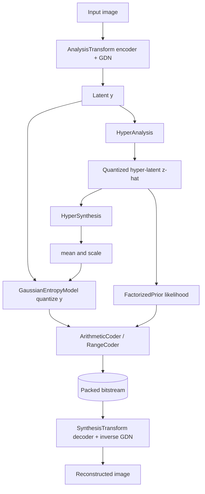

# Neural Compression Engine

A learned image compression system built from scratch, implementing VAE-based hyperprior
codecs in the style of Ballé et al. and Minnen et al.: end-to-end rate-distortion
optimization, Generalized Divisive Normalization (GDN) transforms, hyperprior entropy
models, and arithmetic/range entropy coders.

## Features

- **GDN transforms** — Generalized Divisive Normalization plus strided analysis/synthesis
  networks that downsample 16x (`GDN`, `AnalysisTransform`, `SynthesisTransform` in
  `transforms.py`).
- **Hyperprior entropy model** — hyper-encoder/decoder predicting per-latent mean and scale,
  with a factorized prior on the hyper-latents (`HyperAnalysis`, `HyperSynthesis`,
  `EntropyModel` in `entropy.py`).
- **Gaussian and mean-scale conditional models** — likelihoods computed by integrating the
  Gaussian over each quantization bin (`GaussianEntropyModel`, `MeanScaleHyperprior`).
- **End-to-end codec** — full `forward`/`compress`/`decompress` pipeline returning a
  `CompressionResult` with bitstream, ratio, and bits-per-pixel (`NeuralCompressionCodec` in
  `codecs.py`).
- **Entropy coders** — bit-level `ArithmeticCoder` (E1/E2/E3 scaling) and byte-level
  `RangeCoder`, both with round-trip encode/decode.
- **Multi-rate compression** — a single model spanning several rate points via learnable
  per-channel gain units (`MultiRateCodec`, `GainUnit`, `ScaleHyperpriorCodec` in
  `multirate.py`).
- **Perceptual and distortion losses** — MSE, SSIM, MS-SSIM, a VGG-feature perceptual loss
  (`VGGPerceptualLoss`; `LPIPSLoss` is a VGG-feature *approximation*, not calibrated LPIPS —
  see below), Charbonnier, and a combined `RateDistortionLoss` (`losses.py`).
- **Training loop** — Adam with a higher learning rate for entropy-model parameters,
  multi-step LR decay, gradient clipping, checkpointing, and a multi-rate trainer
  (`CompressionTrainer`, `MultiRateTrain` in `training.py`).
- **Data utilities** — image-folder dataset, random/center crop and flip transforms, and a
  Kodak test-set loader (`data.py`).

## Architecture



| Component | Module | Responsibility |
|-----------|--------|----------------|
| Analysis / Synthesis transforms | `transforms.py` | Encode image to latent and back with GDN |
| Entropy models | `entropy.py` | Hyperprior, factorized and Gaussian likelihoods |
| Codec | `codecs.py` | End-to-end compress/decompress, bitstream packing |
| Entropy coders | `codecs.py` | Arithmetic and range coding |
| Multi-rate | `multirate.py` | Single-model multi-rate control via gain units |
| Losses | `losses.py` | Distortion, perceptual, and rate-distortion losses |
| Training | `training.py` | Training loop, scheduling, checkpoints |
| Data | `data.py` | Datasets and augmentation transforms |

## Quick Start

### Prerequisites

- Python 3.9+
- PyTorch 2.0+ and NumPy (installed via the package). No external services are required to
  run the tests.

### Installation

```bash
pip install -e ".[dev]"
```

For Pillow-based image I/O (`ImageFolderDataset`, `KodakDataset`):

```bash
pip install -e ".[images]"
```

### Running

```bash
pytest tests/ -v
```

## Usage

The codec starts from random initialization, so the round trip below is exercised on an
untrained model — it demonstrates the API and shapes, not yet meaningful reconstructions.

```python
import torch
from neural_compression import NeuralCompressionCodec, RateDistortionLoss

codec = NeuralCompressionCodec(latent_channels=192, hyper_channels=128)

# Training forward pass returns reconstruction and likelihoods.
x = torch.rand(2, 3, 256, 256)
x_hat, likelihoods = codec(x)

criterion = RateDistortionLoss(lambda_rd=0.01, distortion_type="mse")
loss, metrics = criterion(x, x_hat, likelihoods)
loss.backward()
print(metrics["psnr"].item(), metrics["bpp"].item())

# Compress / decompress a single image.
image = torch.rand(1, 3, 256, 256)
result = codec.compress(image)
print(result.compression_ratio, result.bpp)
recon = codec.decompress(result.bitstream)
```

## What's Real vs Simulated

- **Real:** GDN transforms, the hyperprior and Gaussian/mean-scale entropy models, the
  arithmetic and range coders (with round-trip tests), the `NeuralCompressionCodec`
  compress/decompress pipeline and bitstream packing, all losses, and the training loop.
- **Simulated / requires external work:** No pretrained weights are shipped — the codec is
  randomly initialized and must be trained before reconstructions are meaningful. The CDFs
  used for arithmetic coding in `NeuralCompressionCodec` use simplified per-symbol
  distributions (the standalone coders round-trip exactly in tests; the codec's
  learned-CDF construction is approximate).
  `MultiRateCodec.compress` / `.decompress` raise `NotImplementedError` and defer to
  `NeuralCompressionCodec`. `KodakDataset` downloads images over the network.

## Testing

```bash
pytest tests/ -v
```

147 tests across 7 files cover transforms, entropy models, codecs and coders, losses,
multi-rate codecs, training, and data loading. No external services are needed (the Kodak
download is exercised only when explicitly requested).

## Project Structure

```
45-neural-compression/
  README.md
  src/neural_compression/
    transforms.py    # GDN, analysis/synthesis transforms
    entropy.py       # hyperprior, factorized, Gaussian/mean-scale models
    codecs.py        # codec, arithmetic and range coders
    multirate.py     # multi-rate codec and gain units
    losses.py        # distortion, perceptual, rate-distortion losses
    training.py      # training loop and checkpointing
    data.py          # datasets and transforms
  tests/             # 147 tests across 7 files
  docs/BLUEPRINT.md  # full architecture and design
```

## License

MIT — see [LICENSE](../LICENSE)
