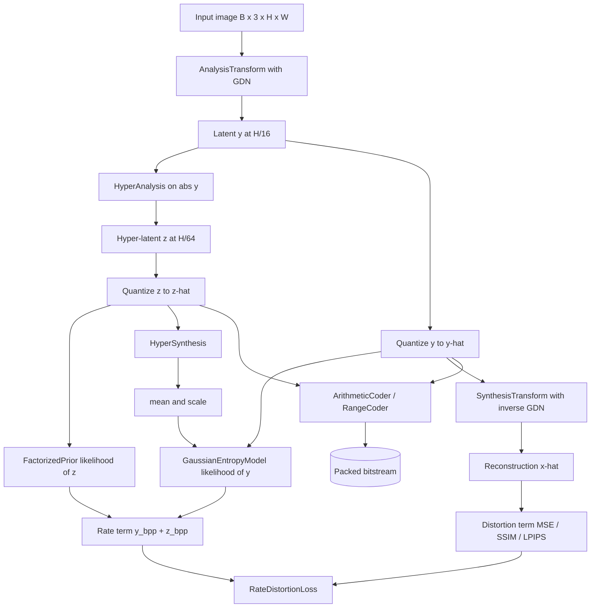

# Neural Compression Engine

## Overview

The Neural Compression Engine is a learned image compression system built from scratch on
top of PyTorch and NumPy. It follows the line of work started by Ballé et al.
(*Variational Image Compression with a Scale Hyperprior*) and extended by Minnen et al.
(*Joint Autoregressive and Hierarchical Priors*): an autoencoder transforms an image into a
latent representation, a hyperprior network predicts the entropy parameters of that latent,
and an entropy coder turns quantized latents into a compact bitstream. Training jointly
minimizes a rate term (the estimated number of bits) and a distortion term (reconstruction
error), so the network learns transforms and priors that trade size against quality.

The project exists to make the moving parts of learned compression concrete and testable:

- The **transform coding** layer (`AnalysisTransform` / `SynthesisTransform`) and the
  **Generalized Divisive Normalization** that makes neural transforms competitive with
  hand-designed ones.
- The **hyperprior entropy model**, which conditions the per-element distribution of the
  latent on a second, smaller latent, capturing spatial correlations a fully factorized
  model would miss.
- The **quantization trick**: replacing non-differentiable rounding with additive uniform
  noise during training so the rate term has gradients.
- **Entropy coding** itself — both an arithmetic coder with E1/E2/E3 renormalization and a
  byte-oriented range coder — turning probabilities into bits.
- **Rate control** across multiple operating points with a single model via learnable gain
  units, and the **perceptual losses** (SSIM, MS-SSIM, VGG/LPIPS) used to optimize for
  visual quality rather than only MSE.

The central object the system optimizes is the rate-distortion Lagrangian `D + lambda * R`,
where `D` is reconstruction distortion (MSE, or a perceptual measure) and `R` is the expected
code length in bits per pixel. Sweeping `lambda` traces the rate-distortion curve: small
`lambda` favors quality at higher bitrate, large `lambda` favors compactness. Every component
in the engine exists to make one of those two terms learnable end-to-end — the transforms and
GDN shape the latent so distortion is low for a given latent budget, while the hyperprior and
entropy coder turn the latent's learned distribution into actual bits so the rate term reflects
real code length.

Scope: the engine is a from-scratch reference. The neural transforms, entropy models, coders,
losses, training loop, and data utilities are all implemented in this repository. No
pretrained weights are shipped, and the arithmetic-coding CDF construction is intentionally
simplified, so the focus is on correct, legible mechanics rather than state-of-the-art
rate-distortion numbers.

## Architecture



The system has four cooperating layers:

1. **Transform coding** (`transforms.py`). The analysis transform maps an image to a latent
   with four stride-2 convolutions interleaved with GDN, giving a 16x spatial reduction. The
   synthesis transform mirrors it with transposed convolutions and inverse GDN.

2. **Entropy modeling** (`entropy.py`). The latent `y` is passed through a hyper-encoder to
   produce a hyper-latent `z`. `z` is quantized and coded under a factorized prior; it is
   then decoded by the hyper-synthesis network into per-element `(mean, scale)` parameters
   for a Gaussian model over `y`. Both latents are quantized (noise in training, rounding at
   inference), and their likelihoods give the rate.

3. **Entropy coding** (`codecs.py`). At inference the quantized latents and their CDFs are
   fed to the arithmetic coder (or range coder) to produce the actual bytes, which are then
   packed with a small header recording lengths and shapes.

4. **Optimization** (`losses.py`, `training.py`). The rate-distortion loss combines the
   estimated bits-per-pixel with a distortion measure; the trainer runs the optimization with
   separate learning rates for the transform and entropy parameters.

Following a single image through the pipeline makes the data flow concrete. A `[1, 3, 256,
256]` image enters the analysis transform and leaves as a `[1, 192, 16, 16]` latent `y`. The
hyper-encoder reduces `y` to a `[1, 128, 4, 4]` hyper-latent `z`. During training, both are
perturbed with uniform noise; at inference, both are rounded. `z` is coded first under the
factorized prior; the hyper-decoder then expands the rounded `z` back to a `[1, 192, 16, 16]`
map of `(mean, scale)` pairs, one Gaussian per latent element. `y` is coded under those
Gaussians. The rate is the summed negative log-likelihood of `y` and `z` divided by the pixel
count; the distortion is computed by running rounded `y` back through the synthesis transform
to a `[1, 3, 256, 256]` reconstruction. At inference the same quantized values are handed to the
arithmetic coder, which emits the bytes that actually get stored. The key invariant is that the
decoder only ever conditions on quantized values the encoder also saw, so encode and decode stay
in lockstep.

## Core Components

### Generalized Divisive Normalization (GDN)

GDN normalizes each activation by a function of the squared activations across channels,
producing more Gaussian-like, decorrelated responses that are easier to code. For channel
`i`, the normalizer is `sqrt(beta[i] + sum_j gamma[i,j] * x[j]^2)`; the forward GDN divides
by it and the inverse multiplies. The cross-channel sum of squares is implemented as a 1x1
convolution with the `gamma` matrix as its kernel, and `beta`/`gamma` are constrained
positive with a `beta_min` floor for stability. GDN replaces batch norm or ReLU in
compression transforms because it is invertible and Gaussianizes activations, which directly
benefits entropy coding.

```python
class GDN(nn.Module):
    def __init__(self, num_channels, inverse=False, beta_min=1e-6, gamma_init=0.1):
        super().__init__()
        self.inverse = inverse
        self.num_channels = num_channels
        self.beta_min = beta_min
        self.beta = nn.Parameter(torch.ones(num_channels))
        self.gamma = nn.Parameter(torch.eye(num_channels) * gamma_init)

    def forward(self, x):
        gamma = self.gamma.abs() + self.beta_min
        beta = self.beta.abs() + self.beta_min
        gamma_kernel = gamma.unsqueeze(-1).unsqueeze(-1)        # [C, C, 1, 1]
        norm = beta.view(1, -1, 1, 1) + F.conv2d(x ** 2, gamma_kernel)
        norm = torch.sqrt(norm)
        return x * norm if self.inverse else x / norm
```

### Analysis and Synthesis Transforms

`AnalysisTransform` is four `Conv2d(stride=2)` layers; the first three are each followed by a
GDN, and the last projects to `latent_channels` (default 192). The cumulative 16x downsample
means a 256x256 image becomes a 16x16 latent. `SynthesisTransform` mirrors this with
`ConvTranspose2d(stride=2, output_padding=1)` and inverse GDN. Both expose `get_output_shape`
helpers so callers can predict latent dimensions. `transforms.py` also provides a
`ResidualBlock` and `EnhancedAnalysisTransform` variant that inserts residual blocks between
downsampling stages for higher capacity. The residual block keeps the spatial size fixed and
adds the input back to a two-conv path, optionally normalized with GDN instead of batch norm:

```python
class ResidualBlock(nn.Module):
    def __init__(self, channels, use_gdn=True):
        super().__init__()
        self.conv1 = nn.Conv2d(channels, channels, 3, padding=1)
        self.conv2 = nn.Conv2d(channels, channels, 3, padding=1)
        self.norm1 = GDN(channels) if use_gdn else nn.BatchNorm2d(channels)
        self.norm2 = GDN(channels) if use_gdn else nn.BatchNorm2d(channels)

    def forward(self, x):
        out = self.norm1(self.conv1(x))
        out = self.norm2(self.conv2(out))
        return out + x
```

`EnhancedAnalysisTransform` splits the four-stage downsample into two stride-2 stages, a stack
of residual blocks at the half-resolution latent, and two more stride-2 stages, so capacity can
be added without changing the 16x total stride.

```python
class AnalysisTransform(nn.Module):
    def __init__(self, in_channels=3, latent_channels=192, num_filters=128):
        super().__init__()
        self.layers = nn.Sequential(
            nn.Conv2d(in_channels, num_filters, 5, stride=2, padding=2),
            GDN(num_filters),
            nn.Conv2d(num_filters, num_filters, 5, stride=2, padding=2),
            GDN(num_filters),
            nn.Conv2d(num_filters, num_filters, 5, stride=2, padding=2),
            GDN(num_filters),
            nn.Conv2d(num_filters, latent_channels, 5, stride=2, padding=2),
        )

    def forward(self, x):                # x: [B, 3, H, W]
        return self.layers(x)            # -> [B, latent_channels, H/16, W/16]


class SynthesisTransform(nn.Module):
    def __init__(self, out_channels=3, latent_channels=192, num_filters=128):
        super().__init__()
        self.layers = nn.Sequential(
            nn.ConvTranspose2d(latent_channels, num_filters, 5, 2, 2, output_padding=1),
            GDN(num_filters, inverse=True),
            nn.ConvTranspose2d(num_filters, num_filters, 5, 2, 2, output_padding=1),
            GDN(num_filters, inverse=True),
            nn.ConvTranspose2d(num_filters, num_filters, 5, 2, 2, output_padding=1),
            GDN(num_filters, inverse=True),
            nn.ConvTranspose2d(num_filters, out_channels, 5, 2, 2, output_padding=1),
        )

    def forward(self, y):                # y: [B, latent_channels, H/16, W/16]
        return self.layers(y)            # -> [B, 3, H, W]
```

### Hyperprior Entropy Model

`EntropyModel` ties the pieces together. Its `forward` runs the hyper-encoder on `abs(y)`,
quantizes the hyper-latent under a `FactorizedPrior`, decodes `(mean, scale)` with
`HyperSynthesis` (resizing to the latent's spatial size to support non-square images), and
then quantizes `y` and evaluates it under a `GaussianEntropyModel`. It returns `y_hat`,
`z_hat`, and a dict of `y`/`z` likelihoods. The intuition is that a fully factorized prior
over `y` cannot exploit spatial structure; the hyper-latent `z` is a compact side channel
that tells the decoder how to set each latent's distribution, so highly structured regions
spend fewer bits.

```python
class EntropyModel(nn.Module):
    def __init__(self, latent_channels=192, hyper_channels=128):
        super().__init__()
        self.hyper_analysis = HyperAnalysis(latent_channels, hyper_channels)
        self.hyper_synthesis = HyperSynthesis(latent_channels, hyper_channels)
        self.hyper_entropy = FactorizedPrior(hyper_channels)
        self.gaussian_entropy = GaussianEntropyModel()

    def forward(self, y):
        z = self.hyper_analysis(y)
        z_hat, z_likelihood = self.hyper_entropy(z, training=self.training)
        target_size = (y.shape[2], y.shape[3])
        mean, scale = self.hyper_synthesis(z_hat, target_size=target_size)
        y_hat, y_likelihood = self.gaussian_entropy(y, mean, scale, training=self.training)
        return y_hat, z_hat, {"y": y_likelihood, "z": z_likelihood}
```

`HyperAnalysis` applies a conv on `abs(y)` followed by two stride-2 convs (a further 4x
downsample of the latent). `HyperSynthesis` runs two transposed convs and a final conv that
outputs `latent_channels * 2` channels, split into `mean` and `log_scale`; the scale is
`exp(log_scale)` clamped to a 0.11 floor so likelihoods never collapse. When a `target_size`
is supplied it bilinearly resizes the parameter map so non-square or odd-sized inputs line up
with the latent grid. `get_entropy_parameters` and `compress` expose the inference-time path
(rounding instead of noise) used by the codec.

### Gaussian and Factorized Likelihoods

`GaussianEntropyModel` computes the probability mass a Gaussian assigns to the quantization
bin `[y-0.5, y+0.5]` by differencing the standardized CDF at the bin edges. The CDF uses
`erf`, and likelihoods are floored at `tail_mass` (1e-9). It also exposes `get_cdf` to build
discrete CDFs for the entropy coder.

```python
class GaussianEntropyModel(nn.Module):
    def forward(self, y, mean, scale, training=True):
        if training:
            y_hat = y + torch.empty_like(y).uniform_(-0.5, 0.5)
        else:
            y_hat = torch.round(y)
        likelihood = self._gaussian_likelihood(y_hat, mean, scale)
        return y_hat, likelihood

    def _gaussian_likelihood(self, y, mean, scale):
        upper = self._standardized_cumulative((y + 0.5 - mean) / scale)
        lower = self._standardized_cumulative((y - 0.5 - mean) / scale)
        return (upper - lower).clamp(min=self.tail_mass)

    def _standardized_cumulative(self, x):
        return 0.5 * (1 + torch.erf(x / math.sqrt(2)))
```

`FactorizedPrior` models each hyper-latent channel with a learned logistic distribution:
likelihood is the difference of `sigmoid` at the bin edges, parameterized by per-channel
`loc` and `log_scale`. During training it adds uniform noise; at inference it rounds. It also
keeps an optional bank of `matrices`/`biases` for a more expressive learned CDF, and a
`get_cdf` method for the coder.

```python
class FactorizedPrior(nn.Module):
    def forward(self, z, training=True):
        z_hat = z + torch.empty_like(z).uniform_(-0.5, 0.5) if training else torch.round(z)
        return z_hat, self._compute_likelihood(z_hat)

    def _compute_likelihood(self, z):
        scale = torch.exp(self.log_scale) + 1e-6
        centered = z - self.loc
        upper = torch.sigmoid((centered + 0.5) / scale)
        lower = torch.sigmoid((centered - 0.5) / scale)
        return (upper - lower).clamp(min=1e-9)
```

`MeanScaleHyperprior` (Minnen et al.) is a self-contained variant that predicts both mean and
scale with LeakyReLU hyper-networks, and `ScaleHyperpriorCodec` (in `multirate.py`) is the
simpler scale-only Ballé variant assuming zero-mean latents with a learned per-channel prior
scale on `z`. Its forward shows the scale-only entropy model in full: `z` conditions only the
Gaussian *scale*, the latent mean is assumed zero, and `z` itself is coded under a logistic
factorized prior parameterized by a single learned `z_prior_log_scale`:

```python
class ScaleHyperpriorCodec(nn.Module):
    def forward(self, x):
        y = self.encoder(x)
        z = self.hyper_encoder(torch.abs(y))
        z_hat = z + torch.empty_like(z).uniform_(-0.5, 0.5) if self.training else torch.round(z)
        scale = torch.exp(self.hyper_decoder(z_hat)).clamp(min=0.11)   # zero-mean Gaussian scale
        y_hat = y + torch.empty_like(y).uniform_(-0.5, 0.5) if self.training else torch.round(y)
        y_likelihood = self._gaussian_likelihood(y_hat, scale)         # mean = 0
        z_scale = torch.exp(self.z_prior_log_scale) + 1e-6
        z_likelihood = self._logistic_likelihood(z_hat, z_scale)
        x_hat = self.decoder(y_hat)
        return x_hat, {"y": y_likelihood, "z": z_likelihood, ...}
```

### Quantization

Rounding is not differentiable, so training substitutes additive uniform noise in `[-0.5,
0.5]`, which approximates the effect of rounding on the rate while leaving gradients intact:
under the noise model the expected likelihood matches the probability of the corresponding
quantization bin. At inference the models switch to true rounding. This `training` flag
threads through `FactorizedPrior`, `GaussianEntropyModel`, and the codecs, and is the reason a
single `model.train()` / `model.eval()` switch changes both the quantizer and the rate
estimate consistently.

### Entropy Coders

`ArithmeticCoder` is a textbook bit-level coder operating on a `precision`-bit range
(default 16). For each symbol it narrows `[low, high)` according to the symbol's CDF interval,
then renormalizes with three rescaling rules: E1 (high below the half — emit 0), E2 (low at or
above the half — emit 1), and E3 (the underflow case straddling the midpoint — defer a pending
bit). `decode` reverses the process, reading bits to track the code value. Helper methods pack
bit lists into bytes and back. The coder round-trips exactly in tests for both uniform and
Gaussian-shaped CDFs.

```python
def encode(self, symbols, cdfs):
    bits, low, high, pending_bits = [], 0, self.max_range, 0
    for i, symbol in enumerate(symbols):
        symbol = int(symbol); cdf = cdfs[i]
        total = int(cdf[-1]) or 1
        range_size = high - low
        high = low + (range_size * int(cdf[symbol + 1])) // total
        low = low + (range_size * int(cdf[symbol])) // total
        while True:
            if high < self.half:                       # E1
                bits.append(0); bits.extend([1] * pending_bits); pending_bits = 0
            elif low >= self.half:                     # E2
                bits.append(1); bits.extend([0] * pending_bits); pending_bits = 0
                low -= self.half; high -= self.half
            elif low >= self.quarter and high < self.three_quarter:  # E3
                pending_bits += 1; low -= self.quarter; high -= self.quarter
            else:
                break
            low <<= 1; high = (high << 1) + 1
    ...                                                 # flush pending bits
    return self._bits_to_bytes(bits)
```

`RangeCoder` is a byte-oriented alternative on a wider (default 32-bit) range. It builds a CDF
from per-position probabilities, updates `low`/`range`, and emits a byte whenever `range` drops
below a `bottom` threshold; decoding mirrors this. Range coding is typically a little faster
than bit-level arithmetic coding at similar efficiency, because it renormalizes a byte at a
time instead of a bit at a time.

### End-to-End Codec

`NeuralCompressionCodec` composes the encoder, decoder, entropy model, and arithmetic coder.
`forward(x)` returns `(x_hat, likelihoods)` for training. `compress(x)` (single image,
`[1, 3, H, W]`) encodes `y`, derives `(mean, scale)` from rounded `z`, builds Gaussian CDFs
for `y` and factorized CDFs for `z`, shifts symbols into a non-negative range, arithmetic-codes
both, and packs them with a header. It returns a `CompressionResult` carrying the bitstream,
original/compressed sizes, compression ratio, bits-per-pixel, and shape. `decompress(bitstream)`
unpacks the header, decodes `z`, recovers `(mean, scale)`, decodes `y`, and runs the decoder.
A `training_step` helper computes the MSE + `lambda_rd * bpp` loss directly.

```python
def compress(self, x):                                 # x: [1, 3, H, W]
    with torch.no_grad():
        y = self.encoder(x)
        y_hat, z_hat, mean, scale = self.entropy_model.compress(y)
        z_cdfs = self._build_factorized_cdfs(z_hat)
        y_cdfs = self._build_gaussian_cdfs(y_hat, mean, scale)
        z_sym = np.clip(z_hat.flatten().cpu().numpy().astype(np.int32) + 128, 0, 255)
        y_sym = np.clip(y_hat.flatten().cpu().numpy().astype(np.int32) + 128, 0, 255)
        z_bytes = self.coder.encode(z_sym, z_cdfs)
        y_bytes = self.coder.encode(y_sym, y_cdfs)
        bitstream = self._pack_bitstream(z_bytes, y_bytes, z_hat.shape, y_hat.shape)
    compressed = len(bitstream)
    bpp = compressed * 8 / (x.shape[2] * x.shape[3])
    return CompressionResult(bitstream, x.numel() * 4, compressed,
                             (x.numel() * 4) / compressed, bpp, x.shape)
```

The CDF builders are deliberately simplified: Gaussian CDFs are discretized per element from
the predicted `(mean, scale)` with a monotonicity fix-up, and the factorized CDFs use a fixed
logistic shape rather than the trained `FactorizedPrior` parameters. This keeps the coding
path legible; the standalone coders are exact, but the codec's approximate learned CDFs mean
its end-to-end round trip is not guaranteed bit-exact for every input.

### Compression / Decompression Symmetry

The decode path must reconstruct exactly the conditioning the encoder used, which is why the
hyper-latent is coded first. The encoder rounds `z`, codes it under the factorized prior, then
derives `(mean, scale)` from the rounded `z` — never from the continuous one — so the decoder,
which only ever sees the rounded `z`, computes the identical Gaussian parameters. Symbols are
shifted by 128 and clipped to `[0, 255]` before coding so they index the 256-entry CDF tables,
and `decompress` undoes the shift after decoding:

```python
def decompress(self, bitstream, device=None):
    z_bytes, y_bytes, z_shape, y_shape = self._unpack_bitstream(bitstream)
    z_cdfs = self._build_factorized_cdfs_for_decode(z_shape)
    z_sym = self.coder.decode(z_bytes, z_cdfs, int(np.prod(z_shape)))
    z_hat = torch.tensor(z_sym.astype(np.float32) - 128).reshape(z_shape)
    mean, scale = self.entropy_model.get_entropy_parameters(z_hat)
    y_cdfs = self._build_gaussian_cdfs_for_decode(y_shape, mean, scale)
    y_sym = self.coder.decode(y_bytes, y_cdfs, int(np.prod(y_shape)))
    y_hat = torch.tensor(y_sym.astype(np.float32) - 128).reshape(y_shape)
    return self.decoder(y_hat)
```

This ordering — code `z`, recover parameters from rounded `z`, then code `y` — is the standard
hyperprior decode protocol and is what makes the side-information scheme self-consistent.

### Multi-Rate Codec

`GainUnit` holds a `[num_rates, channels]` parameter initialized along a `linspace(0.5, 2.0)`
ramp. Applying a gain before quantization and its inverse after lets one model reach several
rate points: larger gains preserve more signal (higher rate, higher quality), smaller gains
discard more. `MultiRateCodec` shares one encoder, decoder, and entropy model across rates,
selecting a rate via `rate_idx`. `get_rate_distortion_points` sweeps all rates and returns
`(rate_idx, bpp, psnr)` tuples to trace an R-D curve. Its `compress`/`decompress` currently
raise `NotImplementedError` and defer to `NeuralCompressionCodec`.

```python
class GainUnit(nn.Module):
    def __init__(self, channels, num_rates):
        super().__init__()
        gains = torch.linspace(0.5, 2.0, num_rates).unsqueeze(1).expand(-1, channels)
        self.gains = nn.Parameter(gains)

    def forward(self, x, rate_idx, inverse=False):
        gain = self.gains[rate_idx].view(1, -1, 1, 1).abs() + 1e-6
        return x / gain if inverse else x * gain


class MultiRateCodec(nn.Module):
    def forward(self, x, rate_idx=0):
        y = self.encoder(x)
        y_scaled = self.gain(y, rate_idx, inverse=False)
        y_hat, z_hat, likelihoods = self.entropy_model(y_scaled)
        y_hat = self.gain(y_hat, rate_idx, inverse=True)
        x_hat = self.decoder(y_hat)
        return x_hat, self._compute_losses(x, x_hat, likelihoods)
```

### Losses

`losses.py` provides the distortion and perceptual measures: `SSIMLoss` (windowed SSIM via a
Gaussian kernel), `MS_SSIMLoss` (multi-scale SSIM with the standard five-scale weights
`[0.0448, 0.2856, 0.3001, 0.2363, 0.1333]`), `VGGPerceptualLoss` (feature MSE over selected
VGG-19 layers, lazily loaded and frozen), `LPIPSLoss` (a VGG-feature perceptual *approximation*
that delegates to `VGGPerceptualLoss` with fixed, non-learned layer weights — it is **not**
calibrated LPIPS and its values are not comparable to published LPIPS scores; use the `lpips`
package for the real metric), and `CharbonnierLoss` (a robust smooth-L1 variant). `RateDistortionLoss` is the
optimization objective: it computes bits-per-pixel from the `y`/`z` likelihoods, selects a
distortion term (`mse`, `ms_ssim`, `lpips`, or `mixed`), and returns
`distortion + lambda_rd * bpp` with a metrics dict including PSNR.

```python
class RateDistortionLoss(nn.Module):
    def forward(self, x, x_hat, likelihoods):
        num_pixels = x.shape[0] * x.shape[2] * x.shape[3]
        y_bpp = -torch.log2(likelihoods["y"].clamp(min=1e-9)).sum() / num_pixels
        z_bpp = -torch.log2(likelihoods["z"].clamp(min=1e-9)).sum() / num_pixels
        bpp = y_bpp + z_bpp
        mse = F.mse_loss(x_hat, x)
        psnr = -10 * torch.log10(mse.clamp(min=1e-10))
        distortion = self._select_distortion(x, x_hat, mse)
        loss = distortion + self.lambda_rd * bpp
        return loss, {"loss": loss, "mse": mse, "psnr": psnr, "bpp": bpp, ...}
```

### Multi-Rate Codec

`GainUnit` holds a `[num_rates, channels]` parameter initialized along a `linspace(0.5, 2.0)`
ramp. Applying a gain before quantization and its inverse after lets one model reach several
rate points: larger gains preserve more signal (higher rate, higher quality), smaller gains
discard more. `MultiRateCodec` shares one encoder, decoder, and entropy model across rates,
selecting a rate via `rate_idx`. `get_rate_distortion_points` sweeps all rates and returns
`(rate_idx, bpp, psnr)` tuples to trace an R-D curve. Its `compress`/`decompress` currently
raise `NotImplementedError` and defer to `NeuralCompressionCodec`.

### Losses

`losses.py` provides the distortion and perceptual measures: `SSIMLoss` (windowed SSIM via a
Gaussian kernel), `MS_SSIMLoss` (multi-scale SSIM with the standard five-scale weights),
`VGGPerceptualLoss` (feature MSE over selected VGG-19 layers, lazily loaded),
`LPIPSLoss` (a VGG-feature *approximation* of LPIPS, not the calibrated metric — see the
Losses subsection above), and `CharbonnierLoss` (a robust
smooth-L1 variant). `RateDistortionLoss` is the optimization objective: it computes
bits-per-pixel from the `y`/`z` likelihoods, selects a distortion term
(`mse`, `ms_ssim`, `lpips`, or `mixed`), and returns `distortion + lambda_rd * bpp` with a
metrics dict including PSNR.

### Training

`CompressionTrainer` splits parameters into transform and entropy groups, giving the entropy
parameters a 10x learning rate (they converge slowly otherwise), and uses Adam with a
`MultiStepLR` schedule. `train_epoch`/`validate` iterate batches, apply the
`RateDistortionLoss` plus a small auxiliary regularizer on the factorized prior's scale, clip
gradients, and accumulate metrics. `train` runs the full loop with checkpointing (best, periodic,
final), resumable via `save_checkpoint`/`load_checkpoint`. `MultiRateTrain` trains a multi-rate
model by sampling a random rate (and its matching `lambda`) per step.

```python
# Parameter grouping: entropy/prior params get a 10x learning rate.
main_params, aux_params = [], []
for name, param in self.model.named_parameters():
    (aux_params if "entropy" in name.lower() or "prior" in name.lower()
     else main_params).append(param)
self.optimizer = optim.Adam(
    [{"params": main_params, "lr": config.lr},
     {"params": aux_params, "lr": config.lr * 10}],
    weight_decay=config.weight_decay,
)
self.scheduler = optim.lr_scheduler.MultiStepLR(
    self.optimizer, milestones=config.lr_decay_steps, gamma=config.lr_decay)
```

### Data

`ImageFolderDataset` recursively loads images (Pillow, with an OpenCV fallback) as `[C, H, W]`
tensors in `[0, 1]`. `RandomCropTransform`, `CenterCropTransform`, `RandomHorizontalFlip`, and
`ComposeTransform` provide augmentation. `KodakDataset` serves the 24-image Kodak benchmark
from a local cache; downloading is opt-in (`download=True`) and each fetched file is
downloaded to a temporary path, validated as a decodable image, and only then atomically
moved into place, so partial or corrupt downloads raise a clear error instead of being
silently served. `create_dataloaders` wires train/val loaders with the standard crop+flip pipeline.

## Data Structures

```python
@dataclass
class CompressionResult:
    bitstream: bytes
    original_size: int      # bytes (float32)
    compressed_size: int    # bytes
    compression_ratio: float
    bpp: float              # bits per pixel
    shape: Tuple[int, ...]

@dataclass
class EntropyOutput:
    y_hat: torch.Tensor     # quantized main latent
    z_hat: torch.Tensor     # quantized hyper-latent
    y_likelihood: torch.Tensor
    z_likelihood: torch.Tensor
    mean: torch.Tensor      # predicted mean for y
    scale: torch.Tensor     # predicted scale for y

@dataclass
class TrainingConfig:
    lr: float = 1e-4
    lr_decay: float = 0.1
    lr_decay_steps: List[int] = [100, 150]
    batch_size: int = 8
    num_epochs: int = 200
    grad_clip: float = 1.0
    weight_decay: float = 0.0
    lambda_rd: float = 0.01
    distortion_type: str = "mse"
    checkpoint_dir: str = "checkpoints"
    save_every: int = 10
    log_every: int = 100
    aux_loss_weight: float = 1.0

@dataclass
class TrainingState:
    epoch: int = 0
    global_step: int = 0
    best_loss: float = float("inf")
    best_psnr: float = 0.0
```

The learned parameter tensors that define the models:

```python
# GDN (per instance): cross-channel normalization
beta:  [num_channels]            # additive floor, kept positive
gamma: [num_channels, channels]  # cross-channel weights, used as a 1x1 conv kernel

# FactorizedPrior (per hyper-channel): logistic prior on z
loc:       [1, channels, 1, 1]
log_scale: [1, channels, 1, 1]

# GainUnit: one gain vector per rate point
gains: [num_rates, channels]     # initialized along linspace(0.5, 2.0)

# RangeCoder configuration (no learned state)
precision = 32                   # range width in bits
top    = 1 << (precision - 8)    # renormalization thresholds
bottom = 1 << (precision - 16)
```

`HyperSynthesis` and `MeanScaleHyperprior` both emit `latent_channels * 2` channels, split into
`mean` and `log_scale`; the scale is always `exp(log_scale)` with a 0.11 floor so that no latent
element is ever assigned a degenerate (zero-width) distribution.

The packed bitstream layout produced by `_pack_bitstream` is a plain byte map:

```
offset  size  field
0       4     z_bytes length (uint32)
4       4     y_bytes length (uint32)
8       16    z_shape (4 x uint32, padded with 1s)
24      16    y_shape (4 x uint32, padded with 1s)
40      ...   z_bytes
...     ...   y_bytes
```

## API Design

Public exports (`neural_compression/__init__.py`):

```python
# Transforms
GDN, AnalysisTransform, SynthesisTransform

# Entropy models
FactorizedPrior, HyperAnalysis, HyperSynthesis,
EntropyModel, GaussianEntropyModel, MeanScaleHyperprior

# Codecs and coders
ArithmeticCoder, RangeCoder, NeuralCompressionCodec, CompressionResult

# Losses
SSIMLoss, MS_SSIMLoss, LPIPSLoss, VGGPerceptualLoss,
RateDistortionLoss, CharbonnierLoss

# Training
CompressionTrainer, TrainingConfig, TrainingState, MultiRateTrain

# Data
ImageFolderDataset, RandomCropTransform, CenterCropTransform,
ComposeTransform, KodakDataset, create_dataloaders

# Multi-rate
MultiRateCodec, GainUnit, ScaleHyperpriorCodec
```

Key signatures:

```python
codec = NeuralCompressionCodec(latent_channels=192, hyper_channels=128, num_filters=128)
x_hat, likelihoods = codec(x)                  # training forward
result = codec.compress(x)                     # x: [1, 3, H, W] -> CompressionResult
recon = codec.decompress(result.bitstream)     # -> [1, 3, H, W]
loss, metrics = codec.training_step(x, lambda_rd=0.01)

coder = ArithmeticCoder(precision=16)
data = coder.encode(symbols, cdfs)             # symbols: [N], cdfs: [N, vocab+1]
out = coder.decode(data, cdfs, num_symbols=N)

criterion = RateDistortionLoss(lambda_rd=0.01, distortion_type="mse")
loss, metrics = criterion(x, x_hat, likelihoods)

trainer = CompressionTrainer(model, TrainingConfig(lambda_rd=0.01))
history = trainer.train(train_loader, val_loader)
```

Supporting constructors and methods:

```python
# Transforms
GDN(num_channels, inverse=False, beta_min=1e-6, gamma_init=0.1)
AnalysisTransform(in_channels=3, latent_channels=192, num_filters=128)
SynthesisTransform(out_channels=3, latent_channels=192, num_filters=128)

# Entropy models
EntropyModel(latent_channels=192, hyper_channels=128)
GaussianEntropyModel(tail_mass=1e-9)               # forward(y, mean, scale, training)
FactorizedPrior(channels, init_scale=10.0)         # forward(z, training) -> (z_hat, lik)
MeanScaleHyperprior(latent_channels=192, hyper_channels=192)

# Multi-rate
MultiRateCodec(num_rates=6, latent_channels=192, hyper_channels=128)
codec.get_rate_distortion_points(x)                # -> [(rate_idx, bpp, psnr), ...]
GainUnit(channels, num_rates)                      # forward(x, rate_idx, inverse)
ScaleHyperpriorCodec(latent_channels=192, hyper_channels=128)

# Losses
SSIMLoss(window_size=11, sigma=1.5, data_range=1.0, channel=3)
MS_SSIMLoss(window_size=11, data_range=1.0, weights=None)
VGGPerceptualLoss(layers=None, weights=None, normalize_input=True)
CharbonnierLoss(epsilon=1e-6)

# Data
ImageFolderDataset(root, transform=None, extensions=None, recursive=True)
create_dataloaders(train_dir, val_dir=None, batch_size=8, crop_size=256, num_workers=4)
```

The coders share a uniform contract. `ArithmeticCoder.encode(symbols, cdfs)` expects integer
symbols and a `[N, vocab+1]` table of cumulative counts scaled to `2^precision`;
`decode(bitstream, cdfs, num_symbols)` reproduces them. `RangeCoder.encode(symbols, probs,
vocab_size)` instead takes per-position probability vectors and builds the CDF internally:

```python
coder = RangeCoder(precision=32)
data = coder.encode(symbols, probs, vocab_size=256)   # probs: [N, 256]
out = coder.decode(data, probs, num_symbols=N, vocab_size=256)
```

The rate-distortion objective is the contract between the entropy model and the optimizer: any
model whose `forward` returns `(x_hat, {"y": ..., "z": ...})` can be trained by
`RateDistortionLoss` and `CompressionTrainer` without modification, which is why
`NeuralCompressionCodec`, `MultiRateCodec`, and `ScaleHyperpriorCodec` are interchangeable from
the trainer's point of view.

## Performance

The transforms downsample 16x, so a `[1, 3, H, W]` image yields an `[1, 192, H/16, W/16]`
latent and an `[1, 128, H/64, W/64]` hyper-latent; this is what bounds memory during a forward
pass. Three design choices dominate behavior:

- **Entropy coding cost.** The arithmetic coder is a pure-Python, per-symbol loop, and the CDF
  builders allocate a `[num_symbols, 257]` table and fill it element by element with `erf` or
  `sigmoid` evaluations plus a monotonicity pass. This is by far the slowest part of
  `compress`/`decompress` and is the natural place for vectorization or a native
  implementation. The range coder amortizes renormalization over bytes rather than bits, which
  is why it is offered as a faster alternative at comparable efficiency.

- **Training stability.** Entropy parameters get a 10x learning rate (they otherwise lag the
  transforms), the scale outputs are clamped at a 0.11 floor to keep likelihoods
  well-conditioned, and gradients are clipped (default norm 1.0). A small auxiliary term
  regularizes the factorized prior's `log_scale`. The rate term is differentiable only because
  quantization is replaced by uniform noise in training; switching to `eval()` swaps in
  rounding for both the quantizer and the rate estimate so they stay consistent.

- **Rate control without retraining.** `MultiRateCodec` reaches multiple operating points from
  one set of weights by scaling the latent with a learned `GainUnit` before quantization. This
  trades a small amount of per-rate optimality for a single deployable model and a continuous
  family of rate points rather than one model per rate.

`RateDistortionLoss` reports PSNR and bits-per-pixel as metrics, and `CompressionResult`
records the achieved compression ratio and bpp, so rate-distortion behavior can be measured
directly once a model is trained. No benchmark numbers are asserted here because no pretrained
weights are shipped; the figures above are computed at runtime from whatever model is loaded.
The standard way to evaluate a trained model is to sweep `lambda_rd` (or `rate_idx` for the
multi-rate codec) over the Kodak set and plot bpp against PSNR or MS-SSIM.

## Testing Strategy

Tests verify mechanics that are easy to get subtly wrong: invertible transforms, valid
probability masses, exact coder round trips, and gradient flow through the noise-based
quantizer. The suite is 147 tests across 7 files:

- `test_transforms.py` — GDN forward/inverse behavior, analysis/synthesis output shapes and the
  16x down/upsampling relationship, residual and enhanced variants.
- `test_entropy.py` — factorized and Gaussian likelihoods are valid probabilities, hyper
  analysis/synthesis shapes, mean/scale ranges, and the full `EntropyModel` forward.
- `test_codecs.py` — arithmetic and range coder round trips, codec `forward`/`compress`/
  `decompress` shapes, and `CompressionResult` fields.
- `test_losses.py` — SSIM/MS-SSIM/VGG/LPIPS/Charbonnier numerics and the combined
  rate-distortion objective, including each `distortion_type`.
- `test_multirate.py` — gain units, multi-rate forward across `rate_idx`, and R-D point sweeps.
- `test_training.py` — config/state dataclasses, a single training step, metric accumulation,
  and checkpoint save/load round trips.
- `test_data.py` — dataset loading, crop/flip transforms, and dataloader construction.

Several test classes are worth calling out. The coder tests assert true round-trip equality
(`np.testing.assert_array_equal` on encode-then-decode) for both fixed CDFs and randomly
sampled Gaussian symbols, and they cover the empty-sequence edge case. The entropy tests check
that likelihoods lie in `(0, 1]` and sum sensibly, and that scale never drops below the 0.11
floor. The transform tests confirm the analysis/synthesis pair preserves spatial dimensions
end-to-end (a `[B, 3, 256, 256]` image survives the 16x down/up round trip) and that GDN's
inverse approximately undoes its forward. The training tests run a single optimization step on
a random batch and confirm the loss is finite and parameters update, then exercise a checkpoint
save/load cycle to verify resumability.

The emphasis throughout is on shape correctness, valid probability ranges, coder round-trip
behavior, and gradient flow rather than on absolute compression quality, which depends on
training. Tests run on CPU with no external services; the Kodak download path is exercised only
when explicitly requested.

## References

- Ballé, Minnen, Singh, Hwang, Johnston. *Variational Image Compression with a Scale
  Hyperprior* (2018).
- Minnen, Ballé, Toderici. *Joint Autoregressive and Hierarchical Priors for Learned Image
  Compression* (2018).
- Ballé, Laparra, Simoncelli. *End-to-end Optimized Image Compression* (2017), including the
  GDN nonlinearity.
- Mentzer, Agustsson, Tschannen, Timofte, Van Gool. *Practical Full Resolution Learned Lossless
  Image Compression* (2019).
- Wang, Simoncelli, Bovik. *Multiscale Structural Similarity for Image Quality Assessment*
  (2003).
- Zhang, Isola, Efros, Shechtman, Wang. *The Unreasonable Effectiveness of Deep Features as a
  Perceptual Metric* (LPIPS, 2018).
