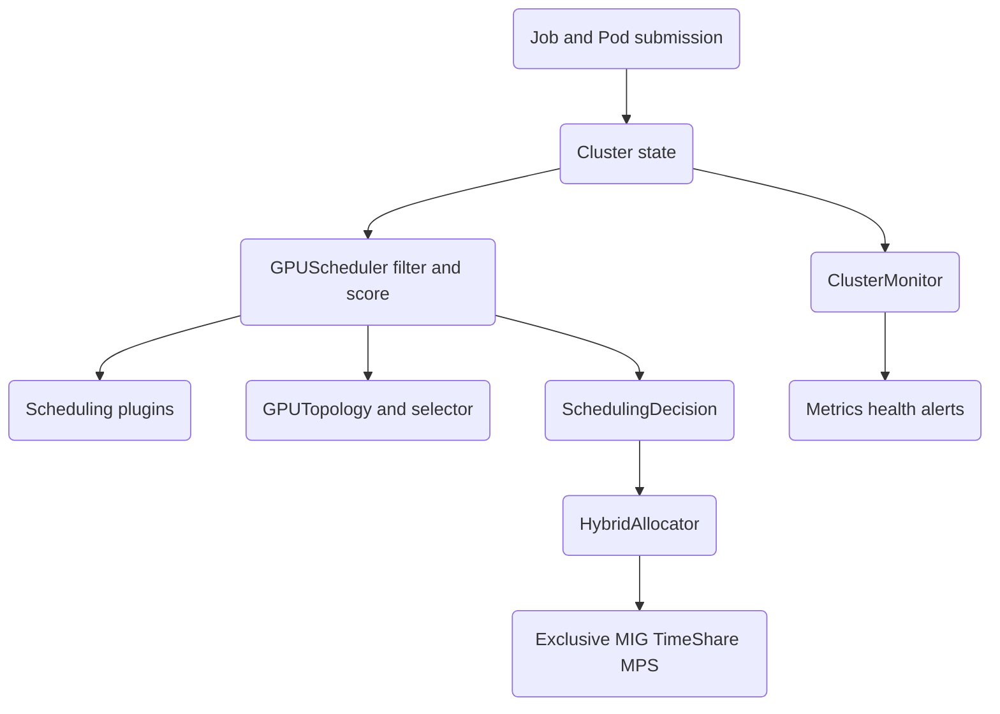

# Multi-Tenant GPU Scheduler

A Kubernetes-inspired GPU cluster scheduler for multi-tenant ML workloads, built from scratch in Python. It models nodes, GPUs, pods, jobs, queues, and tenants, then schedules pods onto GPUs using a pluggable scoring pipeline that is topology-aware (NVLink, NUMA, PCIe), supports gang scheduling and preemption, and exposes four GPU partitioning modes (exclusive, MIG, time-sharing, MPS).

## Features

- **Resource model** — physical GPUs, compute nodes, containers, pods, jobs, queues, and tenants as dataclasses (`gpusched.core.resources`).
- **Plugin-based scheduling** — a filter/score pipeline with weighted plugins: `NodeAffinityPlugin`, `GPUResourcePlugin`, `BinPackingPlugin`, `SpreadingPlugin`, `FairSharePlugin`, and `TopologyPlugin` (`GPUScheduler`).
- **Topology-aware placement** — NVLink connected-component detection, NUMA-local selection, and per-pattern communication-cost scoring (`GPUTopology`, `TopologyAwareGPUSelector`).
- **Gang scheduling** — all-or-nothing placement for distributed jobs (`GPUScheduler.schedule_gang`).
- **Preemption** — higher-priority pods can displace lower-priority preemptible pods (`PreemptionScheduler`, `PreemptionManager`).
- **Multi-queue fair sharing** — weighted, per-queue priority queues drained proportionally (`QueueScheduler`).
- **GPU partitioning** — exclusive, MIG (A100/H100 profiles), time-sharing, and MPS allocators behind a `HybridAllocator`.
- **Quotas** — per-queue and per-tenant GPU quota admission control (`Queue.can_admit`, `QuotaManager`).
- **Monitoring** — metrics collection, aggregation, health checks, alerting, and JSON/Prometheus export (`ClusterMonitor`, `MetricsCollector`, `AlertManager`).

## Architecture



| Component | Module | Responsibility |
|-----------|--------|----------------|
| Resource model | `core/resources.py` | GPU, Node, Pod, Job, Queue, Tenant, Cluster types and helpers |
| Scheduler | `scheduler/scheduler.py` | Filter/score pipeline, gang scheduling, queue and preemption schedulers |
| Topology | `scheduler/topology.py` | NVLink/NUMA/PCIe analysis and topology-aware GPU selection |
| Allocator | `allocator/allocator.py` | Exclusive, MIG, time-share, MPS, and hybrid allocation |
| Monitor | `monitor/monitor.py` | Metrics, aggregation, health checks, alerts, export |

## Quick Start

### Prerequisites

- Python 3.9+
- No external services or GPUs are required; the scheduler operates on an in-memory cluster model and the tests run on CPU.

### Installation

```bash
python -m venv venv
source venv/bin/activate
pip install -e ".[dev]"
```

### Running

The package is a library, not a server. Import it and drive a cluster in process:

```bash
python -c "import gpusched; print(gpusched.__all__)"
```

## Usage

```python
from gpusched import (
    Cluster, GPUType, PriorityClass, GPUScheduler,
    create_node, create_training_job,
)

# Build a cluster with one 8-GPU A100 node (DGX-style NVLink topology)
cluster = Cluster(cluster_id="demo")
node = create_node("gpu-server-01", num_gpus=8, gpu_type=GPUType.A100)
cluster.add_node(node)

# Submit a 4-GPU training job
job = create_training_job(
    name="bert-training",
    num_gpus=4,
    gpu_memory_gb=60.0,
    priority=PriorityClass.HIGH,
)
cluster.submit_job(job)

# Run one scheduling cycle over all pending pods
scheduler = GPUScheduler(cluster)
decisions = scheduler.run_scheduling_cycle()
for d in decisions:
    print(d.pod_id, d.success, d.node_id, d.gpu_ids, round(d.score, 1))
```

Gang scheduling for a distributed job:

```python
job = create_training_job(name="ddp", num_gpus=2, parallelism=4)
job.gang_schedule = True          # all 4 pods must place together
cluster.submit_job(job)
decisions = scheduler.schedule_gang(job)
```

Realizing a decision through the allocation manager:

```python
from gpusched.allocator.allocator import AllocationManager

pod = job.pods[0]
decision = scheduler.schedule_pod(pod)
manager = AllocationManager(cluster)
allocs = manager.allocate_pod(pod, decision.node_id, decision.gpu_ids)
manager.release_pod(pod.pod_id)
```

Shared partitioning via the hybrid allocator (time-sharing, MIG, and MPS modes
take a list of candidate GPU IDs):

```python
from gpusched import HybridAllocator, AllocationMode

allocator = HybridAllocator(cluster)
allocs = allocator.allocate(pod, node, [g.gpu_id for g in node.gpus],
                            mode=AllocationMode.SHARED)
```

Monitoring a cluster:

```python
from gpusched import ClusterMonitor

monitor = ClusterMonitor(cluster, allocator)
dashboard = monitor.run_monitoring_cycle()
print(monitor.export_metrics("prometheus"))
```

## What's Real vs Simulated

- **Real:** the scheduling pipeline (filtering, weighted scoring, best-node selection), gang scheduling, queue fair-sharing, preemption candidate selection, NVLink/NUMA topology analysis and communication-cost scoring, all four allocation modes with MIG-profile fitting, quota admission, and the monitoring/metrics/alert logic. All of this runs purely in memory and is exercised by the test suite.
- **Simulated / requires credentials:** there is no real GPU or driver integration. GPU utilization, temperature, and power are read from in-memory fields (defaulting to 0) rather than NVML; the optional `gpu` extra (`pynvml`, `gputil`) and `observability` extra (`prometheus-client`) are declared but not wired into live collection. Preemption "stops" jobs by mutating state, not by signalling real processes. Cluster state is in-process only — there is no persistence, networking, or leader election.

## Testing

```bash
pytest tests/ -v
pytest --cov=gpusched tests/        # with coverage
```

The suite has 150 tests across resources, scheduler, topology, allocator, monitor, and end-to-end integration (`tests/test_integration.py`). No external services or GPUs are needed.

## Project Structure

```
46-multi-tenant-gpu-scheduler/
  README.md                    # this file
  pyproject.toml               # package metadata and dev tooling
  src/gpusched/
    core/resources.py          # GPU, Node, Pod, Job, Queue, Tenant, Cluster
    scheduler/scheduler.py     # plugins, GPUScheduler, queue and preemption schedulers
    scheduler/topology.py      # NVLink/NUMA/PCIe analysis and selection
    allocator/allocator.py     # exclusive, MIG, time-share, MPS, hybrid
    monitor/monitor.py         # metrics, health, alerts, export
  tests/                       # unit and integration tests
  docs/BLUEPRINT.md            # full architecture and design
```

## License

MIT — see [LICENSE](../LICENSE)
