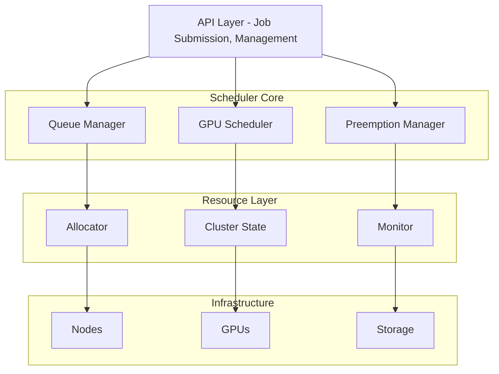

# Multi-Tenant GPU Scheduler - Architecture

## Overview

The Multi-Tenant GPU Scheduler is a Kubernetes-inspired GPU resource management system designed to efficiently schedule and allocate GPU resources across multiple tenants in a shared cluster environment. It provides fair-share scheduling, resource quotas, preemption support, and comprehensive monitoring capabilities.

## System Architecture



## Core Components

### 1. Resource Management (`core/resources.py`)

The foundation of the system, defining all resource abstractions:

- **GPU**: Physical GPU device with properties like memory, compute capability, and MIG support
- **Node**: Compute node containing multiple GPUs with CPU, memory, and network resources
- **Pod**: Schedulable unit containing one or more containers with resource requirements
- **Job**: Collection of pods representing a workload (training, inference, etc.)
- **Cluster**: Overall cluster state containing nodes, jobs, pods, queues, and tenants

#### Key Features:
- Hierarchical resource model (Cluster → Nodes → GPUs)
- Support for multiple GPU types (A100, H100, V100, T4, etc.)
- Resource arithmetic (addition, subtraction, fitting checks)
- Job state management (PENDING → SCHEDULED → RUNNING → COMPLETED)

### 2. Scheduling Engine (`scheduler/scheduler.py`)

Implements various scheduling algorithms and policies:

#### Scheduling Plugins:
- **NodeAffinityPlugin**: Enforces node selector and toleration rules
- **GPUResourcePlugin**: Filters nodes based on GPU availability and type
- **BinPackingPlugin**: Minimizes resource fragmentation
- **SpreadingPlugin**: Distributes workloads across nodes
- **FairSharePlugin**: Ensures fair resource distribution among tenants

#### Scheduling Modes:
- **Standard Scheduling**: One pod at a time
- **Gang Scheduling**: All-or-nothing scheduling for distributed jobs
- **Queue-based Scheduling**: Multi-queue with priority weights
- **Preemption Scheduling**: High-priority jobs can preempt lower-priority ones

### 3. GPU Allocation (`allocator/allocator.py`)

Manages the actual allocation of GPU resources to pods:

#### Allocation Modes:
- **Exclusive**: Entire GPU dedicated to one pod
- **Shared**: Time-sharing between multiple pods
- **MIG (Multi-Instance GPU)**: Hardware partitioning for A100/H100
- **MPS (Multi-Process Service)**: CUDA-level sharing

#### Features:
- Dynamic allocation based on workload requirements
- Support for heterogeneous GPU types
- Memory and compute fraction tracking
- Allocation lifecycle management

### 4. Monitoring System (`monitor/monitor.py`)

Comprehensive monitoring and alerting infrastructure:

#### Metrics Collection:
- GPU utilization, memory, temperature, power
- Node-level CPU, memory, network metrics
- Cluster-wide aggregated statistics
- Job and pod performance metrics

#### Alert Management:
- Multi-level alerts (INFO, WARNING, ERROR, CRITICAL)
- Automatic threshold-based alerting
- Alert resolution and history tracking

#### Health Checking:
- GPU health monitoring (temperature, errors)
- Node health status
- Cluster-wide health assessment

## Data Flow

### Job Submission Flow:

1. **Job Creation**: User creates a job with resource requirements
2. **Queue Admission**: Job is admitted to appropriate queue based on tenant and quota
3. **Pod Generation**: Job pods are created and added to pending queue
4. **Scheduling Decision**: Scheduler evaluates pods against available resources
5. **Resource Allocation**: Selected GPUs are allocated to pod
6. **Execution**: Pod transitions to running state
7. **Monitoring**: Continuous monitoring during execution
8. **Completion**: Resources released upon job completion

### Scheduling Decision Process:

```python
For each pending pod:
    1. Apply filter plugins (node affinity, resource availability)
    2. Score feasible nodes using scoring plugins
    3. Select best node based on weighted scores
    4. Allocate specific GPUs on selected node
    5. Update cluster state
```

## Multi-Tenancy Model

### Tenant Isolation:
- **Resource Quotas**: Hard limits on GPU usage per tenant
- **Queue Isolation**: Separate queues per tenant/team
- **Fair Share**: Weighted resource distribution
- **Priority Classes**: Different priority levels within tenants

### Queue Management:
- Hierarchical queue structure
- Dynamic priority adjustment based on usage
- Preemption policies per queue
- Maximum job limits

## High Availability and Fault Tolerance

### State Management:
- In-memory state with periodic snapshots
- Event-driven state updates
- Transactional state modifications

### Failure Recovery:
- **Node Failure**: Automatic pod rescheduling
- **GPU Failure**: Mark GPU as unhealthy, reschedule affected pods
- **Scheduler Failure**: State recovery from snapshot
- **Network Partition**: Graceful degradation

## Performance Optimizations

### Scheduling Performance:
- **Batch Scheduling**: Process multiple pods in one cycle
- **Priority Queues**: Efficient pod ordering
- **Caching**: Node and GPU capability caching
- **Parallel Evaluation**: Concurrent node scoring

### Resource Utilization:
- **Bin Packing**: Minimize fragmentation
- **Gang Scheduling**: Reduce distributed job start time
- **Preemption**: Maximize high-priority job throughput
- **MIG/MPS**: Improve GPU sharing efficiency

## Security Considerations

### Access Control:
- Tenant-based access control
- Queue-level permissions
- Resource quota enforcement

### Resource Isolation:
- Container-level isolation
- GPU memory isolation (MIG)
- Network isolation per tenant

## Extensibility

### Plugin Architecture:
- Custom scheduling plugins
- Allocation strategy plugins
- Monitoring metric collectors
- Alert condition evaluators

### Integration Points:
- External job submission APIs
- Monitoring system integration (Prometheus)
- Cloud provider GPU APIs
- Container runtime integration

## Configuration

### System Configuration:
```yaml
scheduler:
  interval: 10s
  batch_size: 100
  plugins:
    - name: NodeAffinity
      weight: 1.0
    - name: GPUResource
      weight: 2.0
    - name: BinPacking
      weight: 1.5

allocator:
  mode: auto  # exclusive|shared|mig
  max_sharing: 4

monitor:
  interval: 60s
  retention: 7d
  alerts:
    gpu_temp_threshold: 85
    utilization_threshold: 90
```