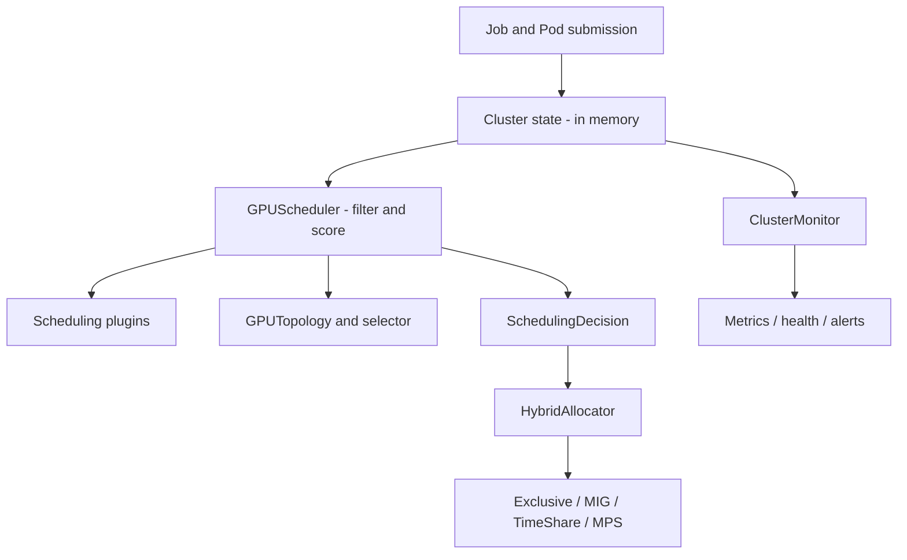

# Multi-Tenant GPU Scheduler - Architecture

## Overview

The Multi-Tenant GPU Scheduler is a Kubernetes-inspired GPU resource model and
scheduling engine for multi-tenant ML workloads. It is an **in-process Python
library** (no server, API endpoint, database, or external service): callers
build an in-memory `Cluster`, submit jobs and pods, and drive scheduling,
allocation, and monitoring by calling the classes described below.

Its capabilities are fair-share and topology-aware scheduling, gang scheduling,
preemption, four GPU partitioning modes, per-queue/per-tenant quota admission,
and in-memory metrics/health/alerting. All state lives in memory for the
lifetime of the process.

> **Scope note.** This document describes only what the code in `src/gpusched`
> actually implements. Distributed high availability, persistent/durable state,
> automatic failure recovery, authentication/authorization, network isolation,
> and file-based (YAML) configuration are **not implemented** and are called out
> as such where relevant.

## System Architecture



| Component | Module | Responsibility |
|-----------|--------|----------------|
| Resource model | `core/resources.py` | GPU, Node, Pod, Job, Queue, Tenant, Cluster types and helpers |
| Scheduler | `scheduler/scheduler.py` | Filter/score pipeline, gang, queue, and preemption schedulers |
| Topology | `scheduler/topology.py` | NVLink/NUMA/PCIe analysis and topology-aware GPU selection |
| Allocator | `allocator/allocator.py` | Exclusive, MIG, time-share, MPS, and hybrid allocation |
| Monitor | `monitor/monitor.py` | Metrics, aggregation, health checks, alerts, export |

## Core Components

### 1. Resource Management (`core/resources.py`)

The foundation of the system, defining all resource abstractions as dataclasses:

- **`GPUResources`**: A resource requirement or availability descriptor (count,
  memory, compute fraction, optional GPU type) plus topology preferences
  (`require_nvlink`, `require_same_node`, `numa_preference`). Supports
  `fits`, `add`, and `subtract`.
- **`GPU`**: Physical GPU device with memory, compute capability, MIG state,
  utilization/temperature/power fields, and topology metadata (NVLink peers,
  NUMA node, PCIe bus, local index).
- **`Node`**: Compute node holding a list of GPUs plus CPU/memory, labels,
  taints, and conditions. Provides schedulability checks.
- **`Container` / `Pod`**: A `Pod` bundles one or more `Container`s and carries
  scheduling metadata (priority, node selector, tolerations, affinity, assigned
  node/GPUs, lifecycle state).
- **`Job`**: A collection of pods with parallelism, priority, preemptibility,
  gang flag, tenant, and queue. Job state is derived from its pods' states.
- **`Queue` / `Tenant`**: Quota and fair-share bookkeeping. `Queue.can_admit`
  enforces GPU-count and max-job limits at submission time.
- **`Cluster`**: The overall in-memory state (nodes, jobs, pods, queues,
  tenants) with helpers for submitting jobs and listing schedulable nodes and
  pending/running pods.

Helper constructors `create_gpu`, `create_node` (with `"dgx"`/`"full"`/`"none"`
NVLink topologies), and `create_training_job` build populated objects.

Enums: `GPUType` (A100, H100, V100, T4, A10G, L4), `JobState`
(PENDING → SCHEDULED → RUNNING → COMPLETED / FAILED / PREEMPTED), and
`PriorityClass` (LOW, NORMAL, HIGH, CRITICAL).

### 2. Scheduling Engine (`scheduler/scheduler.py`)

Implements a filter/score plugin pipeline plus queue and preemption schedulers.

#### Scheduling Plugins (`SchedulingPlugin`):
- **`NodeAffinityPlugin`**: Filters on node selector and taints/tolerations;
  scores preferred node affinity.
- **`GPUResourcePlugin`**: Filters nodes by per-GPU memory/compute and GPU-type
  availability; scores toward higher utilization (bin-packing style).
- **`BinPackingPlugin`**: Scores to minimize memory waste/fragmentation.
- **`SpreadingPlugin`**: Scores toward less-utilized nodes.
- **`FairSharePlugin`**: Scores by inverse tenant utilization.
- **`TopologyPlugin`** (from `scheduler/topology.py`): Filters/scores on NVLink,
  NUMA, and same-node constraints for multi-GPU pods.

`GPUScheduler` wires a default weighted plugin set (NodeAffinity 1.0,
GPUResource 2.0, BinPacking 1.5, Topology 2.0, FairShare 1.0) and a
`TopologyAwareGPUSelector`. `schedule_pod` filters feasible nodes, computes a
weighted score per node, picks the best, and selects specific GPUs (topology-
aware, with a simple memory-sorted fallback).

#### Scheduling Modes:
- **Single-pod scheduling** — `GPUScheduler.schedule_pod`.
- **Gang scheduling** — `GPUScheduler.schedule_gang`: all-or-nothing placement
  for a job's pods.
- **Full cycle** — `GPUScheduler.run_scheduling_cycle`: orders pending pods by
  priority then wait time, schedules gang jobs first, then standalone pods.
- **Multi-queue fair sharing** — `QueueScheduler` drains per-queue
  `PriorityQueue`s proportionally to their `priority_weight`, re-queuing pods
  that fail to schedule.
- **Preemption** — `PreemptionScheduler.schedule_with_preemption` tries normal
  scheduling, then looks for lower-priority preemptible pods whose release would
  free enough GPUs.

> The scheduler produces `SchedulingDecision` records (chosen node and GPU IDs).
> Committing a decision (updating GPU allocation state) is performed by the
> allocator, not by the scheduler itself.

### 3. GPU Allocation (`allocator/allocator.py`)

Manages the actual allocation of GPU resources to pods.

#### Allocation Modes (`AllocationMode`):
- **Exclusive** (`ExclusiveAllocator`): Whole GPU dedicated to one pod.
- **MIG** (`MIGAllocator`): Hardware partitioning for A100/H100 using standard
  MIG profiles (`MIG_PROFILES`, e.g. `1g.5gb`…`7g.80gb`).
- **Shared / time-sharing** (`TimeShareAllocator`): Fractional GPU shares up to a
  `max_shares_per_gpu` limit (default 4).
- **MPS** (`MPSAllocator`): CUDA MPS-style thread-percentage sharing
  (`default_threads_percent`, default 25).

`HybridAllocator` dispatches to the four allocators by mode and tracks all
allocations. `GPUAllocation` records the pod, node, GPU, mode, memory, compute
fraction, and optional MIG instance. Simple test-facing helpers
(`GPUAllocator`, `SharedGPUAllocator`, `AllocationManager`) provide
single-GPU allocate/release interfaces.

> **Note:** these allocators mutate the in-memory `GPU` objects (allocated jobs,
> available memory). There is no interaction with real hardware, CUDA, or
> NVIDIA drivers.

### 4. Topology-Aware Placement (`scheduler/topology.py`)

`GPUTopology` builds an NVLink connectivity graph per node (connected-component
detection via BFS), groups GPUs by NUMA node and PCIe root, and computes
communication cost between GPUs (NVLink < same-node PCIe < cross-node).
`TopologyAwareGPUSelector` picks GPU sets that minimize communication cost,
preferring NVLink groups, then NUMA-local placement, then any available GPUs.
`estimate_distributed_training_efficiency` reports all-to-all/ring efficiency,
NVLink ratio, and NUMA locality for a GPU selection.

### 5. Monitoring System (`monitor/monitor.py`)

In-memory metrics, health checking, alerting, and quota/preemption bookkeeping.

#### Metrics Collection:
- `MetricsCollector` snapshots `GPUMetrics`, `NodeMetrics`, and `ClusterMetrics`
  from current cluster state and keeps a bounded history (`max_history`).
- `MetricsAggregator` computes averages, min/max, percentiles, and time-windowed
  aggregates over collected points.

#### Alert Management (`AlertManager`):
- `AlertLevel` = INFO, WARNING, ERROR, CRITICAL.
- Rule-based threshold checks (`add_rule`, `check_metric`, `check_conditions`)
  and built-in cluster checks (high utilization, low availability).
- Alert creation, active/resolved tracking, and level filtering.

#### Health Checking (`HealthChecker`):
- Per-GPU health (temperature > 85°C, low memory, error count), per-node health
  (Ready condition + GPU health), and cluster-wide aggregation with an overall
  status of healthy/degraded/critical.

#### Quota and Preemption:
- `QuotaManager` computes per-tenant usage and checks quota against
  `Tenant.gpu_quota`.
- `PreemptionManager` finds and preempts lower-priority running jobs and records
  preemption history.

#### Orchestration and Export:
- `ClusterMonitor` (aliased `GPUMonitor`) ties collector, health checker, and
  alert manager together, exposes dashboard/status data, and can run a
  monitoring loop. `export_metrics` supports `"json"` and `"prometheus"`
  text-exposition output.

## Data Flow

### Job Submission Flow:

1. **Job Creation**: Caller builds a `Job` (e.g. via `create_training_job`).
2. **Queue Admission**: `Cluster.submit_job` checks `Queue.can_admit` (quota and
   max jobs) before registering the job and its pods.
3. **Scheduling Decision**: `GPUScheduler` filters and scores nodes for each
   pending pod and returns `SchedulingDecision`s.
4. **Resource Allocation**: An allocator commits the decision by updating GPU
   state for the selected GPUs.
5. **Monitoring**: `ClusterMonitor` collects metrics and evaluates health/alerts
   from current in-memory state on demand or in its loop.
6. **Completion / Release**: Allocations are released back to the in-memory GPU
   objects; there is no persistence across process restarts.

### Scheduling Decision Process:

```text
For each pending pod:
    1. Apply filter plugins (node affinity, GPU resources, topology)
    2. Score feasible nodes using weighted scoring plugins
    3. Select best node by total weighted score
    4. Select specific GPUs on that node (topology-aware, memory-sorted fallback)
    5. Return a SchedulingDecision (allocator commits the state change)
```

## Multi-Tenancy Model

Tenant and queue accounting is bookkeeping over the in-memory model; it is
**not** a security boundary.

- **Resource Quotas**: `Queue.gpu_quota` / `Tenant.gpu_quota` admission limits,
  enforced by `Queue.can_admit` and `QuotaManager.check_quota`.
- **Queue Isolation**: Separate named queues per tenant/team, each with its own
  priority queue in `QueueScheduler`.
- **Fair Share**: `FairSharePlugin` and weighted per-queue draining bias
  scheduling toward under-utilized tenants/queues.
- **Priority Classes**: `PriorityClass` orders pods and gates preemption.

## Extensibility

- **Custom scheduling plugins**: implement `SchedulingPlugin` (`name`, `filter`,
  `score`) and register via `GPUScheduler.add_plugin`.
- **Custom allocators**: implement the allocator interface or extend
  `HybridAllocator`.
- **Metrics/alerts**: add `MetricType`s and `AlertManager` rules.
- **Prometheus export**: `ClusterMonitor.export_metrics(format="prometheus")`
  emits a text-exposition string for scraping by an external Prometheus (the
  library does not run an HTTP endpoint itself).

## Configuration

There is **no YAML/file-based configuration**. All tunables are constructor
arguments on the relevant classes, for example:

- Scheduler plugin set and weights: `GPUScheduler._setup_default_plugins` /
  `add_plugin(plugin, weight)`.
- Time-sharing limit: `TimeShareAllocator(max_shares_per_gpu=4)`.
- MPS thread share: `MPSAllocator(default_threads_percent=25)`.
- Monitoring cadence and history: `MetricsCollector(collection_interval=60.0,
  max_history=1000)` / `ClusterMonitor(collection_interval=60.0)`.
- Alert thresholds are currently hardcoded in the health/alert checks
  (e.g. GPU temperature > 85°C, cluster utilization > 90%) rather than
  externally configured.

## Not Implemented

The following are intentionally out of scope for this in-memory library and are
**not** present in the code:

- **High availability / fault tolerance**: no state snapshots, transactional
  updates, automatic node/GPU-failure rescheduling, scheduler failover, or
  network-partition handling. State is in-memory and lost on process exit.
- **Persistence / durable storage**: no database or storage backend.
- **Security / access control**: no authentication, authorization, queue-level
  permissions, or per-tenant network isolation. Tenancy is accounting only.
- **Networked API layer**: the package is imported and driven in-process; there
  is no job-submission server, REST/gRPC API, or running Prometheus endpoint.
- **Real hardware integration**: no CUDA, NVIDIA driver, MIG hardware, or MPS
  daemon interaction; all GPU state is simulated on Python objects.
