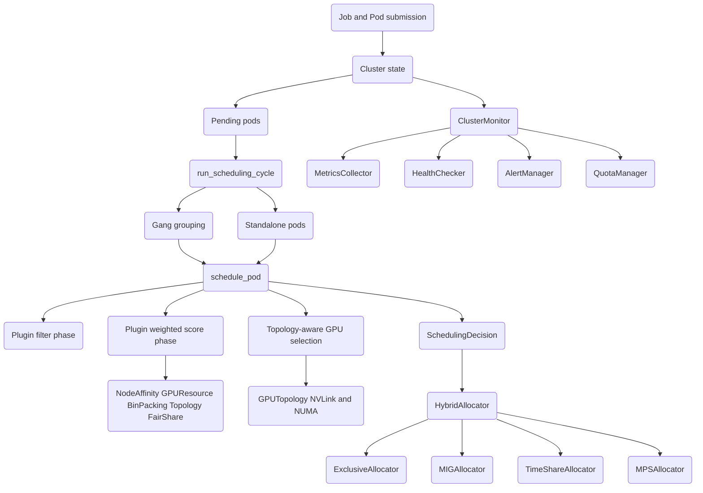

# Multi-Tenant GPU Scheduler

## Overview

The Multi-Tenant GPU Scheduler is a from-scratch, in-memory implementation of a
GPU-aware cluster scheduler for machine-learning workloads. It borrows the
filter/score scheduling model and pod/node vocabulary from Kubernetes, adds the
GPU-specific concerns that ML clusters care about — interconnect topology
(NVLink), NUMA locality, gang scheduling for distributed training, and
fine-grained GPU partitioning (MIG, time-sharing, MPS) — and layers multi-tenant
fair-sharing, quotas, preemption, and monitoring on top.

The system is deliberately a *model*: there is no GPU driver, no networking, and
no persistence. Everything happens against an in-process `Cluster` object. That
makes the scheduling algorithms, topology analysis, and allocation accounting
testable on a CPU with no special hardware, which is the point — this is a
teaching-quality reference for how a GPU scheduler is structured rather than a
production control plane.

The concepts it teaches:

- **Plugin-based scheduling.** Scheduling is split into a *filter* phase (which
  nodes can run a pod at all) and a *score* phase (how good each feasible node
  is). Plugins are independent, each contributes a weighted score, and the best
  node wins. This is exactly the shape of the Kubernetes scheduler framework.
- **Topology-aware placement.** Distributed training is bottlenecked by
  inter-GPU communication. The scheduler builds an NVLink connectivity graph,
  finds connected components, prefers NUMA-local groups, and scores selections
  by an estimated communication cost so that an all-reduce stays on fast links.
- **Gang scheduling.** Distributed jobs are all-or-nothing: either every worker
  pod is placed or none are. Partial placement wastes GPUs and deadlocks.
- **GPU partitioning.** A single physical GPU can be shared four ways —
  exclusively, via hardware MIG slices, via cooperative time-slicing, or via
  NVIDIA MPS. Each has different memory/compute accounting.
- **Multi-tenancy.** Queues and tenants carry GPU quotas and fair-share weights;
  admission control and fair draining keep one tenant from starving another.
- **Preemption.** A high-priority pod that cannot fit can reclaim resources from
  lower-priority, preemptible pods.
- **Observability.** Metrics collection, windowed aggregation with percentiles,
  health checks, threshold alerting, and JSON/Prometheus export.

### Scope

In scope: the resource model, the scheduling pipeline and its plugins, topology
analysis, the four allocators and their hybrid coordinator, quota and fair-share
logic, the preemption controllers, and the monitoring subsystem. Out of scope:
real device integration (NVML), process control, distributed state, an RPC/HTTP
API, and high availability. The "What's Real vs Simulated" section of the README
states the boundary precisely.

## Architecture



The package is organized into four cooperating layers, each a subpackage under
`src/gpusched/`:

- **`core`** holds the data model. Nothing here makes scheduling decisions; it
  defines the entities (`GPU`, `Node`, `Pod`, `Job`, `Queue`, `Tenant`,
  `Cluster`) and the value type `GPUResources` that the other layers reason
  about, plus factory helpers (`create_gpu`, `create_node`,
  `create_training_job`) that build realistic instances including NVLink
  topology.
- **`scheduler`** consumes the model and produces `SchedulingDecision`s. It
  contains the plugin interface and concrete plugins, the main `GPUScheduler`,
  the `QueueScheduler` for fair multi-queue draining, the `PreemptionScheduler`,
  and the entire `topology` module (graph building, NVLink/NUMA group finding,
  communication-cost scoring, and the `TopologyAwareGPUSelector`).
- **`allocator`** turns a decision into an *allocation record*, mutating GPU
  state. It implements four modes plus the `HybridAllocator` that dispatches to
  the right one, and an `AllocationManager` convenience layer.
- **`monitor`** observes the cluster: it samples per-GPU/per-node/cluster
  metrics, aggregates them over time windows, runs health checks, raises and
  resolves alerts, and exports JSON or Prometheus text.

The top-level `gpusched/__init__.py` re-exports the public surface of all four
layers so callers can `from gpusched import GPUScheduler, Cluster, ...`.

Data flows in one direction during a scheduling cycle: pending pods are pulled
from `Cluster`, grouped into gang jobs and standalone pods, each pod is run
through the filter/score pipeline against schedulable nodes, GPUs are selected
on the winning node using topology, and a `SchedulingDecision` is emitted. The
allocator then realizes the decision by mutating the relevant `GPU` objects'
`allocated_jobs` and `available_memory_gb`. The monitor reads the same `Cluster`
to produce metrics; it is a pure observer and never schedules.

The dependency direction is strict and acyclic: `core` depends on nothing,
`scheduler` and `allocator` depend on `core`, and `monitor` depends on `core`
and `allocator`. The one place this could have introduced a cycle — the
`topology` module needing the scheduler's plugin interface — is avoided by
`TopologyPlugin` implementing the `filter`/`score`/`name` contract via duck
typing rather than importing and subclassing `SchedulingPlugin`. The scheduler
then treats it identically to the abstract-base plugins. This keeps `core`
genuinely standalone (importable and testable on its own) and lets the topology
code be reused outside the scheduler, e.g. by the efficiency estimator.

## Core Components

### Resource model (`core/resources.py`)

The model is built from frozen-ish dataclasses. The central value type is
`GPUResources`, which doubles as both a *request* (what a container/pod needs)
and an *availability* descriptor (what a GPU offers):

```python
@dataclass
class GPUResources:
    count: int = 1
    memory_gb: float = 16.0
    compute_units: float = 1.0          # fraction of a GPU's compute
    gpu_type: GPUType | None = None
    require_nvlink: bool = False
    require_same_node: bool = True
    numa_preference: int | None = None

    def fits(self, available: "GPUResources") -> bool: ...
    def add(self, other: "GPUResources") -> "GPUResources": ...
    def subtract(self, other: "GPUResources") -> "GPUResources": ...
```

`fits` checks count, memory, compute, and (when both sides specify it) GPU type.
`add` is used to roll container requests up into a pod request and pod requests
up into a job request; it merges topology flags conservatively (`require_nvlink`
is the OR of both, `require_same_node` is the AND).

`GPU` is a physical device. Beyond memory and a `compute_capability` tuple it
carries the topology fields that make this scheduler GPU-aware: `nvlink_peers`
(GPU IDs reachable over NVLink), `numa_node`, `pcie_bus`, and `local_index`.
Allocation is tracked by appending pod IDs to `allocated_jobs`; the
`available_compute` property degrades by 25% per concurrent job, modeling
contention for shared modes:

```python
@property
def available_compute(self) -> float:
    return max(0, 1.0 - len(self.allocated_jobs) * 0.25)
```

`Node` aggregates GPUs plus CPU/memory and Kubernetes-style `labels`, `taints`,
and `conditions`. `is_schedulable()` returns false if the node is not `Ready` or
carries a `NoSchedule` taint. `Pod` wraps containers and exposes
`total_gpu_request` (the summed `GPUResources` across its containers) and
`wait_time` (seconds since creation, or queue residency if started). `Job` is a
collection of pods with `parallelism`, a `gang_schedule` flag, `priority`,
`preemptible`, `tenant_id`, and `queue_name`; its `state` is *derived* from its
pods' states rather than stored.

`Queue` and `Tenant` carry the multi-tenant accounting: a queue has a
`gpu_quota`, `priority_weight`, and `max_jobs`, and `can_admit(job)` enforces job
and GPU limits before a job is queued. A tenant has a `total_gpu_quota` and a
`fairshare_weight`, and exposes `utilization` (used / quota) which the fair-share
plugin reads.

`Cluster` is the single source of truth. It indexes nodes, jobs, pods, queues,
and tenants by ID and exposes `total_gpus`, `available_gpus`, `pending_pods`,
and `running_pods`. `submit_job` checks queue admission, records the job, and
registers its pods.

The factory `create_node(hostname, num_gpus, gpu_type, gpu_memory_gb,
nvlink_topology)` is worth calling out because it constructs realistic topology.
With `nvlink_topology="dgx"` it splits an 8-GPU node into two fully-connected
NVLink groups of four (mirroring a DGX baseboard), assigns NUMA nodes 0/1 by
half, and synthesizes PCIe addresses. `"full"` builds a full mesh; `"none"`
leaves GPUs unconnected:

```python
if nvlink_topology == "dgx" and num_gpus >= 4:
    # GPUs 0-3 fully connected, GPUs 4-7 fully connected
    for i in range(min(4, num_gpus)):
        for j in range(min(4, num_gpus)):
            if i != j:
                gpus[i].nvlink_peers.append(gpus[j].gpu_id)
    for i in range(4, num_gpus):
        for j in range(4, num_gpus):
            if i != j:
                gpus[i].nvlink_peers.append(gpus[j].gpu_id)
```

Two modeling decisions are worth noting. First, `Job.state` is *derived* rather
than stored: it inspects its pods and returns COMPLETED only if all pods are
complete, FAILED if any failed, then RUNNING/SCHEDULED/PENDING in priority
order. This keeps job and pod state from drifting out of sync. Second, GPU
allocation is recorded on the `GPU` object itself (`allocated_jobs`,
`available_memory_gb`) rather than in a side table, so any code with a reference
to a node sees a consistent picture — at the cost of requiring careful
restoration on deallocation, which each allocator handles.

### Scheduling pipeline (`scheduler/scheduler.py`)

`SchedulingPlugin` is the extension point. Every plugin implements three methods:

```python
class SchedulingPlugin(ABC):
    @abstractmethod
    def name(self) -> str: ...
    @abstractmethod
    def filter(self, ctx: SchedulingContext, node: Node) -> bool: ...
    @abstractmethod
    def score(self, ctx: SchedulingContext, node: Node) -> float: ...
```

`filter` is a hard gate: if any plugin rejects a node, the node is infeasible.
`score` is soft: each plugin returns a number (higher is better) that is
multiplied by the plugin's weight and summed. The built-in plugins are:

- **`NodeAffinityPlugin`** — filters on `node_selector` label matches and
  `NoSchedule` taints (unless tolerated); scores preferred node-affinity
  expressions by their declared weight.
- **`GPUResourcePlugin`** — the core GPU gate. It derives a *per-GPU*
  requirement (memory and a compute fraction of the total) and requires that the
  node has at least `count` GPUs that each satisfy it, optionally constrained by
  GPU type. Its score rewards higher post-placement utilization, i.e. it
  bin-packs.
- **`BinPackingPlugin`** — scores by minimizing wasted memory on the GPUs a pod
  would land on (lower waste, higher score) to reduce fragmentation.
- **`SpreadingPlugin`** — the opposite bias: prefers less-utilized nodes to
  spread load.
- **`FairSharePlugin`** — reads the pod's job's tenant and scores inversely to
  that tenant's current utilization, nudging GPUs toward under-served tenants.
- **`TopologyPlugin`** (from `topology.py`) — filters on NVLink/NUMA feasibility
  for multi-GPU pods and scores by the topology quality of the best GPU group it
  can find.

`GPUScheduler` wires a default plugin set with weights (GPUResource 2.0,
Topology 2.0, BinPacking 1.5, NodeAffinity 1.0, FairShare 1.0) and exposes
`add_plugin` for custom ones. `schedule_pod` runs the full pipeline:

```python
def schedule_pod(self, pod: Pod) -> SchedulingDecision:
    ctx = SchedulingContext(cluster=self.cluster, pod=pod, job=...)
    feasible = [n for n in self.cluster.get_schedulable_nodes()
                if all(p.filter(ctx, n) for p, _ in self.plugins)]
    if not feasible:
        return SchedulingDecision(..., success=False, reason="No feasible nodes")
    scored = [(sum(p.score(ctx, n) * w for p, w in self.plugins), n)
              for n in feasible]
    scored.sort(key=lambda x: -x[0])
    best_score, best_node = scored[0]
    gpu_ids = self._select_gpus(pod, best_node)
    return SchedulingDecision(pod.pod_id, best_node.node_id, gpu_ids,
                              success=True, score=best_score)
```

`_select_gpus` delegates to the `TopologyAwareGPUSelector` and falls back to a
simple memory-sorted pick if topology selection yields nothing. The two phases
have a deliberate division of labor: filtering is cheap and conservative (it
should never let through a node that cannot run the pod), while scoring is where
policy lives (bin-pack vs spread vs fair-share vs topology). Because scores are
summed with weights, the relative weights *are* the cluster's scheduling policy:
giving `GPUResource` and `Topology` weight 2.0 while `FairShare` gets 1.0 means
packing and interconnect quality dominate, with fairness as a tiebreaker. The
`GPUResourcePlugin` filter is subtle in one respect — it splits a pod's total
request into a *per-GPU* requirement so that a 4-GPU, 240 GB request is checked
as "four GPUs that each have 60 GB free," not "one GPU with 240 GB":

```python
per_gpu_req = GPUResources(
    count=1,
    memory_gb=required.memory_gb,
    compute_units=required.compute_units / max(1, required.count),
    gpu_type=required.gpu_type,
)
available_gpus = [g for g in node.gpus if g.can_allocate(per_gpu_req)]
if len(available_gpus) < required.count:
    return False
```

`schedule_gang(job)` schedules every pod and commits the decisions only if *all*
succeed; otherwise it returns failure decisions for the whole job:

```python
def schedule_gang(self, job: Job) -> list[SchedulingDecision]:
    temp = [self.schedule_pod(p) for p in job.pods]
    if all(d.success for d in temp):
        return temp
    return [SchedulingDecision(p.pod_id, None, [], success=False,
                               reason="Gang scheduling failed - insufficient resources")
            for p in job.pods]
```

This all-or-nothing rule is what prevents the classic distributed-training
deadlock where some workers are placed, hold GPUs, and wait forever for workers
that can never start. The driver, `run_scheduling_cycle`, sorts pending pods by
priority (desc) and wait time (desc), separates gang jobs from standalone pods,
schedules gangs first, then the rest — so a large distributed job is not starved
by a stream of small single-pod jobs that would otherwise nibble its GPUs away
one at a time.

`PriorityQueue` is a small heap-backed structure with an entry-finder for
lazy removal, used by `QueueScheduler`. Entries are pushed as
`(-priority, timestamp, pod_id)` so that `heapq` (a min-heap) pops the highest
priority first and breaks ties by oldest submission; `remove` marks an entry
stale in the finder and `pop` skips stale entries, the standard lazy-deletion
trick that avoids re-heapifying on every removal.

The queue scheduler maintains one `PriorityQueue` per named queue and, on each
`schedule()` call, drains pods from each queue in proportion to its
`priority_weight`. The per-queue share is computed as
`int(weight / total_weight * 10) + 1`, so a queue with twice the weight of its
peers gets roughly twice as many placement attempts per cycle, and every
non-empty queue gets at least one (`+ 1`) so no queue is fully starved:

```python
total_weight = sum(self.cluster.queues[q].priority_weight
                   for q in self.queue_priorities if q in self.cluster.queues)
for queue_name, pq in self.queue_priorities.items():
    weight = self.cluster.queues.get(queue_name).priority_weight if ... else 1.0
    share = int((weight / total_weight) * 10) + 1
    for _ in range(min(share, len(pq))):
        pod_id = pq.pop()
        decision = self.gpu_scheduler.schedule_pod(self.cluster.pods[pod_id])
        if not decision.success:
            pq.push(pod_id, pod.priority.value, pod.created_at)   # re-queue
```

Pods whose placement fails are re-queued rather than dropped, so a transient
shortage delays a pod instead of losing it.

`PreemptionScheduler` first tries a normal placement; on failure it walks
schedulable nodes, collects lower-priority preemptible pods on each node via
`find_preemption_candidates`, and if the resources they hold would satisfy the
incoming pod's request, returns a success decision annotated with how many pods
would be preempted (the actual stop/reschedule is left to the caller):

```python
def schedule_with_preemption(self, pod: Pod) -> SchedulingDecision:
    decision = self.gpu_scheduler.schedule_pod(pod)
    if decision.success:
        return decision
    for node in self.cluster.get_schedulable_nodes():
        candidates = self.find_preemption_candidates(pod, node)
        freed = GPUResources(count=0, memory_gb=0, compute_units=0)
        for c in candidates:
            freed = freed.add(c.total_gpu_request)
        if freed.count >= pod.total_gpu_request.count:
            return SchedulingDecision(pod.pod_id, node.node_id, [],
                                      success=True,
                                      reason=f"Preempting {len(candidates)} pods")
    return SchedulingDecision(pod.pod_id, None, [], success=False,
                              reason="No preemption candidates available")
```

`find_preemption_candidates` only considers pods that are RUNNING, belong to a
`preemptible` job, and have strictly lower `priority.value` than the incoming
pod — so preemption never cascades upward and never touches non-preemptible
work. This is intentionally conservative: it identifies *whether* preemption can
succeed and returns the candidate set, but does not itself evict anything, which
keeps the decision and the side-effecting eviction separable and testable.

### Topology analysis (`scheduler/topology.py`)

`GPUTopology` is the heart of GPU-awareness. `analyze_node` builds an undirected
NVLink graph from each GPU's `nvlink_peers`, finds connected components by BFS
(`_find_nvlink_groups`), and additionally groups GPUs by NUMA node and PCIe root
complex, caching the result as a `TopologyInfo` per node.

`find_nvlink_group(node, count)` returns the first NVLink component with `count`
free GPUs; `find_numa_local_gpus(node, count, numa_node)` does the same within a
NUMA domain. Communication cost between two GPUs is a fixed cost model:

```python
@dataclass
class CommunicationCost:
    nvlink: float = 0.1          # ~300 GB/s
    pcie_same_node: float = 2.0  # PCIe Gen3/4 ~32 GB/s
    cross_node: float = 10.0     # network
    same_gpu: float = 0.0
```

`calculate_total_communication_cost(gpus, pattern)` sums pairwise costs for
`all_to_all`, `ring`, or `tree` patterns — the three collective shapes that
distributed training uses. The pattern matters: an all-to-all (used by
all-reduce) touches every pair and so is most sensitive to a single slow link,
while a ring touches only `n` neighbor pairs. `score_gpu_selection` turns the
all-to-all cost into a 0–100 score:

```python
score = 50.0
if requirements.require_nvlink:
    for i, g1 in enumerate(gpus):
        for j, g2 in enumerate(gpus):
            if i < j and g2.gpu_id not in g1.nvlink_peers:
                return 0.0           # hard fail: NVLink demanded but absent
    score += 30.0
comm_cost = self.calculate_total_communication_cost(gpus, "all_to_all")
max_cost = len(gpus) * (len(gpus) - 1) / 2 * self.cost_config.cross_node
if max_cost > 0:
    score += (1 - comm_cost / max_cost) * 30   # cheaper comms -> higher score
if len({g.numa_node for g in gpus}) == 1:
    score += 10.0                    # single NUMA domain
if len({g.node_id for g in gpus}) == 1:
    score += 10.0                    # single node
return min(100.0, score)
```

So a 4-GPU pod landing entirely inside one NVLink quad on one NUMA node scores
near 100, while the same pod scattered across two nodes scores low — and the
weighted `TopologyPlugin` translates that directly into node ranking.

`TopologyAwareGPUSelector.select_gpus` is the placement policy used by the
scheduler. For a single GPU it picks any free GPU of the right type and memory.
For multiple GPUs it tries, in order: an NVLink group, then NUMA-local groups,
then any free GPUs, keeping the highest-scoring valid selection. When
`require_nvlink` is set and no NVLink group exists, it returns empty (the pod
will not be placed).

`TopologyAwareGPUSelector.select_gpus` evaluates up to three strategies and
keeps the best-scoring valid one rather than returning the first that fits:

1. **NVLink group** — `find_nvlink_group` then filter by type/memory. If
   `require_nvlink` is set and this yields nothing, the selector returns empty
   immediately (the pod is unplaceable on this node).
2. **NUMA-local** — for each NUMA domain, `find_numa_local_gpus`, filter, score.
3. **Any free GPUs** — a fallback that fills from whatever is available.

Because each candidate set is scored with `score_gpu_selection`, a node with an
intact NVLink quad will beat one where the only free GPUs straddle NUMA domains,
even if both technically have enough free GPUs.

The standalone helper `estimate_distributed_training_efficiency(gpus)` reports
`all_to_all`/`ring` efficiency, NVLink pair ratio, and NUMA locality for a
selection — a diagnostic for how good a placement is. It normalizes each
collective's cost between the best case (all NVLink) and worst case (all
cross-node), so an efficiency of 1.0 means every pair is on a fast link and 0.0
means every pair crosses the network.

### Allocation (`allocator/allocator.py`)

An *allocation* is the act of binding a pod to GPU resources and recording it as
a `GPUAllocation` (allocation id, pod, node, gpu, mode, memory, compute
fraction, timestamps, optional MIG instance). Four allocators implement four
sharing strategies:

- **`ExclusiveAllocator`** — one whole GPU per pod. Allocation zeroes the GPU's
  `available_memory_gb` and appends the pod to `allocated_jobs`; deallocation
  restores them.
- **`MIGAllocator`** — hardware partitioning for A100/H100. It selects a
  `MIGProfile` (e.g. `1g.5gb`, `3g.20gb`, `7g.80gb`) whose memory satisfies the
  request, creates a `MIGInstance` on the GPU, and tracks instance counts
  against the profile's `max_instances`. Only MIG-capable GPU types are allowed.
- **`TimeShareAllocator`** — cooperative time-slicing. Up to `max_shares_per_gpu`
  pods share a GPU; each share gets `1/(n)` of memory and compute, and the
  allocation is rejected if the per-pod memory share is too small.
- **`MPSAllocator`** — NVIDIA Multi-Process Service. Each pod takes a fixed
  thread-percentage slice (default 25%), and allocation fails once a GPU's
  threads exceed 100%.

The MIG profile search shows the accounting style. `find_mig_profile` walks the
standard A100 profile table sorted by memory (and, as a tiebreak, by descending
compute instances so larger slices are preferred) and returns the first profile
whose memory satisfies the request:

```python
MIG_PROFILES = {
    "1g.5gb": MIGProfile("1g.5gb", 5.0, 1, 1, 7),
    "2g.10gb": MIGProfile("2g.10gb", 20.0, 2, 1, 3),
    "3g.20gb": MIGProfile("3g.20gb", 30.0, 3, 1, 2),
    "4g.40gb": MIGProfile("4g.40gb", 40.0, 4, 1, 1),
    "7g.80gb": MIGProfile("7g.80gb", 80.0, 7, 1, 1),
}

def find_mig_profile(self, req):
    for name, p in sorted(MIG_PROFILES.items(),
                          key=lambda x: (x[1].memory_gb, -x[1].compute_instances)):
        if p.memory_gb >= req.memory_gb:
            return p
    return None
```

`HybridAllocator` owns one of each and dispatches `allocate(pod, node, gpu_ids,
mode)` to the matching allocator, recording which mode owns each allocation id so
`deallocate` can route correctly. It also offers `get_all_allocations` and
`get_pod_allocations` across modes. One sharp edge: the `MIG`, `SHARED` (time-
share), and `MPS` allocators take a *list* of candidate `gpu_ids`, whereas the
`ExclusiveAllocator.allocate` signature binds a *single* `GPU`. The hybrid path
therefore drives the shared modes cleanly; for exclusive allocation the
higher-level `AllocationManager` is the intended entry point. `AllocationManager`
wraps `ExclusiveAllocator` with pod-keyed bookkeeping (`allocate_pod`,
`release_pod`, `get_pod_allocations`), expiry cleanup, and an allocation-stats
summary grouped by mode — and it accepts a `SchedulingDecision`'s `node_id` and
`gpu_ids` directly, which is why it is the natural bridge from scheduling to
allocation.

### Monitoring (`monitor/monitor.py`)

`MetricsCollector` snapshots the cluster into `GPUMetrics`, `NodeMetrics`, and
`ClusterMetrics`, derives memory used from `total - available`, counts jobs by
state, and keeps a bounded history. `MetricsAggregator` keeps per-key time series
in bounded deques and computes averages, min/max, and percentiles (p50/p95/p99)
over a sliding window, with both a list-of-values and a keyed interface.

`HealthChecker` evaluates GPU health (temperature > 85 C, low memory, error
count), node health (the `Ready` condition plus its GPUs), and rolls those up to
a cluster verdict of `healthy`/`degraded`/`critical`. `AlertManager` supports
both rule-based checks (a metric compared to a threshold with an operator) and
direct condition checks against a `ClusterMetrics` object, with create/resolve
lifecycle and severity filtering.

The aggregator's percentile path is worth a note because it is reused for both a
list of raw values and a keyed time series. For a values list it uses linear
interpolation between the two surrounding samples rather than nearest-rank,
which gives stable p95/p99 numbers on small windows:

```python
n = len(values)               # values is sorted
k = (n - 1) * p / 100.0
f = int(k); c = f + 1 if f < n - 1 else f
result[f"p{int(p)}"] = values[f] if f == c else \
    values[f] + (values[c] - values[f]) * (k - f)
```

`QuotaManager` reports per-tenant usage and answers `check_quota(tenant_id,
requested_gpus)` by comparing a tenant's used GPUs plus the request against its
`gpu_quota`. `PreemptionManager` finds lower-priority running jobs, sorts them
by priority (lowest first) and age (oldest first), and preempts by releasing
allocations and flipping job state to PREEMPTED, recording each event in a
`preemption_history` that feeds the dashboard. `ClusterMonitor` ties these
together: it constructs a `MetricsCollector`, `HealthChecker`, and
`AlertManager` (and, when an allocator is supplied, a `QuotaManager` and
`PreemptionManager`); `run_monitoring_cycle` collects metrics, checks alerts,
and returns dashboard data; `get_status` rolls cluster health, the latest
metrics summary, and active alerts into one object; and `export_metrics(format)`
emits either a JSON document or Prometheus exposition text with `gpu_utilization`
and `gpu_total` gauges labeled by cluster id. The Prometheus path produces real
exposition-format lines, but the values come from the in-memory model, not a
live scrape of hardware.

## Data Structures

```python
class GPUType(Enum):
    A100 = "a100"; H100 = "h100"; V100 = "v100"
    T4 = "t4"; A10G = "a10g"; L4 = "l4"

class JobState(Enum):
    PENDING = "pending"; SCHEDULED = "scheduled"; RUNNING = "running"
    COMPLETED = "completed"; FAILED = "failed"; PREEMPTED = "preempted"

class PriorityClass(Enum):
    LOW = 0; NORMAL = 1; HIGH = 2; CRITICAL = 3

@dataclass
class GPU:
    gpu_id: str
    node_id: str
    gpu_type: GPUType
    total_memory_gb: float
    available_memory_gb: float
    compute_capability: tuple[int, int]
    mig_enabled: bool = False
    mig_instances: list[str] = field(default_factory=list)
    allocated_jobs: list[str] = field(default_factory=list)
    nvlink_peers: list[str] = field(default_factory=list)
    numa_node: int = 0
    pcie_bus: str = ""
    local_index: int = 0

@dataclass
class Pod:
    pod_id: str
    name: str
    namespace: str
    containers: list["Container"]
    priority: PriorityClass = PriorityClass.NORMAL
    node_selector: dict[str, str] = field(default_factory=dict)
    tolerations: list[str] = field(default_factory=list)
    affinity: dict = field(default_factory=dict)
    state: JobState = JobState.PENDING
    assigned_node: str | None = None
    assigned_gpus: list[str] = field(default_factory=list)

@dataclass
class Job:
    job_id: str
    name: str
    namespace: str
    pods: list[Pod]
    parallelism: int = 1
    completions: int = 1
    priority: PriorityClass = PriorityClass.NORMAL
    preemptible: bool = True
    gang_schedule: bool = False
    tenant_id: str = "default"
    queue_name: str = "default"
```

The allocation and topology records:

```python
class AllocationMode(Enum):
    EXCLUSIVE = "exclusive"; SHARED = "shared"
    MIG = "mig"; MPS = "mps"

@dataclass
class MIGProfile:
    profile_name: str
    memory_gb: float
    compute_instances: int
    gpu_instances: int
    max_instances: int

@dataclass
class TopologyInfo:
    node_id: str
    gpu_count: int
    nvlink_groups: list[list[str]]   # NVLink connected components
    numa_groups: dict[int, list[str]]
    pcie_groups: dict[str, list[str]]

@dataclass
class SchedulingDecision:
    pod_id: str
    node_id: str | None
    gpu_ids: list[str]
    success: bool
    reason: str = ""
    score: float = 0.0
```

## API Design

The public surface is the in-process Python API re-exported from `gpusched`.
There is no network API. The key entry points:

```
# Build a cluster
Cluster(cluster_id)
Cluster.add_node(node) / remove_node(node_id)
Cluster.submit_job(job) -> bool          # enforces queue admission
create_gpu(node_id, gpu_type, memory_gb, ...) -> GPU
create_node(hostname, num_gpus, gpu_type, gpu_memory_gb, nvlink_topology) -> Node
create_training_job(name, num_gpus, gpu_memory_gb, parallelism, priority, tenant_id) -> Job

# Schedule
GPUScheduler(cluster)
GPUScheduler.add_plugin(plugin, weight)
GPUScheduler.schedule_pod(pod) -> SchedulingDecision
GPUScheduler.schedule_gang(job) -> list[SchedulingDecision]
GPUScheduler.run_scheduling_cycle() -> list[SchedulingDecision]

QueueScheduler(cluster)
QueueScheduler.enqueue(pod, queue_name) -> bool
QueueScheduler.schedule() -> list[SchedulingDecision]

PreemptionScheduler(cluster)
PreemptionScheduler.schedule_with_preemption(pod) -> SchedulingDecision

# Topology
GPUTopology()
GPUTopology.analyze_node(node) -> TopologyInfo
GPUTopology.find_nvlink_group(node, count) -> list[GPU] | None
GPUTopology.score_gpu_selection(gpus, requirements) -> float
TopologyAwareGPUSelector(topology).select_gpus(node, requirements) -> list[str]

# Allocate
HybridAllocator(cluster)
HybridAllocator.allocate(pod, node, gpu_ids, mode) -> list[GPUAllocation]
HybridAllocator.deallocate(allocation_id) -> bool

# Monitor
ClusterMonitor(cluster, allocator)
ClusterMonitor.run_monitoring_cycle() -> dict
ClusterMonitor.export_metrics(format) -> dict | str    # "json" or "prometheus"
MetricsCollector(cluster).collect_metrics() -> ClusterMetrics
QuotaManager(cluster, allocator).check_quota(tenant_id, requested_gpus) -> bool
```

A representative end-to-end flow:

```python
from gpusched import Cluster, GPUType, GPUScheduler, create_node, create_training_job

cluster = Cluster("prod")
cluster.add_node(create_node("n0", num_gpus=8, gpu_type=GPUType.A100))
cluster.add_node(create_node("n1", num_gpus=8, gpu_type=GPUType.A100))

job = create_training_job("llm-pretrain", num_gpus=8, gpu_memory_gb=70.0)
cluster.submit_job(job)

decisions = GPUScheduler(cluster).run_scheduling_cycle()
placed = [d for d in decisions if d.success]
```

## Performance

The performance story here is *algorithmic*, not benchmarked — no throughput or
latency numbers are measured in the repo, so none are claimed.

- **Scheduling cycle.** `schedule_pod` is O(nodes × plugins) for filtering and
  scoring; GPU selection within a node is O(gpus²) in the worst case because
  communication-cost scoring is pairwise. For realistic node sizes (8–16 GPUs)
  this is small and constant.
- **Topology analysis is cached.** `GPUTopology.analyze_node` memoizes
  `TopologyInfo` per node and exposes `invalidate_cache`, so the NVLink BFS and
  NUMA/PCIe grouping run once per node rather than per scheduling decision.
- **NVLink group finding** is a BFS over the per-node connectivity graph, O(V+E)
  in the node's GPU count.
- **Metrics aggregation** uses bounded deques (`maxlen=1000`) and a sliding time
  window, so memory stays bounded regardless of run length, and percentile
  queries sort only the in-window slice.
- **The whole system is in-memory and single-threaded.** There is no I/O on the
  scheduling path, which is what makes the algorithms cheap to test but also
  what bounds this to a model rather than a cluster-scale control plane.

The design choices that *would* matter at scale — caching topology, bin-packing
to reduce fragmentation, gang-first ordering to avoid wasted partial placements
— are present; the absence of persistence, sharding, and concurrency is the
honest ceiling.

## Testing Strategy

The suite is 150 tests across seven files, all running on CPU with no external
services. `tests/conftest.py` provides shared fixtures (DGX, full-mesh, and
no-NVLink nodes; single-, multi-, and NVLink-required pods; clusters).

- **Unit — resources (`test_resources.py`).** Covers every model type:
  `GPUResources.fits/add/subtract`, `GPU.available_compute` and
  `can_allocate`, node schedulability and taints, pod/job `total_gpu_request`
  rollups, derived job `state`, queue `can_admit`, tenant `utilization`, and
  `Cluster` submit/add/remove and pending/running views.
- **Unit — scheduler (`test_scheduler.py`).** Each plugin's filter and score in
  isolation (affinity selectors and tolerations, GPU availability and type
  gating, bin-packing waste, spreading, fair-share), then `GPUScheduler`
  success/no-resource/gang/cycle paths, the `PriorityQueue`, queue fair-share
  draining, and preemption candidate finding.
- **Unit — topology (`test_topology.py`).** Node analysis for DGX, full-mesh,
  and no-NVLink layouts; NVLink and NUMA group finding (including the
  too-many-requested case); pairwise and total communication cost for
  all-to-all and ring; selection scoring with and without an NVLink requirement;
  the selector's type/memory/NVLink behavior; cache invalidation; and the
  efficiency estimator.
- **Unit — allocator (`test_allocator.py`).** Exclusive allocate/release,
  insufficient-memory rejection, MIG capability and profile fitting and instance
  limits, shared allocation with sharing and memory limits, and the
  `AllocationManager` lifecycle and stats.
- **Unit — monitor (`test_monitor.py`).** Metric points and per-level metrics,
  collectors at GPU/node/cluster scope, aggregation and percentile math, alert
  create/resolve/condition checks, health checks at every scope, and monitor
  status/stats/export.
- **Integration (`test_integration.py`).** Nine end-to-end scenarios:
  simple scheduling, multi-tenant scheduling, gang scheduling, preemption,
  quota enforcement, node-affinity scheduling, monitoring integration, a full
  job lifecycle, and failure recovery.

The edge cases deliberately exercised include: no feasible nodes, gang jobs that
cannot fully place, NVLink-required pods on no-NVLink hardware, MIG on
non-capable GPUs, sharing past the per-GPU limit, and empty metric windows.

The fixtures in `conftest.py` are the backbone of the topology tests in
particular: `dgx_node` exposes the two-quad NVLink layout, `full_mesh_node` an
all-connected node, and `no_nvlink_node` a node with no fast links, so the same
assertions can be replayed across qualitatively different hardware. Tests assert
on observable outputs — a `SchedulingDecision`'s `success`/`node_id`/`gpu_ids`,
an allocation's `mode` and `memory_allocated_gb`, a topology score's
ordering — rather than on internal call sequences, which keeps them robust to
refactoring of the scoring internals.

Because the entire system is in-process and deterministic, the suite needs no
GPUs, no network, and no fixtures beyond Python objects, so it runs in seconds
on any machine. Run it with `pytest tests/ -v`, or `pytest --cov=gpusched
tests/` for coverage; `tests/run_tests.py` provides a convenience entry point.

## References

- Kubernetes scheduler framework — the filter/score plugin model this design
  mirrors.
- NVIDIA Multi-Instance GPU (MIG) — the basis for the MIG profiles and instance
  limits in `MIGAllocator`.
- NVIDIA Multi-Process Service (MPS) — the thread-percentage sharing model in
  `MPSAllocator`.
- NVIDIA NVLink and DGX topology — the connectivity model used by `create_node`
  and `GPUTopology`.
- Gandiva: Introspective Cluster Scheduling for Deep Learning (OSDI 2018) — the
  motivation for topology-aware, time-sliced GPU scheduling.
- Dominant Resource Fairness (NSDI 2011) — background for multi-resource fair
  sharing across tenants.
