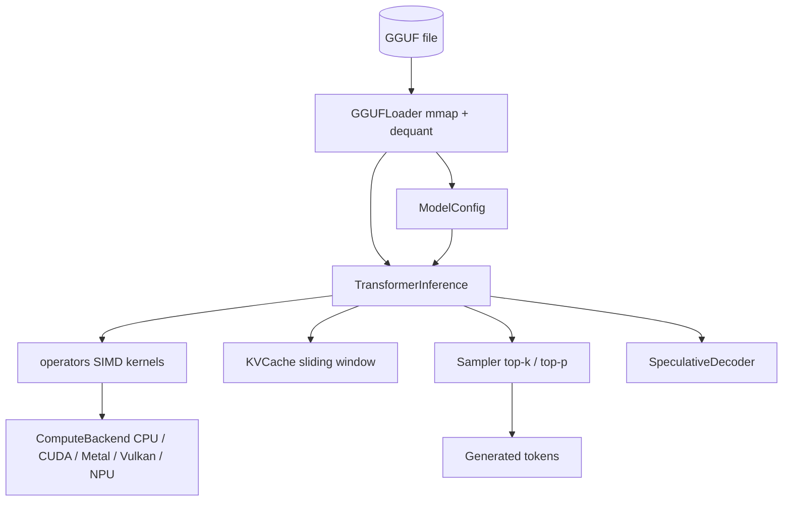

# On-Device LLM Runtime

A lightweight transformer inference runtime for edge deployment, built from scratch in
Python and NumPy. It parses GGUF model files with memory mapping, dequantizes Q4_0/Q8_0
weights, runs a decoder-only forward pass (RMSNorm, RoPE, grouped-query attention, SwiGLU),
and streams tokens through a top-k / top-p sampler. Optional Numba SIMD kernels and a
pluggable compute-backend layer (CPU, CUDA, Metal, Vulkan, NPU) round out the stack.

## Features

- **GGUF loading with mmap** — parses the GGUF v2+ header, metadata key-values, and tensor
  table, then maps the file read-only so weights are read lazily on access (`GGUFLoader`,
  `loader.py`).
- **Vector quantization** — round-trip Q4_0 (18 bytes/block) and Q8_0 (34 bytes/block)
  quantize and dequantize, plus error metrics (`quantize_q4_0`, `dequantize_q8_0`,
  `quantization.py`).
- **SIMD kernels** — tiled `matmul_f32`, `rmsnorm`, `softmax`, `rope_embed`, `silu`, `gelu`,
  `attention_scores`, `weighted_sum`, JIT-compiled by Numba when present, NumPy fallback
  otherwise (`operators.py`).
- **Transformer forward pass** — per-token decode with GQA attention, SwiGLU FFN, and
  residual connections (`TransformerInference`, `inference.py`).
- **KV cache with sliding window** — pre-allocated per-layer key/value arrays and an optional
  fixed window that shifts old entries out (`KVCache`, `memory.py`).
- **Memory pool** — aligned bump allocator with a free list and an LRU `TensorCache`
  (`MemoryPool`, `memory.py`).
- **Sampling** — temperature, top-k, nucleus (top-p), repetition penalty, and greedy decode
  (`Sampler`, `GenerationConfig`).
- **Compute backends** — a `ComputeBackend` interface with CPU, CUDA (CuPy), Metal (MLX),
  Vulkan (kompute), and NPU implementations, plus auto-selection (`backend.py`).
- **NPU path** — int8 tensor format, native int8 matmul, and NNAPI / CoreML / Hexagon /
  Simulated backends behind an `NPUManager` (`npu.py`).
- **Speculative decoding** — draft-plus-verify rejection sampling, with self-speculative and
  lookahead variants (`speculative.py`).

## Architecture



| Component | Module | Responsibility |
|-----------|--------|----------------|
| Model loader | `loader.py` | GGUF parsing, mmap tensor access, dequantization |
| Quantization | `quantization.py` | Q4_0 / Q8_0 quantize, dequantize, error metrics |
| Operators | `operators.py` | matmul, RMSNorm, softmax, RoPE, SiLU/GELU kernels |
| Memory | `memory.py` | Memory pool, KV cache, tensor LRU cache |
| Inference | `inference.py` | Forward pass, generation loop, sampler |
| Backend | `backend.py` | Compute-backend abstraction and selection |
| NPU | `npu.py` | Int8 tensors, native int8 matmul, NPU backends |
| Speculative | `speculative.py` | Draft/verify, self-speculative, lookahead decoding |

## Quick Start

### Prerequisites

- Python 3.9 or newer.
- NumPy (the only required dependency). No model file or external service is needed to run
  the tests — they use a synthetic `MockGGUFLoader`.

### Installation

```bash
pip install -e ".[dev]"
```

Optional extras: `pip install -e ".[simd]"` for Numba SIMD kernels, `pip install -e ".[cuda]"`
for the CuPy backend, or `pip install -e ".[full]"` for everything.

### Running

There is no CLI entry point; the runtime is a library. Import it and drive the inference
loop directly (see Usage), or run the test suite to exercise every component.

## Usage

Generate tokens against a synthetic model with no GGUF file required:

```python
from on_device_llm import TransformerInference, GenerationConfig
from on_device_llm.loader import MockGGUFLoader

loader = MockGGUFLoader(vocab_size=256, hidden_size=64, num_layers=2, num_heads=4)
engine = TransformerInference(loader, window_size=None)

config = GenerationConfig(max_new_tokens=20, temperature=0.7, top_k=40, top_p=0.9)
tokens = engine.generate(prompt_tokens=[1, 42, 7], config=config)
print(tokens)
```

Loading a real GGUF file uses the same interface:

```python
from on_device_llm import GGUFLoader, TransformerInference

with GGUFLoader("model-q4_0.gguf") as loader:
    print(loader.config)              # ModelConfig parsed from metadata
    engine = TransformerInference(loader)
    logits = engine.forward(token_id=1, position=0)   # [vocab_size]
```

Quantize a weight tensor and measure the reconstruction error:

```python
import numpy as np
from on_device_llm import quantize_q4_0, GGMLType
from on_device_llm.quantization import compute_quantization_error

w = np.random.randn(4096).astype(np.float32)
data, dtype = quantize_q4_0(w)
mae, max_err = compute_quantization_error(w, data, GGMLType.Q4_0)
print(dtype, mae, max_err)
```

## What's Real vs Simulated

- **Real:** GGUF header/metadata/tensor parsing and mmap access; Q4_0 and Q8_0 quantize and
  dequantize; the CPU forward pass (RMSNorm, RoPE, GQA attention, SwiGLU FFN); the KV cache
  and sliding window; the memory pool and LRU tensor cache; the sampler; int8 tensor
  quantization and `int8_matmul_native`; the speculative decoder's rejection-sampling loop.
  All of these are exercised by the test suite via `MockGGUFLoader`.
- **Simulated / requires credentials:** `SimulatedNPUBackend` runs int8 matmul on the CPU
  with an optional `time.sleep` latency model. The `NNAPIBackend`, `CoreMLBackend`, and
  `HexagonBackend` gate on `onnxruntime` execution providers or vendor SDKs and fall back to
  `int8_matmul_native` — no ONNX graph is built or run on real accelerator hardware. The
  CUDA (CuPy), Metal (MLX), and Vulkan (kompute) backends require their libraries installed
  and report unavailable otherwise; the Vulkan path uses a NumPy matmul rather than a compute
  shader. `SelfSpeculativeDecoder` and `LookaheadDecoder` are simplified: the former falls
  back to standard generation, and dequantization for Q4_K/Q5_x/Q6_K and other K-quants
  raises `NotImplementedError`.

## Testing

```bash
pytest tests/ -v
```

The suite has 262 tests across quantization, operators, memory/KV cache, GGUF loading,
inference, backends, NPU, and speculative decoding. All tests run on CPU with NumPy and the
synthetic loader; no
model file, GPU, or NPU hardware is required. Numba, CuPy, MLX, and kompute are optional and
their backends are skipped when the library is absent.

## Project Structure

```
47-on-device-llm/
  README.md                     # This file
  pyproject.toml                # Package metadata and extras
  src/on_device_llm/
    __init__.py                 # Public exports
    loader.py                   # GGUF parser, mmap access, MockGGUFLoader
    quantization.py             # GGMLType, Q4_0 / Q8_0 quant/dequant
    operators.py                # SIMD kernels (Numba optional)
    memory.py                   # MemoryPool, KVCache, TensorCache
    inference.py                # TransformerInference, Sampler, BatchInference
    backend.py                  # ComputeBackend and implementations
    npu.py                      # Int8 tensors and NPU backends
    speculative.py              # Speculative / self-speculative / lookahead
  tests/                        # 262 tests (pytest)
  docs/BLUEPRINT.md             # Full architecture and design
```

## License

MIT — see [LICENSE](../LICENSE)
