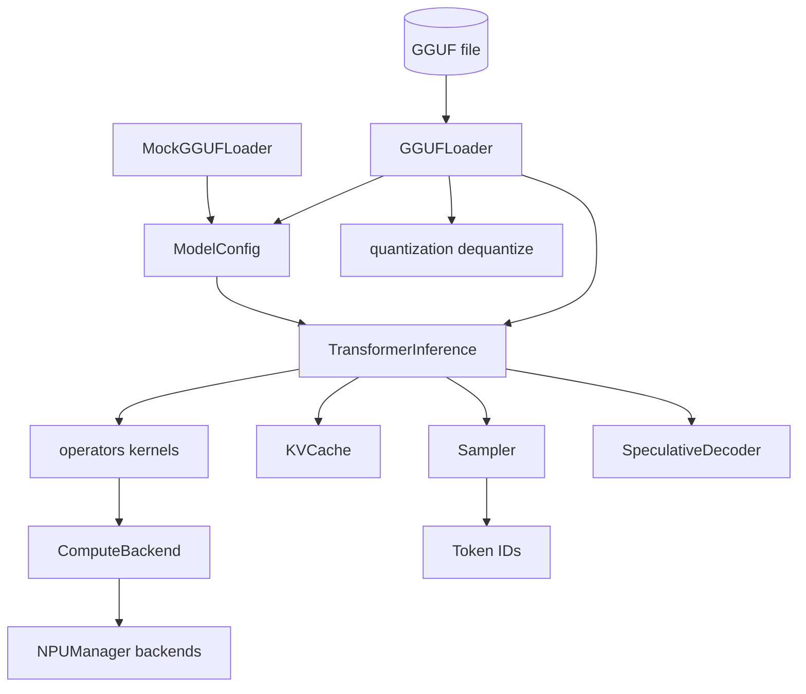

# On-Device LLM Runtime

## Overview

This project is a transformer inference runtime designed for on-device (edge) deployment,
implemented from scratch in Python on top of NumPy. It reproduces, in readable code, the core
techniques that make projects like `llama.cpp` able to run quantized language models on
consumer hardware with a small memory footprint: a memory-mapped model format, block-wise
vector quantization, cache-tiled compute kernels, an autoregressive KV cache, and a
pluggable compute-backend layer.

On-device inference is a distinct problem from server-side inference. The constraints are
memory (a phone or laptop cannot hold a float32 7B model), power (integer arithmetic on an NPU
is far cheaper than float on a GPU), and startup latency (a mapped file is ready instantly,
whereas copying gigabytes into RAM is not). Every major component here exists to address one of
those constraints, and the module boundaries make that mapping explicit.

The runtime is deliberately organized as a stack of independent, individually testable
modules rather than a monolith. The loader turns a GGUF file into a `ModelConfig` plus a
dictionary of memory-mapped tensors. The quantization module converts between float32 and the
GGML block formats. The operators module supplies the numerical kernels. The inference module
wires those pieces into a decoder-only forward pass and a generation loop. The memory module
owns the KV cache and allocation. The backend and NPU modules abstract where the matrix
multiplies actually run. The speculative module layers draft/verify decoding on top of the
inference engine.

Goals and scope:

- **Teach the mechanics of on-device inference.** Each module maps to one concept: GGUF
  parsing, quantization math, SIMD-friendly kernels, KV caching, sampling, backend dispatch,
  and speculative decoding. The code is favored for clarity over raw throughput.
- **Be runnable with zero external assets.** A synthetic `MockGGUFLoader` generates
  correctly-shaped random weights so the entire pipeline — including generation and
  speculative decoding — runs in unit tests without a real model file, GPU, or NPU.
- **Model the real format faithfully where it matters.** GGUF header parsing, the Q4_0 and
  Q8_0 block layouts, 32-byte tensor alignment, and GQA head repetition follow the actual
  conventions so a genuine GGUF file loads through the same path.
- **Stay honest about hardware.** Accelerator backends (CUDA, Metal, Vulkan, NPU) are wired
  behind a uniform interface but degrade gracefully or fall back to CPU/NumPy when their
  libraries or hardware are absent. Nothing pretends to touch silicon it cannot reach.

Out of scope: tokenization (the engine consumes and produces integer token IDs), training,
K-quant formats beyond Q4_0/Q8_0, and true parallel/batched attention.

The architecture mirrors the shape of a real quantized LLM runtime closely enough that the
concepts transfer: the GGUF path, the Q4_0/Q8_0 block math, 32-byte alignment, LLaMA-style
pre-norm blocks with RoPE and SwiGLU, grouped-query attention, and rejection-sampling
speculative decoding are all implemented as they exist in production systems, just in Python
for legibility. Where a component would require hardware or a heavyweight dependency to run for
real — NPU execution providers, GPU kernels, compute shaders — it is implemented behind the
same interface and degrades to a CPU/NumPy path, and this document is explicit about which is
which.

## Architecture



The data flow for a single generated token is:

1. **Load once.** `GGUFLoader` opens the file, parses the header and metadata into a
   `ModelConfig`, computes each tensor's byte offset (aligned to 32 bytes), and maps the file
   read-only. `MockGGUFLoader` provides the same `config` / `get_tensor` / `list_tensors`
   surface using synthetic weights.
2. **Embed.** `TransformerInference.forward(token_id, position)` looks up the embedding row
   for `token_id` from `token_embd.weight`.
3. **Run layers.** For each of `num_layers` blocks: pre-attention RMSNorm, GQA self-attention
   with RoPE and a KV-cache update, residual add, pre-FFN RMSNorm, SwiGLU FFN, residual add.
4. **Project.** A final RMSNorm and a matmul against `output.weight` produce `[vocab_size]`
   logits.
5. **Sample.** `Sampler` applies repetition penalty, temperature, top-k, softmax, and top-p
   to pick the next token; the generation loop advances `position` and repeats until EOS or
   `max_new_tokens`.

The compute kernels used in steps 2–4 come from `operators.py`, which prefers Numba-compiled
implementations and falls back to NumPy. Backends in `backend.py` wrap the same operations so
a caller can route matmuls to CUDA, Metal, Vulkan, or an NPU; the inference engine itself
calls the operator functions directly, and backends are an orthogonal facility for callers
that want explicit device control.

### Layering

- **Format layer** (`loader.py`, `quantization.py`): everything about turning bytes on disk
  into float32 arrays. No knowledge of transformers.
- **Kernel layer** (`operators.py`): stateless numerical functions. No knowledge of model
  structure or file formats.
- **Model layer** (`inference.py`, `memory.py`): assembles kernels into a transformer and
  manages inference-time state (KV cache, sampler).
- **Dispatch layer** (`backend.py`, `npu.py`): where compute physically runs.
- **Decoding layer** (`speculative.py`): higher-level generation strategies built on the
  model layer.

## Core Components

### GGUFLoader

`GGUFLoader` reads the GGUF v2+ container. `_load_header` validates the magic
(`0x46554747`), rejects versions below 2, then reads the tensor count and metadata count as
little-endian `uint64`. Metadata is a sequence of length-prefixed string keys followed by a
type tag and a typed value; `_read_value` dispatches on all 13 GGUF value types including
nested arrays. Tensor headers carry a name, a dimension list, a `GGMLType`, and a
data-section-relative offset.

Because GGUF stores tensor data after all headers and aligns each tensor to 32 bytes, the
loader computes absolute offsets itself: it rounds the post-header file position up to a
32-byte boundary to get `_data_offset`, then walks the tensors accumulating aligned offsets
and `calc_tensor_size` byte counts. The whole file is then mapped with
`mmap.ACCESS_READ`, so no tensor is copied into RAM until requested.

```python
# Header validation and offset computation (loader.py)
magic = struct.unpack('<I', self.file.read(4))[0]
if magic != self.GGUF_MAGIC:              # 0x46554747 == "GGUF"
    raise ValueError(f"Invalid GGUF magic: {magic:08x}")
version = struct.unpack('<I', self.file.read(4))[0]
if version < 2:
    raise ValueError(f"GGUF version {version} not supported (minimum: 2)")

n_tensors  = struct.unpack('<Q', self.file.read(8))[0]
n_metadata = struct.unpack('<Q', self.file.read(8))[0]
...
current_offset = self.file.tell()
self._data_offset = (current_offset + 31) // 32 * 32     # align data section
offset = self._data_offset
for name, shape, dtype in tensor_infos:
    offset = (offset + 31) // 32 * 32                    # align each tensor
    size_bytes = calc_tensor_size(tuple(shape), dtype)
    self.tensors[name] = TensorInfo(name, tuple(shape), dtype, offset, size_bytes)
    offset += size_bytes
```

`get_tensor(name)` slices the mmap for the tensor's byte range and returns float32:
`F32` is reinterpreted and copied, `F16` is upcast, `Q8_0` and `Q4_0` are dequantized, and
any other type raises `NotImplementedError`. The loader is a context manager and also closes
its mmap and file in `__del__`.

`_parse_config` is tolerant of naming: for each field it tries several metadata keys
(`llama.embedding_length`, then `embedding_length`, then `hidden_size`, and so on) before
falling back to a LLaMA-7B-shaped default. `ModelConfig` exposes a derived `head_dim =
hidden_size // num_heads`.

### MockGGUFLoader

`MockGGUFLoader` mirrors the loader interface without a file. Given either a `ModelConfig` or
individual dimensions, `_generate_tensors` creates every tensor a LLaMA-style model needs:
`token_embd.weight`, per-block `attn_norm`, `attn_q/k/v/output`, `ffn_norm`, and
`ffn_gate/up/down`, plus `output_norm.weight` and `output.weight`. Weights use a Xavier-like
`1/sqrt(fan_in)` scale so forward passes produce finite, well-conditioned activations. This is
the backbone of the test suite — it lets inference, sampling, and speculative decoding run
end to end deterministically.

### Quantization

`quantization.py` implements the two block formats the runtime supports:

- **Q8_0** — 32 elements per block, one float16 scale plus 32 int8 values = 34 bytes.
  `quantize_q8_0` computes `scale = amax / 127` and stores `round(x / scale)` clipped to
  int8; `dequantize_q8_0` multiplies back.
- **Q4_0** — 32 elements per block, one float16 scale plus 16 packed bytes = 18 bytes. Values
  are quantized to the signed range #91;-8, 7#93; with `scale = amax / 7`, biased by +8 into
  #91;0, 15#93;, and two nibbles are packed per byte. Dequantization unpacks each nibble,
  subtracts 8, and rescales.

The Q4_0 packing and unpacking is the subtle part — two 4-bit values share a byte, and the
sign bias must be applied consistently on both sides:

```python
# Pack (quantize_q4_0): bias [-8,7] into [0,15], two nibbles per byte
for j in range(16):
    low  = (quantized[j * 2]     + 8) & 0xF
    high = (quantized[j * 2 + 1] + 8) & 0xF
    packed[j] = low | (high << 4)

# Unpack (dequantize_q4_0): cast to int first to avoid uint8 underflow
for j in range(16):
    values[j * 2]     = int(packed[j] & 0xF) - 8
    values[j * 2 + 1] = int(packed[j] >> 4) - 8
result[start:start + block_size] = values * float(scale)
```

Both `quantize_*` functions pad the flattened input up to a block boundary before looping, and
both `dequantize_*` functions allocate `n_blocks * block_size` then slice back to `n_elements`,
so a tensor whose element count is not a multiple of 32 round-trips correctly.

`BLOCK_SIZES` and `BYTES_PER_BLOCK` drive `calc_tensor_size`, which the loader uses for
offset math. `QuantizedTensor` bundles bytes + shape + dtype and can `dequantize()` itself.
`compute_quantization_error` returns mean and max absolute reconstruction error, which the
tests use to bound Q4_0 vs Q8_0 fidelity. Anything outside F32/F16/Q4_0/Q8_0 raises
`NotImplementedError`, keeping the supported surface explicit.

### Operators

`operators.py` provides the numerical kernels twice: a Numba `@njit` version and a NumPy
fallback, selected at import by whether `numba` is installed. The public functions are
identical either way:

- `matmul_f32(A, B)` — tiled (32×32) triple loop with `prange` over the M dimension for
  cache-friendly, parallel multiplication in the Numba build; a plain `A @ B` otherwise.
- `rmsnorm(x, weight, eps)` — `x / sqrt(mean(x^2) + eps) * weight`, the LLaMA normalization
  (no mean-centering).
- `softmax(x)` — max-subtraction for numerical stability.
- `rope_embed(x, pos, theta)` — rotary position embedding applied to adjacent dimension pairs
  with frequency `1 / theta^(i/dim)`.
- `silu(x)` and `gelu(x)` — SwiGLU's activation and a tanh-approximated GELU.
- `attention_scores(q, k_cache, head_dim)` and `weighted_sum(probs, v_cache)` — the scaled
  dot-product and value-mixing primitives.

Module-level helpers `layer_norm`, `apply_rope_batch`, and `compute_causal_mask` round out
the toolkit. Keeping these stateless and shape-explicit is what lets 51 operator tests check
each kernel in isolation against a NumPy reference.

The two implementations are selected once at import time and share a signature, so callers
never branch on the presence of Numba:

```python
try:
    from numba import njit, prange
    HAS_NUMBA = True
except ImportError:
    HAS_NUMBA = False

if HAS_NUMBA:
    @njit(parallel=True, fastmath=True, cache=True)
    def matmul_f32(A, B):
        M, K = A.shape; K_, N = B.shape
        C = np.zeros((M, N), dtype=np.float32)
        tile = 32
        for i in prange(0, M, tile):          # parallel over rows
            for j in range(0, N, tile):
                for k in range(0, K, tile):
                    ...                        # 32x32 tiled inner product
        return C
else:
    def matmul_f32(A, B):
        return (A @ B).astype(np.float32)
```

RoPE rotates each adjacent pair `(x[i], x[i+1])` by an angle that depends on both the position
and the dimension index, which is what gives the model relative-position awareness:

```python
for i in range(0, dim, 2):
    freq = 1.0 / (theta ** (i / dim))
    cos_val = np.cos(pos * freq); sin_val = np.sin(pos * freq)
    out[i]     = x[i] * cos_val - x[i + 1] * sin_val
    out[i + 1] = x[i] * sin_val + x[i + 1] * cos_val
```

### Memory: MemoryPool, KVCache, TensorCache

`MemoryPool` is a 64-byte-aligned bump allocator over a single `uint8` buffer. `allocate`
advances an offset; when the pool would overflow it scans a free list for a reusable freed
block before raising `MemoryError`. `allocate_tensor` reshapes an allocation into a typed
view, `free(name)` marks a named block reusable, `reset` rewinds and zeroes, and `stats`
reports used/free/peak bytes and block counts.

`KVCache` pre-allocates `k_cache` and `v_cache` of shape
`(num_layers, max_seq_len, num_heads, head_dim)` in float32. `append(layer_idx, k, v)` writes
the current position; with a `window_size` set it first shifts every cached entry back by one
so the newest token lands at `window_size - 1`, implementing a sliding window. `length` is
only incremented after the last layer writes, so all layers at one decode step share the same
position. `get`, `get_layer_slice`, `clear`, `resize`, `memory_usage`, and
`effective_length` complete the interface. `resize` grows in place when possible and copies
forward otherwise.

The sliding-window shift is the mechanism that bounds cache growth for long generations. When
`window_size` is set and full, every entry moves back one slot before the new key/value is
written at the last position, and `length` stops advancing:

```python
def append(self, layer_idx, k, v):
    if self.window_size and self.length >= self.window_size:
        self.k_cache[layer_idx, :-1] = self.k_cache[layer_idx, 1:]   # shift out oldest
        self.v_cache[layer_idx, :-1] = self.v_cache[layer_idx, 1:]
        pos = self.window_size - 1
    else:
        pos = self.length
    self.k_cache[layer_idx, pos] = k
    self.v_cache[layer_idx, pos] = v
    if layer_idx == self.num_layers - 1:          # advance once per decode step
        if not self.window_size or self.length < self.window_size:
            self.length += 1
```

`TensorCache` is an LRU cache keyed by name with optional entry-count and byte-size caps,
intended to memoize dequantized tensors and avoid repeated dequantization. `get` promotes a
key to most-recently-used; `put` evicts from the front of the access order until both the
entry-count and byte-size caps are satisfied.

### TransformerInference

`TransformerInference` owns a `loader`, its `config`, a `KVCache`, and a preloaded embedding
table. `forward(token_id, position)`:

1. Copies the embedding row for the token.
2. Calls `_forward_layer` for every block.
3. Applies the final `output_norm` RMSNorm.
4. Projects through `output.weight` (transposed) to logits.

`_forward_layer` is the standard pre-norm transformer block: RMSNorm → attention → residual →
RMSNorm → FFN → residual.

`_attention` implements grouped-query attention. It projects Q/K/V, reshapes Q into
`num_heads` and K/V into `num_kv_heads`, applies RoPE per head, and appends K/V to the cache.
It reads back the cache up to `position + 1` (clamped to the window) directly rather than via
`get()`, because `length` has not yet advanced for the current step. For each query head it
maps to a KV head via `kv_h = h // (num_heads // num_kv_heads)`, computes scaled dot-product
scores, softmaxes them, and accumulates the value-weighted sum. Outputs are concatenated and
projected through `attn_output.weight`.

`_ffn` is SwiGLU: `down(silu(gate(x)) * up(x))`.

The attention inner loop makes the GQA mapping and the cache-read timing explicit:

```python
# Read cache directly up to position+1 because length hasn't advanced yet this step
cache_len = position + 1
if self.kv_cache.window_size:
    cache_len = min(cache_len, self.kv_cache.window_size)
k_cache = self.kv_cache.k_cache[layer_idx, :cache_len]
v_cache = self.kv_cache.v_cache[layer_idx, :cache_len]

kv_repeat = num_heads // num_kv_heads
for h in range(num_heads):
    kv_h = h // kv_repeat                          # map query head -> KV head
    scores = np.array([np.dot(q[h], k_cache[i, kv_h]) / np.sqrt(head_dim)
                       for i in range(len(k_cache))], dtype=np.float32)
    probs = softmax(scores)
    head_out = sum(probs[i] * v_cache[i, kv_h] for i in range(len(v_cache)))
    output[h * head_dim:(h + 1) * head_dim] = head_out
```

`generate(prompt_tokens, config)` validates the `GenerationConfig`, clears the cache, builds
a `Sampler`, feeds the prompt (filling the cache) up to the last token, then loops:
`forward` → sample-or-greedy → append → advance, stopping on EOS, `max_new_tokens`, or
`max_seq_len`.

### Sampler and GenerationConfig

`GenerationConfig` is a validated dataclass of decoding knobs (`max_new_tokens`,
`temperature`, `top_k`, `top_p`, `repetition_penalty`, `eos_token_id`, `do_sample`). `Sampler`
applies, in order: repetition penalty over previously generated tokens, temperature scaling,
top-k masking (`-inf` outside the top set), softmax, and top-p nucleus truncation with
renormalization, then draws with `np.random.choice`. `greedy` is argmax. `from_config`
constructs a sampler from a `GenerationConfig`.

### BatchInference

`BatchInference` holds one `TransformerInference` engine per batch slot (up to
`max_batch_size`). `forward_batch` routes each `(token, position)` to a slot's engine and
returns per-sequence logits; `reset` clears one or all slots. This is sequential
per-slot execution — a structural batch API rather than fused batched attention.

### Compute backends

`backend.py` defines `ComputeBackend`, an ABC with `matmul`, `softmax`, `rmsnorm`,
`rope_embed`, `silu`, plus `is_available`, `synchronize`, and `memory_info`. Implementations:

- **CPUBackend** — always available; delegates to the `operators` kernels.
- **CUDABackend** — imports `cupy`, runs matmul/softmax/rmsnorm on the GPU, and reports
  device name and mempool stats; unavailable without CuPy.
- **MetalBackend** — imports `mlx.core`, runs on Apple Silicon via MLX (matmul, softmax,
  rmsnorm, silu, gelu); reports system memory as unified memory.
- **VulkanBackend** — imports `kp` (kompute); currently computes with NumPy as a placeholder
  for a real compute shader.
- **NPUComputeBackend** — wraps the `NPUManager`, preferring a hardware NPU and falling back
  to the simulated one; exposes `matmul_int8` and `has_hardware_npu`.

`get_backend(type)` constructs one and raises if unavailable; `get_best_backend()` tries
CUDA → Metal → Vulkan → hardware NPU → CPU; `list_available_backends()` enumerates what is
present.

Each backend's `__init__` performs a guarded import so that constructing an unavailable
backend never throws — it simply reports `is_available() == False`. This is what lets
`list_available_backends()` and `get_best_backend()` probe every backend on any machine:

```python
class CUDABackend(ComputeBackend):
    def __init__(self):
        self._cp = None; self._available = False
        try:
            import cupy as cp
            self._cp = cp; self._available = True
        except ImportError:
            pass                       # backend simply stays unavailable

def get_best_backend() -> ComputeBackend:
    for candidate in (CUDABackend(), MetalBackend(), VulkanBackend()):
        if candidate.is_available():
            return candidate
    npu = NPUComputeBackend()
    if npu.is_available() and npu.has_hardware_npu():
        return npu
    return CPUBackend()                # always-available fallback
```

The separation between `backend.py` and the inference engine is deliberate: `TransformerInference`
calls the `operators` functions directly (so a plain `pip install` with no accelerator still
runs), while the backend layer exists for callers who want to move specific matmuls onto a
device explicitly. `NPUComputeBackend` bridges the two worlds — it wraps an `NPUManager`,
prefers a detected hardware NPU, and otherwise routes through the simulated backend so NPU code
paths stay exercisable on a laptop.

### NPU path

`npu.py` models NPU-style int8 inference. `Int8Tensor.from_float32` performs symmetric or
asymmetric, per-tensor or per-channel int8 quantization, and `int8_matmul_native` does the
canonical NPU operation: int8 × int8 with int32 accumulation, then scale to float32.
`Int8TensorBlock` and `convert_ggml_to_int8` bridge from GGML formats (Q8_0 maps directly;
Q4_0 dequantizes then requantizes).

The native int8 matmul is the operation the NPU backends are built around — integer inputs,
int32 accumulation, then a single scale back to float32:

```python
def int8_matmul_native(A: Int8Tensor, B: Int8Tensor) -> np.ndarray:
    result_int32 = np.matmul(A.data.astype(np.int32), B.data.astype(np.int32))
    output_scale = A.scales[0] * B.scales[0]          # per-tensor case
    return result_int32.astype(np.float32) * output_scale
```

`Int8Tensor.from_float32` supports symmetric (`scale = amax / 127`, zero-point 0) and
asymmetric (`scale = (max - min) / 255` with a centered zero-point) quantization, per-tensor or
per-channel along a chosen axis. Per-channel quantization gives each output channel its own
scale, which is the accuracy-preserving default for 2D linear weights in `optimize_for_npu`.

`NPUBackend` is the ABC; `NNAPIBackend`, `CoreMLBackend`, and `HexagonBackend` detect their
runtime (ONNX Runtime execution providers or vendor SDK, gated on platform), advertise a
`NPUDeviceInfo` with capability flags, and route matmuls through `int8_matmul_native`.
`SimulatedNPUBackend` is always available, counts ops, and can add a MACs-proportional
`time.sleep` latency. `NPUManager` detects backends, prefers CoreML → NNAPI → Hexagon →
Simulated, and answers `has_hardware_npu`. `optimize_for_npu` bulk-quantizes weight dicts and
`estimate_npu_performance` returns MACs / estimated-ms / TOPS / power / energy ballpark
figures per device type.

Availability detection is where the honesty lives: `NNAPIBackend` and `CoreMLBackend` only
report available when ONNX Runtime actually exposes the corresponding execution provider, and
CoreML additionally requires a Darwin platform. When available they still compute via
`int8_matmul_native` rather than building and running an ONNX graph — the plumbing is real, the
hardware execution is not.

```python
class NNAPIBackend(NPUBackend):
    def __init__(self):
        self._available = False
        try:
            import onnxruntime as ort
            if "NnapiExecutionProvider" in ort.get_available_providers():
                self._available = True
        except ImportError:
            pass

class CoreMLBackend(NPUBackend):
    def __init__(self):
        self._available = False
        if platform.system() != "Darwin":
            return
        try:
            import onnxruntime as ort
            if "CoreMLExecutionProvider" in ort.get_available_providers():
                self._available = True
        except ImportError:
            pass
```

`NPUDeviceInfo` carries a capability set (`INT8_MATMUL`, `INT4_MATMUL`, `FP16_COMPUTE`,
`DYNAMIC_SHAPES`, `BATCH_INFERENCE`, `QUANTIZE_ON_LOAD`) plus batch and sequence-length limits,
so callers can query `supports(capability)` before dispatching. `estimate_npu_performance` uses
per-device TOPS constants (CoreML ~15, Hexagon ~12, NNAPI ~7, simulated ~0.1) and a power model
to produce MAC counts, estimated milliseconds, and millijoule energy — explicitly ballpark
figures for reasoning about device selection, not measurements.

### Speculative decoding

`SpeculativeDecoder` runs draft-then-verify decoding. `_speculate` uses a fast draft model to
propose `num_speculative_tokens` tokens with their probability distributions. `_verify` runs
the target model over the same positions and applies rejection sampling: each draft token is
accepted with probability `min(1, p_target / p_draft)`; on the first rejection it resamples
from the adjusted distribution `max(0, p_target - p_draft)` (renormalized); if all are
accepted it draws a bonus token from the target's next-position distribution. `SpeculativeStats`
tracks acceptance rate and tokens-per-iteration.

The rejection-sampling core, which guarantees the output distribution matches the target
model, is worth showing in full:

```python
p_draft  = draft_prob[draft_token]
p_target = target_prob[draft_token]
acceptance_prob = min(1.0, p_target / p_draft) if p_draft > 0 else (1.0 if p_target > 0 else 0.0)

if np.random.random() < acceptance_prob:
    accepted_tokens.append(draft_token)
else:
    adjusted = np.maximum(0, target_prob - draft_prob)   # resample the residual
    adjusted = adjusted / adjusted.sum() if adjusted.sum() > 0 else target_prob
    next_token = int(np.random.choice(len(adjusted), p=adjusted))
    return accepted_tokens, next_token
```

`SelfSpeculativeDecoder` is a placeholder that documents an early-exit draft scheme but falls
back to standard `generate`. `LookaheadDecoder` maintains an n-gram cache and probabilistically
tries cached continuations, verifying them against a probability threshold; it is a simplified
stand-in for true parallel lookahead attention.

### Design decisions and trade-offs

A few choices shape the whole runtime and are worth calling out:

- **Per-token decode, not prefill batching.** `forward` processes exactly one token and one
  position, and `generate` fills the prompt one token at a time. This keeps the attention and
  KV-cache logic simple and directly testable at the cost of prompt-processing throughput. A
  production runtime would batch the prompt into a single parallel prefill.
- **Operators-first, backends-optional.** The engine depends only on `operators.py` and NumPy,
  so the default install has no compiled or GPU dependency. Accelerators are additive and
  detected at runtime rather than required. This maximizes portability, which matters for an
  "on-device" target where the device is unknown.
- **Clarity over vectorization in attention.** `_attention` loops over heads and cache
  positions in Python. This mirrors the math one-to-one and is easy to verify, but it is the
  runtime's hot path and the obvious first target for optimization.
- **A synthetic loader as a first-class citizen.** `MockGGUFLoader` is not a test fixture bolted
  on afterward; it implements the same interface as `GGUFLoader` so every higher layer is
  written against an abstraction and the full pipeline is exercisable without any model file.
- **Explicit "unsupported" surfaces.** Rather than silently mis-decoding, unsupported quant
  types raise `NotImplementedError`, and unavailable backends report `is_available() == False`.
  The supported envelope is always visible in the code.

## Data Structures

Model configuration and tensor metadata:

```python
@dataclass
class TensorInfo:
    name: str
    shape: Tuple[int, ...]
    dtype: GGMLType
    offset: int          # absolute byte offset into the mmap
    size_bytes: int

@dataclass
class ModelConfig:
    vocab_size: int
    hidden_size: int
    num_layers: int
    num_heads: int
    num_kv_heads: int    # < num_heads enables grouped-query attention
    intermediate_size: int
    max_seq_len: int
    rope_theta: float = 10000.0
    norm_eps: float = 1e-5

    @property
    def head_dim(self) -> int:
        return self.hidden_size // self.num_heads
```

GGML types and block geometry:

```python
class GGMLType(IntEnum):
    F32 = 0; F16 = 1
    Q4_0 = 2; Q4_1 = 3; Q5_0 = 6; Q5_1 = 7
    Q8_0 = 8; Q8_1 = 9
    Q2_K = 10; Q3_K = 11; Q4_K = 12; Q5_K = 13; Q6_K = 14; Q8_K = 15

BLOCK_SIZES     = {Q4_0: 32, Q4_1: 32, Q8_0: 32, Q8_1: 32}
BYTES_PER_BLOCK = {Q4_0: 18, Q4_1: 20, Q8_0: 34, Q8_1: 36}
```

The KV cache and its sliding window:

```python
@dataclass
class KVCache:
    num_layers: int
    num_heads: int
    head_dim: int
    max_seq_len: int
    window_size: Optional[int] = None
    # k_cache, v_cache: [num_layers, max_seq_len, num_heads, head_dim] float32
    length: int = 0
```

The memory pool's block record and the LRU tensor cache:

```python
@dataclass
class MemoryBlock:
    offset: int
    size: int
    in_use: bool = False
    name: Optional[str] = None

class TensorCache:
    # LRU over dequantized tensors, capped by entry count and/or total bytes
    def __init__(self, max_entries: int = 100, max_bytes: Optional[int] = None): ...
```

Int8 tensor for the NPU path:

```python
@dataclass
class Int8Tensor:
    data: np.ndarray         # int8
    scales: np.ndarray       # per-tensor or per-channel
    zero_points: np.ndarray
    shape: Tuple[int, ...]
    per_channel: bool = False
    channel_axis: int = 0
```

Generation and speculative configuration:

```python
@dataclass
class GenerationConfig:
    max_new_tokens: int = 100
    temperature: float = 1.0
    top_k: int = 40
    top_p: float = 0.9
    repetition_penalty: float = 1.0
    eos_token_id: int = 2
    do_sample: bool = True

@dataclass
class SpeculativeConfig:
    num_speculative_tokens: int = 4
    draft_temperature: float = 0.8
    target_temperature: float = 1.0
    top_k: int = 40
    top_p: float = 0.9
```

## API Design

Public surface, as re-exported from `on_device_llm/__init__.py`:

```
# Loading
GGUFLoader(path)                  -> .config, .get_tensor(name), .list_tensors(), .close()
MockGGUFLoader(...)               -> same interface, synthetic weights
TensorInfo, ModelConfig

# Quantization
GGMLType
QuantizedTensor(data, shape, dtype).dequantize()
quantize_q4_0(x)      -> (bytes, GGMLType)
quantize_q8_0(x)      -> (bytes, GGMLType)
dequantize_q4_0(data, shape) -> np.ndarray
dequantize_q8_0(data, shape) -> np.ndarray

# Operators
matmul_f32, rmsnorm, softmax, rope_embed, silu, gelu,
attention_scores, weighted_sum

# Memory
MemoryPool(size_bytes, alignment).allocate_tensor(shape, dtype, name)
KVCache(num_layers, num_heads, head_dim, max_seq_len, window_size)

# Inference
TransformerInference(loader, window_size=None)
    .forward(token_id, position) -> logits[vocab_size]
    .generate(prompt_tokens, config) -> List[int]
Sampler(temperature, top_k, top_p, repetition_penalty).sample(logits) / .greedy(logits)
GenerationConfig
BatchInference(loader, max_batch_size).forward_batch(token_ids, positions, batch_indices)

# Backends
Backend                            # CPU / CUDA / METAL / VULKAN / NPU enum
get_backend(Backend.CPU)
get_best_backend()
list_available_backends()

# NPU
Int8Tensor.from_float32(x, per_channel, channel_axis, symmetric)
int8_matmul_native(A, B)
NPUManager().get_best_backend()
optimize_for_npu(weights), estimate_npu_performance(shape_a, shape_b, device_info)

# Speculative decoding
SpeculativeDecoder(target_model, draft_model, config)
    .generate(prompt_tokens, max_new_tokens, eos_token_id) -> (tokens, stats)
SelfSpeculativeDecoder, LookaheadDecoder
```

Typical end-to-end call:

```python
from on_device_llm import TransformerInference, GenerationConfig
from on_device_llm.loader import MockGGUFLoader

engine = TransformerInference(MockGGUFLoader(vocab_size=256, hidden_size=64,
                                             num_layers=2, num_heads=4))
tokens = engine.generate([1, 5, 9], GenerationConfig(max_new_tokens=16, top_k=20))
```

## Performance

The runtime optimizes for a small footprint and clear code rather than peak throughput, so
the meaningful numbers here are structural rather than benchmarked:

- **Memory mapping** avoids copying model weights into RAM; only accessed tensors are paged
  in, and the mmap is opened read-only so pages can be shared across processes.
- **Quantized storage.** Q4_0 stores 32 float weights in 18 bytes (4.5 bits/weight including
  the scale) and Q8_0 in 34 bytes (8.5 bits/weight), roughly 7× and 3.8× smaller than float32.
- **Tiled matmul.** `matmul_f32` blocks the M/N/K loops at 32 to keep tiles in cache, and
  parallelizes the outer M loop with Numba `prange` when Numba is present.
- **KV caching** turns per-step attention from O(seq²) recompute into O(seq) by reusing stored
  keys and values; the optional sliding window bounds cache memory to `window_size` positions.
- **Aligned allocation.** `MemoryPool` aligns to 64-byte cache lines and reuses freed blocks.
- **Int8 on NPU.** The NPU path uses int8 × int8 → int32 accumulation, the arithmetic NPUs are
  built to run at low power; `estimate_npu_performance` provides order-of-magnitude MAC/latency
  estimates per device class.

Memory accounting is concrete because the KV cache dominates activation memory. For a model
with `L` layers, `H` KV heads, head dimension `D`, and sequence length `S`, both `k_cache` and
`v_cache` are float32 arrays of shape `(L, S, H, D)`, so `memory_usage()` returns
`2 * L * S * H * D * 4` bytes. The sliding window caps `S` at `window_size`, which is the lever
for keeping long-generation memory flat regardless of how many tokens are produced.

The dominant compute cost is the pure-Python attention loop in `_attention`, which iterates
over heads and cache positions in Python; this is the first place a real deployment would push
into vectorized or compiled kernels. The generation loop is inherently sequential — each token
depends on the previous — which is exactly the dependency speculative decoding attacks by
letting a cheap draft model propose several tokens that the target verifies at once.

The performance story therefore has three tiers, all present in the code: reduce bytes moved
(mmap + quantization), reduce redundant compute (KV cache), and reduce sequential steps
(speculative decoding). No throughput figures are claimed because none are measured in the
repository; the quantization ratios and the KV-cache memory formula above are exact and derived
directly from the block layouts and array shapes.

## Testing Strategy

The suite (262 tests) uses `MockGGUFLoader` and small `ModelConfig` fixtures so the entire
pipeline runs on CPU with NumPy and no external assets. `conftest.py` defines a `tiny_config`
(vocab 256, hidden 64, 2 layers, 4 heads, max sequence 32) so a full `generate` runs in
milliseconds:

```python
@pytest.fixture
def tiny_config() -> ModelConfig:
    return ModelConfig(vocab_size=256, hidden_size=64, num_layers=2,
                       num_heads=4, num_kv_heads=4, intermediate_size=128,
                       max_seq_len=32, rope_theta=10000.0, norm_eps=1e-5)
```

The verification approach is unit-first: because every layer is a pure function of its inputs,
kernels are checked against a NumPy oracle, format code is checked by round-tripping, and the
model layer is checked by asserting shapes, stopping conditions, and distributional properties
of the sampler. Integration is covered by driving `generate` and `SpeculativeDecoder.generate`
end to end on the synthetic model.

- **Quantization (39):** round-trip Q4_0/Q8_0 quantize→dequantize, block-size and byte-size
  invariants, reconstruction-error bounds, and `NotImplementedError` for unsupported types.
- **Operators (51):** each kernel checked against a NumPy reference — matmul shapes and values,
  RMSNorm, numerically-stable softmax, RoPE rotation properties, SiLU/GELU, and the attention
  primitives — so the Numba and fallback paths agree.
- **Memory / KV cache:** pool allocation, alignment, free-list reuse, exhaustion, and cache
  stats; KV append/get, sliding-window shifting, resize, and memory accounting.
- **Inference (45):** single-token `forward` shapes, full `generate` loops, EOS and length
  stopping, sampler behavior (temperature, top-k, top-p, repetition penalty, greedy),
  `GenerationConfig.validate`, and `BatchInference` routing.
- **Backends (31):** CPU backend correctness, availability gating for CUDA/Metal/Vulkan/NPU,
  and the selection helpers `get_backend` / `get_best_backend` / `list_available_backends`.
- **NPU (46):** int8 quantization (symmetric/asymmetric, per-tensor/per-channel),
  `int8_matmul_native` accuracy, GGML→int8 conversion, `NPUManager` detection and fallback,
  and performance estimation.
- **Speculative (19):** the draft/verify acceptance loop, rejection-sampling correctness,
  statistics, and the self-speculative and lookahead fallbacks.

Edge cases exercised include empty/padding-aligned tensors, sliding-window overflow, all-tokens
rejected in speculative decoding, and backends whose libraries are absent (skipped, not
failed). Because optional accelerators fall back to CPU/NumPy, the same tests run identically
on any machine.

## References

- Gerganov et al., `llama.cpp` and the GGML/GGUF file format — the memory-mapped quantized
  inference model this project reproduces.
- GGUF format specification (header layout, metadata typing, tensor alignment).
- Touvron et al., "LLaMA: Open and Efficient Foundation Language Models" — the pre-norm
  RMSNorm / RoPE / SwiGLU / grouped-query-attention architecture.
- Su et al., "RoFormer: Enhanced Transformer with Rotary Position Embedding" (RoPE).
- Shazeer, "GLU Variants Improve Transformer" (SwiGLU).
- Ainslie et al., "GQA: Training Generalized Multi-Query Transformer Models" (grouped-query
  attention).
- Leviathan et al., "Fast Inference from Transformers via Speculative Decoding"
  (https://arxiv.org/abs/2211.17192).
- Fu et al., "Break the Sequential Dependency of LLM Inference Using Lookahead Decoding".
