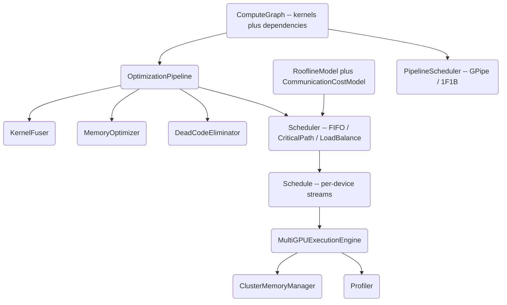

# Multi-GPU Kernel Scheduler

A from-scratch, TensorRT-style scheduler that models deep-learning computation as a DAG of
GPU kernels and schedules it across a multi-GPU cluster. It performs critical-path analysis,
kernel fusion, memory planning, pipeline-parallel partitioning, and roofline cost modeling —
all in pure Python (`numpy` only), with kernel execution simulated so the scheduling logic can
be exercised without CUDA hardware.

## Features

- **Compute graph as a DAG** — kernels and data dependencies with topological sort, critical
  path, and level-based parallel grouping (`ComputeGraph`, `Kernel`, `KernelDependency`).
- **Multiple scheduling policies** — FIFO, critical-path priority, and load-balanced multi-GPU
  placement, plus a factory (`FIFOScheduler`, `CriticalPathScheduler`, `LoadBalanceScheduler`,
  `create_scheduler`).
- **Stream and memory scheduling** — assign kernels to CUDA streams for overlap and schedule
  cross-device transfers over NVLink/PCIe (`StreamScheduler`, `MemoryScheduler`).
- **Graph optimization passes** — kernel fusion (GEMM+bias+activation, elementwise chains),
  memory planning via liveness analysis, dead-code elimination, run as a pipeline
  (`KernelFuser`, `MemoryOptimizer`, `DeadCodeEliminator`, `OptimizationPipeline`).
- **Pipeline parallelism** — partition a graph into stages and schedule microbatches with
  GPipe or 1F1B, reporting the pipeline bubble ratio (`PipelinePartitioner`, `PipelineScheduler`).
- **Roofline cost model** — classify kernels as compute- vs memory-bound and estimate time from
  device peak FLOPs and bandwidth (`RooflineModel`, `CommunicationCostModel`, `CostModelScheduler`).
- **Execution engine** — simulated executor with per-device memory managers, profiling, CUDA
  graph capture/replay, and benchmarking (`MultiGPUExecutionEngine`, `Profiler`, `CUDAGraphCapture`).
- **Speculative execution** — pre-launch kernels ahead of confirmed dependencies with
  validate-and-rollback (`SpeculativeExecutor`).
- **Kernel builders** — helpers for GEMM, attention, elementwise, and reduce kernels, plus a
  transformer-like test graph (`create_gemm_kernel`, `create_attention_kernel`, `create_test_graph`).

## Architecture



| Component | Module | Responsibility |
|-----------|--------|----------------|
| Compute graph | `core/kernel.py` | Kernels, dependencies, topo sort, critical path, parallel groups |
| Kernel builders | `core/kernel.py` | GEMM/attention/elementwise/reduce kernels, transformer test graph |
| Schedulers | `scheduler/scheduler.py` | FIFO, critical-path, load-balance, stream and memory scheduling |
| Pipeline | `scheduler/scheduler.py` | Stage partitioning and GPipe/1F1B microbatch scheduling |
| Optimizer | `optimizer/optimizer.py` | Fusion, memory planning, dead-code elimination pipeline |
| Executor | `executor/executor.py` | Simulated execution, memory managers, profiling, CUDA graph replay |
| Cost models | `executor/executor.py` | Roofline and communication cost estimation |

## Quick Start

### Prerequisites

- Python 3.10+
- `numpy` (installed below). No GPU or CUDA toolkit is required — kernel
  execution is simulated. CuPy/pynvml are optional extras and are not exercised by the tests.

### Installation

```bash
pip install -e ".[dev]"

# Optional CUDA extras (cupy, pynvml) — not required for anything in this repo
pip install -e ".[cuda]"
```

### Running

There is no server or CLI; the package is a library. Import it and build a graph:

```bash
python -c "from kernelsched import create_test_graph; print(len(create_test_graph().kernels))"
```

## Usage

Build a compute graph, optimize it, schedule it on a cluster, and execute:

```python
from kernelsched import (
    GPUDevice, MultiGPUCluster, create_test_graph,
    SchedulingPolicy, create_scheduler,
    optimize_graph, MultiGPUExecutionEngine,
)

# A transformer-like DAG of GEMM / attention / elementwise kernels
graph = create_test_graph(num_layers=4)

# Optimize: dead-code elimination, kernel fusion, memory planning
optimized, result = optimize_graph(graph)
print(f"{result.original_kernels} -> {result.optimized_kernels} kernels, "
      f"fused {result.fused_patterns}")

# Define a 2-GPU cluster and pick a scheduling policy
cluster = MultiGPUCluster(devices=[GPUDevice(0), GPUDevice(1)])
scheduler = create_scheduler(SchedulingPolicy.CRITICAL_PATH, cluster)
schedule = scheduler.schedule(optimized)
print(schedule.get_schedule_summary())

# Execute (simulated) and profile
engine = MultiGPUExecutionEngine(cluster)
outputs, stats = engine.execute(optimized, schedule)
print(f"total {stats.total_time_ms:.3f} ms, peak {stats.memory_peak_mb:.1f} MB")
```

Critical-path analysis and pipeline parallelism are also directly available:

```python
from kernelsched import create_test_graph, PipelineConfig, PipelineScheduler
from kernelsched import GPUDevice, MultiGPUCluster

graph = create_test_graph(num_layers=8)
path, total_us = graph.get_critical_path()
print(f"critical path: {len(path)} kernels, {total_us:.1f} us")

cluster = MultiGPUCluster(devices=[GPUDevice(i) for i in range(4)])
config = PipelineConfig(num_stages=4, num_microbatches=8)
pipe = PipelineScheduler(cluster, config).schedule(graph, strategy="balanced")
print(f"pipeline efficiency: {pipe.efficiency:.2%}, bubble {pipe.bubble_ratio:.2%}")
```

## What's Real vs Simulated

- **Real:** All scheduling, optimization, and analysis logic is fully implemented and tested —
  topological sort, critical-path DP, parallel grouping, the three scheduler policies, stream
  and memory-transfer scheduling, kernel fusion, dead-code elimination, constant folding of
  compile-time-constant subgraphs, memory liveness
  planning, pipeline partitioning with GPipe/1F1B microbatch timing, the roofline and
  communication cost models, per-device memory accounting, profiling, and the speculative
  execution commit/rollback bookkeeping.
- **Simulated / requires credentials:** Kernel *execution* is a stub — `KernelExecutor` returns
  zero-filled `numpy` arrays of the correct shape and sleeps for the estimated kernel time
  rather than computing on a GPU. Timings are analytic estimates (FLOPs and bandwidth), not
  measured hardware numbers. CUDA graph capture/replay is simulated in Python. The optional
  `cupy`/`pynvml` extras are declared but not used by the library or tests.

## Testing

```bash
pytest tests/ -v   # 281 tests
```

The suite covers the graph structure, all three schedulers, optimizer passes, memory managers,
the execution engine, cost models, and pipeline scheduling. No GPU or external services are
required — everything runs on CPU against the simulated executor.

## Project Structure

```
48-multi-gpu-kernel-scheduler/
  README.md                       # This file
  pyproject.toml                  # Package metadata and dependencies
  src/kernelsched/
    core/kernel.py                # Kernels, ComputeGraph, cluster, kernel builders, pipeline
    scheduler/scheduler.py        # Schedulers, stream/memory scheduling, pipeline scheduler
    optimizer/optimizer.py        # Fusion, memory planning, DCE, optimization pipeline
    executor/executor.py          # Execution engine, memory, profiling, cost models, speculation
  tests/                          # Pytest suite (281 tests)
  docs/BLUEPRINT.md               # Full architecture and design
```

## License

MIT — see [LICENSE](../LICENSE)
