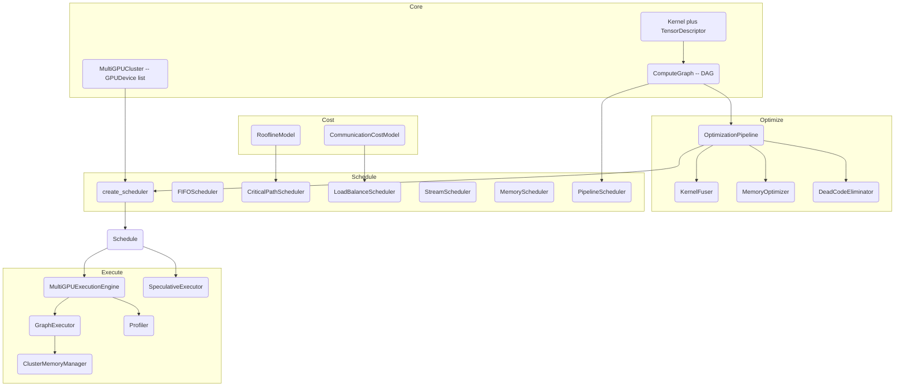

# Multi-GPU Kernel Scheduler

## Overview

The Multi-GPU Kernel Scheduler is a from-scratch model of how a deep-learning inference/training
compiler schedules work across a cluster of GPUs. It represents a model as a directed acyclic
graph (DAG) of GPU *kernels* connected by data dependencies, then applies the classic pipeline
that systems such as TensorRT, XLA, and PyTorch's inductor apply: optimize the graph, plan
placement and memory, schedule kernels onto devices and streams, and execute.

The project's goal is pedagogical clarity, not raw performance. Every stage is written in plain
Python with `numpy` as the only runtime dependency, and kernel execution is *simulated* — kernels
return correctly shaped zero tensors and "run" for their analytically estimated duration. This
lets the scheduling, optimization, cost-modeling, and pipeline-parallel logic be exercised and
tested on any machine, with no GPU or CUDA toolkit.

The concepts it teaches:

- **DAG scheduling** — topological ordering, critical-path (longest-path) analysis via dynamic
  programming, and level-based parallel grouping.
- **List scheduling with priorities** — ready-queue scheduling where kernels are prioritized by
  their distance to the end of the graph (critical-path scheduling).
- **Load balancing and locality** — placing kernels to balance per-device load while keeping
  data on the device that produced it to avoid transfers.
- **Graph rewriting** — kernel fusion by pattern matching over the DAG, dead-code elimination by
  liveness, and copy-on-write graph transforms in an optimization pipeline.
- **Memory planning** — tensor liveness analysis and first-fit offset allocation to reduce peak
  memory, plus per-device allocation accounting.
- **Pipeline parallelism** — partitioning a graph into balanced stages and scheduling
  microbatches with GPipe (all-forward-then-backward) and 1F1B (interleaved) policies, and
  quantifying the pipeline bubble.
- **Roofline modeling** — classifying kernels as compute- or memory-bound and estimating time
  from device peak FLOPs and memory bandwidth; modeling inter-device transfer cost over
  NVLink/PCIe.
- **Speculative execution** — launching kernels ahead of confirmed dependencies and committing
  or rolling back based on later validation.

Scope: single-process, in-memory, CPU-only simulation. There is no persistence, no networking,
and no actual GPU dispatch. The public surface is a Python package (`kernelsched`) exporting the
graph, scheduler, optimizer, and executor types.

The name TensorRT-lite is apt: like TensorRT, the system ingests a model as a graph, fuses and
prunes it, plans memory, and produces an execution plan bound to a specific device configuration —
but it does so in a few thousand readable lines with the hardware abstracted away, so the *shape*
of the problem is visible without the engineering weight of a real inference engine. Where a
production compiler hides these stages behind opaque engine files, here every intermediate is a
Python object you can print, diff, and assert on. That inspectability is the design's north star:
the code should read as an executable explanation of how graph-based schedulers work.

## Architecture



The system is layered into four packages that mirror the compiler pipeline:

1. **`core`** defines the vocabulary: `Kernel`, `TensorDescriptor`, `KernelDependency`, the
   `ComputeGraph` DAG, and the hardware model (`GPUDevice`, `MultiGPUCluster`). It also provides
   kernel builder functions and pipeline-partitioning primitives.
2. **`optimizer`** rewrites a `ComputeGraph` into an equivalent, cheaper graph through a sequence
   of passes wrapped in `OptimizationPipeline`.
3. **`scheduler`** turns an (optimized) graph plus a cluster into a concrete `Schedule` — an
   assignment of kernels to devices, streams, and start/end times — via one of several policies.
   It also contains stream assignment, transfer scheduling, and the pipeline-parallel scheduler.
4. **`executor`** consumes a `Schedule` and runs it against the simulated backend, tracking
   memory, profiling, and returning `ExecutionStats`. The roofline/communication cost models and
   the speculative executor also live here.

Data flows one direction: `ComputeGraph` → optimizer → scheduler → `Schedule` → executor →
`ExecutionStats`. Cost models feed the scheduler with time estimates; the pipeline scheduler is
an alternate path that consumes the graph directly and emits a `PipelineSchedule`.

This layering follows the same contract a production ML compiler uses, deliberately: the graph is
the intermediate representation (IR), the optimizer is a set of IR-to-IR rewrite passes, the
scheduler is the code-generation/placement stage that binds the abstract graph to concrete hardware
resources (devices, streams, time slots), and the executor is the runtime. Each boundary is a plain
Python data type — `ComputeGraph`, `Schedule`, `PipelineSchedule`, `ExecutionStats` — so any stage
can be inspected, snapshotted, or replaced in isolation. Two smaller decisions reinforce the
separation. First, nothing downstream of the scheduler ever re-reads the dependency graph to decide
order; the `Schedule` is self-describing, and the executor merely replays it. Second, the cost
models are *inputs* to scheduling rather than a stage of their own: a `RooflineModel` can annotate
`estimated_time_us`, and a `CostModelScheduler` can total compute-plus-communication, but they never
mutate the graph. The result is that the interesting algorithms — critical path, list scheduling,
fusion, liveness allocation, pipeline bubbling — each live behind a narrow interface and can be
studied one at a time, which is the whole pedagogical point.

## Core Components

### Compute graph (`core/kernel.py`)

`ComputeGraph` is the central data structure: a dict of `Kernel` objects keyed by `kernel_id`,
plus a list of `KernelDependency` edges. Dependencies are stored as edges rather than adjacency
lists, and predecessor/successor queries scan the edge list:

```python
def get_dependencies(self, kernel_id: str) -> list[str]:
    """Kernel IDs this kernel depends on (predecessors)."""
    return [d.source_id for d in self.dependencies if d.target_id == kernel_id]

def get_dependents(self, kernel_id: str) -> list[str]:
    """Kernel IDs that depend on this kernel (successors)."""
    return [d.target_id for d in self.dependencies if d.source_id == kernel_id]
```

Adding a kernel or dependency invalidates a cached topological order (`self._topo_order = None`),
which is recomputed lazily.

**Topological sort** uses Kahn's algorithm: compute in-degrees from the dependency list, seed a
queue with zero-in-degree kernels, and repeatedly emit a kernel and decrement its successors'
in-degrees. The result is cached.

**Critical path** is the longest path through the DAG weighted by `estimated_time_us`. It runs a
forward dynamic program over the topological order, relaxing each edge, records predecessors, and
then reconstructs the path from the maximum-distance endpoint:

```python
def get_critical_path(self) -> tuple[list[str], float]:
    topo_order = self.topological_sort()
    dist = {k: 0 for k in self.kernels}
    pred = {k: None for k in self.kernels}
    for kernel_id in topo_order:
        kernel = self.kernels[kernel_id]
        for dep_id in self.get_dependents(kernel_id):
            new_dist = dist[kernel_id] + kernel.estimated_time_us
            if new_dist > dist[dep_id]:
                dist[dep_id] = new_dist
                pred[dep_id] = kernel_id
    end_node = max(dist, key=lambda k: dist[k] + self.kernels[k].estimated_time_us)
    total_time = dist[end_node] + self.kernels[end_node].estimated_time_us
    path = [end_node]
    while pred[path[-1]]:
        path.append(pred[path[-1]])
    path.reverse()
    return path, total_time
```

**Parallel grouping** (`get_parallelizable_groups`) assigns each kernel a "level" equal to one
more than the maximum level of its dependencies; kernels at the same level have no ordering
constraint between them and can run in parallel. Concretely, level-0 holds all source kernels,
level-1 holds kernels all of whose inputs come from level-0, and so on. This is the ASAP
(as-soon-as-possible) leveling used to estimate the maximum available parallelism and to bound
how wide the schedule can spread across devices and streams. For the `create_test_graph` DAG,
which is a chain of layer blocks, the levels are essentially one kernel deep per step; for
graphs with independent branches (e.g. multiple attention heads feeding a shared reduction) a
level can contain many kernels.

**Why edges instead of adjacency lists.** Dependencies are stored as a flat `list[KernelDependency]`
and predecessor/successor lookups scan it. This is intentionally the simplest correct
representation: an edge records not just source and target but the *tensor* flowing between them
(`tensor_id`), which the memory scheduler needs to size transfers and the fuser needs when
rewiring a fused kernel's boundary edges. The cost is `O(E)` queries; the benefit is that graph
rewrites (fusion, dead-code elimination) only have to filter and rebuild one list rather than keep
two adjacency maps consistent. For the graph sizes this project targets (tens to a few hundred
kernels) the linear scans are negligible, and the invariant "one list is the single source of
truth" removes a whole class of bugs.

`Kernel` carries its I/O tensors, a `KernelConfig` (block/grid sizes, shared memory, stream), an
`estimated_time_us`, and computed properties: `flops` (exact for GEMM as `2*m*k*n`) and
`memory_bytes` (sum of input and output tensor sizes). `TensorDescriptor.size_bytes` multiplies
element count by a per-dtype byte size. Kernel identity is a UUID prefix, and the builder
functions embed the shape into the `name` (e.g. `gemm_512x2048x8192`) so schedules and profiles
are human-readable. The `attributes` dict is where builder-specific shape metadata lives
(`{"m", "k", "n"}` for GEMM, `{"batch", "heads", "seq_len", "head_dim"}` for attention); the
roofline model reads these attributes rather than re-deriving shapes from tensors, which keeps the
FLOP estimate exact for the fused kernels whose tensor shapes may no longer match a single op.

The hardware model is deliberately simple. `GPUDevice` records memory, bandwidth, SM count, and
derives a rough `peak_tflops`. `MultiGPUCluster` holds a device list and NVLink/PCIe bandwidths
and exposes `num_devices` and `total_memory_gb`.

Builder functions (`create_gemm_kernel`, `create_attention_kernel`, `create_elementwise_kernel`,
`create_reduce_kernel`) construct kernels with correctly shaped tensors and analytic time
estimates. `create_test_graph(num_layers)` stitches these into a transformer-like DAG
(attention → GEMM → GELU → GEMM per layer) with the appropriate dependencies, used throughout the
tests.

### Optimizer (`optimizer/optimizer.py`)

Every optimization pass subclasses `GraphOptimizer` and implements `optimize(graph) -> graph`.
`OptimizationPipeline` runs a named sequence of passes and returns the transformed graph plus an
`OptimizationResult` (original vs optimized kernel counts, an estimated speedup from the ratio of
summed kernel times, the list of passes applied, and the fusion patterns matched).

**`KernelFuser`** works on a copy of the graph and repeatedly applies fusion patterns until no
change occurs. Two patterns are implemented in full:

- *GEMM + bias + activation*: find a `GEMM` whose dependent is an `ELEMENTWISE` (bias add),
  optionally followed by an `ELEMENTWISE` activation (`relu`/`gelu`/`silu`), and replace the chain
  with a single fused GEMM kernel whose `estimated_time_us` is reduced by 10%.
- *Elementwise chain*: walk a linear chain of `ELEMENTWISE` kernels (each with exactly one
  dependent and one dependency); if the chain length is ≥ 3, fuse into one kernel.

Fusion is performed by `_replace_kernels`, which adds the fused kernel, rewrites incoming edges to
point at it and outgoing edges to originate from it, drops internal edges, and deletes the old
kernels. `_fuse_layer_norm` and `_fuse_attention` are present as recognized-but-inactive hooks
(they return `False`) — an honest reflection of what is and isn't wired up.

**`MemoryOptimizer`** performs liveness analysis, computing `(start, end)` index ranges for each
tensor over the topological order (extended by dependency edges), then runs a first-fit linear
scan allocator (`_plan_allocation`) that assigns byte offsets from a fixed memory budget, writing
the offsets back into each `TensorDescriptor.memory_offset`. Liveness is the crux: a tensor is
"live" from the step that produces it to the last step that consumes it, so two tensors whose live
ranges do not overlap can safely share the same memory offset. Computing tight live ranges is what
lets peak memory fall below the naive "sum of all tensor sizes." The allocator sorts tensors by
start time (breaking ties by descending size, a common heuristic that places large, long-lived
buffers first), then walks a free-region list assigning the first region large enough. When the
budget is exhausted it degrades gracefully to offset 0 rather than raising, since this is a planning
pass and the executor's memory manager is the component that actually enforces capacity. The pass is
a simplified version of the linear-scan register allocation idea applied to tensor buffers, and it
is intentionally *not* optimal — an exact solution is the NP-hard dynamic storage allocation
problem, so a fast greedy heuristic is the right teaching choice.

**`DeadCodeEliminator`** keeps only kernels that produce a tensor consumed by a dependency or by a
graph output (or that have no dependents), and prunes dependencies to the surviving set.
`ConstantFolder` folds compile-time-constant subgraphs: it marks a kernel constant if it carries an
`is_constant` attribute (e.g. a weight/initializer) or if every kernel it depends on is already
constant, propagating constant-ness transitively in topological order, then collapses each *derived*
constant compute kernel into a single materialized `MEMORY` node and drops its now-redundant incoming
edges. On ordinary graphs (no marked constants) it is an equivalent-graph no-op.

`create_default_pipeline()` wires DCE → fusion → constant folding → memory planning;
`optimize_graph(graph)` is the one-call convenience wrapper.

**Pass ordering matters.** Dead-code elimination runs first so the fuser and allocator never waste
work on unreachable kernels. Fusion runs before memory planning because fusion changes which
tensors are live — a fused GEMM+bias+activation eliminates the intermediate bias and activation
outputs, so the allocator should see the post-fusion graph to compute correct liveness and offsets.
`ConstantFolder` runs on the post-fusion graph so it folds the fused constant subgraphs rather than
their pre-fusion pieces. It is a real but deliberately minimal pass: because the analytic IR stores
tensor *shapes*, not values, folding means proving a kernel's output is compile-time-determined and
replacing the compute with a materialized constant — it does not evaluate arithmetic. The `KernelFuser`
`_fuse_layer_norm` and `_fuse_attention` hooks remain recognized patterns that return `False` today,
kept as explicit extension points rather than pretending the fusion set is complete.

**Copy-on-write graphs.** Each pass returns a *new* `ComputeGraph`; the fuser calls `_copy_graph`
(shallow-copying kernel references and cloning the dependency list) before mutating, so the caller's
original graph is never altered. This makes optimization idempotent to re-run and safe to compare
before/after, which the tests rely on when asserting `original_kernels` versus `optimized_kernels`.

### Schedulers (`scheduler/scheduler.py`)

All device-level schedulers subclass `KernelScheduler(cluster, num_streams_per_device=4)` and
produce a `Schedule`. Each device gets a `DeviceSchedule` holding `num_streams` `Stream` objects;
`Stream.schedule(kernel, start)` places a kernel at `max(start, stream.current_time_us)` and
advances the stream's clock, returning a `ScheduledKernel`.

- **`FIFOScheduler`** walks the topological order, computes each kernel's earliest start as the
  max completion time of its dependencies, places it on the kernel's own device using the
  earliest-free stream (`DeviceSchedule.get_free_stream`), and records completion.
- **`CriticalPathScheduler`** is a priority list scheduler. It first computes each kernel's
  priority as its distance to the end of the graph (a backward pass summing `estimated_time_us`
  along the longest remaining path), then runs a ready-queue: kernels become ready when all
  dependencies complete, and the highest-priority ready kernel (largest distance-to-end) is
  scheduled next via a max-heap keyed on the negated priority.
- **`LoadBalanceScheduler`** tracks per-device accumulated load. For each kernel it prefers the
  device holding most of its dependencies (locality), but if that device's load exceeds the
  least-loaded device by more than 20% it migrates the kernel to the least-loaded device.

`create_scheduler(policy, cluster, **kwargs)` maps a `SchedulingPolicy` enum to the concrete
scheduler (defaulting to FIFO).

**How the three policies differ in practice.** Given the same graph and cluster, FIFO preserves the
topological order and packs onto the kernel's declared device — it is the baseline and the honest
worst case, since it never reorders to hide latency. Critical-path scheduling reorders *ready*
kernels so that whichever kernel lies on the longest remaining path runs first; this is the classic
list-scheduling heuristic for minimizing makespan on a DAG, and it matters most when several
independent subgraphs compete for the same streams. Load-balance ignores per-kernel priority and
instead spreads work across devices, trading potential transfer cost for parallelism — its 20%
imbalance threshold is a hysteresis band that prevents thrashing a kernel to a remote device to
save a sliver of load. All three share the same `Stream`/`DeviceSchedule` machinery, so they differ
only in *which kernel next* and *which device*, keeping the comparison apples-to-apples.

**Earliest-start computation.** Every scheduler computes a kernel's earliest start as the maximum
completion time over its dependencies. Because kernels are placed in dependency-respecting order
(topological, or ready-queue), those completion times are always known when needed. The chosen
stream then further clamps the start to `stream.current_time_us`, so a kernel can be *ready* earlier
than the stream is *free* — the gap between the two is exactly the queueing delay a real GPU stream
would impose, and it is what the schedulers try to minimize by choosing the earliest-free stream.

Two auxiliary schedulers complete the picture. **`StreamScheduler.assign_streams`** greedily
assigns kernels to the stream that can start them earliest, maximizing overlap. It maintains a
per-stream finish-time vector and, for each kernel in topological order, picks the stream whose
`max(earliest_start, stream_finish)` is smallest — the same list-scheduling greedy applied at the
stream granularity within a single device. This models how CUDA streams let independent kernels run
concurrently on one GPU: with four streams, up to four kernels that are ready at the same time can
be in flight, and the assignment tries to keep all four busy rather than serializing on one.
**`MemoryScheduler.schedule_transfers`** inspects dependencies whose source and target land on
different devices and emits transfer records with NVLink-derived transfer times. It looks up the
flowing tensor's size (defaulting to 1 MB when the tensor cannot be matched) and divides by the
cluster's NVLink bandwidth to price the transfer. These records populate `Schedule.memory_transfers`
and feed the communication cost model, closing the loop between placement decisions and their data-
movement cost — a cross-device dependency is never free, and making that cost explicit is what lets
`LoadBalanceScheduler`'s locality preference be evaluated against the load it is trying to balance.

### Pipeline parallelism (`core` + `scheduler`)

`PipelinePartitioner.partition(graph, strategy)` splits the topological order into
`num_stages` `PipelineStage`s under one of three strategies: `balanced` (equal summed compute per
stage), `memory` (equal summed `memory_bytes`), or `layer` (split on attention boundaries, then
merge to fit the stage count). `_compute_stage_boundaries` derives each stage's cross-stage input
and output tensors so stages can be treated as pipeline units.

`PipelineScheduler.schedule(graph, strategy)` partitions the graph, computes per-stage times, and
schedules `num_microbatches` microbatches with one of two policies selected by
`PipelineConfig.interleave_stages`:

- **GPipe** (`_schedule_gpipe`): every stage processes microbatch *m* only after the previous
  stage finishes *m* and after this stage finishes *m-1*.
- **1F1B** (`_schedule_1f1b`): a warmup phase fills the pipeline, then a steady state interleaves,
  reducing activation memory.

The result is a `PipelineSchedule` with per-microbatch stage timings, a computed
`pipeline_bubble_us` (actual time minus the ideal `max_stage_time * num_microbatches`), and
derived `bubble_ratio` and `efficiency` properties.

**Reading the bubble.** The ideal pipeline time is `max_stage_time * num_microbatches`: once the
pipeline is full, the slowest stage is the bottleneck and every microbatch costs one slow-stage
period. The difference between the actual schedule and this ideal is the *bubble* — the fill and
drain time during which some stages sit idle waiting for the pipeline to warm up or wind down.
GPipe pays a fixed fill/drain proportional to `(num_stages - 1)` stage-times regardless of
microbatch count, so its efficiency rises toward 1 as `num_microbatches` grows. 1F1B does not
shorten the total time in this timing model (both compute the same stage occupancy), but its
warmup-then-steady-state structure is what a real system would use to cap activation memory to a
single microbatch per stage rather than all of them. The `strategy` argument controls the
bottleneck: `balanced` minimizes `max_stage_time` by equalizing compute, which is what most
directly shrinks the ideal time and, through it, improves reported efficiency.

### Executor (`executor/executor.py`)

`MultiGPUExecutionEngine` is the top-level entry: it wraps a `GraphExecutor` and a `Profiler`.
`GraphExecutor.execute(graph, schedule, inputs)` allocates memory for every kernel output via
`ClusterMemoryManager`, then walks the schedule device-by-device, stream-by-stream, gathering each
kernel's input tensors, invoking `KernelExecutor`, and storing outputs. It returns the graph's
output tensors plus an `ExecutionStats` (total wall time, per-kernel times, peak memory across
devices, and per-device utilization from the schedule).

`KernelExecutor` is the simulation boundary. Each kernel type maps to an implementation that
returns zero-filled `numpy` arrays of the declared output shape, and `execute` sleeps for
`estimated_time_us` to approximate runtime, recording a `KernelStats`.

Memory accounting is real: `DeviceMemoryManager` tracks current and peak usage, raises
`MemoryError` on overflow, and supports free/reset; `ClusterMemoryManager` fans out to per-device
managers by `tensor.device_id`. The distinction between the *planner* and the *manager* is
deliberate. `MemoryOptimizer` (in the optimizer package) computes offsets ahead of time from
liveness and is free to be approximate; `DeviceMemoryManager` (in the executor) is the ground-truth
bookkeeper that a real allocator would be — it bumps `current_usage` on allocate, records the
running `peak_usage`, and refuses to exceed the device budget. Keeping peak as a high-water mark
means `ExecutionStats.memory_peak_mb` reflects the worst moment during execution, not the final
resting usage, which is the number that actually determines whether a model fits. Because the
manager is per-device and keyed on `tensor.device_id`, a multi-GPU schedule's peak is reported
per device and the cluster peak is the max across them — so an imbalanced placement that piles
tensors on one GPU shows up as a high peak on that device even if the aggregate would have fit.

`Profiler` records per-kernel entries and summarizes total/average time and time-by-type.
`CUDAGraphCapture` provides a simulated capture/replay lifecycle. `MultiGPUExecutionEngine.benchmark`
runs warmup and timed iterations and returns mean/std/min/max in milliseconds.

**Why simulate execution.** The whole point of the project is the *scheduling and optimization*
logic, and that logic is fully determined by the graph structure, kernel time estimates, and device
model — none of which require a real GPU. Simulating the backend means the entire pipeline runs
deterministically on CPU in CI, kernels produce correctly shaped outputs so downstream shape
inference stays exercised, and the memory manager still does real byte accounting so peak-memory and
out-of-memory paths are covered. The `time.sleep(estimated_time_us / 1e6)` in `KernelExecutor` makes
wall-clock `ExecutionStats` roughly track the analytic estimates, which lets `benchmark` report
plausible mean/std spreads without hardware. The seam is drawn cleanly at `KernelExecutor` and
`CUDAGraphCapture`: swapping in a CuPy-backed implementation would not touch the scheduler,
optimizer, or cost models at all.

**Execution order versus schedule order.** `GraphExecutor` iterates devices, then streams, then the
kernels queued on each stream — i.e. it replays the `Schedule` the scheduler produced rather than
re-deriving an order. This keeps a strict separation: the scheduler decides *when and where*, the
executor only *runs what it was told*, and any correctness question ("did a kernel run before its
inputs existed?") is answered by testing the scheduler, not the executor. Because a stream's
`scheduled_kernels` are already in start-time order, the per-stream loop is a straight replay.

### Cost models (`executor/executor.py`)

`RooflineModel(device)` computes the operational-intensity ridge point
`peak_flops / peak_bandwidth`, classifies a kernel as compute- or memory-bound by comparing its
FLOPs-per-byte to that ridge, and estimates time as `max(compute_time, memory_time)`.
`_estimate_flops` derives FLOPs from kernel attributes (GEMM `2*m*k*n`, attention
`4*b*h*s*s*d`, elementwise/reduce as element count).

`CommunicationCostModel(cluster)` estimates transfer time as `bytes / bandwidth` over NVLink or
PCIe, and `total_communication_cost` sums transfers for every cross-device dependency in a graph.
`CostModelScheduler` combines both to estimate a scheduled graph's total time as compute plus
communication.

The roofline model is the standard mental tool for asking "is this kernel limited by arithmetic or
by memory?" The ridge point `peak_flops / peak_bandwidth` is the operational intensity (FLOPs per
byte moved) at which a device transitions from memory-bound to compute-bound. A kernel whose
intensity sits below the ridge cannot keep the ALUs fed and its time is governed by bandwidth; a
kernel above the ridge is bounded by raw FLOPs. Modeling execution time as `max(compute_time,
memory_time)` captures exactly this: whichever resource is the bottleneck sets the wall clock. This
is why GEMM (high reuse, `2*m*k*n` FLOPs against comparatively few bytes) is typically compute-bound
while elementwise and attention (little reuse, dominated by reads and writes) are memory-bound — and
why the builder functions assign them different effective TFLOPS. The communication model completes
the picture on the multi-GPU axis: NVLink at 600 GB/s versus PCIe at 32 GB/s is nearly a 20x gap, so
a placement that forces a large tensor across PCIe can dwarf the compute it was trying to parallelize.
`CostModelScheduler.estimate_total_time` is where the two combine, giving the scheduler a single
number — compute plus cross-device communication — to reason about rather than treating them
separately.

### Speculative execution (`executor/executor.py`)

`SpeculativeExecutor` walks the topological order and, for each kernel, either executes it
normally (all dependencies confirmed complete) or *speculatively* (dependencies "likely" complete
and within `speculation_depth`). "Likely" means every dependency is either confirmed complete or
already has a speculative result in hand — the executor is willing to build on other speculations
up to `speculation_depth` deep. `validate_and_commit` later checks each speculative result: if its
dependencies actually completed, it commits; otherwise it rolls back (output cleared,
`is_valid=False`). `get_stats` reports launch/commit/rollback counts and a speculation success
rate (`committed / max(speculative, 1)`).

The design mirrors branch prediction in a CPU: run ahead on the predicted path, keep the work if
the prediction holds, discard it if not. It is a net win only when speculation usually succeeds and
the discarded work is cheap relative to the latency it hides — which is why `speculation_depth` and
`confidence_threshold` are tunable knobs. Here the mechanism (commit/rollback bookkeeping and the
success-rate accounting) is real and tested; the *benefit* is not measured because kernel execution
is simulated, so the value lies in modeling the control flow, not in demonstrating a speedup.

## Data Structures

```python
class KernelType(Enum):
    GEMM = "gemm"; CONV = "conv"; ELEMENTWISE = "elementwise"
    REDUCE = "reduce"; SOFTMAX = "softmax"; ATTENTION = "attention"
    LAYERNORM = "layernorm"; TRANSPOSE = "transpose"
    MEMORY = "memory"; CUSTOM = "custom"

@dataclass
class TensorDescriptor:
    tensor_id: str
    shape: tuple[int, ...]
    dtype: DataType
    device_id: int = 0
    stride: tuple[int, ...] | None = None
    memory_offset: int = 0

    @property
    def size_bytes(self) -> int: ...   # numel * dtype_size
    @property
    def numel(self) -> int: ...        # product of shape

@dataclass
class Kernel:
    kernel_id: str
    name: str
    kernel_type: KernelType
    inputs: list[TensorDescriptor]
    outputs: list[TensorDescriptor]
    config: KernelConfig = KernelConfig()
    attributes: dict[str, Any] = {}
    device_id: int = 0
    estimated_time_us: float = 0.0
    stats: KernelStats | None = None

    @property
    def flops(self) -> int: ...        # 2*m*k*n for GEMM, else 0
    @property
    def memory_bytes(self) -> int: ... # sum of input + output sizes

@dataclass
class KernelDependency:
    source_id: str
    target_id: str
    tensor_id: str          # tensor flowing source -> target
    dependency_type: str = "data"
```

The DAG itself:

```python
class ComputeGraph:
    kernels: dict[str, Kernel]
    dependencies: list[KernelDependency]
    input_tensors: list[TensorDescriptor]
    output_tensors: list[TensorDescriptor]

    def add_kernel(self, kernel) -> None
    def add_dependency(self, source_id, target_id, tensor_id) -> None
    def get_dependencies(self, kernel_id) -> list[str]
    def get_dependents(self, kernel_id) -> list[str]
    def topological_sort(self) -> list[str]
    def get_critical_path(self) -> tuple[list[str], float]
    def get_parallelizable_groups(self) -> list[list[str]]
```

A note on the type choices: everything transferable is a frozen-in-practice `@dataclass`, while the
two structures that are mutated in place — `ComputeGraph` and the memory managers — are plain
classes. `KernelType`, `DataType`, `DeviceType`, `SchedulingPolicy`, `OptimizationPass`, and
`ExecutionMode` are all `Enum`s so that policy selection, dtype sizing, and fusion pattern matching
are exhaustive and typo-proof rather than string comparisons scattered through the code. Tensor
sizing is centralized in `TensorDescriptor.size_bytes` via a dtype→bytes table (FP32/INT32 = 4,
FP16/BF16 = 2, INT8 = 1), so every consumer — memory manager, roofline model, transfer scheduler —
agrees on how big a tensor is.

Hardware and schedule:

```python
@dataclass
class GPUDevice:
    device_id: int
    name: str = "GPU"
    compute_capability: tuple[int, int] = (8, 0)
    total_memory_gb: float = 80.0
    memory_bandwidth_gbps: float = 2000.0
    sm_count: int = 108
    max_threads_per_sm: int = 1536
    warp_size: int = 32
    @property
    def peak_tflops(self) -> float: ...

@dataclass
class MultiGPUCluster:
    devices: list[GPUDevice]
    nvlink_bandwidth_gbps: float = 600.0
    pcie_bandwidth_gbps: float = 32.0

@dataclass
class ScheduledKernel:
    kernel: Kernel
    device_id: int
    stream_id: int
    start_time_us: float
    end_time_us: float
    priority: int = 0

@dataclass
class Schedule:
    device_schedules: dict[int, DeviceSchedule]
    total_time_us: float = 0.0
    memory_transfers: list[dict] = []
    def get_schedule_summary(self) -> dict[str, Any]: ...
```

Pipeline and results:

```python
@dataclass
class PipelineConfig:
    num_stages: int
    num_microbatches: int = 4
    interleave_stages: bool = False   # 1F1B vs GPipe
    recompute_activations: bool = False

@dataclass
class PipelineSchedule:
    stages: list[PipelineStage]
    microbatch_schedules: list[MicrobatchSchedule]
    total_time_us: float
    pipeline_bubble_us: float
    num_microbatches: int
    @property
    def bubble_ratio(self) -> float: ...
    @property
    def efficiency(self) -> float: ...

@dataclass
class OptimizationResult:
    original_kernels: int
    optimized_kernels: int
    estimated_speedup: float
    passes_applied: list[str]
    fused_patterns: list[str]

@dataclass
class ExecutionStats:
    total_time_ms: float
    kernel_times_ms: dict[str, float]
    memory_peak_mb: float
    device_utilization: dict[int, float]
    memory_transfers_ms: float
```

## API Design

The package re-exports its public surface from `kernelsched/__init__.py`. The primary flows:

```
# Build
graph = create_test_graph(num_layers=4)
# or construct manually:
graph = ComputeGraph()
k = create_gemm_kernel(m=512, k=2048, n=8192)
graph.add_kernel(k)
graph.add_dependency(src_id, dst_id, tensor_id)

# Analyze
order      = graph.topological_sort()          -> list[str]
path, us   = graph.get_critical_path()          -> (list[str], float)
levels     = graph.get_parallelizable_groups()  -> list[list[str]]

# Optimize
optimized, result = optimize_graph(graph)        -> (ComputeGraph, OptimizationResult)
# or build a custom pipeline:
pipe = OptimizationPipeline()
pipe.add_pass("dce", DeadCodeEliminator())
pipe.add_pass("fusion", KernelFuser())
optimized, result = pipe.optimize(graph)

# Schedule
cluster   = MultiGPUCluster(devices=[GPUDevice(0), GPUDevice(1)])
scheduler = create_scheduler(SchedulingPolicy.CRITICAL_PATH, cluster)
schedule  = scheduler.schedule(optimized)        -> Schedule
summary   = schedule.get_schedule_summary()      -> dict

# Cross-device transfers and stream overlap
transfers = MemoryScheduler(cluster).schedule_transfers(graph, placement)
streams   = StreamScheduler(num_streams=4).assign_streams(graph, device_id=0)

# Execute
engine          = MultiGPUExecutionEngine(cluster)
outputs, stats  = engine.execute(optimized, schedule)   -> (dict, ExecutionStats)
bench           = engine.benchmark(optimized, schedule, num_iterations=10)
# convenience:
outputs, stats  = execute_graph(graph, schedule, cluster)

# Pipeline parallelism
config = PipelineConfig(num_stages=4, num_microbatches=8, interleave_stages=True)
pipe   = PipelineScheduler(cluster, config).schedule(graph, strategy="balanced")

# Cost modeling
roofline = RooflineModel(GPUDevice(0))
t_us     = roofline.estimate_time_us(kernel)
bound    = roofline.is_compute_bound(kernel)
comm     = CommunicationCostModel(cluster).total_communication_cost(graph, schedule)

# Speculative execution
spec    = SpeculativeExecutor(GraphExecutor(cluster), speculation_depth=2)
results = spec.execute_speculative(graph, schedule, completed=set())
final   = spec.validate_and_commit(results, completed, graph)
```

`SchedulingPolicy` values are `FIFO`, `PRIORITY`, `SHORTEST_JOB`, `CRITICAL_PATH`, and
`LOAD_BALANCE`; the factory implements `FIFO`, `CRITICAL_PATH`, and `LOAD_BALANCE` and falls back
to FIFO for the rest. `partition` strategies are `"balanced"`, `"memory"`, and `"layer"`.

## Performance

All timings in this project are *analytic estimates*, not measured hardware benchmarks, so the
numbers below describe the model's own cost assumptions and the algorithmic complexity of the
implementation — not GPU throughput.

**Cost-model assumptions** (from the kernel builders and roofline model):

- GEMM: `flops = 2*m*k*n`, estimated at 100 effective TFLOPS in the builder.
- Attention: `flops = 4*b*h*s*s*d`, estimated at 50 TFLOPS (memory-bound assumption).
- Elementwise: memory-bound, `3 * numel * 2 bytes / bandwidth` at 2000 GB/s.
- `GPUDevice` defaults model an A100-class card: 80 GB, 2000 GB/s, 108 SMs.
- Transfers: NVLink at 600 GB/s, PCIe at 32 GB/s.

**Algorithmic complexity:**

- Topological sort: `O(V * E)` as implemented — the inner loop rescans the dependency list per
  emitted node. Fine for the graph sizes here; a true adjacency list would make it `O(V + E)`.
- Critical path: one forward DP pass over the topological order, `O(V + E)` given the order.
- Predecessor/successor queries: `O(E)` each (linear scan of the edge list).
- Critical-path scheduling: `O(V log V)` heap operations plus the priority backward pass.
- Memory planning: liveness in `O(V + E)`, first-fit allocation in `O(T^2)` worst case over `T`
  tensors.

**Fusion effect:** the fused GEMM kernel is modeled at 90% of the original GEMM's time, and a
fused elementwise chain of length `n` at `0.5 * n * base_time` — reflecting kernel-launch and
memory-traffic savings rather than measured speedups. `OptimizationResult.estimated_speedup` is
the ratio of summed pre/post kernel times.

**Pipeline efficiency** is reported directly: `efficiency = 1 - bubble_ratio`, where the bubble is
`total_time - (max_stage_time * num_microbatches)`. More microbatches amortize the fill/drain
bubble; balanced partitioning minimizes the slowest stage.

**A worked pass through the model.** Take `create_test_graph(num_layers=4)`: each layer is
attention → GEMM(ffn1) → GELU → GEMM(ffn2), so the graph is a 16-kernel chain with 12 explicit
dependencies. Because it is a chain, its topological order is unique, its critical path is the whole
graph, and `get_parallelizable_groups` yields one kernel per level — there is no intra-layer
parallelism to exploit, only pipeline parallelism across layers. Running `optimize_graph` on it, the
GELU is an elementwise op sitting between two GEMMs; the GEMM+bias+activation pattern only fires when
a GEMM is directly followed by an elementwise bias-add, so on this particular graph the observable
change is bounded and `OptimizationResult` reports the exact before/after counts rather than a
headline number. Scheduling it with `CriticalPathScheduler` on a 4-GPU cluster and running
`PipelineScheduler` with `num_stages=4` illustrates the trade-off directly: the device scheduler
keeps the chain on one device (no independent work to spread), while the pipeline scheduler splits
the four layers across four GPUs and its reported efficiency climbs as `num_microbatches` increases.
This is the intended teaching arc — the same graph exposes *why* pipeline parallelism, not kernel
parallelism, is the lever for a deep sequential model.

## Testing Strategy

The suite comprises 285 pytest tests across seven files, all running on CPU with no external
services (kernel execution is simulated). Shared fixtures in `tests/conftest.py` provide single
GPUs, dual- and quad-GPU clusters, and sample graphs.

- **`test_graph.py`** (52) — kernel and tensor construction, `size_bytes`/`numel`/`flops`
  properties, dependency queries, topological sort correctness (respecting all edges), critical
  path on known DAGs, parallel grouping levels, and the transformer test-graph builder.
- **`test_scheduler.py`** (42) — FIFO, critical-path, and load-balance schedulers; that
  dependencies are respected (a kernel never starts before its predecessors finish); stream
  assignment for overlap; cross-device transfer scheduling; and `Schedule` summaries/utilization.
- **`test_optimizer.py`** (42) — GEMM+bias+activation fusion, elementwise-chain fusion (length
  threshold), dead-code elimination, memory-planning offsets, the pipeline runner, and
  `OptimizationResult` bookkeeping (counts, patterns, estimated speedup).
- **`test_memory.py`** (31) — `DeviceMemoryManager` allocation/free/peak tracking, out-of-memory
  errors, reset, and `ClusterMemoryManager` per-device routing.
- **`test_execution.py`** (46) — end-to-end `GraphExecutor`/`MultiGPUExecutionEngine` runs, output
  shape/type correctness against the simulated backend, `ExecutionStats`, profiling summaries,
  benchmarking, and CUDA-graph capture/replay lifecycle.
- **`test_cost_models.py`** (47) — roofline ridge point, compute- vs memory-bound classification,
  time estimation, communication cost over NVLink/PCIe, and `CostModelScheduler` totals; plus
  speculative execution commit/rollback counts and success rate.
- **`test_pipeline.py`** (25) — partitioning strategies (balanced/memory/layer), stage-boundary
  tensors, GPipe and 1F1B microbatch schedules, and bubble/efficiency computation.

Edge cases exercised include empty and single-kernel graphs, single- vs multi-GPU clusters,
graphs with no fusable patterns, out-of-memory allocation, and pipelines where microbatch count is
smaller than the stage count (warmup shorter than the pipeline).

**What the tests actually assert.** The value of a scheduling project is that its output is
*checkable* even without hardware. The key invariants the suite pins down are structural: a
topological order lists every kernel exactly once and never places a target before its source; a
schedule never starts a kernel before all its dependencies' recorded end times; fusion strictly
reduces (or preserves) the kernel count and leaves the graph's external inputs and outputs
unchanged; dead-code elimination removes only kernels with no path to an output; memory offsets from
the planner are non-overlapping for tensors whose lifetimes overlap; and the pipeline's reported
`efficiency` is bounded in `[0, 1]` and monotonically non-decreasing in `num_microbatches` for a
fixed partition. These are properties of the algorithms, not of any GPU, which is exactly why the
CPU-only simulation is sufficient to give the suite teeth.

**How the seams help testing.** Because each optimization pass is an isolated `GraphOptimizer` and
each scheduler shares one `Stream`/`Schedule` vocabulary, tests can exercise a single pass or policy
in isolation and compare policies on identical inputs. The simulated `KernelExecutor` makes the
executor tests deterministic; the real byte-accounting in `DeviceMemoryManager` lets the memory
tests assert exact peaks and trigger genuine `MemoryError`s at the configured budget.

Run the full suite with `pytest tests/ -v`.

## References

- TensorRT — graph optimization, layer/kernel fusion, and engine building; the closest analog to
  this project's optimize-then-schedule-then-execute pipeline.
- XLA and MLIR — graph-level compilation and IR-to-IR optimization passes for ML; the model for the
  pass-pipeline structure in the optimizer.
- GPipe (Huang et al., 2019) — pipeline parallelism with microbatching to reduce the pipeline bubble;
  the basis for `_schedule_gpipe`.
- PipeDream and the 1F1B schedule — interleaved forward/backward pipeline scheduling to bound
  activation memory; the basis for `_schedule_1f1b`.
- Williams, Waterman, Patterson, "Roofline: An Insightful Visual Performance Model for Multicore
  Architectures" (2009) — the compute-vs-memory-bound classification in `RooflineModel`.
- Kahn (1962) — topological sorting of a DAG by iterative in-degree reduction.
- Critical Path Method (CPM) and list scheduling — longest-path analysis and priority-driven DAG
  scheduling, the foundation of `CriticalPathScheduler`.
- Linear-scan register allocation (Poletto & Sarkar, 1999) — the sort-by-lifetime, first-fit idea
  adapted for tensor-buffer allocation in `MemoryOptimizer`.
- CUDA streams and CUDA Graphs — asynchronous kernel overlap and capture/replay, simulated by
  `StreamScheduler` and `CUDAGraphCapture`.

The implementations here are intentionally simplified and self-contained; the references indicate
the systems and papers each component draws its ideas from, not a claim of feature parity.
