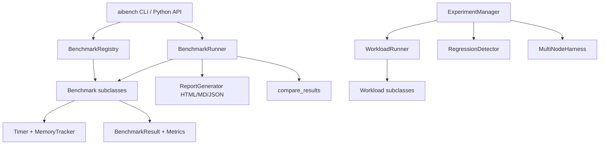

# AI Benchmark Suite

A benchmarking framework for AI/ML workloads, built from scratch in Python. It provides a
registry of synthetic NumPy-based workloads (LLM inference, training, attention, matmul,
embedding, and more), a runner with warmup and percentile statistics, multi-format
reporting, and an experiment layer for load generation, regression detection, and
multi-node orchestration.

## Features

- **Pluggable benchmark base class** — subclass `Benchmark` with `setup`/`run_iteration`/`teardown`; warmup and timed iterations are handled by the framework (`core/benchmark.py`).
- **Eight built-in workloads** — `LLMInferenceBenchmark`, `LLMGenerationBenchmark`, `TrainingThroughputBenchmark`, `MemoryBandwidthBenchmark`, `MatMulBenchmark`, `AttentionBenchmark`, `EmbeddingBenchmark`, `SoftmaxBenchmark`, each registered via the `@register_benchmark` decorator (`benchmarks/workloads.py`).
- **Decorator-based registry** — `BenchmarkRegistry` maps names to classes so workloads can be created and run by string name (`registry`, `register_benchmark`).
- **Percentile statistics** — `BenchmarkResult` exposes `mean_time_ms`, `std_time_ms`, `p50_time_ms`, `p99_time_ms`, and min/max derived from raw per-iteration timings.
- **Runner with hooks and parallelism** — `BenchmarkRunner` runs suites or registry names, supports `before_benchmark`/`after_benchmark`/`on_error` hooks, optional `ThreadPoolExecutor` parallelism, and baseline comparison (`runner/runner.py`).
- **CLI** — `aibench` parses flags such as `--benchmark`, `--batch-size`, `--seq-len`, `--iterations`, `--list`, and `--compare` (`CLIRunner`).
- **Reporting** — `ReportGenerator` emits HTML, Markdown, or JSON; `ComparisonReport` diffs two runs; `MetricsAnalyzer` flags bottlenecks and recommendations (`report/report.py`).
- **Experiment layer** — `ExperimentManager` runs load-generating `Workload`s with sequential/concurrent execution, captures system info, and persists JSON results (`experiment/experiment.py`).
- **Regression detection** — `RegressionDetector` classifies throughput/latency regressions as minor/moderate/severe across two experiments.
- **Multi-node harness** — `MultiNodeHarness` fans an experiment across `NodeConfig`s and aggregates per-workload summaries.

## Architecture



| Component | Module | Responsibility |
|-----------|--------|----------------|
| Benchmark base + registry | `core/benchmark.py` | Lifecycle, timing, metrics, registration, save/load/compare |
| Workloads | `benchmarks/workloads.py` | Eight NumPy benchmark implementations |
| Runner + CLI | `runner/runner.py` | Execute suites/registry names, hooks, parallelism, CLI |
| Reporting | `report/report.py` | HTML/Markdown/JSON reports, comparison, analysis |
| Experiment layer | `experiment/experiment.py` | Load generation, experiments, regression detection, multi-node |

## Quick Start

### Prerequisites

- Python 3.10+
- NumPy (the only runtime dependency). No external services are needed to run the tests.

### Installation

```bash
pip install -e ".[dev]"
```

### Running

```bash
# List available benchmarks
aibench --list

# Run a single benchmark
aibench --benchmark matmul --iterations 20

# Run all registered benchmarks and write JSON results
aibench
```

## Usage

```python
from aibench import (
    BenchmarkConfig, BenchmarkSuite, MatMulBenchmark,
    BenchmarkRunner, RunnerConfig, generate_report,
)

# Configure and build a suite
config = BenchmarkConfig(name="matmul", benchmark_iterations=10, precision="fp32")
suite = BenchmarkSuite(name="demo")
suite.add_benchmark(MatMulBenchmark(config))

# Run via the runner
runner = BenchmarkRunner(RunnerConfig(verbose=True, save_results=False))
results = runner.run_suite(suite)

# Inspect statistics
r = results[0]
print(r.benchmark_name, r.mean_time_ms, r.p99_time_ms)
for metric in r.metrics:
    print(metric.name, metric.value, metric.unit.value)

# Generate a Markdown report
generate_report(results, output_dir="./reports", format="markdown")
```

Running benchmarks from the registry by name:

```python
from aibench import BenchmarkConfig, BenchmarkRunner, RunnerConfig, registry

runner = BenchmarkRunner(RunnerConfig(save_results=False))
results = runner.run_from_registry(["matmul", "softmax"], BenchmarkConfig(name="cli"))
```

## What's Real vs Simulated

- **Real:** The benchmark lifecycle (warmup, timed iterations, teardown), the `Timer`
  using `time.perf_counter`, percentile/statistics computation, the registry and runner,
  HTML/Markdown/JSON report generation, comparison and regression-detection logic, and the
  NumPy computation inside `MatMulBenchmark`, `AttentionBenchmark`, `EmbeddingBenchmark`,
  `SoftmaxBenchmark`, `MemoryBandwidthBenchmark`, and the training/inference benchmarks.
- **Simulated / requires credentials:** Workloads model AI systems with NumPy rather than
  real frameworks — there is no PyTorch/TensorFlow/ONNX or GPU execution. `MemoryTracker.snapshot`
  returns a random value rather than real device memory. The `experiment` workloads
  (`LLMInferenceWorkload`, `RAGWorkload`, `ANNSearchWorkload`, `GPUKernelWorkload`) use
  `time.sleep` to stand in for inference/retrieval/search. `MultiNodeHarness` runs each
  "node" locally instead of over SSH. `nvidia-smi` is queried for system info only if present.

## Testing

```bash
pytest tests/ -v
```

The suite has 224 tests across benchmarks, the runner/CLI, reporting, and the experiment
layer (workloads, experiment manager, regression detection, multi-node aggregation). No
external services or GPUs are required.

## Project Structure

```
49-ai-benchmark-suite/
  src/aibench/
    core/benchmark.py       # Benchmark base, metrics, registry, save/load/compare
    benchmarks/workloads.py # Eight built-in NumPy workloads
    runner/runner.py        # Runner, CLI, scheduler
    report/report.py        # HTML/Markdown/JSON reports, comparison, analysis
    experiment/experiment.py# Workloads, experiments, regression, multi-node
  tests/                    # 224 tests across all modules
  docs/BLUEPRINT.md         # Full architecture and design
```

## License

MIT — see [LICENSE](../LICENSE)
