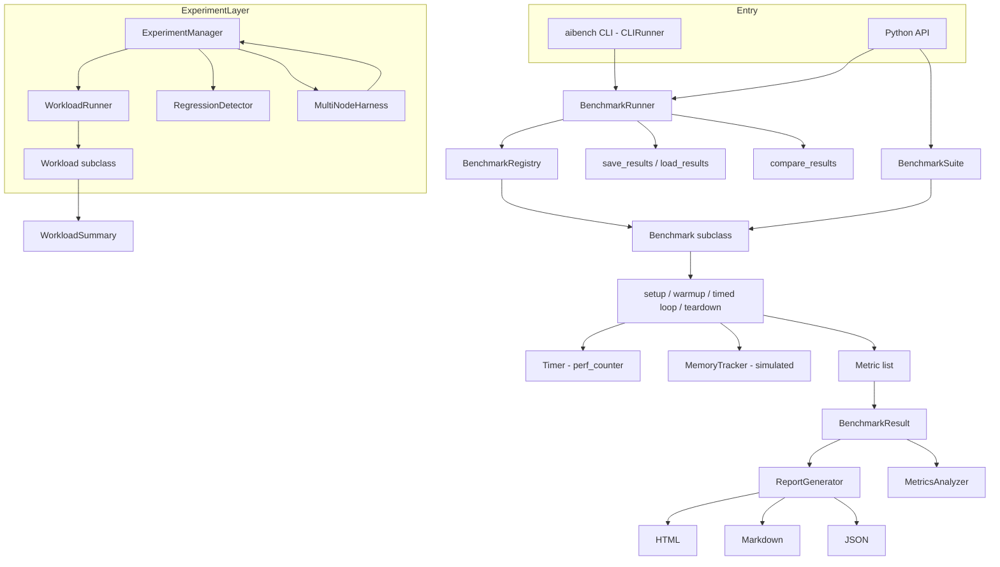

# AI Benchmark Suite

## Overview

The AI Benchmark Suite is a from-scratch Python framework for measuring the performance of
AI/ML-style workloads in a reproducible, comparable way. It is built around a small number
of orthogonal concerns that compose cleanly: a lifecycle-managed `Benchmark` base class, a
decorator-driven registry that maps names to benchmark classes, a runner that executes
suites and collects results, a reporting layer that renders results as HTML/Markdown/JSON,
and an experiment layer that adds request-level load generation, regression detection, and
multi-node orchestration on top of the same statistical vocabulary.

The design goal is to teach the mechanics that production benchmarking tools (MLPerf, perf
harnesses, service load generators) are built from, without pulling in a deep-learning
runtime. Everything runs in-process with only NumPy as a runtime dependency, so the whole
suite — including its 224 tests — executes on a laptop with no GPU and no network.

The concepts the suite teaches:

- **Disciplined measurement** — warmup iterations to absorb allocator/cache/JIT transients,
  high-resolution timing with `time.perf_counter`, and percentile statistics (p50/p99)
  rather than a single-shot timing that hides tail behavior.
- **Reproducibility** — fixed iteration counts, captured system info (`platform`, optional
  `nvidia-smi`), a recorded random seed, and serializable results so runs can be compared
  over time and across machines.
- **Regression detection** — comparing a baseline run to a current run and classifying the
  magnitude of any throughput or latency change into `minor`/`moderate`/`severe` bands.
- **Extensibility** — a class-decorator plugin model (`@register_benchmark`) so new
  workloads slot into the registry, CLI, and runner without touching any of them.
- **Two measurement altitudes** — micro-benchmarks (one matmul, one attention layer, one
  training step) and macro load tests (many independent requests under a concurrency
  profile), unified under one reporting and comparison layer.

### Scope and honesty

The computational workloads are implemented in NumPy. They exercise the framework's timing,
metrics, and reporting paths with *real arithmetic* — `np.matmul`, scaled dot-product
attention, numerically stable softmax, embedding gather, an MSE training step with a manual
backward pass — but they are *models* of AI systems, not bindings to PyTorch, TensorFlow,
ONNX, or GPU kernels. There is no device execution. This is stated plainly in the README's
"What's Real vs Simulated" section and is repeated below under Performance so the numbers
are never over-read.

Specifically simulated seams:

- `MemoryTracker.snapshot()` returns a random value in a fixed range rather than a real
  device allocation figure. The seam exists so a real implementation could substitute
  `torch.cuda.memory_allocated()` without changing any caller.
- The experiment-layer workloads (`LLMInferenceWorkload`, `RAGWorkload`,
  `ANNSearchWorkload`, `GPUKernelWorkload`) use `time.sleep` to stand in for
  inference/retrieval/search latency; their throughput and percentile outputs demonstrate
  the load-generation and statistics machinery, not real model performance.
- `MultiNodeHarness` runs each "node" locally as a stand-in for SSH-based remote execution.
- `nvidia-smi` is queried for system info only if the binary is present; its absence is
  handled gracefully.

## Architecture

The framework has two parallel execution paths that share the same reporting and comparison
vocabulary. The **benchmark path** (`core`, `benchmarks`, `runner`, `report`) is oriented at
micro-benchmarks: a `Benchmark` runs a fixed number of timed iterations and produces a
`BenchmarkResult` carrying raw per-iteration times plus a list of `Metric` objects. The
**experiment path** (`experiment`) is oriented at service-style load testing: a `Workload`
runs many independent *requests* under a load profile (request count, concurrency, warmup)
and produces a `WorkloadSummary` with latency percentiles and throughput, which then feeds
regression detection and multi-node aggregation.



| Layer | Module | Responsibility |
|-------|--------|----------------|
| Benchmark base + registry | `core/benchmark.py` | Lifecycle, timing, metrics, registration, save/load/compare |
| Built-in workloads | `benchmarks/workloads.py` | Eight NumPy benchmark implementations |
| Runner + CLI | `runner/runner.py` | Execute suites/registry names, hooks, parallelism, CLI, scheduler |
| Reporting | `report/report.py` | HTML/Markdown/JSON reports, comparison report, metric analysis |
| Experiment layer | `experiment/experiment.py` | Load generation, experiments, regression detection, multi-node |

Both paths are pure Python plus NumPy, run in-process, and require no external services. The
package `__init__.py` re-exports the public surface of all five layers so callers import
everything from `aibench`.

## Core Components

### Benchmark lifecycle (`core/benchmark.py`)

`Benchmark` is an abstract base class (`ABC`). A concrete benchmark implements four abstract
methods:

- `name()` — the benchmark's string identifier.
- `setup()` — allocate data and weights; called once per run.
- `run_iteration()` — perform one unit of work and return a dict of per-iteration values
  (e.g. `{"flops": ...}`, `{"tokens_generated": ...}`).
- `teardown()` — release resources; always called via `finally`.

The template method `benchmark()` drives the lifecycle deterministically:

1. `setup()` allocates state.
2. `warmup()` runs `config.warmup_iterations` un-timed iterations to stabilize caches and
   allocator state before measurement begins.
3. The timed loop runs `config.benchmark_iterations` iterations. Each is bracketed by
   `Timer.start()` / `Timer.stop()`, and the returned per-iteration dict is collected into
   `iteration_results`.
4. `_compute_metrics(iteration_results)` turns raw timings and iteration data into a list of
   `Metric` objects.
5. A `BenchmarkResult` is assembled with `raw_times_ms` (a copy of `Timer.elapsed_times`)
   and the metric list, `success=True`.

Any exception raised during `setup`/`warmup`/the timed loop/`_compute_metrics` is caught in
the `except` clause and recorded as a failed result: `metrics=[]`, `raw_times_ms=[]`,
`success=False`, and `error_message=str(e)`. `teardown()` runs in the `finally` block
regardless of success or failure, so cleanup is guaranteed. This is the mechanism the runner
and reporting layers rely on to distinguish pass from fail without try/except at every call
site.

```python
def benchmark(self) -> BenchmarkResult:
    try:
        self.setup()
        self.warmup()
        self.timer.reset()
        iteration_results = []
        for _ in range(self.config.benchmark_iterations):
            self.timer.start()
            result = self.run_iteration()
            self.timer.stop()
            iteration_results.append(result)
        metrics = self._compute_metrics(iteration_results)
        return BenchmarkResult(
            benchmark_name=self.name(), config=self.config,
            metrics=metrics, raw_times_ms=self.timer.elapsed_times.copy(),
            success=True,
        )
    except Exception as e:
        return BenchmarkResult(
            benchmark_name=self.name(), config=self.config,
            metrics=[], raw_times_ms=[], success=False, error_message=str(e),
        )
    finally:
        self.teardown()
```

`_compute_metrics()` on the base class always produces three metrics: `mean_latency` (ms,
from `Timer.mean`), `throughput` (items/sec, `1000.0 / mean` guarded on `mean > 0`,
`lower_is_better=False`), and `peak_memory` (MB, from a `MemoryTracker.snapshot()`).
Subclasses override this method, call `super()._compute_metrics(...)` first, and append
workload-specific metrics such as `tflops` or `tokens_per_second`.

### Timing and memory (`Timer`, `MemoryTracker`)

`Timer` wraps `time.perf_counter`. `start()` records a start timestamp; `stop()` computes
elapsed milliseconds `(end - start) * 1000`, appends it to `elapsed_times`, and returns it.
`reset()` clears the list. Two properties summarize the accumulated samples: `last` (the most
recent time, or `0.0` if empty) and `mean` (`statistics.mean`, or `0.0` if empty). The
empty-list guards make the timer safe to query even when no iterations ran.

`MemoryTracker` records a peak/current value via `snapshot()`. As noted under scope, the
snapshot is deliberately simulated (`random.uniform(100, 1000)`) because the suite does not
link a GPU runtime; `reset()` zeroes the tracker. The tracker keeps `peak_memory_mb` as a
running max so `peak_memory` reflects the highest observed value across snapshots.

### Metrics and results (`Metric`, `BenchmarkResult`)

`Metric` is a named value with a `MetricType` unit, a `lower_is_better` flag (defaulting to
`True`; throughput-style metrics flip it to `False`), and an optional `metadata` dict.
`to_dict()` renders it as a plain JSON-serializable dict with `unit.value` as the unit
string.

`BenchmarkResult` stores the config, the metric list, and the raw timings. It computes
statistics lazily as properties rather than storing them, so all statistics derive from a
single source of truth (`raw_times_ms`):

- `mean_time_ms`, `std_time_ms` (population standard deviation via `statistics.stdev`,
  defined as `0.0` when fewer than two samples exist),
- `min_time_ms`, `max_time_ms`,
- `p50_time_ms` (`statistics.median`),
- `p99_time_ms` — sorts the raw times, takes the index `int(len * 0.99)`, and clamps to the
  last element so a small sample never indexes out of range.

Every statistic guards the empty-list case and returns `0.0`. `to_dict()` serializes the
config summary, the metric list, and a `statistics` block into a shape suitable for the
report and comparison layers.

### Registry (`BenchmarkRegistry`, `register_benchmark`, `registry`)

The registry maps string names to `Benchmark` *subclasses*. `register_benchmark("name")` is
a class decorator that calls `registry.register(name, cls)` at import time. Every workload in
`benchmarks/workloads.py` is decorated this way, so importing the `aibench` package
populates the module-global `registry`. The registry exposes:

- `register(name, cls)` — insert or overwrite a mapping.
- `get(name)` — return the class or `None`.
- `list_benchmarks()` — return all registered names.
- `create(name, config)` — instantiate the class with a `BenchmarkConfig`, or `None` if the
  name is unknown.

This name-indirection is what lets the CLI (`--benchmark matmul`) and `run_from_registry`
operate purely on strings and what makes "run all" trivially `registry.list_benchmarks()`.

### Persistence and comparison (`save_results`, `load_results`, `compare_results`)

`save_results(results, filepath)` writes `[r.to_dict() for r in results]` to a JSON file.
`load_results(filepath)` reads it back as raw dicts (not reconstructed objects — the runner
reconstructs a minimal `BenchmarkResult` when it needs one). `compare_results(baseline,
current)` matches results by `benchmark_name`, computes `speedup = baseline_mean /
current_mean` (guarded when the baseline mean is zero, in which case speedup is `1.0`), and
returns a per-name dict with `baseline_ms`, `current_ms`, `speedup`, and an `improved`
boolean (`speedup > 1.0`). This is the primitive the runner's `compare_with_baseline` and
the reporting layer's `ComparisonReport` build on.

### Built-in workloads (`benchmarks/workloads.py`)

Eight benchmarks, each registered by name via `@register_benchmark`. All subclass
`Benchmark` and override `setup`/`run_iteration`/`teardown`; several also override
`_compute_metrics` to append domain metrics.

- **`llm_inference`** (`LLMInferenceBenchmark`) — builds `num_layers * 4` simulated
  transformer weight matrices (`hidden_size × hidden_size`, fp16) and runs a chain of
  matmuls over a random hidden state each iteration. Adds a `tokens_per_second` metric from
  total tokens over total time.
- **`llm_generation`** (`LLMGenerationBenchmark`) — autoregressive greedy decoding: for
  `max_new_tokens` steps it embeds the last token, projects to vocab via an LM head, and
  `argmax`es the next token, concatenating it to the sequence. Adds `generation_speed` and a
  `time_to_first_token` estimate derived from the first iteration's time divided by
  `max_new_tokens`.
- **`training_throughput`** (`TrainingThroughputBenchmark`) — a forward pass through stacked
  weight matrices, an MSE loss against a zero target, a simplified manual backward pass
  (accumulating parameter gradients and back-propagating input gradients), and SGD-style
  in-place updates. Adds `samples_per_second` and `final_loss`.
- **`memory_bandwidth`** (`MemoryBandwidthBenchmark`) — allocates source/destination float32
  buffers sized from `size_mb` and times `np.copyto`. Adds a `bandwidth_gbps` metric
  (bytes/time/1e9) with `{"unit": "GB/s"}` metadata.
- **`matmul`** (`MatMulBenchmark`) — times `np.matmul` on `M×K` and `K×N` matrices (fp16 or
  fp32 per `config.precision`). Adds a `tflops` metric from `2*M*N*K` FLOPs over measured
  time.
- **`attention`** (`AttentionBenchmark`) — scaled dot-product attention over
  `batch × heads × seq × head_dim` tensors: `QK^T`, scale by `1/sqrt(head_dim)`, a
  numerically stable softmax (subtract row max), then `AV`. Reports FLOPs in the iteration
  dict (`4 * B * H * S * S * D`).
- **`embedding`** (`EmbeddingBenchmark`) — fancy-indexes an embedding table by random token
  ids of shape `batch × sequence_length`.
- **`softmax`** (`SoftmaxBenchmark`) — numerically stable softmax over a
  `batch × seq × vocab` tensor.

The four workloads without a `_compute_metrics` override (`matmul` reports its own,
`attention`, `embedding`, `softmax`) still receive the base latency/throughput/memory
metrics; `attention`/`embedding`/`softmax` carry their FLOP/token counts only in the
per-iteration dict, which the base timing metrics summarize.

A recurring pattern across the metric-computing workloads is worth calling out because it is
the crux of correct throughput reporting: each derived metric divides a *total* (total
tokens, total FLOPs, total bytes) by the *sum of all iteration times*, not by the mean of
per-iteration rates. Averaging per-iteration rates would over-weight fast iterations and bias
the reported throughput upward; dividing totals by total time yields the true aggregate rate.
Every such division is guarded on `total_time_s > 0`, so a pathologically fast run (all
iterations rounding to zero elapsed time) reports `0` rather than raising. The precision knob
(`config.precision`) threads through `matmul` and `attention`, selecting `np.float16` vs
`np.float32`, which measurably changes both memory footprint and BLAS throughput on the host.

### Runner and CLI (`runner/runner.py`)

`BenchmarkRunner` is configured by `RunnerConfig` (`output_dir`, `parallel`, `max_workers`,
`verbose`, `save_results`, optional `compare_baseline` path, optional `filter_benchmarks`
list). It creates the output directory on construction and accumulates results across calls.
Its surface:

- `add_hook(event, callback)` and `_call_hooks(event, **kwargs)` — a lightweight event
  system with three events: `before_benchmark`, `after_benchmark`, `on_error`. Hook
  exceptions are caught and (in verbose mode) printed, so a misbehaving hook never breaks a
  run.
- `run_benchmark(benchmark)` — fires `before_benchmark`, times the wall-clock of the whole
  run, prints a PASS/FAIL line in verbose mode, fires `after_benchmark`, and (if the result
  failed) fires `on_error`.
- `run_suite(suite)` — runs every benchmark in a `BenchmarkSuite`, either sequentially or,
  when `parallel=True`, via a `ThreadPoolExecutor` with `as_completed`. Results are appended
  to `self.results`.
- `run_from_registry(names, config)` — instantiates each name via `registry.create`,
  honoring `filter_benchmarks`, and skips unknown names (printing a note in verbose mode).
- `save(filename=None)` — writes accumulated results to the output dir, defaulting the
  filename to `results_<epoch>.json`.
- `compare_with_baseline(path)` — loads a baseline JSON, reconstructs a minimal
  `BenchmarkResult` per entry (carrying only the mean time in `raw_times_ms`), calls
  `compare_results`, and prints per-benchmark speedups with an up/down indicator.
- `print_summary()` — prints pass/fail counts and, per benchmark, mean/std/p99 plus any
  non-baseline metrics.

`CLIRunner.run(args)` is a hand-rolled argument parser (no `argparse`) supporting
`--benchmark`, `--batch-size`, `--seq-len`, `--iterations`, `--output`, `--compare`,
`--list`, and `--quiet`. With no `--benchmark`, it defaults to every registered benchmark.
It builds a runner, runs the selected names, optionally saves and compares, prints a summary,
and returns a process exit code — `0` if all benchmarks passed, `1` otherwise.
`BenchmarkScheduler` queues `(name, config)` pairs via `schedule` and runs them later against
a supplied runner via `run_scheduled`, clearing the pending queue. `run_benchmarks(...)` is a
module-level convenience wrapper that constructs a runner, runs registry names, saves, and
prints a summary.

### Reporting (`report/report.py`)

`ReportConfig` selects the format (`html`/`markdown`/`json`) and toggles charts, raw data,
and the report title; the output directory is created on `ReportGenerator` construction.
`ReportGenerator.generate(results, filename=None)` dispatches by format:

- `_generate_html` — a self-contained HTML page with inline CSS, a summary table
  (benchmark, status, mean/std/p99 ms), per-benchmark metric tables, and, when
  `include_charts` is set, an ASCII bar chart embedded in a `<pre>` block scaled to the
  slowest benchmark.
- `_generate_markdown` — a Markdown summary table plus per-benchmark metric tables; failed
  benchmarks render their `error_message` instead of a metric table.
- `_generate_json` — the title, a generated timestamp, and the `to_dict()` of each result.

`ComparisonReport.compare(baseline, current)` matches by name, computes speedups, and writes
a Markdown report. Each benchmark is classified `Improved` (`speedup > 1.05`), `Regressed`
(`speedup < 0.95`), or `Same` otherwise, and the report also groups sorted improvement and
regression lists. The 1.05/0.95 dead-band around 1.0 deliberately treats sub-5% swings as
noise, which matches the reality that repeated runs of the same benchmark vary by a few
percent even on a quiet machine. `MetricsAnalyzer.analyze(results)` aggregates every metric
across results (mean/min/max/count), identifies bottlenecks (the slowest benchmark when it
exceeds 100 ms, and any benchmark whose std exceeds 20% of its mean, which flags an unstable
measurement rather than a slow one), and emits recommendations (fix failing benchmarks;
optimize benchmarks whose `peak_memory` exceeds 8000 MB). `generate_report(...)` is the
module-level convenience wrapper that constructs a `ReportConfig`, a `ReportGenerator`, and
calls `generate` in one line — the entry point the README's usage example uses.

The HTML path is intentionally dependency-free: rather than embedding a charting library it
renders an ASCII bar chart inside a `<pre>` block, scaling each bar to 40 characters against
the slowest successful benchmark. This keeps reports self-contained (a single file, openable
offline) and keeps the suite's runtime dependency list at exactly one entry (NumPy).

### Experiment layer (`experiment/experiment.py`)

This layer reframes benchmarking as request-level load testing and adds regression detection
and multi-node fan-out.

- **`WorkloadConfig`** describes a load profile: `num_requests`, `concurrency`,
  `warmup_requests`, optional `duration_seconds`, `dataset_path`/`dataset_size`, a free-form
  `params` dict, and a `WorkloadCategory` tag.
- **`Workload`** is the abstract base (`setup`/`run_single`/`teardown`, plus a `validate`
  hook defaulting to `True`). Four implementations exist:
  - `LLMInferenceWorkload` — loads or synthesizes prompts, sleeps ~1 ms per request to
    simulate generation, and reports `latency_ms`, `input_tokens`, `output_tokens`,
    `tokens_per_second`, and a simulated `time_to_first_token_ms`.
  - `RAGWorkload` — separate retrieval (~0.5 ms) and generation (~1 ms) phases, reporting
    total/retrieval/generation latencies and `num_docs_retrieved`.
  - `ANNSearchWorkload` — random query vectors (`dim`), sleeps ~0.1 ms per search, reports a
    fixed `recall` of 0.95 and `k`.
  - `GPUKernelWorkload` — pre-allocates matmul inputs and reports `latency_ms`, a `tflops`
    figure from `2*M*N*K` over the (sleep-dominated) time, and `kernel_type`.
- **`WorkloadRunner.run(workload)`** drives `setup`, a warmup loop of `warmup_requests`
  (exceptions swallowed), then sequential (`_run_sequential`) or concurrent
  (`_run_concurrent`, a `ThreadPoolExecutor` sized to `concurrency`) execution. It collects a
  `WorkloadResult` per request and computes a `WorkloadSummary` with p50/p90/p99/mean/std
  latency, `requests_per_second`, and averaged custom metrics. Latency is taken from each
  request's `latency_ms` metric, falling back to wall-clock if absent.
- **`ExperimentManager`** runs an `ExperimentConfig` (a list of `WorkloadConfig`s plus
  reproducibility fields). It maps categories to workload classes via `WORKLOAD_CLASSES`,
  collects system info (`_collect_system_info`, including optional `nvidia-smi`), persists
  results to JSON keyed by an 8-char MD5 of `name + start_time`, and provides `load_result`
  (reconstructing summaries) and `compare_results` (percentage changes in throughput and
  p50/p99 latency, division-guarded).
- **`RegressionDetector`** compares two `ExperimentResult`s. For each matched workload it
  flags a throughput drop beyond `throughput_threshold` (default 5%) and latency increases
  in p99 and p50 beyond `latency_threshold` (default 10%), and classifies each flagged change
  via `_classify_severity` into `minor`/`moderate`/`severe` against the 5%/15%/30% bands.
  `generate_report` renders a grouped, severity-ordered text report.
- **`MultiNodeHarness`** takes a list of `NodeConfig`s and runs the experiment per node via
  `run_distributed` (locally, as a stand-in for SSH), optionally in parallel. `_run_on_node`
  suffixes the experiment name with the host so results are separable. `aggregate_results`
  sums throughput and averages latencies across nodes per base workload name (stripping the
  `__host` suffix), and `compare_nodes` ranks nodes by total throughput.

The distinction between summing throughput and averaging latency in `aggregate_results` is a
deliberate modeling choice: total system throughput across N independent nodes is the *sum*
of their per-node throughputs (the cluster serves more requests per second), whereas latency
is a per-request property that does not add — averaging the per-node percentiles gives a
representative cluster latency. `_run_on_node` constructs a fresh `ExperimentManager` rooted
at `./results/<host>` so each node's raw JSON is written to its own directory, mirroring how a
real distributed run would keep per-host artifacts separate before aggregation.

A subtle interaction worth noting: `ExperimentManager.WORKLOAD_CLASSES` maps only four of the
seven `WorkloadCategory` values (the four with implementations). Requesting a category without
a registered class raises `ValueError("Unknown workload category: ...")` from
`_create_workload`, which surfaces as a clear failure rather than a silent no-op — the
`TRAINING`, `DATA_PIPELINE`, and `EMBEDDING` categories exist in the enum as forward-declared
slots but have no workload class yet.

## Data Structures

Core types (`core/benchmark.py`):

```python
class BenchmarkType(Enum):
    INFERENCE = "inference"; TRAINING = "training"; MEMORY = "memory"
    THROUGHPUT = "throughput"; LATENCY = "latency"; ACCURACY = "accuracy"

class MetricType(Enum):
    TIME_MS = "time_ms"; TIME_S = "time_s"; THROUGHPUT = "throughput"
    MEMORY_MB = "memory_mb"; MEMORY_GB = "memory_gb"; FLOPS = "flops"
    TFLOPS = "tflops"; ACCURACY = "accuracy"; LOSS = "loss"
    TOKENS_PER_SEC = "tokens/s"; SAMPLES_PER_SEC = "samples/s"

@dataclass
class Metric:
    name: str
    value: float
    unit: MetricType
    lower_is_better: bool = True
    metadata: dict[str, Any] = field(default_factory=dict)

@dataclass
class BenchmarkConfig:
    name: str
    warmup_iterations: int = 3
    benchmark_iterations: int = 10
    timeout_seconds: float = 300.0
    batch_size: int = 1
    sequence_length: int = 512
    num_threads: int = 4
    device: str = "cpu"
    precision: str = "fp32"
    extra_config: dict[str, Any] = field(default_factory=dict)

@dataclass
class BenchmarkResult:
    benchmark_name: str
    config: BenchmarkConfig
    metrics: list[Metric]
    raw_times_ms: list[float]
    success: bool = True
    error_message: str = ""
    timestamp: float = field(default_factory=time.time)
    # properties: mean/std/min/max/p50/p99 time_ms; to_dict()
```

`BenchmarkConfig.extra_config` is the escape hatch each workload reads its own knobs from —
e.g. `num_layers`, `max_new_tokens`, `size_mb`, matmul `m`/`n`/`k`, attention `num_heads`
and `head_dim`, embedding `vocab_size`/`embed_dim`. This keeps the config dataclass stable
while workloads stay self-describing.

Experiment-layer types (`experiment/experiment.py`):

```python
class WorkloadCategory(Enum):
    LLM_INFERENCE = "llm_inference"; RAG = "rag"; ANN_SEARCH = "ann_search"
    GPU_KERNEL = "gpu_kernel"; TRAINING = "training"
    DATA_PIPELINE = "data_pipeline"; EMBEDDING = "embedding"

@dataclass
class WorkloadConfig:
    name: str
    category: WorkloadCategory
    description: str = ""
    params: Dict[str, Any] = field(default_factory=dict)
    num_requests: int = 1000
    concurrency: int = 1
    duration_seconds: Optional[int] = None
    warmup_requests: int = 100
    dataset_path: Optional[str] = None
    dataset_size: int = 10000

@dataclass
class WorkloadResult:
    request_id: int
    start_time: float
    end_time: float
    metrics: Dict[str, Any]
    success: bool
    error: Optional[str] = None

@dataclass
class WorkloadSummary:
    workload_name: str
    total_requests: int
    successful_requests: int
    failed_requests: int
    duration_seconds: float
    latency_p50: float
    latency_p90: float
    latency_p99: float
    latency_mean: float
    latency_std: float
    requests_per_second: float
    custom_metrics: Dict[str, float] = field(default_factory=dict)
```

Experiment orchestration and regression types:

```python
@dataclass
class ExperimentConfig:
    name: str
    description: str = ""
    workloads: List[WorkloadConfig] = field(default_factory=list)
    system_info: Dict[str, str] = field(default_factory=dict)
    random_seed: int = 42
    git_commit: str = ""
    variants: List[Dict[str, Any]] = field(default_factory=list)

@dataclass
class ExperimentResult:
    config: ExperimentConfig
    summaries: List[WorkloadSummary]
    start_time: datetime
    end_time: datetime
    metadata: Dict[str, Any] = field(default_factory=dict)

@dataclass
class Regression:
    workload: str
    metric: str
    baseline_value: float
    current_value: float
    change_pct: float
    severity: str  # 'minor' | 'moderate' | 'severe'

@dataclass
class NodeConfig:
    host: str
    port: int = 22
    username: str = ""
    ssh_key_path: str = ""
    working_dir: str = "/tmp/benchmark"
```

Note the two independent percentile implementations: `BenchmarkResult` uses
`statistics.median` for p50 and an index-based p99, while `WorkloadRunner._compute_summary`
uses an index-based `percentile(data, p)` helper for p50/p90/p99. Both clamp the index to the
last element, so neither indexes out of bounds on small samples.

## API Design

Public exports (`aibench/__init__.py`) — everything below is importable directly from
`aibench`:

```python
# Core
BenchmarkType, MetricType, Metric, BenchmarkConfig, BenchmarkResult
Timer, MemoryTracker, Benchmark, BenchmarkSuite, BenchmarkRegistry
registry, register_benchmark, save_results, load_results, compare_results

# Workloads
LLMInferenceBenchmark, LLMGenerationBenchmark, TrainingThroughputBenchmark
MemoryBandwidthBenchmark, MatMulBenchmark, AttentionBenchmark
EmbeddingBenchmark, SoftmaxBenchmark

# Runner
RunnerConfig, BenchmarkRunner, CLIRunner, BenchmarkScheduler, run_benchmarks

# Report
ReportConfig, ReportGenerator, ComparisonReport, MetricsAnalyzer, generate_report

# Experiment management
WorkloadCategory, WorkloadConfig, Workload
LLMInferenceWorkload, RAGWorkload, ANNSearchWorkload, GPUKernelWorkload
ExperimentConfig, ExperimentResult, ExperimentManager
RegressionDetector, MultiNodeHarness
```

### Running a suite through the runner

```python
from aibench import (
    BenchmarkConfig, BenchmarkSuite, MatMulBenchmark,
    BenchmarkRunner, RunnerConfig, generate_report,
)

config = BenchmarkConfig(name="matmul", benchmark_iterations=10, precision="fp32")
suite = BenchmarkSuite(name="demo")
suite.add_benchmark(MatMulBenchmark(config))

runner = BenchmarkRunner(RunnerConfig(verbose=True, save_results=False))
results = runner.run_suite(suite)

r = results[0]
print(r.benchmark_name, r.mean_time_ms, r.p99_time_ms)
for metric in r.metrics:
    print(metric.name, metric.value, metric.unit.value)

generate_report(results, output_dir="./reports", format="markdown")
```

### Running by registry name

```python
from aibench import BenchmarkConfig, BenchmarkRunner, RunnerConfig, registry

runner = BenchmarkRunner(RunnerConfig(save_results=False))
results = runner.run_from_registry(["matmul", "softmax"], BenchmarkConfig(name="cli"))
```

### Defining a custom benchmark

The registry decorator plus the four abstract methods are the whole extension contract:

```python
from aibench import Benchmark, BenchmarkConfig, register_benchmark
import numpy as np

@register_benchmark("vector_add")
class VectorAddBenchmark(Benchmark):
    def name(self) -> str:
        return "vector_add"

    def setup(self) -> None:
        n = self.config.extra_config.get("n", 1_000_000)
        self.a = np.random.randn(n).astype(np.float32)
        self.b = np.random.randn(n).astype(np.float32)

    def run_iteration(self) -> dict:
        self.c = self.a + self.b
        return {"elements": self.a.size}

    def teardown(self) -> None:
        self.a = self.b = self.c = None

config = BenchmarkConfig(name="vector_add", benchmark_iterations=20)
result = VectorAddBenchmark(config).benchmark()
print(result.mean_time_ms, result.p99_time_ms)
```

Once registered, the benchmark is reachable by name from the CLI (`aibench --benchmark
vector_add`) and from `run_from_registry(["vector_add"], config)` with no further wiring.

### Running an experiment with regression detection

```python
from aibench import (
    ExperimentConfig, WorkloadConfig, WorkloadCategory,
    ExperimentManager, RegressionDetector,
)

cfg = ExperimentConfig(
    name="inference_load",
    workloads=[WorkloadConfig(
        name="llm_7b", category=WorkloadCategory.LLM_INFERENCE,
        num_requests=500, concurrency=4, warmup_requests=50,
    )],
)
manager = ExperimentManager(results_dir="./results")
current = manager.run_experiment(cfg)

baseline = manager.load_result("./results/baseline.json")
for reg in RegressionDetector().detect(baseline, current):
    print(reg.workload, reg.metric, reg.change_pct, reg.severity)
```

### Multi-node fan-out

```python
from aibench import MultiNodeHarness, ExperimentConfig, WorkloadConfig, WorkloadCategory
from aibench.experiment.experiment import NodeConfig

harness = MultiNodeHarness([NodeConfig(host="node-a"), NodeConfig(host="node-b")])
results = harness.run_distributed(ExperimentConfig(
    name="fanout",
    workloads=[WorkloadConfig(name="ann", category=WorkloadCategory.ANN_SEARCH,
                              num_requests=200)],
), parallel=True)
combined = harness.aggregate_results(results)
ranking = harness.compare_nodes()["rankings"]["by_throughput"]
```

### CLI surface (`aibench`)

```
aibench --list
aibench --benchmark matmul --iterations 20 --batch-size 8
aibench --benchmark matmul --benchmark softmax --seq-len 1024
aibench --compare results/baseline.json
aibench --quiet --output ./out
```

The exit code is `0` when every selected benchmark passes and `1` otherwise, which makes the
CLI usable as a CI gate.

## Performance

The framework's own measurement overhead is small and bounded: timing is a pair of
`perf_counter` calls per iteration, and metric computation is O(iterations) plus O(iterations
log iterations) for the p99 sort. Warmup iterations (`warmup_iterations`, default 3) absorb
allocator and cache transients so the timed window reflects steady-state behavior.
Percentiles are computed from the full raw-times list, so `p99` is only meaningful when
`benchmark_iterations` is large enough — tens to hundreds. With the default of 10 iterations,
`int(10 * 0.99) = 9` selects the max, which is the honest interpretation of "p99 over 10
samples."

Reported throughput numbers (TFLOPS, GB/s, tokens/sec, samples/sec) are derived from the
actual NumPy work performed and the measured wall-clock time, so they reflect the host CPU
and the NumPy/BLAS build in use. They are not GPU numbers and not fabricated targets — a
`matmul` run on a machine with a threaded BLAS will report a higher TFLOPS than one without,
because the underlying `np.matmul` is genuinely faster. The `peak_memory` metric is
simulated (see Overview) and must not be read as a real allocation figure.

The experiment layer's latencies are dominated by deliberate `time.sleep` calls inside the
workloads (used to simulate inference/retrieval/search), so its throughput and percentile
outputs demonstrate the load-generation and statistics machinery rather than real model
performance. Concurrency above 1 uses threads (`ThreadPoolExecutor`), so any CPU-bound NumPy
work would be bounded by the GIL and BLAS threading rather than scaling linearly; because the
simulated workloads spend their time in `time.sleep` (which releases the GIL), concurrency
does improve their apparent throughput, which is exactly the behavior a real I/O-bound
inference service would exhibit.

There are no hard-coded benchmark targets in the repo. The only fixed thresholds are
decision thresholds, not performance claims: the comparison report's 1.05/0.95 improve/regress
bands, the analyzer's 100 ms slow-benchmark and 20%-variance bottleneck rules and 8000 MB
memory recommendation, and the regression detector's 5%/10% flag thresholds and 5%/15%/30%
severity bands. All reported numbers are whatever the host produces at run time.

## Testing Strategy

Tests live in `tests/` and total 224 test functions across four files plus shared fixtures
in `conftest.py`. They require only NumPy and pytest — no GPU, no network, no external
services — so the whole suite runs anywhere. Run it with:

```bash
pytest tests/ -v
```

- **`test_benchmarks.py`** — exercises each built-in workload's lifecycle end to end and the
  domain-specific metrics they emit (`tokens_per_second`, `tflops`, `bandwidth_gbps`,
  `samples_per_second`, `final_loss`, TTFT), plus the base `Benchmark` machinery: that
  `warmup()` runs exactly `warmup_iterations` times, that the timed loop records exactly
  `benchmark_iterations` samples, that a raised exception yields `success=False` with a
  populated `error_message` and an empty metric list, and that `BenchmarkResult` statistics
  and `to_dict()` are correct.
- **`test_runner.py`** — covers `RunnerConfig` defaults, single/suite/registry execution, the
  three hook events (`before_benchmark`/`after_benchmark`/`on_error`) including hook-error
  isolation, parallel execution via the thread pool, `save`/`load` round-trips, baseline
  comparison, the hand-rolled CLI argument parser (each flag), the exit-code contract, and
  the `BenchmarkScheduler` queue.
- **`test_reports.py`** — verifies HTML/Markdown/JSON generation (including that failed
  benchmarks render their error instead of a metric table), the comparison report's
  Improved/Regressed/Same classification and grouped improvement/regression lists, and
  `MetricsAnalyzer`'s aggregation, bottleneck detection, and recommendation logic.
- **`test_experiment.py`** — covers workload setup/run/teardown for all four categories,
  sequential and concurrent `WorkloadRunner` execution, `WorkloadSummary` percentile math,
  experiment save/load round-trips and system-info collection, `ExperimentManager.compare_results`
  percentage math, `RegressionDetector` threshold flagging and severity classification, and
  `MultiNodeHarness` fan-out, aggregation (throughput sum, latency average, suffix
  stripping), and throughput ranking.

Edge cases explicitly under test include: empty result lists (every statistic returns `0.0`);
division-by-zero guards in throughput, speedup, and percentage-change math; single-iteration
runs where standard deviation is defined as `0`; failed iterations propagating into
`success=False` results without breaking the runner; dataset truncation/padding in the
synthetic prompt/query generators; and the percentile index clamp on small samples. The
tests treat the simulated seams as first-class behavior — for example, they assert the
regression detector's severity bands rather than any absolute latency, because absolute
latencies are host- and sleep-dependent.

## References

- MLPerf — industry-standard ML benchmark methodology, emphasizing reproducibility, fixed
  workloads, and reported-metric discipline.
- "Systems Performance" (Brendan Gregg) — methodology for warmup, percentiles, and variance
  in performance measurement; the source of the p50/p99-over-single-mean discipline used
  here.
- Python `statistics` and `time.perf_counter` documentation — the standard-library
  primitives the timing and statistics layers are built on.
- NumPy documentation — the array, `matmul`, `copyto`, and fancy-indexing operations that the
  workloads use as their real arithmetic.
- Python `concurrent.futures` documentation — the `ThreadPoolExecutor`/`as_completed` model
  behind the runner's parallel suite execution and the experiment layer's concurrent load
  generation.
