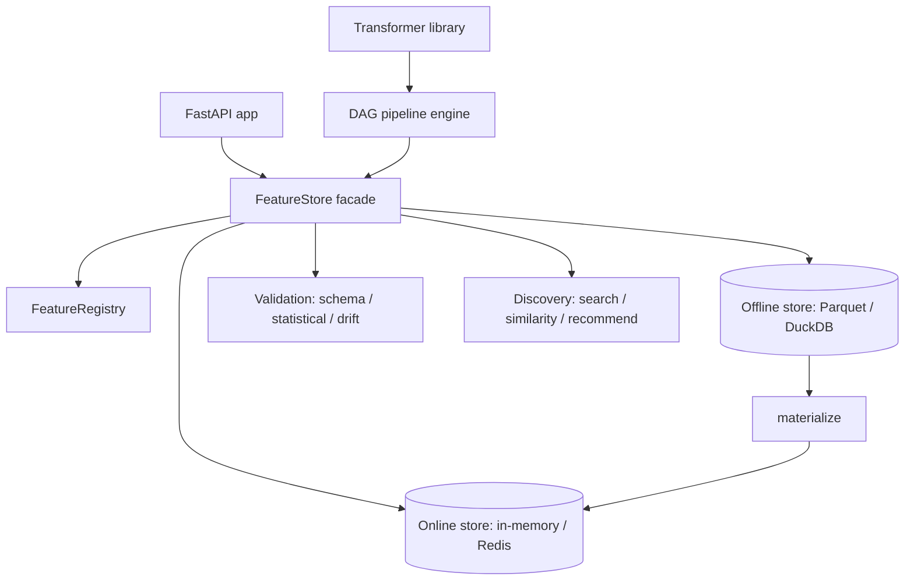

# Feature Engineering Platform

An ML feature engineering platform built from scratch in Python: a library of fit/transform
feature transformers, an online/offline feature store with a registry, a DAG-based pipeline
engine, schema/statistical/drift validation, feature discovery, and a FastAPI serving layer.

## Features

- **Transformer library** — numeric (`StandardScaler`, `MinMaxScaler`, `RobustScaler`, `LogTransformer`, `PowerTransformer`, `Binner`, `QuantileTransformer`, `Normalizer`), categorical (one-hot, label, ordinal, target, frequency, binary, hashing), temporal (`DatePartsExtractor`, `CyclicalEncoder`, `RollingWindowFeatures`, `LagFeatures`, and more), and text (`TfidfVectorizer`, `CountVectorizer`, `HashingVectorizer`, `NGramExtractor`) — all sharing a `BaseTransformer` fit/transform/serialize contract.
- **Composite transformers** — `Pipeline`, `FeatureUnion`, `ColumnTransformer`, and `SequentialTransformer` compose transformers (`transformers/composite.py`).
- **Feature store facade** — `FeatureStore` unifies a registry, offline store, and online store behind `apply`, `write_to_offline_store`, `write_to_online_store`, `materialize`, `get_online_features`, `get_historical_features`, and `get_feature_vector` (`store/feature_store.py`).
- **Offline + online stores** — `ParquetOfflineStore`/`DuckDBOfflineStore` for batch features and point-in-time joins; `InMemoryOnlineStore`/`RedisOnlineStore` for low-latency serving with TTLs.
- **Feature registry** — `FeatureRegistry` stores entities, feature views, versions, and lineage and backs feature search.
- **DAG pipelines** — `DAG`/`DAGExecutor` provide cycle detection, topological sort, level-based parallel execution, retries, and skip-on-failure (`pipeline/dag.py`).
- **Validation** — `SchemaValidator`, `StatisticalValidator`, and a `DriftDetector` supporting PSI, KS, Chi-squared, Jensen-Shannon, and Wasserstein methods (`validation/`).
- **Advanced drift** — streaming concept-drift detectors `DDMDetector`, `ADWINDetector`, `CUSUMDetector`, plus `WindowedDriftMonitor` and `MultivariateDriftDetector` (`validation/advanced_drift.py`).
- **Discovery** — `FeatureSearchEngine`, `FeatureSimilarityEngine`, and `FeatureRecommender` for finding and recommending features.
- **REST API** — FastAPI app exposing feature-view CRUD, online/historical serving, materialization, statistics, search, and validation (`api/main.py`).

## Architecture



| Component | Module | Responsibility |
|-----------|--------|----------------|
| Core models | `core/models.py` | `Entity`, `Feature`, `FeatureView`, `FeatureVector`, `DataType` |
| Transformers | `transformers/` | fit/transform numeric, categorical, temporal, text, composite |
| Feature store | `store/` | registry, offline/online stores, store facade |
| Pipeline | `pipeline/` | DAG construction and execution |
| Validation | `validation/` | schema, statistical, drift, advanced drift |
| Discovery | `discovery/` | search, similarity, recommendations |
| API | `api/` | FastAPI endpoints and request/response models |

## Quick Start

### Prerequisites

- Python 3.9+
- Core dependencies (NumPy, SciPy, scikit-learn, pandas, pydantic, FastAPI) install with the
  package. DuckDB and Redis are optional; the defaults are Parquet offline and in-memory online.

### Installation

```bash
pip install -e ".[dev]"
```

### Running

```bash
# Run the REST API
uvicorn feature_platform.api.main:app --reload
# Interactive docs at http://localhost:8000/docs
```

### Security & limits

Three opt-in hardening controls are configured via environment variables. All
default to a safe posture and leave `/health`, `/`, and the docs
(`/docs`, `/redoc`, `/openapi.json`) open.

| Env var | Default | Effect |
| --- | --- | --- |
| `API_KEYS` | *(unset)* | Comma-separated valid keys. Unset disables auth. |
| `RATE_LIMIT_PER_MINUTE` | `120` | Requests/minute per key or client IP; `0` disables. |
| `REQUEST_TIMEOUT_SECONDS` | `30` | Per-request timeout; `504` on exceed; `0` disables. |

When `API_KEYS` is set, pass a key via `Authorization: Bearer <key>` or `X-API-Key: <key>`:

```bash
API_KEYS=my-secret uvicorn feature_platform.api.main:app
curl -H "Authorization: Bearer my-secret" http://localhost:8000/feature-views
```

## Usage

Transform features with the library:

```python
import numpy as np
from feature_platform import StandardScaler, OneHotEncoder, Pipeline

X = np.array([[1.0], [2.0], [3.0], [4.0]])
scaler = StandardScaler()
scaled = scaler.fit_transform(X)          # zero mean, unit variance
original = scaler.inverse_transform(scaled)
```

Register and serve features through the store:

```python
from datetime import timedelta
from feature_platform import Entity, Feature, FeatureView, FeatureStore

store = FeatureStore()  # Parquet offline + in-memory online by default

user = Entity(name="user", join_keys=["user_id"])
view = FeatureView(
    name="user_features",
    entities=[user],
    schema=[Feature("age", dtype="float64"), Feature("total_purchases", dtype="float64")],
    ttl=timedelta(days=1),
)
store.apply([user, view])

store.write_to_online_store(
    feature_view="user_features",
    entity_id={"user_id": 1},
    features={"age": 34.0, "total_purchases": 12.0},
)

result = store.get_online_features(
    feature_refs=["user_features:age", "user_features:total_purchases"],
    entity_ids={"user_id": [1]},
)
```

Detect drift between a reference and current sample:

```python
import numpy as np
from feature_platform import DriftDetector, DriftMethod

ref = np.random.normal(0, 1, 1000)
cur = np.random.normal(0.5, 1, 1000)
detector = DriftDetector()
result = detector.detect(ref, cur, method=DriftMethod.KS, column="x")
print(result.is_drifted, result.score)
```

## What's Real vs Simulated

- **Real:** All transformers (numeric, categorical, temporal, text, composite) with
  fit/transform/inverse-transform and state serialization; the Parquet offline store and
  in-memory online store; the feature registry and `FeatureStore` facade including
  materialization and point-in-time retrieval; the DAG engine (cycle detection, topological
  sort, parallel levels, retries); schema/statistical validation; PSI/KS/Chi-squared/JS/
  Wasserstein drift and the streaming DDM/ADWIN/CUSUM detectors; discovery search, similarity,
  and recommendations; and the full FastAPI surface with opt-in API-key auth,
  in-process rate limiting, and request timeouts (see Security & limits).
- **Simulated / requires credentials:** The Redis online store and DuckDB offline store require
  those services/packages (the in-memory and Parquet implementations are the defaults). There
  are no scikit-learn `Pipeline` adapters or PyTorch/TensorFlow dataset connectors — the
  transformers are self-contained NumPy implementations rather than wrappers. `FeatureSource`
  describes table/file/stream/api sources but does not connect to external warehouses.

## Testing

```bash
pytest tests/ -v
```

The suite has 283 tests across 9 files covering numeric, categorical, temporal, and text
transformers, advanced drift detectors, feature discovery, the REST API, API hardening, and
store security. The API tests need `httpx` (Starlette's test client); transformer and drift
tests need only the core dependencies.

## Project Structure

```
50-feature-engineering-platform/
  src/feature_platform/
    api/          # FastAPI app and request/response models
    core/         # Entity, Feature, FeatureView, config
    discovery/    # search, similarity, recommendations
    monitoring/   # metrics and alerts
    pipeline/     # DAG construction and execution
    store/        # registry, offline/online stores, facade
    transformers/ # numeric, categorical, temporal, text, composite
    validation/   # schema, statistical, drift, advanced drift
  tests/          # 283 tests across 9 files
  docs/BLUEPRINT.md   # Full architecture and design
```

## License

MIT — see [LICENSE](../LICENSE)
