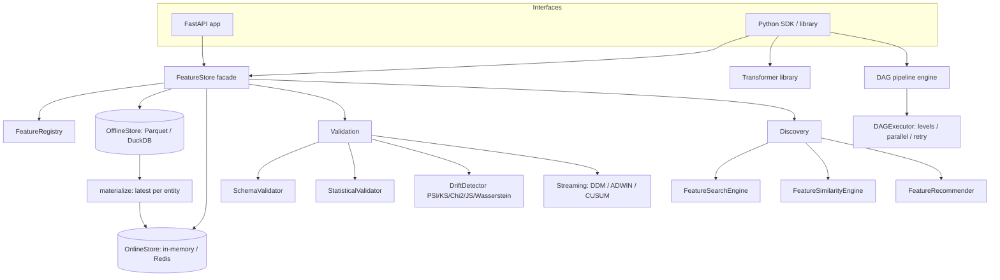

# Feature Engineering Platform

## Overview

The Feature Engineering Platform is a from-scratch Python implementation of the machinery an
ML team needs to define, transform, store, validate, discover, and serve features. Rather
than wrapping an existing framework, every subsystem is built directly on NumPy, SciPy, and
pandas so that the mechanics of a feature store are visible and inspectable. The package is
importable as `feature_platform`, and its public surface is a single flat namespace that
re-exports the core models, the transformer library, the store, the pipeline engine, the
validation subsystem, the discovery subsystem, and the monitoring helpers (see
`src/feature_platform/__init__.py`).

The system is organized as a set of cooperating but deliberately decoupled subsystems that
share one small vocabulary of core models — `Entity`, `Feature`, `FeatureSchema`,
`FeatureView`, `FeatureValue`, and `FeatureVector` (all in `core/models.py`):

- A **transformer library** (`transformers/`) with a uniform fit/transform/serialize
  contract, spanning numeric, categorical, temporal, text, and composite families.
- A **feature store** (`store/`) that unifies a registry, an offline store, and an online
  store behind one `FeatureStore` facade, including materialization and point-in-time
  retrieval.
- A **DAG pipeline engine** (`pipeline/`) for orchestrating feature computation with
  dependency tracking, cycle detection, and level-based parallel execution.
- A **validation subsystem** (`validation/`) covering schema checks, statistical checks, and
  both batch and streaming **drift detection**.
- A **discovery subsystem** (`discovery/`) for searching, comparing, and recommending
  features.
- A **monitoring** module (`monitoring/`) for accumulating feature metrics and raising
  alerts.
- A **FastAPI** serving layer (`api/`) exposing the store over HTTP.

The concepts the platform teaches are exactly the ones that define production feature stores
(Feast, Tecton) and feature-engineering libraries (scikit-learn transformers): the train/serve
split between offline and online stores, point-in-time correctness, the fit/transform
lifecycle and state serialization, DAG scheduling with parallel levels, and drift monitoring —
including the streaming concept-drift detectors (DDM, ADWIN, CUSUM) from the concept-drift
literature.

**Scope and honesty.** The default stores are a Parquet offline store and an in-memory online
store; the DuckDB offline backend and the Redis online backend exist but require those
packages/services. The transformers are self-contained NumPy implementations, not wrappers
around scikit-learn, PyTorch, or TensorFlow — so there are no framework-native `Pipeline`
adapters or dataset connectors. `FeatureSource` describes external table/file/stream/api
sources but does not itself connect to a warehouse. Everything else — the transformers, the
Parquet and in-memory stores, the registry and facade, the DAG engine, schema/statistical
validation, the five batch drift methods, the three streaming detectors, discovery, and the
full FastAPI surface — is fully implemented.

## Architecture



The layering is intentional and enforced by import direction rather than by convention alone.
Transformers depend only on `transformers/base.py` and NumPy — they know nothing about the
store. The store layer depends on the core models and on its own registry/offline/online
pieces, but not on HTTP. The DAG engine runs arbitrary callables and has no knowledge of
features at all. The `FeatureStore` facade (`store/feature_store.py`) is the single
integration point that ties the registry and the two stores together, and the FastAPI app
(`api/main.py`) is a thin adapter over that facade that owns nothing beyond request/response
translation and a global store instance created in its lifespan handler.

This decoupling is what makes the platform a good teaching artifact: each subsystem can be
read, tested, and reasoned about in isolation, and the seams between them are explicit method
boundaries rather than shared mutable state.

### Layers in brief

- **Interfaces** — the FastAPI app and the Python SDK (the package's flat export namespace).
  Both funnel writes and reads through the facade; the SDK additionally exposes the
  transformer library and DAG engine directly for offline feature computation.
- **Facade** — `FeatureStore` orchestrates registry lookups, routing of writes, the
  offline-to-online materialization pass, point-in-time reads, and the online-first /
  offline-fallback single-entity read.
- **Storage** — a registry (metadata), an offline store (batch history + point-in-time
  joins), and an online store (latest value per entity, TTL-bounded).
- **Computation** — the transformer library (stateless-until-fit objects with serializable
  state) and the DAG engine (dependency-ordered execution of callables).
- **Quality** — validation and drift detection, both batch and streaming.
- **Metadata services** — discovery (search/similarity/recommend) and monitoring
  (metrics/alerts) built on top of registry and feature data.

### Design decisions and invariants

A handful of invariants hold across the codebase and explain many of the smaller design
choices:

- **Fit-before-transform is enforced, not assumed.** `_validate_input(X, require_fitted=True)`
  raises if `is_fitted` is `False`, so a transformer can never emit an output from
  uninitialized parameters. This makes serialization safe: a transformer restored via
  `set_state` has `is_fitted = True` and its learned statistics populated before any
  transform runs.
- **The DAG cannot become cyclic through its API.** `add_edge` mutates the adjacency maps,
  checks for a cycle with DFS, and rolls the mutation back before raising if one is found. So
  any `DAG` a caller holds is acyclic by construction, and both `topological_sort` and
  `get_execution_levels` can treat a cycle as an internal error rather than an expected case.
- **The online store is one row per entity.** `materialize` collapses offline history to the
  latest timestamp per entity before writing online, and writes are TTL-bounded, so the online
  footprint is O(distinct entities) regardless of event volume — the property that makes
  online serving cheap.
- **Reads degrade gracefully.** `get_feature_vector` tries online, falls back to offline, and
  returns an empty `FeatureVector` rather than raising when an entity is simply absent; a
  missing feature view, by contrast, is a caller error and does raise.
- **No hidden framework dependencies.** Every numeric computation is a NumPy/SciPy call the
  reader can follow; the ML-store concepts are implemented rather than delegated.

## Core Components

### Core models (`core/models.py`)

- **`DataType`** is an enum of supported types: fixed-width int/float (`INT32`, `INT64`,
  `FLOAT32`, `FLOAT64`), `STRING`, `BOOL`, `DATETIME`, `BYTES`, and array variants
  (`ARRAY_FLOAT64`, `ARRAY_STRING`, etc.). It bridges to NumPy with
  `from_numpy_dtype` (walking a `dtype_map` and using `np.issubdtype` to match) and
  `to_numpy_dtype` (mapping back, defaulting to `np.object_`).
- **`Entity`** is the object features attach to (a user, product, transaction, session). It
  carries `name` and `join_keys`, and its `__post_init__` rejects an empty key list. It
  defines `__hash__` over `(name, tuple(join_keys))` and a matching `__eq__`, so entities are
  usable as dict keys and set members.
- **`Feature`** is a single feature's metadata: `name`, `dtype` (coerced from a string to a
  `DataType` in `__post_init__`), `description`, `nullable`, `default_value`, `tags`, `owner`,
  and a `created_at` timestamp. `validate_value` checks a candidate against the dtype by
  attempting a one-element NumPy array construction and returning whether it succeeds
  (nullable features accept `None`).
- **`FeatureSchema`** wraps a list of `Feature`s plus optional entity/timestamp column names.
  It builds a `_feature_map` for O(1) lookup and exposes `get_feature`, `get_feature_names`,
  and `validate(data)` — the last returning a list of human-readable errors for missing
  required features and dtype mismatches.
- **`FeatureSource`** describes where feature data comes from: a `source_type` in
  `{table, file, stream, api}`, a `path`, an optional `query`, timestamp fields, a field
  mapping, and free-form `options`. Its `validate` method flags a missing path or an invalid
  source type. It is descriptive metadata only — it does not open connections.
- **`FeatureView`** ties entities, a schema, an optional `FeatureSource`, a `ttl`
  (default one day), and `online`/`offline` flags together, plus a list of `transformations`
  (callables). It hashes on `name` alone. The glue methods `get_entity_keys` (flattens all
  entity join keys), `get_feature_names`, and `get_feature_refs` (returns `view:feature`
  strings) are used throughout the store and API.
- **`FeatureValue`** / **`FeatureVector`** are the serving-side carriers. A `FeatureValue`
  bundles a name, value, and timestamps; a `FeatureVector` bundles an `entity_id` dict with a
  list of `FeatureValue`s and a `to_dict()` that flattens the vector into
  `{**entity_id, feature_name: value, ...}`, with `get_value(name)` for single-feature access.
- Supporting config dataclasses (`MaterializationConfig`, `FeatureServiceConfig`,
  `TrainingDataConfig`) describe batch materialization windows, named feature services, and
  training-data requests.

### Transformer library (`transformers/`)

Every transformer subclasses `BaseTransformer` (`transformers/base.py`), which is an ABC
combined with a `TransformerMixin` of NumPy utilities. The contract:

- `fit(X, y=None, columns=None) -> self` learns parameters, records `_input_columns` /
  `_output_columns` and a `_fitted_at` timestamp, and sets `is_fitted = True`.
- `transform(X) -> np.ndarray` applies the learned transform, calling
  `_validate_input(X, require_fitted=True)` so an unfitted transformer raises before it can
  produce garbage.
- `fit_transform(X, y, columns)` simply chains `fit(...).transform(X)`.
- `inverse_transform(X)` is optional: the base raises `NotImplementedError`, and the numeric
  scalers override it (`StandardScaler` returns `X * std + mean`, `MinMaxScaler` inverts its
  linear scale).
- `get_state()` / `set_state(state)` serialize a `TransformerState` (name, type, parameters,
  fit time, columns, learned statistics, version) via the per-class hooks `_get_parameters`,
  `_get_statistics`, `_set_parameters`, `_set_statistics`. `TransformerState` itself supports
  `to_dict`/`from_dict` and `to_json`/`from_json`.
- `save(path)` / `load(path)` pickle and unpickle the whole transformer object.

The `TransformerMixin` provides `_validate_input` (accepts a pandas object via its `.values`
attribute or any array-like, coerces with `np.asarray`, and enforces fitted-ness when asked),
`_ensure_2d` / `_ensure_1d` for shape normalization, and `_get_output_columns` for naming.
Two utility transformers, `IdentityTransformer` and `FunctionTransformer`, live in the base
module as minimal reference implementations of the contract.

Concrete families:

- **Numeric** (`numeric.py`): `StandardScaler` — `(x - mean) / std`, NaN-aware via
  `np.nanmean`/`np.nanstd`, with a zero-std guard (`np.where(std == 0, 1.0, std)`) and a true
  inverse. `MinMaxScaler` scales to a `feature_range` with an analogous zero-range guard.
  `RobustScaler`, `LogTransformer`, `PowerTransformer`, `Binner`, `QuantileTransformer`, and
  `Normalizer` round out the family. Each numeric transformer serializes its learned
  statistics (means, stds, mins/maxes, scales) through `_get_statistics`/`_set_statistics`.
- **Categorical** (`categorical.py`): `OneHotEncoder`, `LabelEncoder`, `OrdinalEncoder`,
  `TargetEncoder` (supervised — consumes `y` to compute per-category target means),
  `FrequencyEncoder`, `BinaryEncoder`, and `HashingEncoder` (feature hashing into a fixed
  width). Unseen categories at transform time are handled per encoder.
- **Temporal** (`temporal.py`): `DatePartsExtractor`, `TimeSinceEvent`, `CyclicalEncoder`
  (sin/cos encoding of periodic fields such as hour-of-day or month so that the wrap-around
  is continuous), `RollingWindowFeatures`, `LagFeatures`, `DateDiffFeatures`,
  `HolidayFeatures`, and `TimeZoneConverter`.
- **Text** (`text.py`): `TfidfVectorizer`, `CountVectorizer`, `HashingVectorizer`,
  `NGramExtractor`, `TextCleaner`, and `TextStatistics`.
- **Composite** (`composite.py`): `Pipeline` (fits and transforms through a list of
  transformers in sequence, threading each stage's output into the next), `FeatureUnion`
  (fits every child on the same input and horizontally concatenates their outputs),
  `ColumnTransformer` (routes column subsets to different transformers and reassembles the
  columns), and `SequentialTransformer`. Because composites are themselves `BaseTransformer`s,
  they satisfy the same contract and nest arbitrarily — a `Pipeline` can contain a
  `FeatureUnion` that contains a `ColumnTransformer`, and the whole tree fits and transforms
  with one call.

Two properties of the contract are worth calling out because tests depend on them. First,
**state is fully serializable**: a fitted numeric scaler serializes its parameters (e.g.
`with_mean`, `with_std`) and its learned statistics (means, stds, `n_features`) into a
`TransformerState`; restoring that state into a fresh instance via `set_state` reproduces the
exact same `transform` output without re-fitting. Second, **inverse is opt-in and exact where
it exists**: `StandardScaler.inverse_transform` returns `X * std + mean` and
`MinMaxScaler.inverse_transform` inverts its linear scale, so `inverse_transform(transform(X))`
recovers the original values (modulo the zero-variance guard); transformers without a
meaningful inverse inherit the base's `NotImplementedError` rather than silently returning
wrong data.

### Feature store (`store/`)

The store layer has three storage pieces plus a facade.

- **`FeatureRegistry`** (`registry.py`) is the catalog. It persists entities, feature views,
  `FeatureDefinition`s, and `FeatureVersion`s, exposes `register_entity`,
  `register_feature_view`, `get_entity`, `get_feature_view`, `list_feature_views`, and
  `delete_feature_view`, and answers `search_features(query, limit)` for name/description
  search — the substrate the discovery subsystem builds on.
- **`OfflineStore`** (`offline.py`) is the batch store, defined as an ABC with four abstract
  methods — `write_features(view, data, mode)`, `read_features(view, entity_ids?,
  feature_names?, start_time?, end_time?)`, `get_historical_features(entity_df, feature_refs,
  timestamp_column)`, and `delete_features(view, entity_ids?, before_time?)`. The unit of
  exchange is `FeatureData`: a dict of entity-id columns, a dict of feature-name→`np.ndarray`,
  an optional timestamp array, and the owning view name; its `__len__` returns the row count
  (length of the first feature array) that `materialize` iterates over, and `to_dict`
  flattens it back to plain lists. `ParquetOfflineStore` is the default (constructed by the
  facade's `_create_offline_store` from config; it uses PyArrow when available);
  `DuckDBOfflineStore` is the optional alternative. `get_historical_features` implements the
  point-in-time join: for each entity row in the request, it selects the feature values whose
  timestamp is the latest one **at or before** that row's timestamp, which is what prevents
  label leakage when generating training data.
- **`OnlineStore`** (`online.py`) is the low-latency store. `InMemoryOnlineStore` is the
  default; `RedisOnlineStore` is the optional alternative. It stores values keyed by feature
  view and entity id, honors per-view TTLs (checked on read), and answers
  `get_online_features(feature_refs, entity_ids)`.
- **`FeatureStore`** (`feature_store.py`) is the facade and the heart of the system:
  - `apply(objects)` registers each `Entity` and `FeatureView`, caching views in
    `_feature_view_cache`.
  - `write_to_offline_store(view, data, timestamp_column, mode)` splits an incoming column
    dict into entity columns (via `view.get_entity_keys()`), feature columns (via
    `view.get_feature_names()`, coercing lists to `np.ndarray`), and a timestamp column, then
    packages a `FeatureData` and appends/overwrites it.
  - `write_to_online_store(view, entity_id, features, timestamp)` writes a single entity's
    features with the view's TTL.
  - `materialize(view, start_time, end_time)` reads the offline store for the window, then
    walks every row grouping by a canonical entity key (`str(sorted(entity_id.items()))`),
    keeping only the row with the **latest timestamp per entity**, and writes those latest
    rows to the online store — returning the number of entities materialized. This is the
    offline→online sync that keeps the online store to one row per entity.
  - `get_online_features` and `get_historical_features` delegate straight to the respective
    stores.
  - `get_feature_vector(view, entity_id, feature_names)` tries the online store first and,
    only if nothing is found, falls back to reading the offline store — returning a
    `FeatureVector` either way (or an empty one if neither has data).
  - `get_feature_statistics(view, feature_names)` reads the offline data and computes
    `count`, `null_count`, and — for numeric columns — `mean`, `std`, `min`, `max` over the
    NaN-filtered values.
  - `validate_feature_view(view)` checks that every entity is registered and that the source
    config (if any) validates, returning the list of errors.
  - `delete_feature_view` removes data from both stores, deletes the registry entry, and
    clears the cache.

### Pipeline engine (`pipeline/`)

`DAG` (`dag.py`) holds `DAGNode`s and `DAGEdge`s plus forward (`_adjacency`) and reverse
(`_reverse_adjacency`) adjacency maps. A `DAGNode` is a named callable with declared
`inputs`/`outputs`, static `config`, and mutable run state (`status`, `result`, `error`,
`start_time`, `end_time`, and a `duration` property). Nodes hash on `name`.

Key graph operations:

- `add_node` inserts a node and auto-wires edges from any already-present inputs.
- `add_edge(source, target)` records the edge and updates both adjacency maps, then runs
  `_has_cycle()` (a recursive DFS with a recursion stack); if a cycle is found, it **rolls
  the edge back** and raises. This makes the "acyclic" invariant impossible to violate
  through the public API.
- `topological_sort()` uses Kahn's algorithm over in-degrees and raises if a cycle is
  detected (result length < node count).
- `get_execution_levels()` groups nodes into waves: repeatedly it collects every remaining
  node whose reverse-dependencies are all already completed, appends that wave, and marks
  them completed. Nodes in the same wave are independent and can run concurrently.
- `get_roots`, `get_leaves`, `get_upstream`, `get_downstream`, `reset` (clears run state),
  and `to_dict` round out the API.

`DAGExecutor` runs a DAG either sequentially (`_execute_sequential`, in topological order,
skipping downstream of any failure) or in parallel (`_execute_parallel`, one
`ThreadPoolExecutor` bounded by `max_workers`, submitting all runnable nodes at each level
and waiting via `as_completed`). Each node runs through `_execute_node`, which gathers its
inputs from prior results plus its static config, executes the callable with an optional
`retry_count`/`retry_delay` backoff loop, stores the result (and any named `outputs`) under a
lock, and updates status. A node whose upstream failed is marked `SKIPPED` rather than run.
`get_execution_stats` reports completed/failed/skipped counts, per-node durations, and total
duration. The module-level `create_pipeline(*steps)` helper builds a simple linear DAG from
`(name, func)` tuples.

`PipelineExecutor` (`executor.py`) wraps the DAG executor with `ExecutionResult` and
`ExecutionStatus` for higher-level pipeline runs.

### Validation (`validation/`)

- **`SchemaValidator`** (`schema.py`) checks types, nullability, and required columns against
  a schema, returning a `SchemaValidationResult`.
- **`StatisticalValidator`** (`statistical.py`) checks ranges, distributions, and outliers,
  returning a `StatisticalValidationResult`.
- **`DriftDetector`** (`drift.py`) compares a reference sample to a current sample. It is
  configured with a `DriftMethod` (PSI, KS, Chi-squared, Jensen-Shannon, Wasserstein), a
  `threshold`, and `n_bins`. `set_reference` caches the reference data and its columns;
  `detect(current_data, columns)` reshapes 1-D input, iterates columns, and dispatches each to
  `_detect_numeric_drift` or `_detect_categorical_drift` based on the reference dtype. Each
  method has a concrete, inspectable implementation:
  - **PSI** — bins the pooled `[min, max]` range into `n_bins` via `np.linspace`, histograms
    both samples, converts to proportions, clips to `[epsilon, 1-epsilon]` to avoid `log(0)`,
    and returns `sum((curr - ref) * log(curr / ref))`. Drifted when `score > threshold`.
  - **KS** — `scipy.stats.ks_2samp`; the score is the KS statistic and drift is decided on
    `p_value < 0.05` (the threshold is reported as `0.05`, with the p-value attached).
  - **JS** — histograms both samples into proportions, adds an epsilon, and computes the
    Jensen-Shannon divergence against the pooled mixture; drifted when `score > threshold`.
  - **Wasserstein** — `scipy.stats.wasserstein_distance` normalized by the pooled data range,
    so the score is scale-free; drifted when the normalized score exceeds `threshold`.
  - **Categorical (Chi-squared)** — counts category frequencies in both samples over their
    union, converts to expected/observed counts (with an epsilon on expected to avoid
    division by zero), and runs `scipy.stats.chisquare`, deciding on `p_value < 0.05`. The
    first ten categories are attached to `details`.
  Per-column results aggregate into a `DriftReport` whose `is_drifted` is the OR across
  columns and whose `drifted_features`/`drift_count` summarize the drift. `detect_label_drift`
  covers the label-distribution case.
- **Advanced drift** (`advanced_drift.py`) adds streaming detectors that consume one
  observation at a time and are meant to sit in a serving loop:
  - `DDMDetector` (`update(error)`) implements the Drift Detection Method state machine. It
    maintains an incremental error mean `p` (updated as `p += (error - p) / n`) and a binomial
    standard deviation `s = sqrt(p * (1 - p) / n)`. It tracks the running minimum of `p + s`
    (recording `p_min`, `s_min`), and once at least `min_samples` (default 30) observations
    have been seen and `s_min > 0`, it flags a **warning** when
    `p + s >= p_min + warning_level * s_min` (default 2σ) and **drift** when
    `p + s >= p_min + drift_level * s_min` (default 3σ). It records the warning/drift points
    and a `detection_delay`, returning a `ConceptDriftResult` each step. `reset()` clears all
    running state.
  - `ADWINDetector` (`update(value)`) maintains an adaptive variable-length window backed by a
    list of exponential-histogram buckets (`(count, total, variance)` triples, at most
    `max_buckets` per level, controlled by `delta`, `min_window`, and `min_clock`). It shrinks
    the window from the older end whenever a statistically significant change in the mean is
    detected between an older and a newer sub-window, keeping memory bounded while adapting the
    window length to the data.
  - `CUSUMDetector` (`update(value)`) accumulates a cumulative sum of deviations from a
    reference level and fires when the running sum exceeds its threshold — the classic
    change-point CUSUM control.
  - `WindowedDriftMonitor` (`update(data)`) runs batch drift over sliding windows and can
    return a `DriftReport`; `MultivariateDriftDetector` (`detect(...)`) detects joint
    distribution shifts across multiple features at once.

### Discovery (`discovery/`)

- **`FeatureSearchEngine`** (`search.py`) answers a `SearchQuery` (with `SearchFilters` and a
  `SortOrder`) against the registry, returning ranked `SearchResult`s.
- **`FeatureSimilarityEngine`** (`similarity.py`) builds a `FeatureProfile` per feature and
  compares profiles with a selectable `SimilarityMethod`, returning `SimilarityResult`s —
  useful for spotting duplicate or redundant features before they proliferate.
- **`FeatureRecommender`** (`recommendations.py`) recommends features from a
  `RecommendationContext` plus recorded usage, returning typed `FeatureRecommendation`s tagged
  with a `RecommendationType`.

### Monitoring (`monitoring/`)

`MetricsCollector` / `FeatureMetrics` (`metrics.py`) accumulate feature-level metrics over
time; `AlertManager` / `Alert` / `AlertSeverity` (`alerts.py`) raise alerts when configured
thresholds are crossed.

### API (`api/`)

`create_app` builds a FastAPI application with CORS middleware and a lifespan handler that
initializes a single module-global `FeatureStore`. The routes in `main.py` (fourteen
endpoints) cover feature-view CRUD, online and historical serving, materialization,
statistics, search, online/offline writes, single-entity vectors, and view validation, all
using the Pydantic request/response models in `api/models.py`. The app owns no domain logic —
it translates HTTP to facade calls and back.

## Data Structures

Core models:

```python
class DataType(Enum):
    INT32 = "int32"; INT64 = "int64"
    FLOAT32 = "float32"; FLOAT64 = "float64"
    STRING = "string"; BOOL = "bool"; DATETIME = "datetime"; BYTES = "bytes"
    ARRAY_INT32 = "array_int32"; ARRAY_INT64 = "array_int64"
    ARRAY_FLOAT32 = "array_float32"; ARRAY_FLOAT64 = "array_float64"
    ARRAY_STRING = "array_string"
    # from_numpy_dtype(dtype) / to_numpy_dtype()

@dataclass
class Entity:
    name: str
    join_keys: List[str]
    description: str = ""
    tags: Dict[str, str] = field(default_factory=dict)
    # __post_init__ rejects empty join_keys; hashes on (name, tuple(join_keys))

@dataclass
class Feature:
    name: str
    dtype: Union[DataType, str]   # coerced to DataType in __post_init__
    description: str = ""
    nullable: bool = True
    default_value: Any = None
    tags: Dict[str, str] = field(default_factory=dict)
    owner: str = ""
    created_at: datetime = field(default_factory=datetime.utcnow)
    # validate_value(value) -> bool

@dataclass
class FeatureSchema:
    features: List[Feature]
    entity_columns: List[str] = field(default_factory=list)
    timestamp_column: Optional[str] = None
    # get_feature(name), get_feature_names(), validate(data) -> List[str]

@dataclass
class FeatureSource:
    source_type: str            # "table" | "file" | "stream" | "api"
    path: str
    query: Optional[str] = None
    timestamp_field: Optional[str] = None
    created_timestamp_field: Optional[str] = None
    field_mapping: Dict[str, str] = field(default_factory=dict)
    options: Dict[str, Any] = field(default_factory=dict)
    # validate() -> List[str]

@dataclass
class FeatureView:
    name: str
    entities: List[Entity]
    schema: List[Feature]
    source: Optional[FeatureSource] = None
    ttl: timedelta = field(default_factory=lambda: timedelta(days=1))
    online: bool = True
    offline: bool = True
    description: str = ""
    tags: Dict[str, str] = field(default_factory=dict)
    owner: str = ""
    created_at: datetime = field(default_factory=datetime.utcnow)
    updated_at: datetime = field(default_factory=datetime.utcnow)
    transformations: List[Callable] = field(default_factory=list)
    # get_entity_keys(), get_feature_names(), get_feature_refs()

@dataclass
class FeatureValue:
    name: str
    value: Any
    timestamp: Optional[datetime] = None
    created_at: datetime = field(default_factory=datetime.utcnow)

@dataclass
class FeatureVector:
    entity_id: Dict[str, Any]
    features: List[FeatureValue]
    timestamp: Optional[datetime] = None
    # to_dict() flattens entity_id + feature name->value; get_value(name)
```

Transformer state:

```python
@dataclass
class TransformerState:
    name: str
    transformer_type: str
    parameters: Dict[str, Any]
    fitted_at: datetime
    input_columns: List[str]
    output_columns: List[str]
    statistics: Dict[str, Any] = field(default_factory=dict)
    version: str = "1.0"
    # to_dict/from_dict, to_json/from_json
```

DAG types:

```python
class NodeStatus(Enum):
    PENDING = "pending"; RUNNING = "running"; COMPLETED = "completed"
    FAILED = "failed"; SKIPPED = "skipped"

@dataclass
class DAGNode:
    name: str
    func: Callable
    inputs: List[str] = field(default_factory=list)
    outputs: List[str] = field(default_factory=list)
    config: Dict[str, Any] = field(default_factory=dict)
    status: NodeStatus = NodeStatus.PENDING
    result: Any = None
    error: Optional[Exception] = None
    start_time: Optional[datetime] = None
    end_time: Optional[datetime] = None
    # duration property (seconds) when both timestamps set

@dataclass
class DAGEdge:
    source: str
    target: str
    data_key: Optional[str] = None
```

Drift types:

```python
class DriftType(Enum):
    FEATURE_DRIFT = "feature_drift"; LABEL_DRIFT = "label_drift"
    CONCEPT_DRIFT = "concept_drift"; PRIOR_DRIFT = "prior_drift"

class DriftMethod(Enum):
    PSI = "psi"; KS = "ks"; CHI2 = "chi2"; JS = "js"; WASSERSTEIN = "wasserstein"

@dataclass
class DriftResult:
    column: str
    drift_type: DriftType
    method: DriftMethod
    score: float
    threshold: float
    is_drifted: bool
    p_value: Optional[float] = None
    details: Dict[str, Any] = field(default_factory=dict)

@dataclass
class DriftReport:
    is_drifted: bool
    results: List[DriftResult]
    analyzed_at: datetime = field(default_factory=datetime.utcnow)
    reference_stats: Dict[str, Any] = field(default_factory=dict)
    current_stats: Dict[str, Any] = field(default_factory=dict)
    # drifted_features property, drift_count property
```

Offline exchange container:

```python
@dataclass
class FeatureData:
    entity_ids: Dict[str, List[Any]]
    features: Dict[str, np.ndarray]
    timestamps: Optional[np.ndarray] = None
    feature_view: str = ""
    # __len__ -> len(first feature array); to_dict() flattens to plain lists
```

Streaming drift result (returned by DDM/ADWIN/CUSUM `update`):

```python
class ConceptDriftMethod(Enum):
    DDM = "ddm"; ADWIN = "adwin"; CUSUM = "cusum"; PAGE_HINKLEY = "page_hinkley"

@dataclass
class ConceptDriftResult:
    method: ConceptDriftMethod
    is_drift_detected: bool
    is_warning_detected: bool
    current_mean: float
    warning_point: Optional[int] = None
    drift_point: Optional[int] = None
    detection_delay: Optional[int] = None
```

The `DDMDetector` keeps the running scalars `n`, `p` (error mean), `s` (binomial std), and
their minimums `p_min`/`s_min`; `ADWINDetector` keeps a list of exponential-histogram buckets
holding `(count, total, variance)` triples plus running `total`, `variance`, and `width`.

## API Design

### Transformer interface

```python
class BaseTransformer(ABC, TransformerMixin):
    def fit(self, X, y=None, columns=None) -> "BaseTransformer": ...
    def transform(self, X) -> np.ndarray: ...
    def fit_transform(self, X, y=None, columns=None) -> np.ndarray: ...
    def inverse_transform(self, X) -> np.ndarray: ...      # optional; base raises
    def get_feature_names_out(self, input_features=None) -> List[str]: ...
    def get_state(self) -> TransformerState: ...
    def set_state(self, state) -> "BaseTransformer": ...
    def save(self, path) -> None: ...
    @classmethod
    def load(cls, path) -> "BaseTransformer": ...
```

### FeatureStore facade

```python
store.apply([entity, feature_view])
store.get_feature_view(name) -> Optional[FeatureView]
store.list_feature_views() -> List[FeatureView]
store.write_to_offline_store(feature_view, data, timestamp_column="_timestamp", mode="append")
store.write_to_online_store(feature_view, entity_id, features, timestamp=None)
store.materialize(feature_view, start_time=None, end_time=None) -> int
store.get_online_features(feature_refs, entity_ids) -> Dict[str, List[Any]]
store.get_historical_features(entity_df, feature_refs, timestamp_column="_timestamp") -> FeatureData
store.get_feature_vector(feature_view, entity_id, feature_names=None) -> FeatureVector
store.get_feature_statistics(feature_view, feature_names=None) -> Dict[str, Dict[str, Any]]
store.search_features(query, limit=10) -> List[Dict[str, Any]]
store.validate_feature_view(feature_view) -> List[str]
store.delete_feature_view(name) -> bool
```

### DAG engine

```python
dag = DAG(name="pipeline")
dag.add_node(DAGNode(name="scale", func=scale_fn, inputs=["load"], outputs=["scaled"]))
dag.add_edge("load", "scale")                # rolls back + raises if it would cycle
dag.topological_sort() -> List[str]
dag.get_execution_levels() -> List[List[str]]

executor = DAGExecutor(dag, max_workers=4, retry_count=0, retry_delay=1.0)
results = executor.execute(initial_data={...}, parallel=True) -> Dict[str, Any]
executor.get_status() -> Dict[str, str]
executor.get_execution_stats() -> Dict[str, Any]

create_pipeline(("load", load_fn), ("scale", scale_fn)) -> DAG
```

### Drift detection

The batch `DriftDetector` is reference-first: you call `set_reference` once with the training
distribution, then `detect` a new sample against it. A single `DriftDetector` is bound to one
`DriftMethod` at construction (chosen per the enum); it produces a per-column `DriftReport`.

```python
detector = DriftDetector(method=DriftMethod.KS, threshold=0.1, n_bins=10)
detector.set_reference(reference_2d_array, columns=["x", "y"])
report = detector.detect(current_2d_array, columns=["x", "y"]) -> DriftReport
report.is_drifted            # any column drifted
report.drifted_features      # -> List[str]
report.drift_count           # -> int
detector.detect_label_drift(reference_labels, current_labels) -> DriftResult

# streaming — one observation at a time
ddm = DDMDetector(warning_level=2.0, drift_level=3.0, min_samples=30)
res = ddm.update(error)      -> ConceptDriftResult   # is_warning_detected / is_drift_detected
adwin = ADWINDetector(delta=0.002, max_buckets=5, min_window=10)
adwin.update(value)          -> ConceptDriftResult
cusum = CUSUMDetector(...); cusum.update(value) -> ConceptDriftResult
```

`detect` reshapes 1-D input to a column, iterates the columns it was given, and dispatches
each to numeric or categorical handling based on `np.issubdtype(reference.dtype, np.number)`.
NaNs are filtered before scoring, and empty columns short-circuit to a non-drifted result.

### REST endpoints

The FastAPI app (`api/main.py`) exposes fourteen routes; the full OpenAPI schema is served at
`/docs`:

```
GET    /health
GET    /feature-views
GET    /feature-views/{name}
POST   /feature-views
DELETE /feature-views/{name}
POST   /feature-views/{name}/validate
POST   /features/online
POST   /features/online/write
POST   /features/offline/write
POST   /features/historical
POST   /features/materialize/{feature_view}
GET    /features/{feature_view}/statistics
GET    /features/{feature_view}/vector
POST   /search
```

## Performance

No fixed latency or throughput numbers are asserted anywhere in the repository; the notes
below describe the algorithmic complexity of the implemented paths.

**Online serving.** `InMemoryOnlineStore` is a dictionary keyed by feature view and entity id,
so `get_online_features` is O(requested entities × features) with no I/O — the design target
is constant-time per-entity lookup. TTL expiry is evaluated at read time against the view's
`ttl`, so stale rows are never served even before any eviction.

**Materialization.** `materialize` is O(rows) over the offline window. It groups by a
canonical entity key and retains only the latest timestamp per entity, so the online store
holds exactly one row per entity regardless of how deep the offline history is. The result is
that online storage is bounded by the number of distinct entities, not by event volume.

**Point-in-time retrieval.** `get_historical_features` is the offline path and is dominated by
the join and sort over the entity dataframe; its cost scales with the entity count and the
history depth being joined against.

**DAG execution.** Parallel execution runs each topological level in a `ThreadPoolExecutor`
bounded by `max_workers`, so independent feature computations proceed concurrently. Because
the heavy work is CPU-bound NumPy, effective parallelism is bounded by the GIL and by any BLAS
internal threading; the thread pool is most valuable when node bodies release the GIL (I/O,
BLAS calls) rather than for pure-Python loops. Cycle detection on `add_edge` is O(V+E) per
insertion via DFS, paid once at graph-construction time.

**Drift detection.** Cost depends on method. PSI and the histogram-based methods are
O(n + bins); KS and Wasserstein sort the samples and are O(n log n). The streaming detectors
update in O(1) per observation for DDM and CUSUM (they maintain running scalars); ADWIN is
amortized near-O(1) using exponential-histogram buckets that cap memory per level, so its
window grows and shrinks without unbounded storage.

**Transformer fit/transform.** Fits are single vectorized passes (`np.nanmean`, `np.nanstd`,
`np.nanmin`/`nanmax`, histogram/quantile computations) that are O(rows × features); transforms
are elementwise and equally vectorized. The zero-variance and zero-range guards
(`np.where(... == 0, 1.0, ...)`) avoid division-by-zero without branching per element.

**Serialization footprint.** A `TransformerState` stores only parameters and learned
statistics (means, stds, category maps), not the training data, so the persisted size is
O(features) or O(distinct categories) rather than O(rows). This is what makes shipping a
fitted transformer from a training job to a serving process cheap, and it is why
`get_state`/`set_state` are the recommended path over `save`/`load` (which pickles the whole
Python object and is version-sensitive) when only the fitted behavior needs to travel.

**Concurrency and locking.** `DAGExecutor` writes results into a shared `_results` dict under
a single `threading.Lock`, so parallel level execution is safe against interleaved writes; the
critical section is small (storing a node's result and its named outputs), keeping lock
contention low even with many workers. Each node reads its inputs from `_results` outside the
lock, so read-heavy graphs parallelize well.

## Testing Strategy

Tests live in `tests/` and total **264 test functions across 7 files** (45 + 28 + 38 + 29 +
34 + 50 + 40). They rely on NumPy and pandas plus the core dependencies; the API tests
additionally need `httpx` for Starlette's test client. Run the whole suite with
`pytest tests/ -v`.

- **`test_numeric_transformers.py`** (38 tests) — fit/transform/inverse-transform correctness
  for the numeric scalers, NaN handling, the zero-variance and zero-range guards, and
  `get_state`/`set_state` round-trips so a serialized transformer reproduces its outputs.
- **`test_categorical_transformers.py`** (34 tests) — encoding correctness for
  one-hot/label/ordinal/target/frequency/binary/hashing encoders, including unseen-category
  behavior and the supervised path in `TargetEncoder`.
- **`test_temporal_transformers.py`** (29 tests) — date-part extraction, cyclical (sin/cos)
  encoding, and rolling/lag features over time-ordered data.
- **`test_text_transformers.py`** (40 tests) — vectorization (TF-IDF, count, hashing), n-gram
  extraction, cleaning, and text statistics.
- **`test_advanced_drift.py`** (45 tests) — DDM/ADWIN/CUSUM detection on injected drift, the
  windowed and multivariate monitors, and the warning→drift state-machine boundaries.
- **`test_discovery.py`** (50 tests) — search ranking and filtering, similarity scoring, and
  the recommender.
- **`test_api.py`** (28 tests) — the FastAPI surface end to end via the test client:
  feature-view CRUD, online and historical serving, materialization, statistics, search,
  writes, and view validation.

Edge cases exercised across the suite include empty inputs, single-row and single-column
data, the division-by-zero guards in scaling and percentage math, cycle rejection in the DAG
(`add_edge` rolling back), TTL expiry in the online store, and the online-first / offline
fallback in `get_feature_vector`. Because each subsystem depends only on the core models and
its own module, the tests can drive components in isolation without spinning up the whole
stack (only `test_api.py` boots the FastAPI app).

The transformer and drift tests are deterministic: they either use fixed input arrays or seed
the NumPy RNG before drawing synthetic samples, so the drift detectors are asserted against
distributions with a known amount of injected shift rather than against chance. The state
round-trip tests (`get_state` → `set_state` → `transform`) pin down the serialization contract
directly, catching regressions where a new parameter or statistic is added to a transformer
but not threaded through `_get_parameters`/`_get_statistics`. The API tests exercise the full
request/response cycle through Starlette's `TestClient`, so the Pydantic models in
`api/models.py` are validated end to end alongside the facade calls they wrap — a failure
there surfaces both schema-shape bugs and facade-integration bugs.

## References

- Feast and Tecton — feature-store architecture: the offline/online split, point-in-time
  joins, materialization, and the entity/feature-view registry model.
- scikit-learn transformer API — the fit/transform/inverse_transform lifecycle that this
  library mirrors with its own self-contained NumPy implementations.
- J. Gama, I. Žliobaitė, A. Bifet, M. Pechenizkiy, A. Bouchachia, "A Survey on Concept Drift
  Adaptation" — the DDM, ADWIN, and CUSUM streaming detectors.
- A. Bifet and R. Gavaldà, "Learning from Time-Changing Data with Adaptive Windowing"
  (ADWIN) — the exponential-histogram adaptive window.
- Population Stability Index, and the Kolmogorov–Smirnov, Chi-squared, Jensen–Shannon, and
  Wasserstein (Earth Mover's) measures used for distribution-drift detection.
- Kahn, "Topological sorting of large networks" — the in-degree algorithm used by
  `topological_sort`.
