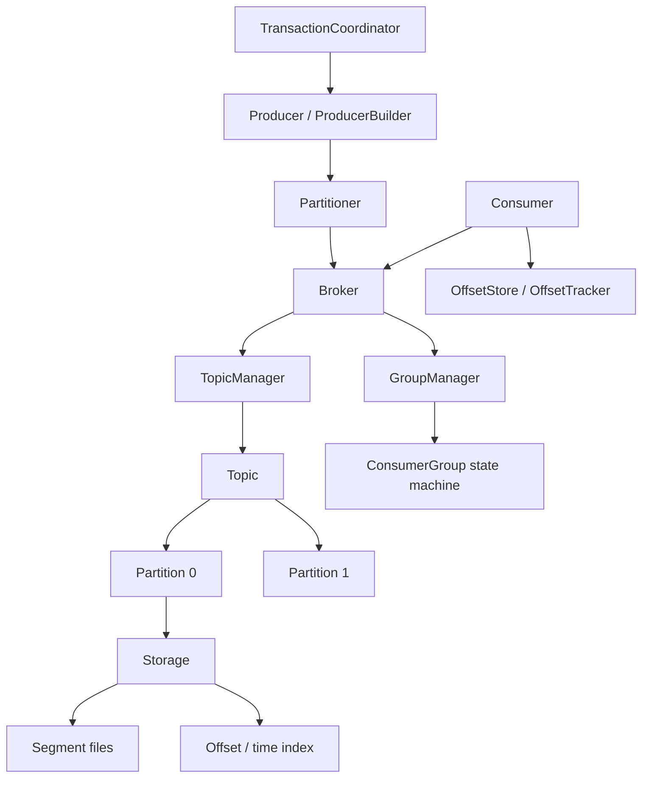

# Message Queue

A persistent, Kafka-style message queue implemented from scratch in Rust. It provides
topic-based pub/sub with partitioning, an append-only segmented log with offset and time
indexes, batched producers and acknowledging consumers, a consumer-group state machine with
partition rebalancing, transactional/idempotent producer support, and pluggable compression.

## Features

- **Append-only segmented log** — each partition is a sequence of `Segment` files with a
  CRC-checked binary record format, rolled at a configurable size (`segment.rs`, `storage.rs`).
- **Offset and time indexes** — `OffsetIndex`/`MemoryIndex` map offsets to file positions and
  `TimeIndex` maps timestamps to offsets for fast lookup (`index.rs`).
- **Topics and partitions** — `TopicManager` creates/loads/deletes topics; `Partition` tracks
  start offset, log-end offset, high watermark, and leader epoch (`topic.rs`, `partition.rs`).
- **Partitioners** — round-robin, key-hash (xxh3), sticky, random, and manual strategies via
  `Partitioner`/`PartitionStrategy` (`partition.rs`).
- **Producers** — `Producer` and `ProducerBuilder` with acks, compression, batching, linger,
  idempotence, and retries; returns `RecordMetadata` (`producer.rs`).
- **Consumers** — `Consumer`/`ConsumerBuilder` with `subscribe`/`assign`, `poll`, `commit`,
  `seek`, pause/resume, and lag tracking (`consumer.rs`).
- **Consumer groups** — `ConsumerGroup` join/sync/heartbeat/leave state machine with
  generation tracking and range partition assignment; `GroupManager` owns groups (`consumer_group.rs`).
- **Offset management** — `OffsetStore` (persisted committed offsets) and `OffsetTracker`
  (in-memory positions, high watermark, lag) keyed by `TopicPartition` (`offset.rs`).
- **Transactions / idempotence** — `TransactionCoordinator`, `ProducerState`, and a
  producer-id manager implement a transaction state machine with sequence-number dedup (`transaction.rs`).
- **Compression** — `Compression` codec with `None`, `Gzip`, `Lz4`, and `Snappy` variants
  applied per message batch (`compression.rs`).
- **Broker** — `Broker` ties the topic manager and group manager together with produce/fetch
  and metrics (`broker.rs`).

## Architecture



| Component | Module | Responsibility |
|-----------|--------|----------------|
| Message format | `message.rs` | `Message`/`MessageBatch` serialization with CRC |
| Storage | `segment.rs`, `storage.rs` | Segmented append-only log and retention |
| Index | `index.rs` | Offset-to-position and time-to-offset indexes |
| Topics | `topic.rs`, `partition.rs` | Topic/partition management and partitioning |
| Producer | `producer.rs` | Batched, configurable produce path |
| Consumer | `consumer.rs`, `consumer_group.rs` | Polling, commits, group rebalancing |
| Offsets | `offset.rs` | Committed offsets and position/lag tracking |
| Transactions | `transaction.rs` | Idempotent/transactional producer state |
| Replication | `replication.rs` | ISR, leader election, ack levels (standalone) |
| Broker | `broker.rs` | Orchestration and metrics |

## Quick Start

### Prerequisites

- Rust (stable, edition 2021) with Cargo. No external services are needed to run the tests.

### Installation

```bash
cargo build
cargo build --release   # LTO + codegen-units=1 optimized profile
```

### Running

```bash
cargo run --bin mq-server   # in-process broker (no network listener)
```

The server reads `MQ_BROKER_ID`, `MQ_DATA_DIR`, `MQ_LOG_DIR`, `MQ_HOST`, and `MQ_PORT` from
the environment.

## Usage

```rust
use message_queue::{Broker, BrokerConfig, Message};

fn main() -> message_queue::Result<()> {
    let broker = Broker::new(BrokerConfig::default())?;
    broker.start()?;

    // Produce (auto-creates the topic; returns (partition, offset))
    let (partition, offset) = broker.produce("orders", Message::new("hello"))?;
    println!("wrote to partition {partition} at offset {offset}");

    // Fetch up to 10 messages from that partition starting at offset 0
    let messages = broker.fetch("orders", partition, 0, 10, 0)?;
    assert_eq!(messages[0].payload.as_ref(), b"hello");

    broker.stop()?;
    Ok(())
}
```

Building a keyed message with the fluent builder:

```rust
use message_queue::MessageBuilder;

let msg = MessageBuilder::new("payload")
    .key("user-42")
    .string_header("content-type", "text/plain")
    .build();
```

## What's Real vs Simulated

- **Real:** The on-disk segmented log with CRC-checked records, offset/time indexes, topic and
  partition management, all five partitioning strategies, the producer/consumer APIs, the
  consumer-group join/sync/heartbeat state machine with range assignment, persisted offset
  commits and lag tracking, the transaction/idempotence state machine with sequence dedup, the
  four compression codecs, retention, and crash recovery (segments and offsets are reloaded on
  open). These are exercised by 284 tests.
- **Simulated / requires credentials:** The system runs **in-process only**. `mq-server` boots
  a `Broker` but opens no network socket, so there is no wire protocol or remote client. The
  `replication` module (ISR membership, leader election, ack levels) is implemented as a
  standalone in-process component and is **not wired into** the broker or server — there is no
  multi-node clustering or cross-node coordination.

## Testing

```bash
cargo test
cargo bench   # Criterion throughput benchmarks (release profile)
```

The suite is 284 tests: 75 integration tests in `tests/integration_tests.rs` plus 209 unit
tests across the source modules. They cover serialization round-trips, CRC corruption
detection, segment roll/retention, index lookups, partitioning, producer/consumer flows,
group rebalancing, offset persistence, and transaction state transitions. No external services
are required.

## Project Structure

```
51-message-queue/
  src/
    lib.rs            # Crate root and public re-exports
    message.rs        # Message, MessageBatch, MessageBuilder, CRC framing
    segment.rs        # Segment files and SegmentManager
    storage.rs        # Storage / StorageManager and retention
    index.rs          # OffsetIndex, TimeIndex, MemoryIndex
    topic.rs          # Topic and TopicManager
    partition.rs      # Partition, Partitioner, partitioning strategies
    producer.rs       # Producer and ProducerBuilder
    consumer.rs       # Consumer and ConsumerBuilder
    consumer_group.rs # ConsumerGroup, GroupManager, rebalancing
    offset.rs         # OffsetStore, OffsetTracker, TopicPartition
    transaction.rs    # TransactionCoordinator, ProducerState
    replication.rs    # ReplicaSet, ISR, leader election (standalone)
    compression.rs    # Compression codecs
    config.rs         # Broker/topic/producer/consumer config
    error.rs          # Typed error hierarchy
    bin/server.rs     # In-process server binary
  tests/integration_tests.rs   # 75 integration tests
  benches/throughput.rs        # Criterion benchmarks
  docs/BLUEPRINT.md            # Full architecture and design
```

## License

MIT — see ../LICENSE
