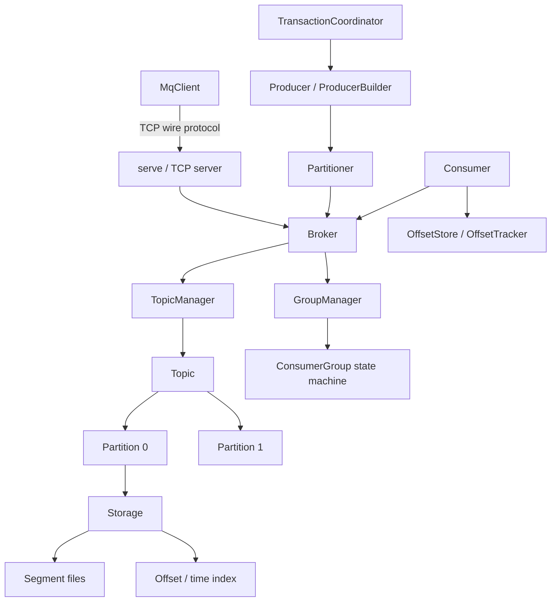

# Message Queue

A persistent, Kafka-style message queue implemented from scratch in Rust. It provides
topic-based pub/sub with partitioning, an append-only segmented log with offset and time
indexes, batched producers and acknowledging consumers, a consumer-group state machine with
partition rebalancing, transactional/idempotent producer support, and pluggable compression.

## Features

- **Append-only segmented log** — each partition is a sequence of `Segment` files with a
  CRC-checked binary record format, rolled at a configurable size (`segment.rs`, `storage.rs`).
- **Offset and time indexes** — `OffsetIndex`/`MemoryIndex` map offsets to file positions and
  `TimeIndex` maps timestamps to offsets for fast lookup (`index.rs`).
- **Topics and partitions** — `TopicManager` creates/loads/deletes topics; `Partition` tracks
  start offset, log-end offset, high watermark, and leader epoch (`topic.rs`, `partition.rs`).
- **Partitioners** — round-robin, key-hash (xxh3), sticky, random, and manual strategies via
  `Partitioner`/`PartitionStrategy` (`partition.rs`).
- **Producers** — `Producer` and `ProducerBuilder` with acks, compression, batching, linger,
  idempotence, and retries; returns `RecordMetadata` (`producer.rs`).
- **Consumers** — `Consumer`/`ConsumerBuilder` with `subscribe`/`assign`, `poll`, `commit`,
  `seek`, pause/resume, and lag tracking (`consumer.rs`).
- **Consumer groups** — `ConsumerGroup` join/sync/heartbeat/leave state machine with
  generation tracking and range partition assignment; `GroupManager` owns groups (`consumer_group.rs`).
- **Offset management** — `OffsetStore` (persisted committed offsets) and `OffsetTracker`
  (in-memory positions, high watermark, lag) keyed by `TopicPartition` (`offset.rs`).
- **Transactions / idempotence** — `TransactionCoordinator`, `ProducerState`, and a
  producer-id manager implement a transaction state machine with sequence-number dedup (`transaction.rs`).
- **Compression** — `Compression` codec with `None`, `Gzip`, `Lz4`, and `Snappy` variants
  applied per message batch (`compression.rs`).
- **Broker** — `Broker` ties the topic manager and group manager together with produce/fetch
  and metrics (`broker.rs`).
- **Network layer** — a length-prefixed binary wire protocol (`protocol.rs`), a tokio TCP
  server that wraps the broker (`server.rs`, `serve`), and an async `MqClient` (`client.rs`),
  so the queue is connectable over the network with optional token auth.

## Architecture



| Component | Module | Responsibility |
|-----------|--------|----------------|
| Message format | `message.rs` | `Message`/`MessageBatch` serialization with CRC |
| Storage | `segment.rs`, `storage.rs` | Segmented append-only log and retention |
| Index | `index.rs` | Offset-to-position and time-to-offset indexes |
| Topics | `topic.rs`, `partition.rs` | Topic/partition management and partitioning |
| Producer | `producer.rs` | Batched, configurable produce path |
| Consumer | `consumer.rs`, `consumer_group.rs` | Polling, commits, group rebalancing |
| Offsets | `offset.rs` | Committed offsets and position/lag tracking |
| Transactions | `transaction.rs` | Idempotent/transactional producer state |
| Replication | `replication.rs` | ISR, leader election, ack levels (standalone) |
| Broker | `broker.rs` | Orchestration and metrics |
| Network | `protocol.rs`, `server.rs`, `client.rs` | Wire protocol, TCP server, async client |

## Quick Start

### Prerequisites

- Rust (stable, edition 2021) with Cargo. No external services are needed to run the tests.

### Installation

```bash
cargo build
cargo build --release   # LTO + codegen-units=1 optimized profile
```

### Running

```bash
cargo run --bin mq-server   # boots the broker and serves the wire protocol over TCP
```

The server reads `MQ_BROKER_ID`, `MQ_DATA_DIR`, `MQ_LOG_DIR`, `MQ_HOST`, and `MQ_PORT` from
the environment (defaults: `127.0.0.1:9092`). If `MQ_AUTH_TOKEN` is set, every client must
authenticate with that shared token before issuing requests; if it is unset, no auth is
required (convenient for local use). `Ctrl-C` triggers a clean shutdown.

### Wire protocol

Clients speak a length-prefixed binary protocol over TCP:

```text
+-------------------+-----------------------------+
| u32 length (BE)   | body (bincode-serialized)   |
+-------------------+-----------------------------+
```

Each frame's `length` prefix is the byte length of the body; requests and responses share the
same framing. Bodies are `Request`/`Response` enums serialized with `bincode`. Frames larger
than a configurable cap (16 MiB by default) are rejected before allocation. Supported requests:
`Ping`, `CreateTopic`, `ListTopics`, `Produce`, `Fetch`, `CommitOffset`, `FetchOffset`, and
`Auth`; failures come back as a typed `Response::Error { kind, message }`. Consumer-group
offsets committed via the wire protocol are persisted server-side with the crate's file-backed
`OffsetStore`.

## Usage

```rust
use message_queue::{Broker, BrokerConfig, Message};

fn main() -> message_queue::Result<()> {
    let broker = Broker::new(BrokerConfig::default())?;
    broker.start()?;

    // Produce (auto-creates the topic; returns (partition, offset))
    let (partition, offset) = broker.produce("orders", Message::new("hello"))?;
    println!("wrote to partition {partition} at offset {offset}");

    // Fetch up to 10 messages from that partition starting at offset 0
    let messages = broker.fetch("orders", partition, 0, 10, 0)?;
    assert_eq!(messages[0].payload.as_ref(), b"hello");

    broker.stop()?;
    Ok(())
}
```

Building a keyed message with the fluent builder:

```rust
use message_queue::MessageBuilder;

let msg = MessageBuilder::new("payload")
    .key("user-42")
    .string_header("content-type", "text/plain")
    .build();
```

### Remote client

With `mq-server` running, connect over the network with `MqClient` (async, tokio):

```rust
use message_queue::{MqClient, WireMessage};

#[tokio::main]
async fn main() -> message_queue::Result<()> {
    // Pass Some(token) if the server was started with MQ_AUTH_TOKEN.
    let mut client = MqClient::connect("127.0.0.1:9092", None).await?;
    client.ping().await?;

    client.create_topic("orders", Some(1)).await?;
    let (partition, offset) = client.produce("orders", b"hello".to_vec()).await?;
    println!("wrote to partition {partition} at offset {offset}");

    let messages = client.fetch("orders", partition, 0, 10, 0).await?;
    assert_eq!(messages[0].payload, b"hello");

    // Consumer-group offset tracking
    client.commit_offset("group-a", "orders", partition, offset + 1).await?;
    assert_eq!(client.fetch_offset("group-a", "orders", partition).await?, Some(offset + 1));
    let _ = WireMessage::new(b"payload".to_vec()); // full message with key/headers
    Ok(())
}
```

## What's Real vs Simulated

- **Real:** The on-disk segmented log with CRC-checked records, offset/time indexes, topic and
  partition management, all five partitioning strategies, the producer/consumer APIs, the
  consumer-group join/sync/heartbeat state machine with range assignment, persisted offset
  commits and lag tracking, the transaction/idempotence state machine with sequence dedup, the
  four compression codecs, retention, and crash recovery (segments and offsets are reloaded on
  open). **The TCP wire protocol is real too:** `mq-server` opens a socket, and `MqClient`
  connects over the network to produce, fetch, create/list topics, commit/fetch consumer-group
  offsets, and (optionally) authenticate — all exercised end-to-end over real sockets. These
  are covered by 301 tests.
- **Simulated / requires credentials:** The server is **single-node**. The `replication`
  module (ISR membership, leader election, ack levels) is implemented as a standalone in-process
  component and is **not wired into** the broker, server, or write path — there is no multi-node
  clustering or cross-node coordination. The wire protocol is a purpose-built binary framing,
  not the Kafka wire format, so existing Kafka clients cannot connect.

## Testing

```bash
cargo test
cargo bench   # Criterion throughput benchmarks (release profile)
```

The suite is 301 tests: 214 unit tests across the source modules (including protocol/server
tests), 75 integration tests in `tests/integration_tests.rs`, and 12 end-to-end network tests
in `tests/network_tests.rs`. They cover serialization round-trips, CRC corruption detection,
segment roll/retention, index lookups, partitioning, producer/consumer flows, group
rebalancing, offset persistence, transaction state transitions, and — over real TCP sockets on
an ephemeral port — the wire protocol (produce/fetch round-trips, ordering, topic listing,
offset commit/fetch, oversized-frame rejection, and the auth handshake). No external services
are required.

## Project Structure

```
51-message-queue/
  src/
    lib.rs            # Crate root and public re-exports
    message.rs        # Message, MessageBatch, MessageBuilder, CRC framing
    segment.rs        # Segment files and SegmentManager
    storage.rs        # Storage / StorageManager and retention
    index.rs          # OffsetIndex, TimeIndex, MemoryIndex
    topic.rs          # Topic and TopicManager
    partition.rs      # Partition, Partitioner, partitioning strategies
    producer.rs       # Producer and ProducerBuilder
    consumer.rs       # Consumer and ConsumerBuilder
    consumer_group.rs # ConsumerGroup, GroupManager, rebalancing
    offset.rs         # OffsetStore, OffsetTracker, TopicPartition
    transaction.rs    # TransactionCoordinator, ProducerState
    replication.rs    # ReplicaSet, ISR, leader election (standalone)
    compression.rs    # Compression codecs
    config.rs         # Broker/topic/producer/consumer config
    error.rs          # Typed error hierarchy
    protocol.rs       # Wire protocol: Request/Response, WireMessage, framing
    server.rs         # Tokio TCP server (serve) wrapping the Broker
    client.rs         # MqClient async network client
    bin/server.rs     # mq-server binary (serves the wire protocol)
  tests/integration_tests.rs   # 75 in-process integration tests
  tests/network_tests.rs       # 12 end-to-end wire-protocol tests
  benches/throughput.rs        # Criterion benchmarks
  docs/BLUEPRINT.md            # Full architecture and design
```

## License

MIT — see [LICENSE](../LICENSE)
