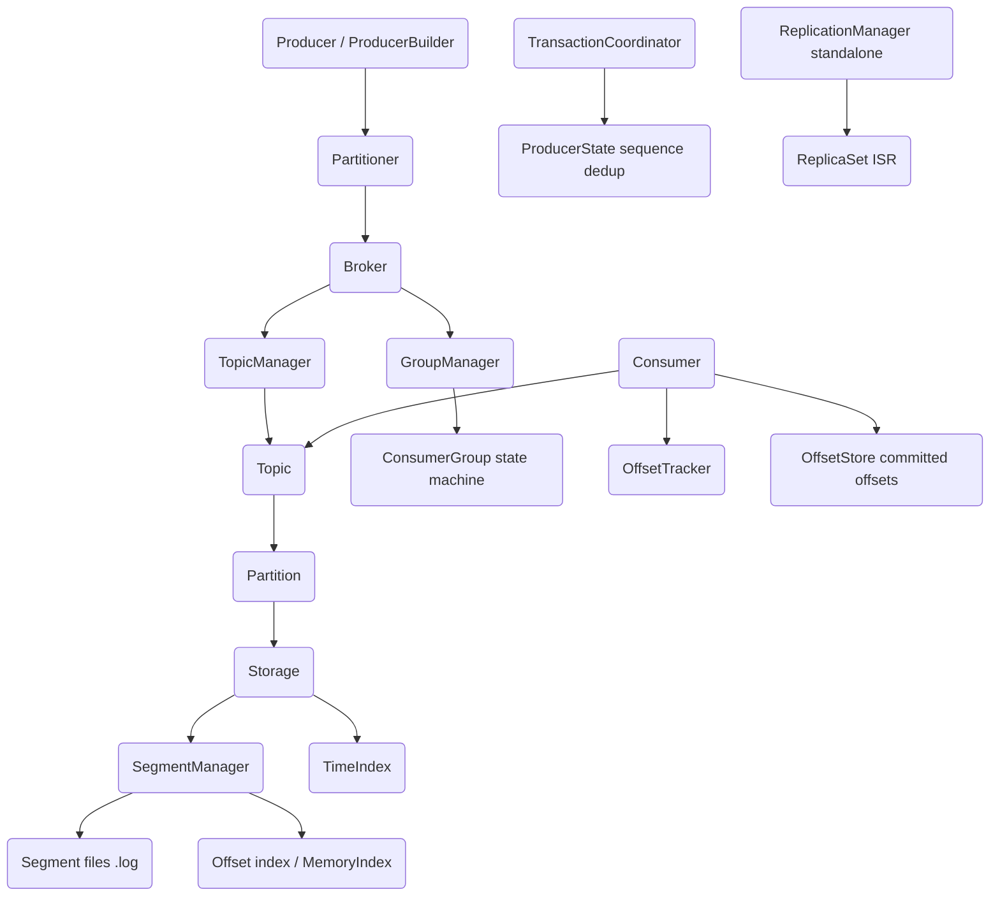

# Message Queue

## Overview

This project is a persistent, Kafka-style message queue implemented from scratch in Rust.
It models the core of a distributed log system: durable, append-only, offset-addressed
partitions grouped under named topics, with a batched producer path, an acknowledging
consumer path, a consumer-group rebalancing protocol, persisted offset commits, an
idempotent/transactional producer state machine, and pluggable per-batch compression. On top
of that storage and coordination core sits a real network layer: `mq-server` opens a TCP
socket and speaks a length-prefixed binary wire protocol, and `MqClient` connects remotely to
produce, fetch, manage topics, and track consumer-group offsets. The system is single-node.

The concepts this codebase teaches are the ones that make a commit log work in practice:

- **The log as the primitive.** A partition is nothing more than a sequence of immutable,
  length-prefixed records written to append-only segment files. Reads are positioned by an
  offset, which is a monotonic per-partition counter, and translated to a byte position
  through a sparse index. Understanding that "everything is a log" is the central lesson.
- **Segmented storage and retention.** Logs are split into fixed-size segments so that old
  data can be reclaimed by deleting whole files, and so that the active write path only ever
  appends to one open file. Retention by time and by size is expressed in terms of dropping
  whole segments below a computed offset.
- **Sparse indexing.** Rather than indexing every record, the segment stores one index entry
  every `index_interval` bytes and binary-searches to the nearest entry, then scans forward.
  This trades a small amount of read work for a much smaller index.
- **Consumer coordination.** A consumer group is a small state machine — `Empty`,
  `PreparingRebalance`, `CompletingRebalance`, `Stable`, `Dead` — driven by join, sync,
  heartbeat, and leave requests, with generation numbers to fence stale members and a range
  or round-robin assignor to distribute partitions.
- **Exactly-once building blocks.** Idempotent producers deduplicate by tracking a per
  `(producer, partition)` sequence number; transactions layer a commit/abort state machine
  and producer-epoch fencing on top of that.

Scope is deliberately bounded. The `replication` module implements ISR membership, high
watermark computation, leader election, and ack levels, but it is a standalone in-process
component — it is **not** wired into the `Broker`, the server, or the write path, and there is
no multi-node clustering. The network layer is single-node and its framing is purpose-built,
not the Kafka wire format. The system is exercised by 301 tests (209 unit tests, 75 in-process
integration tests, and 12 end-to-end network tests over real sockets) covering serialization,
CRC corruption detection, segment roll and retention, index lookup, partitioning,
producer/consumer flows, group rebalancing, offset persistence, transaction state transitions,
and the full request/response wire protocol including the auth handshake.

### Design goals and non-goals

The implementation optimizes for pedagogical clarity of the log engine while remaining a
faithful model of Kafka's data model and vocabulary. Several concrete goals shaped the code:

- **Durability that is observable.** Every stored record carries a CRC32 so that a corrupt
  read fails loudly with `Error::CrcMismatch` rather than returning garbage. Recovery is
  explicit: opening a segment rebuilds its index by re-scanning the file, and opening a topic
  rediscovers its partitions from the directory tree.
- **Offsets as the contract.** The public surface is offset-addressed end to end. Producers
  learn the offset they wrote (`RecordMetadata.offset`), consumers advance a per-partition
  position, and commits persist that position, so the same `(topic, partition, offset)` triple
  identifies a record everywhere.
- **Thread-safe shared state without a runtime.** The whole system is synchronous and
  lock-based. There is no async executor on the hot path; concurrency is expressed with
  `parking_lot` locks and `std::sync::atomic` counters, which keeps the control flow readable.
- **Configuration mirrors Kafka.** `BrokerConfig`, `TopicConfig`, `ProducerConfig`, and
  `ConsumerConfig` carry the familiar knobs (`acks`, `linger.ms`, `batch.size`,
  `auto.offset.reset`, `session.timeout`, retention by time and size) so that the mental model
  transfers directly.

The explicit non-goals are the parts a production broker would need but this project omits:
multi-node replication actually wired into the write path (the `replication` module is
standalone), Kafka wire-format compatibility (the network protocol is a purpose-built binary
framing, so off-the-shelf Kafka clients cannot connect), log compaction (the
`CleanupPolicy::Compact` variant exists in config but the delete policy is what runs), and a
background scheduler for retention and ISR maintenance (those are methods the caller invokes,
not timers). The single-node wire protocol and remote client — previously a non-goal — are now
implemented (`protocol.rs`, `server.rs`, `client.rs`).

## Architecture

The system is layered. At the bottom is the byte-level storage engine (`Segment`,
`SegmentManager`, `Storage`, index types). Above it sits the logical model (`Partition`,
`Topic`, `TopicManager`). The client-facing layer (`Producer`, `Consumer`, consumer groups,
offset stores) uses that logical model, and the `Broker` orchestrates topic and group
management, exposing produce/fetch entry points and metrics. `Compression` is a cross-cutting
codec used at the batch level; `TransactionCoordinator` and `ReplicationManager` are
standalone coordination components.



**Storage layer.** `Segment` owns a single `.log` file and the in-memory offset index for
that file; `SegmentManager` owns one active (writable) segment plus a vector of read-only
older segments, rolling to a new segment when the active one fills. `Storage` wraps a
`SegmentManager` for one partition, adding statistics, flush scheduling, retention, and a
byte-bounded read path. `StorageManager` maps `topic-partition` keys to `Arc<Storage>`
instances, but the partition layer creates its own `Storage` directly rather than going
through `StorageManager`.

**Logical layer.** `Partition` layers offset bookkeeping (log end offset, high watermark,
leader epoch, a leader flag) on top of `Storage` and produces `FetchResult` values.
`Topic` holds a vector of `Arc<Partition>` and a `Partitioner`, routing appends to a partition
by strategy and exposing per-partition read/fetch, retention, and description. `TopicManager`
creates, loads from disk, deletes, and lists topics.

**Client layer.** `Producer` chooses a partition, optionally buffers into per-partition
pending batches governed by `linger_ms` and `batch_size`, and appends through the topic.
`Consumer` subscribes or assigns partitions, initializes offsets via the auto-offset-reset
policy or a committed offset, polls per-partition up to `max_poll_records`, and can commit,
seek, pause, and resume. `ConsumerGroup`/`GroupManager` implement the group protocol.
`OffsetStore` persists committed offsets as JSON lines with an atomic rename; `OffsetTracker`
holds in-memory positions, high watermarks, and lag.

**Orchestration.** `Broker` ties `TopicManager` and `GroupManager` together, honoring
`auto_create_topics`, and records metrics through `BrokerMetrics`.

**Network layer.** `protocol.rs` defines the `Request`/`Response` enums, the `WireMessage`
record, and the length-prefixed framing. `server.rs` exposes `serve(broker, addr, opts)`: a
tokio TCP listener that accepts connections, reads framed requests, dispatches them against the
shared `Arc<Broker>`, and writes framed responses, with an optional token auth handshake and an
oversized-frame guard. `client.rs` provides `MqClient`, an async client mirroring the protocol.
The `mq-server` binary constructs a `Broker` from environment variables, starts it, and calls
`serve` on `MQ_HOST:MQ_PORT`.

| Component | Module | Responsibility |
|-----------|--------|----------------|
| Message format | `message.rs` | `Message`/`MessageBatch` binary serialization with CRC framing |
| Storage | `segment.rs`, `storage.rs` | Segmented append-only log, roll, retention, byte-bounded reads |
| Index | `index.rs` | Offset-to-position and time-to-offset indexes (mmap and in-memory) |
| Topics | `topic.rs` | Topic lifecycle, partition routing, topic description |
| Partitions | `partition.rs` | Offset bookkeeping, fetch results, partitioning strategies |
| Producer | `producer.rs` | Partition selection, batching, produce metrics |
| Consumer | `consumer.rs` | Poll loop, offset init, commit, seek, pause/resume, lag |
| Consumer groups | `consumer_group.rs` | Join/sync/heartbeat/leave state machine, range/round-robin assignment |
| Offsets | `offset.rs` | Persisted committed offsets, position/lag tracking, `TopicPartition` |
| Transactions | `transaction.rs` | Idempotent sequence dedup, transaction state machine, epoch fencing |
| Compression | `compression.rs` | None/Gzip/Lz4/Snappy codecs |
| Replication | `replication.rs` | ISR, high watermark, leader election, ack levels (standalone) |
| Broker | `broker.rs` | Orchestration, produce/fetch entry points, metrics |
| Wire protocol | `protocol.rs` | `Request`/`Response` enums, `WireMessage`, length-prefixed framing |
| Server | `server.rs` | Tokio TCP server (`serve`), auth handshake, frame-size guard |
| Client | `client.rs` | `MqClient` async network client |
| Config | `config.rs` | Broker/topic/producer/consumer configuration and enums |
| Errors | `error.rs` | Typed error hierarchy with retriable/fatal classification |

## Core Components

### Message and MessageBatch (`message.rs`)

A `Message` is the unit of data: a random `MessageId` (UUID v4), an optional `key` used for
partitioning, a `payload`, a `Headers` map, a millisecond `timestamp`, and the `offset` and
`partition` that are stamped when the message is stored. Keys and payloads are `bytes::Bytes`
so slices can be shared without copying.

Serialization is a hand-rolled binary format, not a serde blob, because the on-disk record
layout matters. `Message::serialize` writes a magic byte (`0x01`), the 16-byte ID, a
length-prefixed key (`-1` length signals no key), a length-prefixed payload, a header count
followed by length-prefixed key/value pairs, the timestamp, offset, and partition, and finally
a CRC32 over everything preceding. `deserialize` recomputes the CRC over `data[..len-4]` and
compares it to the trailing four bytes, returning `Error::CrcMismatch { expected, actual }` on
mismatch — this is what makes corruption detectable on read.

A `MessageBatch` groups messages for compressed storage and idempotent production. Its own
frame (magic `0x02`) carries the compression codec, base offset, partition, optional
producer id, and optional sequence number, followed by the message block. The message block —
a count plus length-prefixed serialized messages — is passed through
`Compression::compress` before being written, and a CRC covers the whole batch header plus
compressed payload. `MessageBuilder` provides fluent construction (`key`, `header`,
`string_header`, `timestamp`).

### Segment and SegmentManager (`segment.rs`)

A `Segment` is a single append-only `.log` file named by its zero-padded 20-digit base offset
(`{:020}.log`). It holds the file behind a `RwLock`, an `AtomicU64` size, a `max_size`, a
`MemoryIndex` for offset→position lookups, a small in-memory time index, an atomic
`next_offset`, a `read_only` flag, and an `index_interval` (4096 bytes) with a
`bytes_since_index` counter.

`append` refuses writes when read-only, serializes the message, and checks whether
`current_size + 4 + msg_len` would exceed `max_size` — if so it returns `Error::StorageFull`
so the manager can roll. Otherwise it claims the next offset atomically, writes a 4-byte
length prefix followed by the serialized record at end-of-file, and updates the size. A sparse
index entry is inserted only once `bytes_since_index` reaches `index_interval`, and a time
index entry is appended when the timestamp advances.

`read(offset)` validates the offset is in `[base_offset, next_offset)`, looks up the nearest
indexed position, then scans records forward until it reaches the exact offset. `read_range`
does the same but streams up to `max_messages` records, tolerating EOF mid-scan. `truncate_to`
finds the byte position for an offset (via index or scan), truncates the file, and resets size,
next offset, and the index — this is the recovery/rollback primitive. `rebuild_index` (run by
`open`) walks the file from the start reading length prefixes to reconstruct offsets and the
in-memory index, which is how a segment recovers its state after a restart.

`SegmentManager` discovers existing segments by parsing base offsets out of `.log` filenames,
sorts them, opens the older ones read-only, and keeps the newest as the active segment.
`append` rolls to a fresh segment when the active one is full (or when a single message will
not fit), pushing the old segment into the inactive vector. `read`/`read_range` dispatch to
the active segment or search inactive segments in reverse. `delete_before(offset)` drops whole
inactive segments whose `next_offset <= offset`, which is the mechanism behind retention.

### The write path, end to end

A produce call travels a fixed sequence of layers, and each layer adds exactly one concern:

1. `Broker::produce` (or `Producer::send`) resolves or auto-creates the topic, then delegates
   to `Topic::append`.
2. `Topic::append` asks its `Partitioner` for a partition id and forwards the message to that
   `Partition`.
3. `Partition::append` checks the leader flag, stamps `message.partition`, and calls
   `Storage::append`.
4. `Storage::append` records the message size, delegates to `SegmentManager::append`, bumps the
   pending-bytes counter, updates statistics, and flushes if `sync_on_append` is set or the
   flush interval has elapsed.
5. `SegmentManager::append` rolls the active segment if it is full, then calls `Segment::append`,
   handling a `StorageFull` return by rolling and retrying so a single oversized-for-remaining
   message still lands in a fresh segment.
6. `Segment::append` serializes the record, reserves the next offset atomically, writes the
   length prefix and bytes at end-of-file, updates the size and the sparse offset/time indexes.

The offset assigned in step 6 propagates back up so `Partition` can advance its log end offset
and high watermark, and `Producer`/`Broker` can return it in `RecordMetadata` /
`(partition, offset)`.

### The read path and fetch semantics

A fetch reverses the same layering but resolves position through the index. `Partition::fetch`
chooses between `Storage::read_bytes` (when `max_bytes > 0`) and `Storage::read_range`, then
truncates to `max_messages`. Inside a segment, `read` and `read_range` first ask the offset
index for the byte position of the nearest indexed offset at or below the target, seek there,
and scan records forward — reading a 4-byte length prefix and then the record — until they
reach the requested offset (for `read`) or fill the batch (for `read_range`). Because the index
is sparse, the forward scan covers at most one `index_interval` of log. The returned
`FetchResult` reports the `next_offset` to fetch next, the current `high_watermark`, and the
`log_end_offset`, so a consumer can both advance its position and observe lag in a single call.

### Recovery and crash safety

The system has no separate write-ahead log; the segment file *is* the log, and recovery is the
act of reconstructing in-memory state from those files. On restart:

- `Segment::open` calls `rebuild_index`, which walks the `.log` file from byte 0, reads each
  length prefix, records an offset→position mapping, and advances `next_offset` — so a segment
  recovers its offset range and index without any auxiliary metadata.
- `SegmentManager::new` lists the directory, sorts segment base offsets, reopens the tail as
  the active segment and the rest read-only, so the whole partition log is reconstructed.
- `Partition::open`/`Topic::open`/`TopicManager::load` layer directory discovery on top, so the
  broker's `start` restores every topic and partition it finds under the data directory.
- `OffsetStore` writes commits to a temp file, fsyncs, and atomically renames, so a crash mid
  commit leaves either the old or the new offsets intact, never a torn file; `load` reads the
  file back on construction.

Corruption is caught rather than silently propagated: a record whose recomputed CRC32 does not
match its stored checksum yields `Error::CrcMismatch`, which `Error::is_fatal` classifies as
fatal alongside `SegmentCorrupted` and `LockPoisoned`.

### Concurrency model

The engine is designed to be shared across threads via `Arc` without a global lock. The rules
it follows:

- **Atomics for monotonic counters.** Segment `size` and `next_offset`, partition
  `log_end_offset`/`high_watermark`/`leader_epoch`, producer-id allocation, and every metrics
  counter are `AtomicU32`/`AtomicU64`/`AtomicI64`, updated with acquire/release or relaxed
  ordering as appropriate. `Partition::update_high_watermark` uses a compare-exchange loop so the
  watermark only ever moves forward.
- **`RwLock` for shared collections.** Topic/partition/storage/group maps, the segment file
  handle, the paused set, offset maps, and group state are guarded by `parking_lot::RwLock`,
  which lets many readers proceed while writers (append, roll, rebalance) take the write lock.
- **`Mutex` for the batch buffer.** The producer's pending-batch map and the rate-limiter's last
  timestamp use `parking_lot::Mutex` because they are short critical sections mutated on every
  send.
- **`Arc` sharing for zero-copy fan-out.** `TopicManager` hands out `Arc<Topic>`,
  `StorageManager` hands out `Arc<Storage>`, and `GroupManager` hands out `Arc<ConsumerGroup>`,
  so multiple producers and consumers operate on the same underlying state safely.

The single serialization point on the write path is the active segment's file write lock; read
paths and manager lookups take read locks and proceed concurrently.

### Retention

Retention is where segmentation pays off. `Storage::apply_retention` computes a single
`delete_before` offset and then drops whole segments below it, never rewriting live data.
Time-based retention scans forward from the log start, advancing `delete_before` past every
message whose timestamp is older than `current_timestamp - retention_ms`, and stopping at the
first record still within the window. Size-based retention then keeps advancing `delete_before`
while the total log size exceeds `retention_bytes`. The resulting offset is handed to
`SegmentManager::delete_before`, which unlinks each inactive segment whose `next_offset` is at or
below it and returns a `RetentionResult` reporting segments and offsets removed. Because the
active segment is never a retention candidate, in-flight writes are unaffected. Retention runs
only when a caller invokes it (`Topic::apply_retention`, `Broker::apply_retention`); there is no
background timer.

### Index types (`index.rs`)

Three index implementations coexist. `OffsetIndex` is the durable, memory-mapped variant: a
fixed-capacity file of 8-byte `IndexEntry` records (`relative_offset: u32`, `position: u32`),
looked up with a binary search that returns the position of the largest offset `<= target`.
It supports `append`, `open` (which counts valid entries by scanning the mmap), `truncate_to`,
`flush`, and `remap`. `TimeIndex` stores `(timestamp, offset)` pairs of 16 bytes each, both
in memory and appended to a file, and binary-searches for the largest timestamp `<= target`.
`MemoryIndex` is a `BTreeMap<u64, u32>` used by `Segment` at runtime; its `lookup` uses
`range(..=offset).next_back()` to find the floor entry, and `truncate_to` uses `split_off`.
The segment append path uses `MemoryIndex`; the file-backed `OffsetIndex`/`TimeIndex` are the
persistent counterparts exercised directly by unit tests.

### Partition and Partitioner (`partition.rs`)

`Partition` owns a `Storage`, plus atomics for `high_watermark`, `log_end_offset`, and
`leader_epoch`, and an `is_leader` flag. `append` rejects writes when not leader, stamps the
message's partition id, appends through storage, and advances log end offset to `offset + 1`
and high watermark to `offset`. `fetch(offset, max_messages, max_bytes)` reads either by byte
budget (`read_bytes`) or by message count (`read_range`), truncates to `max_messages`, and
returns a `FetchResult` carrying the messages, the next offset to fetch, the high watermark,
and the log end offset. `FetchResult::has_more` reports whether `next_offset < high_watermark`.
`update_high_watermark` uses a CAS loop to advance monotonically.

`Partitioner` supports five `PartitionStrategy` variants: `RoundRobin` (atomic counter modulo
partition count), `KeyHash` (xxh3 of the key modulo count, falling back to round-robin when
there is no key), `Sticky` (a stored partition), `Random` (nanosecond-derived), and `Manual`
(uses the message's own partition field). The module also provides a Kafka-compatible
`murmur2` hash and `kafka_partition` helper, used and tested independently of the default
xxh3 partitioner.

### Topic and TopicManager (`topic.rs`)

`Topic::new` creates `partition_count` partitions under `base_dir/<name>/<id>/` and installs a
`KeyHash` partitioner. `append(message)` routes through the partitioner and returns
`(partition_id, offset)`; `append_to_partition`, `read`, and `fetch` target a specific
partition. `describe` produces a `TopicDescription` with per-partition `PartitionInfo` (leader
epoch, log start/end offsets, high watermark, size). `Topic::open` rediscovers partitions by
listing numeric subdirectories and reopening or backfilling them.

`TopicManager` guards a `HashMap<String, Arc<Topic>>`. `create_topic` errors with
`TopicAlreadyExists` on a duplicate; `get_or_create_topic` is the auto-create path used by the
producer and broker; `delete_topic` removes the entry and recursively deletes the directory;
`load` scans the data directory and reopens each topic subdirectory (skipping hidden dirs and
`__consumer_offsets`), which is how the broker restores topics on start.

### Producer (`producer.rs`)

`Producer` holds a shared `TopicManager`, per-topic partitioners, a map of pending batches, a
closed flag, and `ProducerMetrics`. `send` auto-creates the topic, selects a partition, and —
when `linger_ms == 0` — appends immediately and returns fully-populated `RecordMetadata`.
When lingering is enabled it buffers into a per-`topic-partition` `PendingBatch` and flushes
when the accumulated size reaches `batch_size` or the batch has aged past `linger_ms`; the
returned metadata carries a placeholder offset in that path, reflecting the non-async design.
`send_batch` groups messages by partition and appends each group with `append_batch`.
`send_to_partition` bypasses partitioning. `flush` drains all pending batches, and `close`
flushes then rejects further sends with `Error::ProducerClosed`. `ProducerBuilder` configures
client id, acks, compression, batch size, linger, idempotence, and retries.

### Consumer (`consumer.rs`)

`Consumer` tracks subscriptions, assignments, an `OffsetTracker`, an optional `OffsetStore`
(created when a group id is set), a paused set, and `ConsumerMetrics`. `subscribe` clears prior
state and auto-assigns every partition of each subscribed topic, initializing each partition's
offset; `assign` sets explicit partitions. `initialize_offset` prefers a committed offset from
the store, otherwise applies `auto_offset_reset` (`Earliest` → start offset, `Latest` → log end
offset, `None` → error).

`poll(timeout)` iterates assigned, non-paused partitions, fetches from each partition's current
position up to the remaining `max_poll_records` budget, advances the tracked position to
`next_offset`, records the high watermark, and stops on the record budget or the timeout.
`commit` writes every tracked position to the offset store and flushes; `seek`,
`seek_to_beginning`, and `seek_to_end` validate and reposition; `pause`/`resume` toggle
partition membership in the paused set; `lag` and `total_lag` derive from tracked positions and
high watermarks. `ConsumerBuilder` configures client id, group id, auto-commit, offset reset,
max poll records, and fetch max bytes.

### Consumer groups (`consumer_group.rs`)

`ConsumerGroup` is the coordination state machine. State flows `Empty → PreparingRebalance →
CompletingRebalance → Stable`, with `Dead` as a terminal state. `join` mints a member id if one
is not supplied, records subscriptions, sets the first member as leader, and moves a `Stable`
group back to `PreparingRebalance`; the response tells the caller whether it is the leader and,
if so, includes the full member list so the leader can compute assignments. `sync` verifies the
generation, applies leader-supplied assignments to members, transitions to `Stable`, and returns
this member's partitions. `heartbeat` validates the generation, refreshes the member's timer,
and signals whether a rebalance is pending. `leave` removes the member, reassigns leadership,
and re-triggers a rebalance (or empties the group).

Assignment is pluggable: `assign_range` splits each topic's partitions into contiguous ranges
across sorted members (front members absorb the remainder), while `assign_round_robin` sorts all
`TopicPartition`s and deals them out cyclically. `check_expired_members`/`remove_expired_members`
enforce session timeouts by comparing each member's last heartbeat against its
`session_timeout`. `GroupManager` owns the map of groups and refuses to delete a non-empty group.

### Offset management (`offset.rs`)

`TopicPartition` is the `(topic, partition)` key used throughout, hashable and displayed as
`topic-partition`. `OffsetStore` is the durable committed-offset store for a group: it holds a
`HashMap<TopicPartition, OffsetMetadata>` and a dirty flag, and `flush` writes each entry as a
JSON line to a temp file, fsyncs, and atomically renames over the real file — crash-safe commit.
`load` reads that file back on construction, and a `Drop` impl flushes on the way out.
`OffsetTracker` is the in-memory bookkeeper: positions (next offset to fetch), committed offsets,
high watermarks, and log end offsets, from which `lag` (`high_watermark - position`) and
`total_lag` are computed. Seek helpers reposition the tracked position directly.

### Transactions and idempotence (`transaction.rs`)

`ProducerState` implements per-producer idempotency and the transaction lifecycle. Sequence
dedup lives in `check_sequence`: the expected base sequence is `last + 1` (or 0), a lower value
is a `DuplicateSequence` error, a higher value is `OutOfOrderSequence`, and a match advances the
stored last sequence by the batch size. The transaction state machine —
`Empty → Ongoing → PrepareCommit → CompleteCommit` (or the abort path) — is guarded so each
transition is only valid from the right predecessor state. `bump_epoch` fences superseded
producers.

`TransactionCoordinator` allocates producer ids through a block-based `ProducerIdManager`, maps
transactional ids to producer ids, and bumps the epoch (and resets state) when an existing
transactional id re-initializes. `validate_epoch` returns `ProducerFenced` when the supplied
epoch does not match. `commit_transaction`/`abort_transaction` drive the state machine through
prepare and complete; the code notes that a networked implementation would additionally write
commit/abort markers to partitions. `expire_transactions` aborts non-terminal transactions past
their timeout.

### Compression (`compression.rs`)

`Compression` is a `#[repr(u8)]` enum (`None=0`, `Gzip=1`, `Lz4=2`, `Snappy=3`) with
`compress`/`decompress` dispatching to flate2 (gzip), lz4_flex with a size prefix, and snap raw
codecs. `from_u8`/`as_u8` map the on-disk byte, `from_str` parses config strings, and
`estimate_compressed_size` gives rough buffer hints. `CompressionStats` tracks ratio and space
savings. Compression is applied at the `MessageBatch` level, not per message.

### Broker and replication (`broker.rs`, `replication.rs`)

`Broker` validates its config, creates data and log directories, builds a `TopicManager` seeded
from broker defaults and a `GroupManager`, and exposes `produce`, `produce_to_partition`,
`fetch`, topic admin, offset queries, and group access, all instrumented by `BrokerMetrics`
(produced/consumed counts, topic create/delete, request counters). `start` loads existing
topics; `stop` flushes them.

`replication.rs` is a complete but unwired standalone module. `ReplicaSet` tracks assigned
replicas, an in-sync-replica (ISR) set, per-replica progress, and a high watermark computed as
the minimum ISR log end offset. `update_replica_fetch` moves replicas in and out of the ISR by
lag; `maybe_shrink_isr`/`maybe_expand_isr` enforce lag-time and lag-message bounds;
`elect_leader` promotes a preferred or first ISR member and bumps the leader epoch.
`ReplicationManager` maps `(topic, partition)` to replica sets and answers leadership queries.
Nothing in `broker.rs` or the server binary constructs these types.

### Wire protocol and network layer (`protocol.rs`, `server.rs`, `client.rs`)

The network layer wraps the broker without changing its semantics. Frames are
`u32` big-endian length prefixes followed by a `bincode`-serialized body:

```text
+-------------------+-----------------------------+
| u32 length (BE)   | body (bincode-serialized)   |
+-------------------+-----------------------------+
```

`protocol.rs` defines `Request` (`Auth`, `Ping`, `CreateTopic`, `ListTopics`, `Produce`,
`Fetch`, `CommitOffset`, `FetchOffset`) and `Response` (`AuthOk`, `Pong`, `TopicCreated`,
`Topics`, `Produced`, `Fetched`, `OffsetCommitted`, `FetchedOffset`, and a typed
`Error { kind, message }` where `kind` is a wire-stable `ErrorKind`). Messages travel as
`WireMessage`, a flat serde record that converts to/from the internal `Message` so the protocol
stays decoupled from `Bytes`/`MessageId`/`Headers`. `Response::from_error` maps a broker `Error`
to the closest `ErrorKind`.

`server.rs` exposes `serve(broker, addr, opts)` (and `serve_with_listener` for tests binding
`127.0.0.1:0`). Each accepted connection runs its own tokio task: an optional auth handshake
(when `MQ_AUTH_TOKEN` is set, the first frame must be a matching `Auth`, compared in constant
time), then a request loop. Broker calls are synchronous and operate on in-memory/local-file
state, so they are invoked directly from the async task rather than through `spawn_blocking`.
A per-frame size cap (`DEFAULT_MAX_FRAME_BYTES`, 16 MiB) rejects oversized length prefixes
before allocation, and a malformed or undecodable frame closes or errors only that connection —
the accept loop keeps running. Consumer-group offsets committed over the wire are persisted
server-side through the crate's file-backed `OffsetStore`, keyed by group under
`data_dir/consumer-offsets`, because the broker deliberately exposes no offset commit/fetch API.

`client.rs` provides `MqClient::connect(addr, token)`, which performs the handshake and offers
one async method per request (`ping`, `create_topic`, `list_topics`, `produce`,
`produce_message`, `fetch`, `commit_offset`, `fetch_offset`). It is single-connection and issues
one request at a time, keeping request/response framing unambiguous; server-side errors surface
as `Error::Server { kind, message }`.

## Data Structures

The message and its serialized-frame relationship:

```rust
pub struct Message {
    pub id: MessageId,          // UUID v4
    pub key: Option<Bytes>,     // partitioning key
    pub payload: Bytes,
    pub headers: Headers,       // HashMap<String, Vec<u8>> wrapper
    pub timestamp: u64,         // ms since epoch
    pub offset: u64,            // set on store
    pub partition: u32,         // set on store
}

pub struct MessageBatch {
    pub messages: Vec<Message>,
    pub compression: Compression,
    pub base_offset: u64,
    pub partition: u32,
    pub producer_id: Option<u64>, // idempotent producers
    pub sequence: Option<u32>,
}
```

On-disk record framing produced by `Message::serialize` (big-endian):

```
+--------+----------------+---------------+-----------------+--------------------+
| magic  | message id     | key           | payload         | headers            |
| 0x01   | 16 bytes       | i32 len + buf | i32 len + buf   | i32 count + pairs  |
| (1 B)  |                | (-1 = none)   |                 | (i32 klen,k,i32 vlen,v)
+--------+----------------+---------------+-----------------+--------------------+
| timestamp u64 | offset u64 | partition u32 | crc32 u32 (over all preceding)   |
+---------------+------------+---------------+----------------------------------+
```

The offset index entry, 8 bytes, memory-mapped in `OffsetIndex`:

```rust
pub struct IndexEntry {
    pub relative_offset: u32,  // offset - segment base_offset
    pub position: u32,         // byte position in the .log file
}
impl IndexEntry { pub const SIZE: usize = 8; }
```

The segment's runtime state (abbreviated):

```rust
pub struct Segment {
    base_offset: u64,
    log_file: RwLock<File>,
    size: AtomicU64,
    max_size: u64,
    offset_index: MemoryIndex,        // BTreeMap<u64, u32>
    time_index: RwLock<Vec<(u64, u64)>>,
    next_offset: AtomicU64,
    read_only: AtomicBool,
    index_interval: u32,              // 4096 bytes between sparse entries
    bytes_since_index: AtomicU64,
}
```

Partition bookkeeping and the fetch result:

```rust
pub struct Partition {
    topic: String,
    id: PartitionId,                  // u32
    storage: Storage,
    high_watermark: AtomicU64,
    log_end_offset: AtomicU64,
    leader_epoch: AtomicU32,
    is_leader: bool,
}

pub struct FetchResult {
    pub messages: Vec<Message>,
    pub next_offset: u64,
    pub high_watermark: u64,
    pub log_end_offset: u64,
}
```

Consumer-group types (state machine, member, responses):

```rust
pub enum GroupState { Empty, PreparingRebalance, CompletingRebalance, Stable, Dead }

pub struct GroupMember {
    pub id: String,
    pub client_id: String,
    pub session_timeout: Duration,
    pub rebalance_timeout: Duration,
    pub last_heartbeat: Option<Instant>,
    pub assignment: Vec<TopicPartition>,
    pub subscriptions: Vec<String>,
    pub metadata: Vec<u8>,
}

pub struct JoinGroupResponse {
    pub member_id: String,
    pub generation_id: u32,
    pub leader_id: String,
    pub is_leader: bool,
    pub members: Vec<GroupMember>,    // populated only for the leader
}
```

Offset persistence and tracking:

```rust
pub struct TopicPartition { pub topic: String, pub partition: u32 }

pub struct OffsetMetadata {
    pub offset: u64,
    pub metadata: Option<String>,
    pub timestamp: u64,
    pub leader_epoch: Option<u32>,
}

// OffsetTracker holds four maps keyed by TopicPartition:
//   positions, committed, high_watermarks, log_end_offsets
// lag = high_watermark.saturating_sub(position)
```

Transaction state:

```rust
pub enum TransactionState {
    Empty, Ongoing, PrepareCommit, PrepareAbort,
    CompleteCommit, CompleteAbort, Dead,
}
// is_active() -> Empty | Ongoing
// is_terminal() -> CompleteCommit | CompleteAbort | Dead
```

Configuration types carry the Kafka-style knobs. The broker and topic configs (abbreviated to
the fields that drive behavior):

```rust
pub struct BrokerConfig {
    pub broker_id: u32,
    pub data_dir: PathBuf,
    pub log_dir: PathBuf,
    pub default_partitions: u32,          // 4
    pub default_replication_factor: u32,  // 1
    pub retention_ms: u64,                // 7 days
    pub retention_bytes: u64,             // u64::MAX
    pub segment_bytes: u64,               // 1 GB
    pub compression: Compression,         // None
    pub max_message_bytes: usize,         // 1 MB
    pub auto_create_topics: bool,         // true
    pub min_insync_replicas: u32,         // 1
    // plus socket/threads/timeout fields used by config only
}

pub struct TopicConfig {
    pub partition_count: u32,
    pub replication_factor: u32,
    pub retention_bytes: u64,
    pub retention_ms: u64,
    pub segment_bytes: u64,
    pub compression: Compression,
    pub min_insync_replicas: u32,
    pub cleanup_policy: CleanupPolicy,    // Delete | Compact | CompactDelete
    pub max_message_bytes: usize,
    pub message_timestamp_type: TimestampType, // CreateTime | LogAppendTime
    pub flush_messages: u64,
    pub flush_ms: u64,
}
```

Producer and consumer configs and the enums they use:

```rust
pub enum Acks { None, Leader, All }           // as_i16 -> 0 / 1 / -1
pub enum OffsetReset { Earliest, Latest, None }
pub enum AssignmentStrategy { Range, RoundRobin, Sticky, CooperativeSticky }
pub enum IsolationLevel { ReadUncommitted, ReadCommitted }

pub struct ProducerConfig {
    pub client_id: String,
    pub acks: Acks,                       // default All
    pub retries: u32,                     // 3
    pub batch_size: usize,                // 16 KB
    pub linger_ms: u64,                   // 0 (immediate send)
    pub compression: Compression,
    pub enable_idempotence: bool,         // false
    pub transactional_id: Option<String>,
    pub transaction_timeout_ms: u64,      // 60 s
    // plus buffer/timeout/inflight fields
}

pub struct ConsumerConfig {
    pub client_id: String,
    pub group_id: Option<String>,         // enables the OffsetStore
    pub enable_auto_commit: bool,         // true
    pub auto_offset_reset: OffsetReset,   // Latest
    pub fetch_max_bytes: usize,           // 50 MB
    pub max_poll_records: usize,          // 500
    pub session_timeout_ms: u64,          // 10 s
    pub partition_assignment_strategy: AssignmentStrategy, // Range
    pub isolation_level: IsolationLevel,  // ReadUncommitted
    // plus fetch/heartbeat/interval fields
}
```

The storage configuration that controls segment sizing, retention, flushing, and durability:

```rust
pub struct StorageConfig {
    pub base_dir: PathBuf,
    pub segment_bytes: u64,        // 1 GB
    pub retention_ms: u64,         // 7 days
    pub retention_bytes: u64,      // u64::MAX
    pub flush_interval_ms: u64,    // 1000
    pub index_interval_bytes: u32, // 4096
    pub sync_on_append: bool,      // false
}
```

## API Design

The crate root (`lib.rs`) re-exports the public surface. The primary entry point is `Broker`:

```rust
// Construction and lifecycle
Broker::new(config: BrokerConfig) -> Result<Broker>
broker.start() -> Result<()>          // loads existing topics
broker.stop() -> Result<()>           // flushes all topics
broker.is_running() -> bool

// Topic admin
broker.create_topic(name: &str, config: Option<TopicConfig>) -> Result<Arc<Topic>>
broker.delete_topic(name: &str) -> Result<()>
broker.list_topics() -> Vec<String>
broker.describe_topic(name: &str) -> Result<TopicDescription>

// Produce / fetch
broker.produce(topic: &str, message: Message) -> Result<(PartitionId, u64)>
broker.produce_to_partition(topic, partition, message) -> Result<u64>
broker.fetch(topic, partition, offset, max_messages, max_bytes) -> Result<Vec<Message>>
broker.get_offsets(topic: &str) -> Result<HashMap<PartitionId, (u64, u64)>>

// Groups + metrics
broker.get_or_create_group(group_id: &str) -> Arc<ConsumerGroup>
broker.list_groups() -> Vec<String>
broker.metrics() -> &BrokerMetrics
```

The producer and consumer offer richer, client-style APIs against a shared `Arc<TopicManager>`:

```rust
// Producer
producer.send(topic: &str, message: Message) -> Result<RecordMetadata>
producer.send_to_partition(topic, partition, message) -> Result<RecordMetadata>
producer.send_batch(topic: &str, messages: Vec<Message>) -> Result<Vec<RecordMetadata>>
producer.flush() -> Result<()>
producer.close() -> Result<()>

ProducerBuilder::new()
    .client_id("p1").acks(Acks::All).compression(Compression::Lz4)
    .batch_size(32768).linger_ms(5).idempotence(true).retries(3)
    .build(topic_manager) -> Producer

// Consumer
consumer.subscribe(topics: &[&str]) -> Result<()>
consumer.assign(partitions: &[TopicPartition]) -> Result<()>
consumer.poll(timeout: Duration) -> Result<Vec<Message>>
consumer.commit() -> Result<()>
consumer.seek(tp: &TopicPartition, offset: u64) -> Result<()>
consumer.pause(&[TopicPartition]); consumer.resume(&[TopicPartition])
consumer.position(tp) -> Option<u64>; consumer.lag() -> HashMap<TopicPartition, u64>

ConsumerBuilder::new()
    .client_id("c1").group_id("g1").auto_commit(false)
    .offset_reset(OffsetReset::Earliest).max_poll_records(500)
    .build(topic_manager) -> Result<Consumer>
```

The consumer-group protocol is request/response shaped:

```rust
group.join(member_id: Option<String>, client_id: String, subscriptions: Vec<String>)
    -> Result<JoinGroupResponse>
group.sync(member_id, generation_id, assignments: Option<HashMap<String, Vec<TopicPartition>>>)
    -> Result<SyncGroupResponse>
group.heartbeat(member_id, generation_id) -> Result<HeartbeatResponse>
group.leave(member_id) -> Result<()>
group.assign(topic_partitions: &HashMap<String, Vec<PartitionId>>)
    -> HashMap<String, Vec<TopicPartition>>
```

A minimal end-to-end use of the broker:

```rust
use message_queue::{Broker, BrokerConfig, Message};

fn main() -> message_queue::Result<()> {
    let broker = Broker::new(BrokerConfig::default())?;
    broker.start()?;

    let (partition, offset) = broker.produce("orders", Message::new("hello"))?;
    let messages = broker.fetch("orders", partition, 0, 10, 0)?;
    assert_eq!(messages[0].payload.as_ref(), b"hello");

    broker.stop()?;
    Ok(())
}
```

Errors are a single `Error` enum (`error.rs`) covering I/O, serialization, CRC mismatch, topic
and partition lookup failures, offset-out-of-range, group and rebalance conditions, storage
full, producer/consumer closed, invalid config and state, and the transaction errors
(`ProducerFenced`, `DuplicateSequence`, `OutOfOrderSequence`, `InvalidTransactionState`).
`is_retriable` and `is_fatal` classify errors for callers.

## Performance

The design choices are aimed at sequential-write throughput and cheap positioned reads. Actual
numeric throughput and latency are not asserted here because the repository ships a Criterion
benchmark harness (`benches/throughput.rs`, run with `cargo bench` on the release profile) but
no committed benchmark numbers; only the configured defaults and the structural choices that
drive performance are stated below.

- **Append-only sequential writes.** Every write is an append to the active segment's file at
  end-of-offset, which is the disk-friendliest access pattern. The record is a single
  length-prefixed frame, so writes are one `write_all` after serialization.
- **Sparse indexing keeps the index small.** With `index_interval = 4096` bytes, the segment
  records roughly one index entry per 4 KB of log, so the index stays a small fraction of the
  log size while still bounding the forward scan on a read to at most one index interval.
- **Binary-searched, memory-mapped offset index.** The durable `OffsetIndex` is `mmap`-backed
  and looked up with a binary search returning the floor entry, turning offset resolution into
  an in-memory operation rather than a file scan.
- **Batching amortizes the produce path.** `linger_ms` and `batch_size` let the producer
  accumulate messages per partition before a single `append_batch`, and `MessageBatch`
  compresses the whole message block at once so codec overhead is paid per batch, not per
  message.
- **Byte-bounded fetches.** `Storage::read_bytes` reads until a `max_bytes` budget is reached
  (always returning at least one message), which lets consumers cap the memory and payload of a
  poll independent of message count.
- **Fine-grained concurrency.** Hot counters (`size`, `next_offset`, `high_watermark`,
  `log_end_offset`, metrics) are atomics; shared collections use `parking_lot` `RwLock`/`Mutex`.
  The active-segment write lock is the main serialization point on the write path, while reads of
  inactive segments and the various manager maps take read locks.
- **Configurable durability.** `StorageConfig::sync_on_append` (default `false`) and a
  time-based `flush_interval_ms` (default 1000 ms) trade fsync frequency against throughput; the
  release profile is built with LTO and a single codegen unit.

Defaults that shape resource use: 1 GB segments, 7-day retention, 16 KB producer batch size, a
50 MB fetch ceiling, and 4 default partitions per topic (`lib.rs`, `config.rs`).

## Testing Strategy

Correctness is verified by 301 tests — 214 unit tests colocated with their modules, 75
integration tests in `tests/integration_tests.rs`, and 12 end-to-end network tests in
`tests/network_tests.rs`. No external services are required; all persistence tests use
`tempfile::TempDir` scratch directories, and the network tests bind a real listener on an
ephemeral port (`127.0.0.1:0`).

- **Serialization and framing.** Round-trip tests for `Message` and `MessageBatch` (with and
  without keys, with and without compression) confirm byte-exact reconstruction, and a
  deliberate byte corruption test asserts that `deserialize` returns `Error::CrcMismatch`,
  proving the CRC actually guards the record.
- **Storage and segments.** Tests cover append/read, ranged reads, persistence across reopen
  (exercising `rebuild_index`), segment roll under a tiny `max_size`, the `StorageFull`
  boundary, truncation, read-only enforcement, message counts, and total-size accounting.
  Retention has its own `RetentionResult` coverage.
- **Indexes.** `OffsetIndex` and `TimeIndex` are tested for exact and floor lookups,
  persistence and reload, and truncation; `MemoryIndex` is tested for range lookup, exact get,
  entry enumeration, clear, and `truncate_to`.
- **Partitioning.** Round-robin wraparound, key-hash determinism (same key → same partition),
  sticky selection, and the Kafka-compatible `murmur2`/`kafka_partition` helpers are each
  asserted directly.
- **Producer / consumer flows.** Producer tests cover send, keyed send, targeted-partition
  send, batch send, flush, close-then-reject, and metrics. Consumer tests cover subscribe and
  auto-assignment, poll, seek (including begin/end), commit with a group id, pause/resume,
  unsubscribe, close-then-reject, the not-subscribed error, and builder configuration.
- **Consumer groups.** Join (single and multi-member, leader election), heartbeat-triggered
  rebalance signaling, leave, sync to `Stable`, range and round-robin assignment totals, member
  expiration under a short session timeout, generation increment, and group-state display.
- **Offsets.** Commit, update, persistence across reload, multi-partition tracking, lag and
  total-lag math, seek operations, and clear.
- **Transactions.** Sequence advance, duplicate and out-of-order detection, the begin →
  commit and begin → abort state paths, producer-id allocation, epoch fencing (old epoch →
  `ProducerFenced`), dedup through the coordinator, and coordinator stats.
- **Replication (standalone).** Even though it is unwired, `ReplicaSet` and
  `ReplicationManager` are tested for ISR membership, high-watermark = min-ISR-offset, replica
  progress and lag classification, leader election with epoch bump, minimum-ISR checks, and
  leader/follower partition enumeration.
- **Broker and integration.** Broker tests cover start/stop (and double-start / stop-when-idle
  errors), topic create/delete/describe, produce/fetch, offsets, metrics, auto-create toggling,
  and group listing. The integration suite drives full produce→fetch→commit→recover cycles
  across the assembled components.
- **Wire protocol (network).** `tests/network_tests.rs` boots a broker, serves it on an
  ephemeral port, and drives `MqClient` over a real socket: connect + ping, produce→fetch
  payload round-trip, multi-message ordering and offset assignment, create/list topics,
  commit→fetch consumer-group offsets, key/header round-trips, typed error on a missing topic,
  oversized-frame rejection (listener survives), malformed-frame handling (connection stays
  open), and the auth handshake (wrong token and missing token rejected, correct token works).

The integration suite (`tests/integration_tests.rs`) is organized by subsystem — message,
compression, storage, topic, topic-manager, producer, consumer, consumer-group, broker, offset,
index, segment, partition, config, error, and end-to-end sections — so each layer is validated
both in isolation (colocated unit tests) and as assembled through the public re-exports. The
end-to-end section drives complete produce→fetch→commit→recover cycles: producing keyed and
unkeyed messages, consuming them back in order, committing offsets under a group id, dropping the
components, and reopening to confirm the log and committed offsets survive.

Edge cases are treated as first-class: empty batches, missing keys (`-1` length sentinel),
offset-out-of-range, storage-full mid-append with a roll-and-retry, EOF mid-scan during ranged
reads, and rebalance-in-progress generation mismatches all have dedicated assertions. Because
persistence tests reopen storage from `TempDir` scratch directories rather than mocking the
filesystem, the recovery paths (`rebuild_index`, segment rediscovery, offset reload) are
exercised for real rather than simulated.

## References

- [Apache Kafka Protocol](https://kafka.apache.org/protocol) — record batch format, produce/fetch semantics, offset commit and consumer-group protocol.
- [The Log: What every software engineer should know about real-time data's unifying abstraction](https://engineering.linkedin.com/distributed-systems/log-what-every-software-engineer-should-know-about-real-time-datas-unifying) — the log-as-primitive model.
- [Redpanda Architecture](https://redpanda.com/blog/redpanda-architecture) — a modern C++ take on the Kafka log engine.
- [RocketMQ Domain Model](https://rocketmq.apache.org/docs/domainModel/01main/) — topics, queues, and consumer groups in an alternative broker.
- [xxHash](https://github.com/Cyan4973/xxHash) and [Kafka's murmur2 partitioner](https://kafka.apache.org/documentation/#producerconfigs_partitioner.class) — the hashing used by the partitioners.
