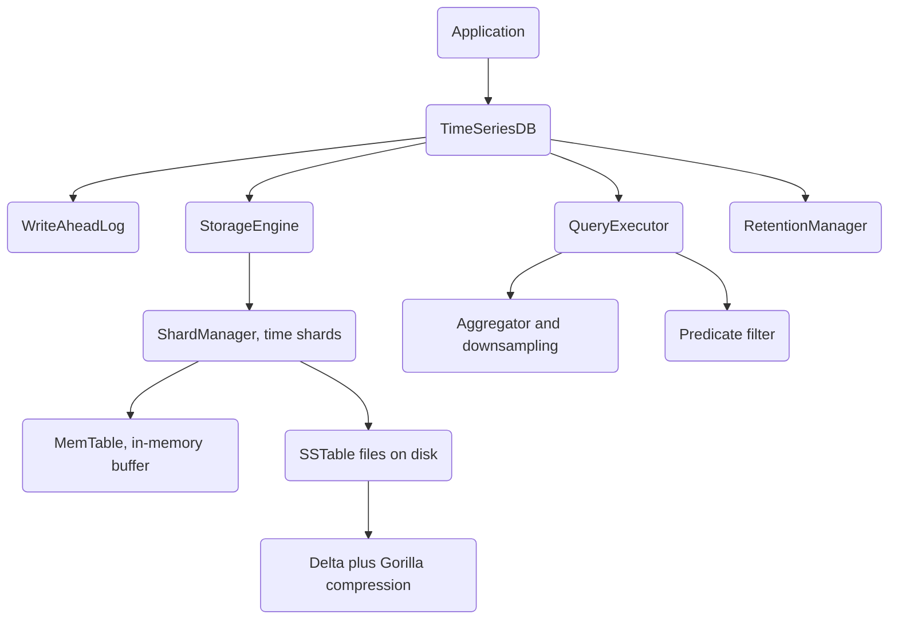

# Time-Series Database

A high-performance time-series database (TSDB) written from scratch in Rust. It combines a
time-sharded LSM storage engine, a stack of columnar compression codecs (delta, Gorilla XOR,
RLE, dictionary, varint), a write-ahead log for durability, and a query engine with
aggregation, downsampling, predicate filtering, and Prometheus-style functions.

## Features

- **Sharded LSM storage** — writes land in an in-memory `MemTable`, flush to immutable
  `SSTable` files, and are grouped into time-range shards (`StorageEngine`, `ShardManager`).
- **Delta + Gorilla compression** — timestamps are delta-encoded and float values are
  Gorilla XOR-encoded into a single `DeltaGorilla` block (`compress_points` in `compression`).
- **Additional codecs** — run-length encoding (`RleEncoder`), variable-length integers
  (`encode_varint`), and dictionary encoding for string tags (`DictionaryEncoder`).
- **Durable write path** — every write is appended to a CRC-checked `WriteAheadLog` and
  replayed on startup so no acknowledged write is lost after a crash.
- **Time-range queries** — binary-search range scans over merged memtable and SSTable data
  (`TimeSeriesDB::query_range`, `query_metric`).
- **Aggregations** — sum, avg, min, max, count, first, last, stddev, variance, percentile,
  rate, and delta via the stateful `Aggregator` (`Aggregation`).
- **Downsampling** — bucket a series into fixed intervals with a chosen aggregation
  (`TimeSeriesDB::downsample`).
- **Predicate pushdown** — a composable `Predicate` tree (value/timestamp comparisons, ranges,
  NaN/finite checks, `And`/`Or`/`Not`) applied during query execution.
- **Label matching** — Prometheus-style `LabelMatcher` selectors with `=`, `!=`, `=~`, `!~`.
- **Prometheus functions** — `rate`, `increase`, `irate`, `delta`, `idelta`, `deriv`,
  `predict_linear`, `changes`, `resets`, and `histogram_quantile`.
- **Retention** — configurable `RetentionPolicy` with age-based data expiration and
  background flush, compaction, and retention threads.

## Architecture



| Component | Module | Responsibility |
|-----------|--------|----------------|
| Database facade | `database.rs` | `open`, `write`, `query_range`, `aggregate`, `downsample`, background tasks |
| Storage engine | `storage/engine.rs` | Series index, routes writes/queries to shards, stats |
| Shard manager | `storage/shard.rs` | Time-range partitioning, per-shard memtable + SSTables |
| MemTable | `storage/memtable.rs` | Sorted in-memory write buffer, size-based flush trigger |
| SSTable | `storage/sstable.rs` | Immutable on-disk block format with index and CRC footer |
| Compression | `compression/` | Delta, Gorilla XOR, RLE, varint, dictionary codecs |
| Query engine | `query/executor.rs` | Query planning, execution, limit/offset, aggregation |
| Aggregation | `query/aggregation.rs` | Stateful aggregators and interval bucketing |
| Functions | `query/functions.rs` | Prometheus-style rate/increase/deriv/quantile |
| WAL | `wal/mod.rs` | Append-only durable log, replay on startup |
| Retention | `retention/mod.rs` | Policies, expiration, downsample rules |

## Quick Start

### Prerequisites

- Rust stable, edition 2021 (`cargo`, `rustc`)
- No external services — all storage is local disk or in-memory

### Installation

```bash
cd 52-time-series-database
cargo build
```

### Running

This project is a library crate. Exercise it through the test suite and benchmarks:

```bash
cargo test          # run all unit and integration tests
cargo bench         # run Criterion benchmarks (ingestion, query, compression)
```

## Usage

```rust
use time_series_database::{TimeSeriesDB, Tags, Aggregation};
use time_series_database::database::DatabaseConfig;

fn main() -> time_series_database::Result<()> {
    // Open a database in a local directory (WAL + background tasks on by default).
    let db = TimeSeriesDB::open(DatabaseConfig::new("tsdb_data"))?;

    // Write points: (metric, tags, timestamp_ns, value).
    let mut tags = Tags::new();
    tags.insert("host".into(), "server1".into());
    for i in 0..100 {
        db.write("cpu.usage", &tags, i * 60_000_000_000, i as f64)?;
    }

    // Range query by metric name + tags.
    let key = db.series_key("cpu.usage", &tags);
    let points = db.query_range(key, 0, 100 * 60_000_000_000)?;
    println!("read {} points", points.len());

    // Aggregate and downsample.
    let sum = db.aggregate(key, 0, i64::MAX, Aggregation::Sum)?;
    let buckets = db.downsample(key, 0, 100 * 60_000_000_000, 10 * 60_000_000_000, Aggregation::Avg)?;
    println!("sum = {sum}, {} downsample buckets", buckets.len());

    db.close()
}
```

Timestamps are Unix nanoseconds; the `duration` module (`SECOND`, `MINUTE`, `HOUR`, `DAY`, …)
provides convenient constants.

## What's Real vs Simulated

- **Real:** the storage engine, LSM write path, time sharding, SSTable on-disk format with
  CRC checksums, all five compression codecs, the WAL and its crash-recovery replay, the query
  executor, aggregations, downsampling, predicate filtering, label matchers, the Prometheus
  functions, and retention policy enforcement. Everything is a genuine implementation with no
  random or placeholder outputs, verified end-to-end by the test suite and benchmarks.
- **Simulated / not implemented:** there is **no network layer or multi-node distribution**.
  "Sharding" here means local, in-process time-range partitioning only — there is no cluster,
  replication, or RPC. Retention downsampling *rules* are modeled (`DownsampleRule`), but the
  automatic rewrite of aged data to lower resolution is not wired into the background loop; the
  retention worker currently drops data past its raw retention window.

## Testing

```bash
cargo test              # 217 unit tests + 80 integration tests
cargo test -- --nocapture   # show println! output
```

The suite covers codec round-trips (including empty and reset-heavy series), memtable/SSTable
persistence and reload, WAL replay across reopen, sharded queries and retention drops,
aggregation and downsampling correctness, predicate and label-matcher evaluation, and the
Prometheus functions. No external services are needed; tests use `tempfile` scratch directories.

## Project Structure

```
52-time-series-database/
  src/
    database.rs        # TimeSeriesDB facade + background tasks
    types.rs           # DataPoint, Metric, Series, Tags, SeriesKey, duration
    error.rs           # TsdbError
    storage/           # engine, memtable, shard, sstable
    compression/       # delta, gorilla, rle, varint, dictionary, block
    query/             # executor, aggregation, functions, label_matcher, predicate
    wal/               # write-ahead log
    retention/         # retention policies and downsample rules
  tests/               # integration tests across the full stack
  benches/             # Criterion benchmarks
  docs/BLUEPRINT.md    # Full architecture and design
```

## License

MIT — see [LICENSE](../LICENSE)
