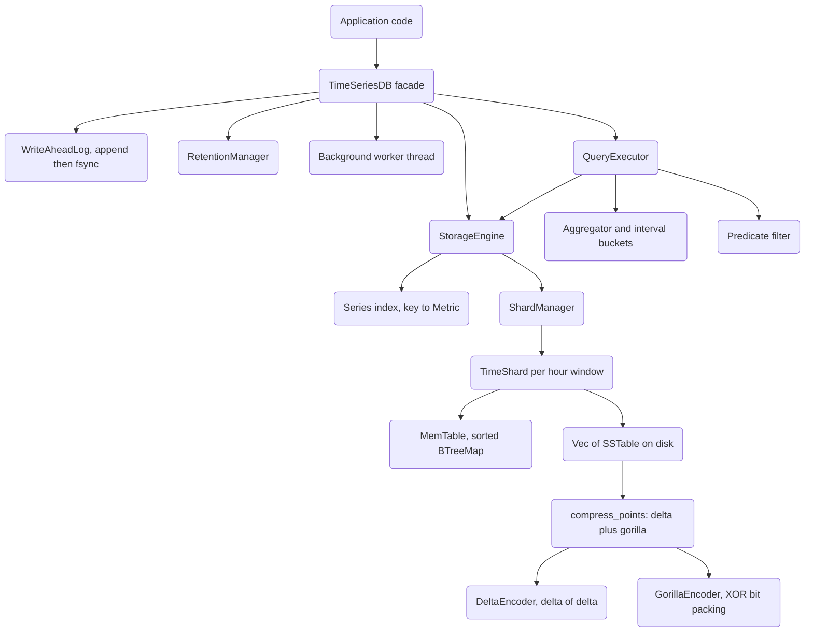

# Time-Series Database

## Overview

This project is a time-series database (TSDB) implemented from scratch in Rust. A TSDB is
specialized for one workload: enormous volumes of `(timestamp, value)` observations, written
in roughly increasing time order, queried by time range, and aggregated into rollups. The
design here mirrors the architecture of production systems such as Facebook's Gorilla,
Prometheus, and InfluxDB, but reduced to a single-node, in-process library so the mechanisms
are legible end to end.

The database is built around a **log-structured merge (LSM)** write path. Incoming points are
buffered in an in-memory `MemTable`, then flushed to immutable, sorted, compressed on-disk
files called `SSTable`s. To make retention and query pruning cheap, data is partitioned into
**time shards**: contiguous, fixed-width windows of wall-clock time (one hour by default). Each
shard owns its own memtable and set of SSTables, so expiring old data is as simple as deleting
a shard directory, and a range query only touches the shards whose window overlaps the query.

Compression is the second pillar. Timestamps and values are stored in separate columns and
compressed with codecs tuned to their statistical shape: **delta-of-delta** encoding for the
monotonically increasing timestamp column, and **Gorilla XOR** encoding for the float value
column. Auxiliary codecs — run-length encoding, dictionary encoding, and variable-length
integers — cover repeated values, string tags, and length prefixes. On regular time-series data
these codecs shrink the raw 16-byte-per-point footprint substantially.

Durability comes from a **write-ahead log (WAL)**. Every write is serialized and appended to a
CRC-protected log file before it touches the memtable, and the log is replayed on startup, so a
crash between a flush cannot lose an acknowledged write. On top of storage sits a **query
engine** that performs range scans, stateful aggregation (sum through percentile), interval
downsampling, predicate filtering, Prometheus-style label matching, and a family of
counter/gauge functions (`rate`, `increase`, `deriv`, `histogram_quantile`, and more).

Concepts this project teaches:

- LSM storage: memtable buffering, immutable SSTables, flush, and compaction.
- Time-range sharding and how it enables O(1) retention and query pruning.
- Columnar storage and the codecs that make time-series data compress so well.
- Delta-of-delta and Gorilla XOR bit-packing.
- Write-ahead logging and crash recovery by replay.
- Query execution: range merge, aggregation, downsampling, and predicate pushdown.
- Prometheus's counter model — rate, increase, and reset handling.

Scope and non-goals: this is a **single-node, in-process library**. There is no network server,
no clustering, no replication, and no distributed consensus. "Sharding" is local time-range
partitioning within one process, not horizontal scale-out across machines.

## Architecture



The stack is layered, and each layer has a narrow responsibility.

**Facade layer (`database.rs`).** `TimeSeriesDB` is the public entry point. It owns the WAL, the
storage engine, the retention manager, and a background worker thread. Writes flow WAL-first,
then to storage; reads and aggregations delegate to a `QueryExecutor` built over the storage
engine. A `DatabaseConfig` builder controls the data directory, shard duration, memtable size,
whether the WAL is enabled, whether background tasks run, and the flush / compaction / retention
intervals.

**Storage engine (`storage/engine.rs`).** `StorageEngine` maintains the **series index** — a
`HashMap<SeriesKey, Metric>` guarded by an `RwLock` that maps each 64-bit series key back to its
metric name and tags (used by `find_series` and `series_keys`). It routes every write and query
to the `ShardManager` and aggregates statistics. A closed flag makes the engine reject
operations after `close`.

**Shard manager (`storage/shard.rs`).** `ShardManager` holds a `BTreeMap<i64, TimeShard>` keyed
by shard start time. `shard_start_time` floors a timestamp to its shard window
(`(ts / duration) * duration`). Writes are grouped by shard before insertion; queries iterate
only the shards whose `#91;start_time, end_time)` overlaps the requested range; retention drops
whole shards whose window ends before the cutoff by removing them from the map and deleting the
directory.

**Time shard (`storage/shard.rs`).** Each `TimeShard` owns one `MemTable` plus a `Vec<SSTable>`
and validates that inserted timestamps fall inside its window. A range query merges the
memtable's live points with the overlapping SSTables, then sorts and deduplicates by timestamp
(last write wins).

**MemTable (`storage/memtable.rs`).** An in-memory `BTreeMap<SeriesKey, Series>` behind an
`RwLock`, with an atomic byte-size counter. Points are inserted in sorted order via binary
search (`Series::insert_sorted`), so each series stays timestamp-sorted and a range scan is a
`partition_point` slice. `should_flush` compares the size counter against the configured max.

**SSTable (`storage/sstable.rs`).** The immutable on-disk format: a run of per-series data
blocks, a series index, and a fixed 44-byte footer carrying the index offset/length, min/max
timestamp, a CRC32 checksum, a version, and the `TSST` magic number. Data blocks store the
series key, the metric name and tags, and the compressed point payload.

**Compression (`compression/`).** `compress_points` splits a point slice into a timestamp column
and a value column, delta-encodes the former, Gorilla-encodes the latter, and frames them with a
`DeltaGorilla` type byte and varint length prefixes. `decompress_points` reverses this.

**Query engine (`query/`).** `QueryExecutor` runs a `Query` — one or more series keys, a time
range, an optional predicate, an optional aggregation, an optional downsample interval, and
limit/offset. It fetches raw points from storage, applies the predicate, then either aggregates
(single value or per-interval buckets) or returns the paginated raw points.

**WAL (`wal/mod.rs`).** An append-only, CRC-checked log. Each write and batch is serialized,
length- and checksum-framed, and appended. On startup, `replay` walks the log and re-applies
every entry through the storage engine.

**Retention (`retention/mod.rs`).** `RetentionPolicy` describes how long raw data is kept and,
optionally, a set of `DownsampleRule`s. `RetentionManager` computes the drop-before timestamp
that the storage engine and background worker use to expire data.

**Background worker (`database.rs`).** A dedicated thread that, on a timer or on demand via a
`crossbeam-channel`, periodically flushes memtables, compacts SSTables, and applies retention,
shutting down cleanly on `close`.

## Core Components

### Write path, end to end

Tracing a single `db.write("cpu.usage", &tags, ts, v)` clarifies how the layers cooperate:

1. **WAL.** If durability is enabled, the write is serialized into a `WalEntry::Write` and
   appended to the log, then (on `flush`/`sync`) fsynced. This happens *before* the memtable is
   touched, so the write survives a crash even if it is never flushed.
2. **Series index.** `StorageEngine::write` builds the `Metric`, computes its `SeriesKey`, and
   records `key -> Metric` in the index if it is new. Metadata is written once per series, not
   once per point.
3. **Shard routing.** `ShardManager::insert` floors the timestamp to its shard window, lazily
   creates the `TimeShard` for that window if needed, and hands the point to that shard.
4. **Memtable insert.** The shard validates that the timestamp lies inside its window, then calls
   `MemTable::insert`, which binary-searches the target `Series` and inserts the point in sorted
   order (overwriting on an exact timestamp collision) while bumping the atomic size counter.

A batch write (`write_batch`) follows the same path but groups points by shard up front so a
mixed batch fans out in a single pass, and appends one `WalEntry::WriteBatch` instead of N
entries.

### Read path, end to end

A `db.query_range(key, start, end)` resolves in the reverse direction:

1. **Shard pruning.** `ShardManager::query_range` visits only shards whose
   `#91;start_time, end_time)` overlaps the request.
2. **Per-shard merge.** Each shard queries its live memtable (`Series::range`, an O(log n)
   `partition_point` slice) and every SSTable whose min/max footer overlaps the range
   (`SSTable::overlaps`), concatenating the results.
3. **Sort and dedup.** Because the same timestamp can appear in both the memtable and an older
   SSTable, results are sorted by timestamp and `dedup_by_key`'d so the newest write wins.

The `QueryExecutor` wraps this with predicate filtering, aggregation, downsampling, and
limit/offset, as described below.

### TimeSeriesDB facade

`TimeSeriesDB::open` creates the data directory, builds the `StorageEngine` from a `StorageConfig`
derived from the `DatabaseConfig`, optionally creates a WAL under `data_dir/wal`, constructs the
`RetentionManager`, and — if background tasks are enabled — spawns the worker thread and wires up
the shutdown flag and message channel. If the WAL is enabled it replays it before returning, so a
reopened database already contains every previously acknowledged write.

Writes are WAL-first:

```rust
pub fn write(&self, metric: &str, tags: &Tags, timestamp: i64, value: f64) -> Result<()> {
    if let Some(ref wal) = self.wal {
        wal.append(&WalEntry::Write {
            metric_name: metric.to_string(),
            tags: tags.clone(),
            timestamp,
            value,
        })?;
    }
    self.storage.write(metric, tags, timestamp, value)
}
```

Reads and analytics build a short-lived `QueryExecutor` over the storage engine:
`query_range`, `query_metric`, `execute`, `aggregate`, and `downsample`. `series_key` computes a
metric's key without a lookup; `find_series` scans the series index by name prefix. Management
methods — `flush`, `compact`, `apply_retention`, `stats`, and `close` — drive the storage engine
directly. `Drop` calls `close`, so the database always flushes on the way out.

### StorageEngine

The engine is the single writer/reader interface over sharded storage. On every write it updates
the series index (`index.entry(key).or_insert_with(...)`) so metadata is recorded exactly once
per series, then hands the point to the shard manager. `write_batch` and `write_points` do the
same in bulk. Queries pass straight through to `ShardManager::query_range`. `stats` aggregates
per-shard statistics into a `StorageStats` (series count, point count, shard count, SSTable
count, total size). `close` uses a compare-and-exchange on the closed flag so the final flush
runs exactly once even under concurrent shutdown.

### ShardManager and TimeShard

Sharding is what makes time-series retention cheap. `shard_start_time` maps any timestamp to the
start of its window; `get_or_create_shard` lazily materializes a shard the first time a window is
touched (double-checked under the write lock). `insert_batch` first groups points by shard so a
mixed batch fans out to the right windows in one pass.

`query_range` iterates the shard map and only descends into shards whose window overlaps the
query:

```rust
for shard in shards.values() {
    if shard.end_time >= start && shard.start_time <= end {
        result.extend(shard.query_range(series_key, start, end)?);
    }
}
result.sort_by_key(|p| p.timestamp);
result.dedup_by_key(|p| p.timestamp);
```

`drop_before` collects the keys of shards whose window ends at or before the cutoff, removes them
from the map, and deletes their directories — the entire cost of expiring an hour of data is one
map removal and one recursive directory delete. Within a shard, `query_range` merges the live
memtable with every overlapping SSTable, then sorts and dedups so that a later write for the same
timestamp shadows an earlier one.

### MemTable

The memtable is the hot write buffer. Its `BTreeMap<SeriesKey, Series>` keeps series ordered by
key, and each `Series` keeps points ordered by timestamp via `insert_sorted`, which
binary-searches for the insertion point and overwrites on an exact timestamp collision. Range
reads use `Series::range`, which finds the start and end with `partition_point` and returns a
slice — no scanning. An atomic size counter tracks the approximate byte footprint so
`should_flush` can trigger a flush without walking the map. `take` swaps out the whole map for an
empty one, which is how a flush hands data to the SSTable builder without holding the write lock
for the duration of the flush.

### SSTable

An SSTable is the durable, immutable form of a memtable's contents. The layout is
`#91;data blocks#93; #91;index block#93; #91;footer#93;`:

- **Data block** (one per series): series key (u64), metric name (length-prefixed), tags
  (count-prefixed key/value pairs), then the compressed point payload with its length.
- **Index block**: a count followed by one entry per series — series key, byte offset, length —
  so a point lookup seeks straight to the right block instead of scanning.
- **Footer** (44 bytes): index offset, index length, min timestamp, max timestamp, a CRC32
  checksum, a format version, and the `0x54535354` (`TSST`) magic number.

The min/max timestamps in the footer let a range query skip an SSTable entirely
(`SSTable::overlaps`), and the checksum plus magic guard against reading a truncated or corrupt
file. `SSTableBuilder` streams series in, tracking the running offset, min/max timestamp, and
point count as it writes each block.

**Flush.** `TimeShard::flush` calls `MemTable::take` to swap out the whole map, gives up early if
it is empty, allocates a unique filename (`shard_{start}_{end}_{counter}.sst`), writes the
SSTable via `SSTable::create_from_map`, then reopens it and pushes it onto the shard's SSTable
list so it is immediately queryable. Because `take` leaves an empty memtable behind, new writes
proceed concurrently with the flush of the old data.

**Compaction.** Over time a shard accumulates many small SSTables from repeated flushes.
`TimeShard::compact` first flushes the memtable, then — if more than one SSTable exists — reads
every series from every SSTable into a merged `BTreeMap<SeriesKey, Series>` (deduplicating by
timestamp via `insert_sorted`), writes a single `*_compacted.sst`, swaps it in, and deletes the
old files. This bounds read amplification: after compaction a series lives in one place.

**Recovery.** On startup, `TimeShard::load_sstables` scans the shard directory and reopens every
`.sst` file, so a reopened database sees all previously flushed data without replaying it.
Combined with WAL replay for the not-yet-flushed tail, this gives complete recovery.

### Compression pipeline

`compress_points` is column-oriented. It gathers all timestamps into one vector and all values
into another, then:

1. Delta-encodes the timestamp column (`delta::compress_timestamps`).
2. Gorilla-encodes the value column (`gorilla::compress_values`).
3. Emits a header: the `DeltaGorilla` type byte, a varint point count, the varint length of the
   compressed timestamp block, the timestamp bytes, and finally the value bytes.

Storing the two columns separately is essential: timestamps and float values have completely
different statistical shapes, and mixing them would defeat both codecs.

**Delta / delta-of-delta (`compression/delta.rs`).** Timestamps in a series are usually evenly
spaced, so consecutive *deltas* are nearly constant and the *delta of deltas* is nearly always
zero. `DeltaEncoder` stores the first value as a signed varint, the second as a delta, and every
value after as a delta-of-delta — a stream of mostly-zero varints that packs into a byte or two
per point.

**Gorilla XOR (`compression/gorilla.rs`).** Adjacent float readings in a metric tend to share
most of their IEEE-754 bits. `GorillaEncoder` works over a `BitBuffer` and follows the paper's
control-bit scheme exactly:

- The **first** value is written verbatim as 64 bits.
- For each subsequent value, it computes `xor = bits ^ prev_bits`.
- If `xor == 0` (the value is unchanged) it writes a single `0` control bit — the common case for
  a flat gauge.
- Otherwise it writes a `1`, then decides whether the new value's meaningful bits fit inside the
  previous leading/trailing-zero *window*. If they do, it writes a `0` and only the meaningful
  bits. If they do not, it writes a `1`, then 5 bits of leading-zero count (clamped to 31), 6
  bits of meaningful-bit length (with `0` meaning a full 64), and the meaningful bits themselves,
  updating the remembered window.

```rust
let xor = bits ^ self.prev_value;
if xor == 0 {
    self.buffer.write_bit(false);          // unchanged value: one bit
} else {
    self.buffer.write_bit(true);
    let leading = xor.leading_zeros() as u8;
    let trailing = xor.trailing_zeros() as u8;
    if leading >= self.prev_leading && trailing >= self.prev_trailing
        && self.prev_leading != u8::MAX {
        self.buffer.write_bit(false);       // reuse previous window
        // ... write only the meaningful bits ...
    } else {
        self.buffer.write_bit(true);        // new window: 5-bit + 6-bit header
        // ... write leading count, length, and meaningful bits ...
    }
}
```

The `GorillaDecoder` mirrors this state machine, reconstructing each value by XOR-ing the decoded
meaningful bits back onto the previous value. Slowly changing gauges — CPU load, temperature,
free memory — compress dramatically because most points cost only a bit or two.

**Auxiliary codecs.** `RleEncoder` collapses runs of repeated values; `DictionaryEncoder` maps
repeated string tags to small integer IDs; `encode_varint` / `encode_signed_varint` (LEB128,
with zig-zag for signed) provide the compact length prefixes that frame every block.

### Query engine

`QueryExecutor::execute` runs the query for each requested series key: fetch the raw range from
storage, apply the predicate if present, then branch on aggregation. With an aggregation and an
interval it produces per-interval buckets via `aggregate_with_interval`; with an aggregation and
no interval it feeds an `Aggregator` and returns a single value; with no aggregation it applies
offset and limit and returns raw points. It also records `execution_time_ns` and `total_points`
in the `QueryResult`.

`Aggregator` (`query/aggregation.rs`) is a stateful accumulator supporting `Sum`, `Avg`, `Min`,
`Max`, `Count`, `First`, `Last`, `StdDev`, `Variance`, `Percentile(u8)`, `Rate`, and `Delta`.
Every `add` updates the running `sum`, `sum_squared`, `count`, `min`, `max`, and the earliest /
latest `(timestamp, value)` pair, so the streaming functions cost O(1) per point and never
materialize the series. Only the functions that inherently need the full sample —
`Percentile`, `StdDev`, and `Variance` — push individual values into a side vector:

```rust
match self.aggregation {
    Aggregation::Percentile(_) | Aggregation::StdDev | Aggregation::Variance => {
        self.values.push(point.value);
    }
    _ => {}
}
```

At `result` time the percentile branch sorts the retained values and indexes the
`round((p/100) * (n-1))` element; `StdDev`/`Variance` compute the mean-squared deviation; `Rate`
divides the first-to-last value change by the elapsed seconds; and `Delta` returns the raw
first-to-last difference. An empty aggregator returns `NaN` rather than a misleading zero.

**Downsampling (`aggregate_with_interval`).** Interval rollups walk fixed `#91;bucket_start,
bucket_end)` windows from `start` to `end`, feed each window's points into a fresh `Aggregator`,
and emit a `(bucket_start, value)` pair only for non-empty buckets. This is what backs
`TimeSeriesDB::downsample`: a 6000 ns range at a 600 ns interval yields exactly ten buckets, which
one of the integration tests asserts directly.

### Prometheus functions

`query/functions.rs` implements Prometheus's counter/gauge model. `rate` computes the per-second
average increase over a window, handling counter resets: when a value decreases,
`counter_increase` treats the drop as a restart rather than a negative delta. `increase` is the
un-normalized total, `irate` and `idelta` use only the last two points for responsiveness,
`deriv` and `predict_linear` fit a least-squares line, `changes` and `resets` count value
transitions, and `histogram_quantile` interpolates a quantile from bucket boundaries.

### Label matching

`LabelMatcher` (`query/label_matcher.rs`) implements Prometheus-style selectors: `Equal` (`=`),
`NotEqual` (`!=`), `RegexMatch` (`=~`), and `RegexNotMatch` (`!~`), with regex matchers compiling
their pattern once at construction so evaluation never re-parses the pattern. `LabelMatchers`
combines several matchers into a series selector that tests a metric's `Tags` for membership;
`SeriesSelector` layers a metric-name match on top so a query can express "all series named
`http_requests` where `region =~ us-.*` and `method != OPTIONS`" without materializing the full
series list first.

### Predicate evaluation

`Predicate` (`query/predicate.rs`) is a small algebra over a single `DataPoint`. Leaf predicates
compare the value or timestamp against a constant (`Value`/`Timestamp` with a `PredicateOp` of
`Eq`, `Ne`, `Lt`, `Le`, `Gt`, `Ge`), test range membership (`ValueRange`, `TimestampRange`), or
classify the value (`IsNan`, `IsNotNan`, `IsFinite`, `IsInfinite`). `And`, `Or`, and `Not`
combine them into a tree, and `True`/`False` are the identity/absorbing leaves. During execution
the tree is evaluated per point in `filter_owned`, which is the predicate-pushdown step: filtering
happens right after the range scan, before any aggregation, so aggregators only ever see the
points that survive the filter.

### Write-ahead log

`WriteAheadLog` serializes each `WalEntry` (`Write`, `WriteBatch`, or `Checkpoint`) to a compact
binary frame — a type byte, varint-prefixed strings and tags, and little-endian timestamps and
values — appends it under a mutex, and can `sync` to force it to disk. `replay` reads the log
back on startup and re-applies each entry through the storage engine, which is exactly how a
reopened database recovers writes that were logged but not yet flushed. CRC framing lets replay
stop cleanly at a torn tail record rather than propagating corruption.

### Retention

`RetentionPolicy` carries a raw-data duration, an optional list of `DownsampleRule`s (each with an
`after` age, a target `interval`, and a `keep_for` window), and a `drop_after_retention` flag.
`max_retention`, `should_drop`, and `resolution_for_age` express when data expires and what
resolution applies at a given age. `RetentionManager` turns a policy plus "now" into a
drop-before timestamp that `StorageEngine::drop_before` and the background worker consume. The
policy *models* multi-resolution downsampling with `DownsampleRule`, but the current background
loop applies only the raw-retention drop; automatic resolution rewrites are not yet wired in.

### Background worker

When background tasks are enabled, `TimeSeriesDB::open` spawns a dedicated thread running
`background_worker`. The worker blocks on a `crossbeam-channel` with a one-second timeout, so it
reacts immediately to an explicit `Flush`, `Compact`, `CheckRetention`, or `Shutdown` message and
otherwise wakes once a second to check whether the configured `flush_interval`,
`compaction_interval`, or `retention_check_interval` has elapsed. `close` sets the shutdown
`AtomicBool` and sends a `Shutdown`, so the thread exits promptly and cleanly.

### Concurrency model

The database uses fine-grained, lock-per-structure concurrency rather than a global lock:

- The **memtable** map, the **shard** map, and the **series index** each sit behind their own
  `parking_lot::RwLock`, so reads and writes on different shards do not contend.
- The **WAL** serializes only its append behind a `Mutex`; everything else proceeds in parallel.
- Sizes and counters (memtable bytes, SSTable filename counter, closed flag) use atomics, so hot
  paths avoid taking a lock just to read a number.
- SSTables are **immutable** once written, so any number of readers can scan them without
  synchronization; only the `Vec<SSTable>` that lists them is guarded.

This design lets ingestion (memtable writes) and background maintenance (flush/compact of already
frozen data) overlap, and lets queries against different shards run truly concurrently.

## Data Structures

Core types (`types.rs`):

```rust
/// Tags are key-value pairs; BTreeMap keeps them ordered for a stable series key.
pub type Tags = std::collections::BTreeMap<String, String>;

/// 64-bit identifier for a time series (FNV hash of name + sorted tags).
pub type SeriesKey = u64;

/// A single observation. Timestamp is Unix nanoseconds.
#[derive(Debug, Clone, Copy, PartialEq)]
pub struct DataPoint {
    pub timestamp: i64,
    pub value: f64,
}

/// A named measurement with optional tags.
#[derive(Debug, Clone, PartialEq, Eq)]
pub struct Metric {
    pub name: String,
    pub tags: Tags,
}

/// A metric plus its timestamp-sorted points.
#[derive(Debug, Clone)]
pub struct Series {
    pub key: SeriesKey,
    pub metric: Metric,
    pub points: Vec<DataPoint>,
}
```

The **series key** is the linchpin. `compute_series_key` FNV-hashes the metric name and every
sorted `(key, value)` tag pair. Because `Tags` is a `BTreeMap`, tags always hash in the same
order, so `{a=1, b=2}` and `{b=2, a=1}` produce the identical key — the database is
tag-order-independent by construction.

Configuration and stats:

```rust
pub struct DatabaseConfig {
    pub data_dir: PathBuf,
    pub enable_wal: bool,
    pub shard_duration: i64,          // default: duration::HOUR
    pub max_memtable_size: usize,     // default: 64 MiB
    pub flush_interval: Duration,
    pub compaction_interval: Duration,
    pub retention_check_interval: Duration,
    pub enable_background_tasks: bool,
}

pub struct DatabaseStats {
    pub series_count: usize,
    pub point_count: usize,
    pub shard_count: usize,
    pub sstable_count: usize,
    pub total_size_bytes: u64,
    pub wal_sequence: u64,
}
```

Query and compression types:

```rust
pub struct Query {
    pub series_keys: Vec<SeriesKey>,
    pub start: i64,
    pub end: i64,
    pub predicate: Option<Predicate>,
    pub aggregation: Option<Aggregation>,
    pub interval: Option<i64>,
    pub limit: Option<usize>,
    pub offset: Option<usize>,
}

#[repr(u8)]
pub enum CompressionType {
    None = 0, Delta = 1, Gorilla = 2, Rle = 3, DeltaGorilla = 4,
}

pub enum Predicate {
    Value(PredicateOp, f64),
    Timestamp(PredicateOp, i64),
    ValueRange(f64, f64),
    TimestampRange(i64, i64),
    IsNan, IsNotNan, IsFinite, IsInfinite,
    And(Box<Predicate>, Box<Predicate>),
    Or(Box<Predicate>, Box<Predicate>),
    Not(Box<Predicate>),
    True, False,
}
```

Durability and retention types:

```rust
pub enum WalEntry {
    Write { metric_name: String, tags: Tags, timestamp: i64, value: f64 },
    WriteBatch { points: Vec<(String, Tags, i64, f64)> },
    Checkpoint { sequence: u64 },
}

pub struct RetentionPolicy {
    pub name: String,
    pub raw_duration: i64,               // how long raw data is kept (ns)
    pub downsample_rules: Vec<DownsampleRule>,
    pub drop_after_retention: bool,
}

pub struct SSTableMeta {
    pub path: PathBuf,
    pub min_timestamp: i64,
    pub max_timestamp: i64,
    pub series_count: usize,
    pub point_count: usize,
    pub file_size: u64,
}
```

Time constants live in `types::duration` (`NANOSECOND` through `WEEK`), and errors are a single
`thiserror`-derived `TsdbError` enum:

```rust
pub enum TsdbError {
    Io(std::io::Error),
    Compression(String),
    Decompression(String),
    InvalidTimestamp(i64),
    SeriesNotFound(u64),
    InvalidQuery(String),
    WalError(String),
    StorageError(String),
    RetentionError(String),
    CompactionError(String),
    Corruption(String),
    BufferOverflow { expected: usize, actual: usize },
    InvalidFormat(String),
    ChecksumMismatch { expected: u32, actual: u32 },
    DatabaseClosed,
    LockPoisoned,
}
```

`Result<T> = std::result::Result<T, TsdbError>` is the crate-wide return type, and `#[from]` on
the `Io` variant means `?` propagates `std::io::Error` transparently.

### On-disk SSTable layout

The SSTable is the one format that must remain stable across reopens, so it is worth spelling out
byte by byte:

```
SSTable file
  [ data block 0 ]          # one per series, in series-key order
     series key (u64)
     metric name len (varint) + metric name bytes
     tag count (varint) + repeated (key len, key, value len, value)
     compressed payload len (varint) + payload  # DeltaGorilla block
  [ data block 1 ]
  ...
  [ index block ]
     entry count (varint)
     repeated: series key (u64), offset (u64), length (u32)
  [ footer, 44 bytes ]
     index offset (u64)
     index length (u64)
     min timestamp (i64)
     max timestamp (i64)
     checksum (u32, CRC32)
     version (u32)
     magic (u32 = 0x54535354 "TSST")
```

Because the footer is fixed-size and at the end of the file, a reader seeks to
`file_len - 44`, validates the magic and checksum, reads the index offset/length, loads the index,
and then binary-searches the index to jump straight to the block for a wanted series key — no
linear scan of data blocks is ever required.

## API Design

Public surface re-exported from `lib.rs`:

```rust
// Lifecycle
TimeSeriesDB::open(config: DatabaseConfig) -> Result<TimeSeriesDB>
db.close() -> Result<()>
db.flush() -> Result<()>
db.compact() -> Result<()>

// Writes
db.write(metric: &str, tags: &Tags, timestamp: i64, value: f64) -> Result<()>
db.write_batch(points: &[(String, Tags, i64, f64)]) -> Result<()>

// Reads
db.query_range(series_key: SeriesKey, start: i64, end: i64) -> Result<Vec<DataPoint>>
db.query_metric(name: &str, tags: &Tags, start: i64, end: i64) -> Result<Vec<DataPoint>>
db.execute(query: &Query) -> Result<QueryResult>

// Analytics
db.aggregate(key: SeriesKey, start: i64, end: i64, agg: Aggregation) -> Result<f64>
db.downsample(key: SeriesKey, start: i64, end: i64, interval: i64, agg: Aggregation)
    -> Result<Vec<(i64, f64)>>

// Metadata + retention
db.series_key(name: &str, tags: &Tags) -> SeriesKey
db.find_series(name_prefix: &str) -> Vec<(SeriesKey, Metric)>
db.series_keys() -> Vec<SeriesKey>
db.set_retention_policy(policy: RetentionPolicy)
db.apply_retention() -> Result<usize>
db.stats() -> DatabaseStats
```

`DatabaseConfig` uses a builder style: `DatabaseConfig::new(dir).without_wal()
.without_background_tasks().with_shard_duration(duration::DAY)`. Queries can be constructed
directly with `Query::new` / `Query::multi` plus `with_predicate`, `with_aggregation`,
`with_interval`, `with_limit`, `with_offset`, or fluently via `QueryBuilder`.

Compression is also usable standalone: `compress_points(&[DataPoint]) -> Result<Vec<u8>>`,
`decompress_points(&[u8]) -> Result<Vec<DataPoint>>`, and `compression_ratio(orig, compressed)`.
The individual codecs are public too — `DeltaEncoder`, `GorillaEncoder`, `RleEncoder`,
`DictionaryEncoder`, and the `encode_varint` / `encode_signed_varint` helpers — so the encoding
of a column can be inspected or reused directly.

Predicates compose into a boolean tree with constructor helpers and combinators:

```rust
let p = Predicate::value_gt(10.0)
    .and(Predicate::value_between(0.0, 100.0))
    .or(Predicate::is_finite());
```

Label matchers build Prometheus-style selectors that test a metric's `Tags`:

```rust
let m = LabelMatcher::eq("host", "server1");
let r = LabelMatcher::regex("region", "us-.*")?;   // =~
let selector = LabelMatchers::new(vec![m, r]);
```

The Prometheus function family operates on a `&[DataPoint]` slice and returns `Option<f64>`
(or a `Vec` for `histogram_quantile`), so they can be layered on top of any range query:
`rate`, `increase`, `irate`, `delta`, `idelta`, `deriv`, `predict_linear`, `changes`, `resets`,
and `histogram_quantile`.

## Performance

Real, measured behavior is exercised by the Criterion suite in `benches/benchmarks.rs`, which
has three groups:

- **`compression`** — `compress` and `decompress` across point-count sizes.
- **`database`** — `single_write` and batched writes at varying batch sizes.
- **`query`** — `range_query`, `aggregation_sum`, and `downsample`.

Run them with `cargo bench`; the crate builds with `lto = true`, `codegen-units = 1`, and
`opt-level = 3` in both the release and bench profiles.

The design choices that drive performance:

- **Batched, sequential writes.** Points land in an in-memory `BTreeMap` first; disk work is
  deferred to flush, so ingest cost is dominated by the sorted in-memory insert rather than
  synchronous IO. `write_batch` amortizes the WAL append and index update across many points.
- **Binary-search range reads.** Each series keeps its points timestamp-sorted, so a range scan
  is a `partition_point` slice — O(log n) to locate the window, then a contiguous copy.
- **Shard and SSTable pruning.** A range query only visits shards whose window overlaps the
  request, and within a shard skips SSTables whose min/max timestamp footer excludes the range.
  Wide time ranges never pay for irrelevant data.
- **Columnar compression.** Splitting timestamps from values lets delta-of-delta and Gorilla
  each work on a homogeneous stream. The one hard number the tests assert is a lower bound:
  `test_compression_ratio` requires better than 2x compression on regular sinusoidal data, and
  `test_compress_decompress_points` verifies lossless round-trips within `1e-10`.
- **Fine-grained locking.** `parking_lot::RwLock` guards the memtable, the shard map, and the
  series index independently, and the WAL uses a `Mutex` only around the append, so readers and
  writers on different shards do not serialize against each other.

**Space overhead.** A raw `DataPoint` is 16 bytes (an `i64` timestamp plus an `f64` value). The
compression pipeline collapses this to a fraction of a byte per point on regular data: constant
inter-arrival timestamps delta-of-delta down to near-zero varints, and slowly changing values
Gorilla-encode down to a few bits each. The per-series metadata (metric name and tags) is stored
once per SSTable block, not per point, so it amortizes across a whole series.

**Read amplification.** Without compaction, a series that has been flushed K times would be
scattered across K SSTables, and every read would touch all K. Compaction merges them back into
one file per shard, so steady-state reads touch at most the live memtable plus one compacted
SSTable per overlapping shard.

The BLUEPRINT deliberately does not quote throughput or latency targets that the repository does
not measure; the codec ratio bounds above are the only asserted numeric guarantees.

## Testing Strategy

Correctness is verified by 219 unit tests colocated with the modules and 80 integration tests in
`tests/integration_tests.rs`, all runnable with `cargo test` and requiring no external services
(tests use `tempfile` scratch directories that are cleaned up automatically).

**Unit tests** cover each component in isolation:

- *Types* — data-point and metric construction, series-key stability across tag order, sorted
  insertion, and range slicing (`types.rs`).
- *Compression* — round-trip fidelity and the ratio lower bound for the combined pipeline, plus
  per-codec tests for delta, Gorilla, RLE, varint, and dictionary encoding.
- *Storage* — memtable insert/flush/size accounting, SSTable write-then-read, per-shard queries,
  the config builder, `drop_before` shard expiry, and rejection of writes after `close`.
- *Query* — aggregator math for every function, interval downsampling bucket counts, predicate
  evaluation, label-matcher operators, and the Prometheus functions.

**Integration tests** exercise the full stack through the `TimeSeriesDB` facade: write-then-query
round-trips, batch writes, aggregation and downsampling correctness (e.g. a 6000/600 downsample
yielding exactly 10 buckets), prefix series discovery, retention application, flush-then-compact
preserving data, statistics, and — importantly — **WAL durability**: writing with the WAL
enabled, closing, reopening, and asserting the points are still present.

**Edge cases** deliberately covered include empty point slices (compress/decompress of nothing),
duplicate timestamps (last-write-wins dedup), counter resets in `rate`/`irate`, timestamps
straddling shard boundaries, and reopening a database to force WAL replay.

**Representative assertions.** A few tests pin down exact behavior and are worth calling out:

- `test_series_key_consistency` writes the same tags in two orders and asserts identical series
  keys, proving the tag-order independence of `compute_series_key`.
- `test_series_range` builds 100 points and asserts an inclusive range slice returns exactly the
  expected count and boundary timestamps, validating the `partition_point` logic.
- `test_compress_decompress_points` round-trips 100 points and checks every value is recovered
  within `1e-10`; `test_compression_ratio` asserts better than 2x on 1000 sinusoidal points.
- `test_storage_engine_drop_before` writes three hours of data into three shards and asserts that
  dropping the first hour removes exactly one shard.
- `test_database_downsample` asserts a 6000/600 downsample yields exactly ten buckets.
- `test_database_with_wal` writes ten points, closes, reopens, and asserts all ten are present —
  the durability guarantee.
- `test_storage_engine_close` asserts that a write after `close` returns `TsdbError::DatabaseClosed`.

**How to run.** `cargo test` runs everything; `cargo test -- --nocapture` surfaces `println!`
output; `cargo test <name>` narrows to a module or single test. Every test is self-contained and
uses `tempfile::tempdir` scratch directories, so the suite is deterministic and leaves no
artifacts behind. The benchmarks are separate (`cargo bench`) and are not part of `cargo test`.

**What is not tested by automation.** There is no fuzzing of the on-disk format against
adversarial input, no property-based testing of the codecs against random point streams, and no
concurrent stress test that hammers the same shard from many threads. The correctness guarantees
rest on the example-based unit and integration tests enumerated above.

## References

- T. Pelkonen et al., "Gorilla: A Fast, Scalable, In-Memory Time Series Database," VLDB 2015 —
  the XOR value compression and delta-of-delta timestamp encoding used here.
- P. O'Neil, E. Cheng, D. Gawlick, E. O'Neil, "The Log-Structured Merge-Tree (LSM-Tree),"
  Acta Informatica, 1996 — the memtable/SSTable write path.
- Prometheus documentation — the label-matcher syntax and the `rate`/`increase`/`irate`/
  `histogram_quantile` semantics, including counter-reset handling.
- InfluxDB and Facebook Gorilla storage designs — time-range sharding for cheap retention and
  query pruning.
- LEB128 / variable-length integer encoding — the varint framing used throughout the on-disk and
  WAL formats.
